# AOI_Main — Complete Communication Design

> Target communication architecture for **`AOI_Main.exe`** (Falcon.Net, .NET FW 4.8) covering **every link** inventoried in [aoi-main-communication-analysis.md](../03-inputs/aoi-main-communication-analysis.md): 6 native COM servers, ~15 .NET ROT singletons, 2 gRPC links (+1 hosted server), 2 MMF links, grabbing libraries, PubSub, files/DB, and all inbound channels.
> Integrates the fabric design ([camtek-tool-fabric-complete-design.md](camtek-tool-fabric-complete-design.md), bus = Appendix A there) with the analysis's gRPC-mesh (A) and consolidation (D) recommendations — as **four lanes under one decision**, not competing programs.
> Constraint: AOI_Main stays .NET FW 4.8. Status: proposal. Date: 2026-07-17.

---

## 1. Design Approach — Four Lanes, One Rule Each

Every link is assigned by **shape**, not by technology preference:

| Lane | Rule | Technology | Complete design |
|---|---|---|---|
| **BUS** | One-to-many events, state, telemetry, lifecycle; commands with accept-semantics | `Camtek.Messaging` (named pipes, topics, durability classes) | **Appendix A** |
| **SVC** | One-to-one request/response service APIs (object/query surfaces) | gRPC behind the existing `Connect()` seam — AOI_Main already runs Grpc.Core client+server in production | **Appendix B** |
| **CONS** | Singletons where AOI_Main is the **sole consumer** | In-proc consolidation — callbacks become plain .NET events; **no IPC at all** | **Appendix C** |
| **KEEP** | Data plane, latency-sensitive motion boundaries, external contracts | MMF / supervised COM / frozen façades — unchanged by design (but actively managed) | **Appendix D** |

Two standing rules from the verification: (1) **call-frequency telemetry on every `ComServerWrappers\` wrapper before migrating its edge** (chattiness audit); (2) sole-consumer status is **verified by census, not assumed** — a second consumer moves the link from CONS to SVC.

---

## 2. Complete Link Disposition — every counterpart from the analysis

### 2.1 Native ATL COM servers (analysis §1.1)

| Counterpart | Today | Lane | Target | Phase* |
|---|---|---|---|---|
| **MachineSrv.exe** (`IMachineCallback`, `IXYTableCB`, `IChuckNavigatorCallback`) | Duplex COM, motion master | **KEEP → BUS(events) later** | Supervised COM stays (latency-sensitive; tight loops live inside it). Later: *events only* via the registered machine-layer topics (`machine.efem.state`, `machine.safety.alarm` — **future, machine-layer-owned namespace, gated on the multi-PC census A-1**) through the native C client; commands remain COM until MachineSrv itself is modernized | Track F re-exam list / own program |
| **EfemSrv.exe** (`IAutoLoader`/`IAutoLoaderCB`, `IDoorCB`) | Duplex COM | **BUS(events) + KEEP(commands)** | `loader.events` topic (class C) replaces the CB events into the GUI; wafer-move commands stay COM | P2 |
| **ScenarioManager.exe** (`IScenarioManagerObj`, `CScanManager`/`IScanManagerInkingCB`, DDS-node status) | Duplex COM, scan orchestration | **KEEP (both directions) — AOI republishes** | ScenarioManager itself is untouched: its COM callbacks keep landing in AOI_Main, and **AOI's BusAdapter republishes** the fan-out-worthy ones (`scan.operations`, `scan.dds-node-status` — registered, tool-mgmt-owned, class C). A ScenarioManager-side shim is deferred to its own adoption program. ⚠ **Blocked on Gap 6:** reconcile which process hosts ScanManager (ScenarioManager vs FalconWrapper) before P2 planning | P2–P3 (AOI-side only) |
| **FalconWrapper.exe** (`IFalconExternalControl`/`CB`, `IFalconFireEvents`) | External automation contract + event hub | **KEEP (frozen façade) — AOI-side bridge** | Customer-facing contract — frozen until renegotiated (analysis risk M11). Bridge is **AOI-side** (decided, R1-C3): AOI's BusAdapter republishes events to bus topics while continuing the legacy `Fire*` into the hub, so its 5 subscriber processes keep working; inbound commands land in `ExternalControlCbUiWrapper` as today and dispatch in-proc. **FalconWrapper itself is never modified and never a bus client** | P2–P4 (AOI-side only), façade possibly permanent |
| **SecsGemDriver** (`CSECSGemConnector`→`IS12` wafer maps) | COM, S12 map download/upload | **KEEP** | GEM-door territory; fab-qualified path; S12 map exchange unchanged | — |
| **WaferMapServer.exe** (`IWaferDisplayServerWrapper`) | Outbound COM, display hosting | **CONS candidate** | If census confirms AOI_Main is sole consumer → absorb display hosting in-proc; else KEEP | Census → C-track |

### 2.2 .NET ROT singletons (analysis §1.2) — the triage the analysis recommended

| Singleton | Today | Lane | Target |
|---|---|---|---|
| **ToolManager (TAC)** | Duplex COM (`ToolManagerUiWrapper`) | **BUS** | Owned by the fabric program: `tool.state` (P3), `tool.commands` request/reply (P5, per-customer). *Not* SVC — tool state fan-out is exactly the bus's shape, and the GEM/host coupling lives here |
| JobProvider (SDR) | → COM | **SVC (late, compatibility connector)** | **Disqualified as pilot** (census: consumed by SecsGem clients, NetTAC, TAC.Net, ProductionGui, RobotUI **and native C++** `ProcessProgramManager.cpp:84-88` — a seam swap re-transports the whole GEM/TAC job path; interface is an object graph with out-params + stateful locks). Migrates late via a **compatibility connector**: COM-visible net48 façade wrapping the gRPC client, so non-AOI consumers are untouched |
| SystemLogger | → COM | **SVC — pilot candidate (pending its own fan-in census)** | Pilot criteria: fan-in = AOI-only, flat interface, no live-object parameters. **The census selects the pilot** — the first service meeting all three |
| WafersDatabase | → COM | **SVC** | gRPC query service |
| InspectionMng (+SPC DB) | → COM | **SVC** | gRPC |
| WaferHandlingManager / AutomationManager | → COM | **SVC** (events → BUS if fan-out found) | gRPC command surface; any broadcast events ride `production.carrier`/`tool.state` |
| MaintenanceManager (+`IModuleMaintenanceManagerCB`) | Duplex COM | **SVC + BUS(events)** | gRPC for task control; calibration progress/completion events → `tool.telemetry` (already a bus topic; `FirePeriodicCalibrationCompleted` maps here) |
| BufferStationManager | Duplex COM | **KEEP (census FAILED for CONS)** | ⚠ Census executed: consumed by `SecsGemObjects\Clients\BufferStationClient.cs:59` — **not sole-consumer**. Stays COM until the GEM/TAC stack's own migration reaches it |
| WaferLevelCassetteManager | Duplex COM | **CONS candidate (census pending)** | Census → absorb only if sole-consumer confirmed |
| WaferLoader | Duplex COM | **KEEP (census FAILED for CONS)** | ⚠ Census executed: consumed by `E30Client.cs:124`, `AutolineClient.cs:66`, `StandaloneClient.cs:60`, NetTAC `ToolManagementAdapter.cs:61`, **and native C++** `ToolManagementEventsImpl.cpp:42-47`. Stays COM; any transport change requires GEM/TAC-stack consent |
| RobotUI (`IRobotUIConnectorCB`, rich callbacks) | Duplex COM | **CONS — flagship (census PASSED)** | Census verified clean: sole `new RobotConnector()` is `RobotUIEventHandlerWrapper.cs:1288`; `AOI_Main.csproj:2170` already references the module; connector already exposes parallel .NET events (`RobotUIConnector.cs:50-106`). Real costs stated: it creates its **own STA thread + message pump** (`RobotUIConnector.cs:477-507`) and owns COM connections to MachineSrv/EFEM/WafersDB/JobProvider that move into AOI_Main — the A-4 threading audit is genuine engineering |
| BsiModule / EbiModule / FrtModule / **BsiHR** helpers | Mixed | **CONS candidates** | Census per module; SmartUI view-model pattern suggests sole-consumer |
| CamtekUtils | → COM | **CONS (census pending)** | Shared utilities as a library, not a process — census must clear its object-graph getters (`GetCFileUtils/GetCSystem/GetCForms`) |
| `IWaferNavigatorCB` / `IGuiServiceCallback` providers | Likely in-proc services (analysis §1.9 flag) | **No lane — verify** | Confirm in-proc during Wave-0 census; if in-proc, they are not IPC edges and need no disposition |

### 2.3 gRPC — existing links (analysis §1.3)

| Link | Today | Lane | Target |
|---|---|---|---|
| ADC inference (`localhost:5000`) | Grpc.Core client | **KEEP → SVC hygiene** | Stays; migrate off EOL Grpc.Core to `Grpc.Net.Client`+WinHttpHandler when the SVC track establishes the pattern |
| CMM client (`ICmmClient`) | Grpc.Core client | **KEEP** | Same hygiene path |
| **`CmmReceiverServer` — AOI_Main HOSTS gRPC `:50055`** | Grpc.Core **server** inside AOI_Main | **CONTAIN now, SPLIT per operation later** | Wholesale bus relocation is **blocked twice** (feasibility-verified): `ExportMapConfirmation` blocks on an operator Yes/No dialog — incompatible with Ttl'd request/reply; and S12 wafer maps (int-per-die, 100k+ dies) exceed the bus's 1 MB frame cap. Plan: **(1) Wave 2 — gateway gRPC proxy in front of :50055** (external surface closed, :50055 becomes localhost-internal behind the gateway; no bus dependency, by-value maps and modal replies keep working); (2) notification-shaped ops (`ImportStarted/Completed`, alerts) → bus topics opportunistically; (3) bulk map ops stay on the proxied gRPC hop — pointer-handoff only via negotiated CMM contract change; (4) `ExportMapConfirmation` **explicitly exempted** from request/reply. ⚠ SPC.exe hosts a second `ComCmmReceiverServer` (`apps\SPC\frmMain.frm:984`) — added to the inventory, same containment applies | Proxy: Wave 2 (S-track, no B-P4 dependency). Split: with CMM team, unscheduled |

### 2.4 Shared memory, grabbing, PubSub, files (analysis §1.4–1.7)

| Link | Lane | Disposition |
|---|---|---|
| STIL/FSI `Still_data_Buffer` MMF | **KEEP** | Data plane by design; bus carries pointers only. (Producer identity still unresolved — flag stands) |
| DDS TilePool MMF | **KEEP** | Same; farm results stay off the control plane |
| Grabbing libraries (`IGrabberManagerCB`, TCP+MMF inside) | **KEEP** | In-proc library boundary; not an IPC edge of AOI_Main |
| PubSub `IPublisher.Publish` sites | **BUS** | This *is* fabric P1a — the seam already exists (`System.ini [PubSubEvents]`); RabbitMQ/MSMQ/InProc variants retire with it |
| DAO `.mdb` (FalconLog, spc) | **out of scope** | Flagged separately: DataServer/MDC modernization candidate, not a transport question |
| Shared INI / `c:\job` files | **KEEP → shrink via SVC** | Job coordination progressively subsumed by the JobProvider gRPC service; INIs remain configuration |

### 2.5 Inbound channels (analysis §1.8)

| Inbound | Disposition |
|---|---|
| FalconWrapper → `IFalconExternalControlCB` | Frozen façade (customer contract); the COM callback lands in `ExternalControlCbUiWrapper` exactly as today and is dispatched **in-process through the BusAdapter** (Ttl/mode gates apply — no bus round-trip, no new command publisher) at P4 |
| COM `*CB` sinks from every server | Retired per-edge as each lane migrates (BUS events / SVC streams / CONS in-proc events) |
| CMM → `:50055` | Proxied via gateway — contain-then-split (§2.3) |
| TestAutomationAPI (FlaUI UI automation) | **Untouched** — drives the UI, not the IPC; regression-tested through every phase |
| Fab host via ToolManager singleton | Fabric program (GEM door — shim only; wire unchanged) |

---

## 3. Target Architecture

### 3.0 Current architecture — today (what we are changing)

AOI_Main is a **hub-and-spoke of bidirectional out-of-proc COM**: ~21 counterparts, each reached by a call-out interface plus a `*CB` callback sink registered back into AOI_Main. Verified inventory per the analysis.

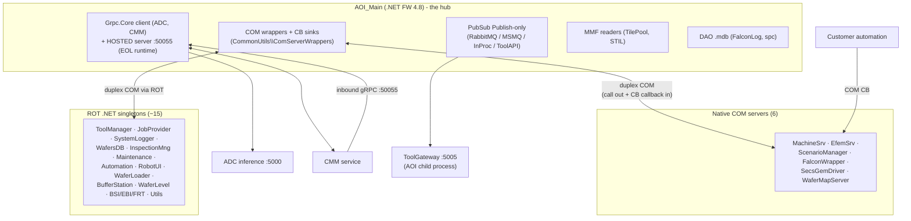

Defining traits (each one is a cost the target design removes or contains):

| # | Trait today | Consequence |
|---|---|---|
| T1 | ~21 duplex COM links, every callback a `*CB` COM sink | Undefined failure semantics — a hung subscriber can stall the caller; near-zero testability; COM/STA expertise required for every change |
| T2 | ~15 singleton **processes** (one `ComSingletonHolder.exe` clone each) | Process sprawl: install, monitor, restart, and debug surface per process; many are sole-consumer UI helpers |
| T3 | AOI_Main **hosts** a gRPC server (:50055) on EOL Grpc.Core | Inbound network listener inside the operator GUI; dead runtime in the hub process |
| T4 | Event "bus" is publish-only, per-transport variants, plus the `Fire*` COM hub (FalconWrapper.exe) | No subscription model — every new consumer edits publisher code; early/late race undocumented |
| T5 | Publish path unbounded (`Thread.Sleep(1000)` + spawn on scan thread; no deadline) | Scan-thread jeopardy when the gateway is down |
| T6 | Failed events → write-only dead-letter file | Silent, unrecoverable data loss to Fleet/TSMC |
| T7 | Hub topology: everything terminates in AOI_Main | AOI_Main restart = tool-wide communication reset; no tool telemetry when the GUI is closed |

### 3.1 High-level — AOI_Main and its four lanes

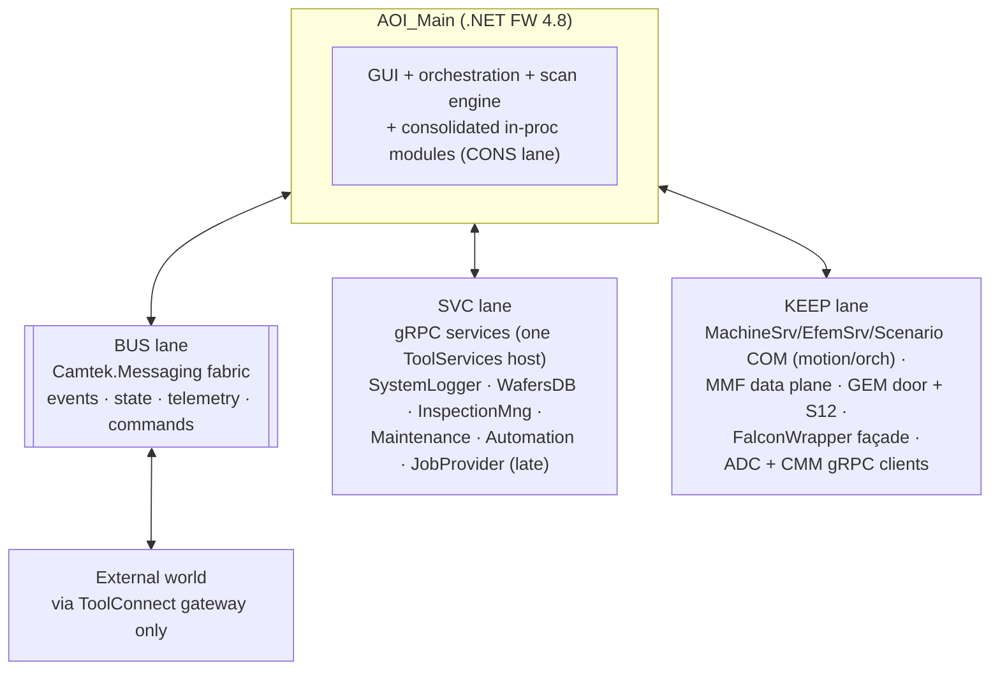

### 3.2 Mid-level — process view, all counterparts by lane

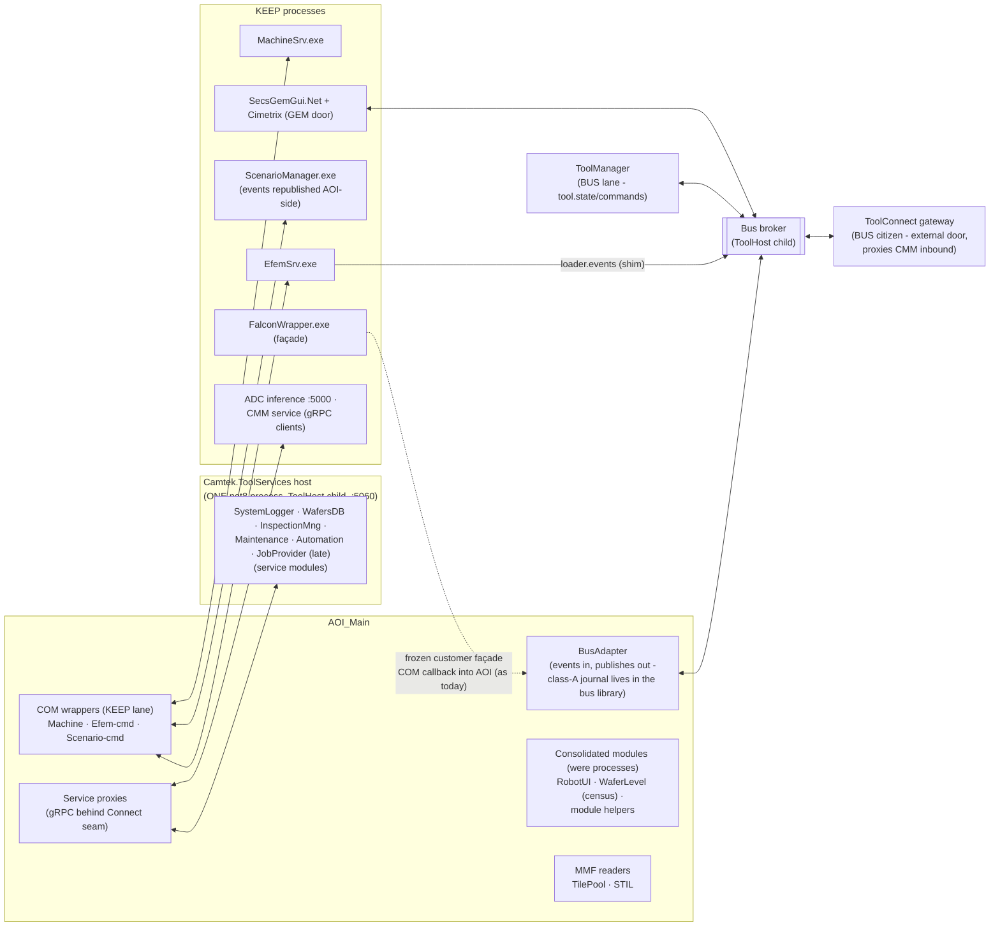

### 3.3 Low-level — inside AOI_Main after migration

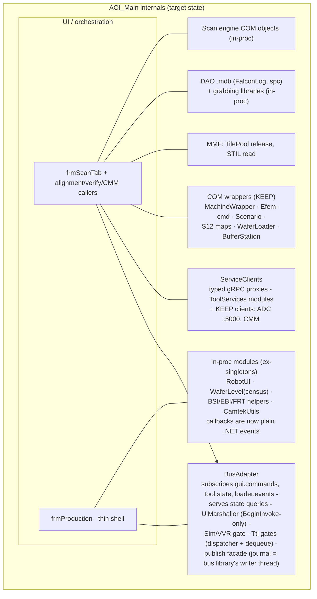

What disappears from AOI_Main: **~5–7** out-of-proc singleton connections (CONS lane absorbs the census-verified ones — WaferLoader and BufferStation *failed* their census and stay), the `:50055` **external exposure** (contained behind a gateway proxy at Wave 2; the listener itself deleted only when the per-operation split with the CMM team completes), the `ToolApiPublisher` push, four COM wrapper classes, and — per edge migrated — the `*CB` sink registrations.

### 3.4 What we gain — the benefits of the change

Mapped one-to-one against the current-architecture traits (§3.0):

| Gain | Against | Concrete measure |
|---|---|---|
| **Defined failure semantics** — per-topic durability classes, per-subscriber isolation, poison containment | T1 | A hung/slow/crashed consumer can no longer stall ToolManager or the GUI — contract-tested, fault-injected, not hoped |
| **Fewer processes** — census-verified sole-consumer singletons absorbed; 3 Windows services → 1 (ToolHost) | T2 | **~5–7** processes deleted from the tool; each was an install/monitor/restart/debug unit and a support-ticket surface |
| **No externally-reachable listeners; one audited external door** | T3 | `:5005` retired; `:50055` **contained at Wave 2** (gateway proxy — external surface closed early) and deleted when the CMM per-operation split completes; `0.0.0.0` misbinding class eliminated; the only external surfaces are the GEM wire and ToolConnect (:5007 authenticated/authorized/audited). Fab cybersecurity posture (SEMI E187-class) improves at Wave 2, not years out |
| **EOL-runtime exposure shrinks** | T3 | The Grpc.Core *server* dependency (worst case) is deleted; new SVC clients standardize on supported `Grpc.Net.Client` |
| **Decoupling — new consumers subscribe, publishers never change** | T4 | The frmScanTab line-7301 growth pattern ends; adding a Fleet/MES/analytics consumer = a gateway sink or a topic subscription, zero AOI edits. Early/late race structurally closed (payload contract) |
| **Scan thread protected** | T5 | Publish = ≤1 ms local enqueue, contract-test enforced — replacing an *unbounded* path (sleep + process-spawn on the scan thread) |
| **Zero silent data loss** for results/telemetry | T6 | Class-A disk journal + end-to-end ack; today's write-only dead-letter file becomes a replayable journal + counted dead-letters — Fleet/TSMC data survives broker, gateway, and AOI crashes |
| **Tool visible when the GUI is closed** | T7 | Gateway + bus run from boot under ToolHost — Fleet gets tool-down telemetry at exactly the moment it matters most |
| **Testability** — the systemic gain | T1/T4 | Every migrated edge becomes testable against a fake bus / service mock / in-proc event; today only ToolGateway has tests. A full production-run simulation (fake counterparts on real transports) becomes possible for the first time |
| **Maintainability & hiring** | T1 | COM/ATL/STA tribal knowledge stops being the price of every change; mainstream stacks (gRPC, JSON, pub/sub) with contracts in code |
| **Diagnosability at 3am** | T6 | Per-topic counters via ToolHost :5100, `correlationId` end-to-end (UnifiedLogger-aligned), bus-tap recorder, on-disk journals/dead-letters — versus today's two unread files |
| **A future path that doesn't exist today** | all | MES integrations, remote/fleet operations, multi-PC growth (SVC lane), and per-module .NET modernization all get a defined place to land instead of another COM interface |

What it costs (stated honestly): one new infrastructure component (bus) to build and own; a multi-release migration program with dual-run overhead; the broker as a new supervised dependency; and the risks in §6 / the fabric register — all bounded by per-edge rollback flags and the phase gate.

### 3.5 AOI_Main internal design — the communication components

How the communication machinery is organized **inside** AOI_Main, today and in the target state.

#### 3.5.1 Today — the internal communication layout

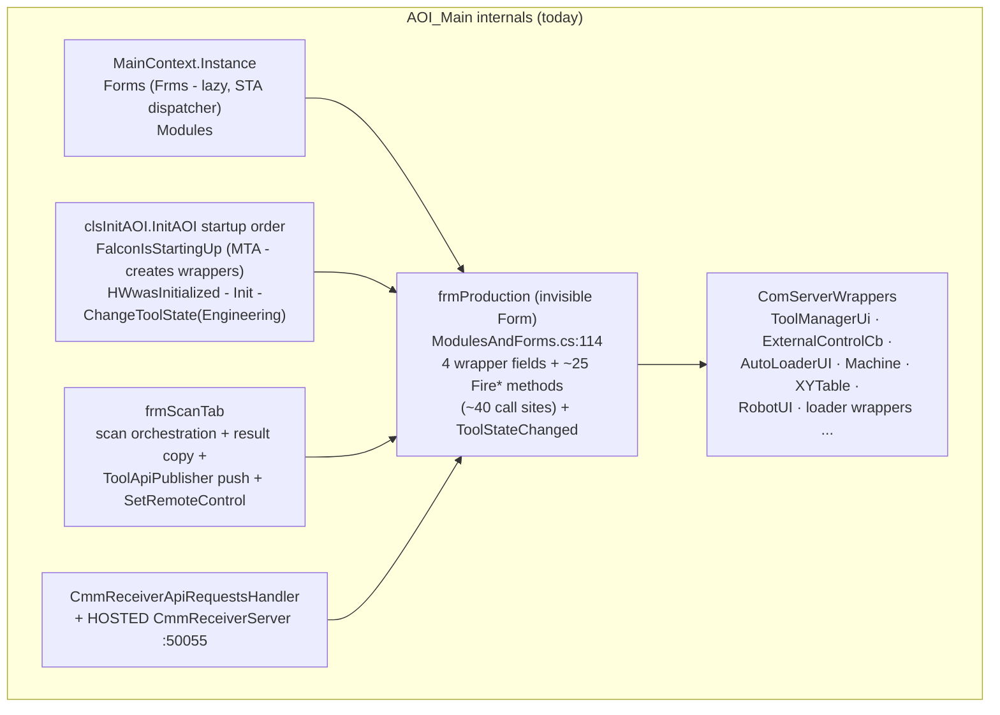

Threading today: the GUI runs one STA UI thread; COM callbacks arrive on COM worker threads and each wrapper marshals ad-hoc (`InvokeIfRequired`, `NonBlockingUITask`); the ~25 `Fire*` methods each carry their own SimMode/VVRMode short-circuit; `GuiStartManualScan` is `async void` (caller regains control at first await). Communication concerns are smeared across frmProduction, frmScanTab, the wrappers, and clsInitAOI.

#### 3.5.2 Target — communication concerns in three components

| Component | Kind | Responsibility |
|---|---|---|
| **`BusAdapter`** | Plain class (NOT a Form), owned by MainContext | *All* bus interaction: subscriptions (`gui.commands`, `tool.state`, `loader.events`), Ttl gate, **central** Sim/VVR gate, the **single** UI-marshal point, request/reply serving (state getters), publish façade + class-A journal |
| **`ServiceClients`** | Plain class, owned by MainContext | Typed gRPC proxies behind the `Connect()` seam (SystemLogger, WafersDB, …, JobProvider late) — per-service `grpc/rot/inproc` flags |
| **`frmProduction`** | Shrinks to a thin shell | Keeps only GUI *reactions* (enable/disable, light tower, job reload) — invoked BY the BusAdapter; the reaction logic moves to a testable `ToolStateReactions` class the form delegates to |

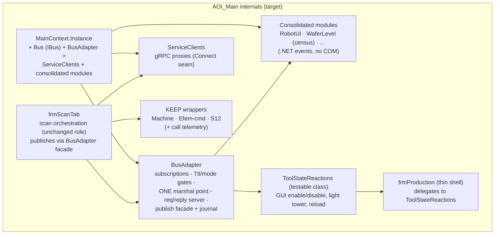

#### 3.5.3 Startup & teardown order (replaces the clsInitAOI COM sequence)

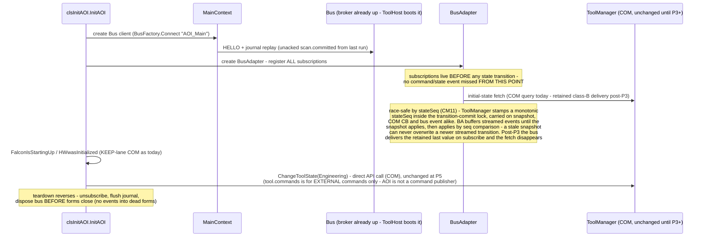

#### 3.5.3b Degraded-startup contract (broker absent or hung)

"ToolHost boots the broker" is the normal case, **not** an assumption the AOI may rely on. Normative behavior when the bus is unreachable (ToolHost crashed/disabled, fresh or partial install, boot race):

| Rule | Behavior |
|---|---|
| Connect | `BusFactory.Connect` is **non-blocking** — returns immediately, background retry with backoff. AOI startup **never hangs** on the bus |
| Subscriptions | Registered locally; replayed automatically on (re)connect |
| Publishing | Unaffected by contract: ≤1 ms enqueue; class A accumulates in the disk journal (cap + **AOI-side** alarm at threshold) |
| Operator visibility | **Degraded-mode banner in the AOI GUI within N seconds** + an event in AOI's own log — never only via ToolHost :5100, because the failed component must not host its own smoke detector |
| Self-heal | `EnsureBusRunning`: if unreachable after T, attempt to start the ToolHost service, then alert — replaces the `EnsureToolGatewayRunning` self-heal that P1a deletes |
| Per-phase severity | P1 (events only): degrade loudly, production continues. **P4+ (`gui.commands`/`tool.state` on the bus): refuse entry to Production state while the bus is down** — a tool that can't receive host commands must not pretend it can |
| Already IN Production (CM8) | Bus dark ≥ T while ToolState == Production → operator banner + local alarm; **cycle pauses at the next wafer boundary** (product-owner sign-off); gateway reports **stale-since** to Fleet, never last-value-forever. The GEM process has its own equivalent contract (fabric doc §4.3) — it degrades the host-visible control state before the host discovers the outage via HCACK failures |

#### 3.5.4 The threading contract (one rule, one place — Revision 2, post-concurrency-review)

> **Load-bearing correction (CC9/CM14):** `NonBlockingUITask` is **not** a marshal primitive — it offloads to a pool thread while the caller spins `Application.DoEvents()` (a reentrant modal pump), and it carries a live timeout bug (`.Milliseconds` instead of `.TotalMilliseconds` — any whole-second timeout becomes 0 ms). The earlier phrasing "the `NonBlockingUITask` discipline, centralized" is retracted. `UiMarshaller` is specified **from scratch**.

- **Publish**: allowed from any thread; costs ≤1 ms (lock-free enqueue only — the journal write happens on the bus library's journal thread, never the caller's; bus design §6.1 rev. 3) — safe on the scan thread by contract.
- **Marshal (the normative rules — CC9):**
  1. **Blocking `Control.Invoke` is banned** in the BusAdapter and UiMarshaller. Marshal = **`BeginInvoke` post**, always. (A blocking Invoke closes the four-party deadlock cycle: UI blocked in outbound COM ← ToolManager CB ← GEM shim awaiting reply ← BusAdapter parked in Invoke — and COM modal waits do *not* dispatch WinForms marshal messages, so the park is permanent.)
  2. **Reply = ACCEPTED on successful post** to the UI dispatcher — sent from the pool thread immediately after posting.
  3. **Ttl is re-checked at dequeue, on the UI thread, as the first statement of the marshaled delegate** (monotonic clock). Expired-at-dequeue → command-expired event + the per-command compensation (Appendix E / P4 table) — a command can never execute after the host was told it failed.
  4. **Requester-side deadline is mandatory** on every `RequestAsync` (bus contract §6.3) — receiver-side Ttl alone cannot break cross-process wait cycles.
  5. **Command serialization gate:** at most one `gui.commands` dispatch in flight; commands arriving during a tool-state transition are deferred or NACKed — the legacy `DoEvents` pump (live until its call sites retire) would otherwise execute them **reentrantly mid-transition**.
- **`UiMarshaller` spec (plain class, bus-independent):** `BeginInvoke`-post; optional completion-event wait **with a real timeout** (`TotalMilliseconds`); shutdown-token + `IsHandleCreated/IsDisposed` checks; dequeue-time Ttl recheck hook; **no `DoEvents` anywhere**. Pre-fabric absorbed modules (Track C-standalone) marshal their COM callbacks through it; the BusAdapter composes the same class post-P2.
- **Request/reply serving**: dispatch is *accepted* semantics — matching today's `async void` reality, now explicit and gated as above.
- **Teardown (CM13, normative order):** (1) flip a **reject-new gate** — new commands NACKed immediately with compensation; (2) NACK/compensate commands still queued-but-unexecuted; (3) drain in-flight handlers with a bounded timeout (abandon + log after T, never an unbounded join); (4) marshal primitive refuses posts once the shutdown token is set; (5) journal flush with timeout (class-A replay-on-next-start covers the remainder); (6) bus `Dispose` never runs on the UI thread.
- **Two disciplines coexist during migration — per edge, time-boxed** by the same N-release retention rule as rollback (§5); the shadow comparator is mode-, thread-, and skew-aware (overload semantics per A-12: evictions are an *explained* category; pairing by `correlationId`+`stateSeq`).


---

## 4. Communication Flows

### Flow A1 — full scan cycle (all four lanes in one wafer)

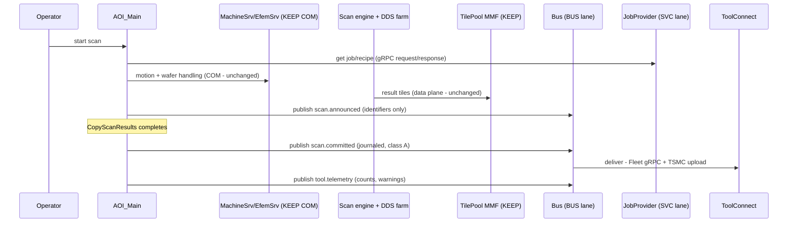

### Flow A2 — service call through the Connect seam (SVC lane)

```mermaid
sequenceDiagram
    participant C as Caller (unchanged code)
    participant CN as Connector.Instance seam (e.g. JobProviderConnector.Instance)
    participant P as gRPC proxy (new inside seam)
    participant S as ToolServices module (net8)

    C->>CN: Connector.Instance (the real seam - a static singleton lookup)
    CN->>P: returns proxy (was ROT COM lookup via SingletonUtils)
    C->>P: service call
    P->>S: gRPC unary call
    S-->>P: payload
    P-->>C: same interface, same types
    Note over CN: seam limits (verified): the connector assembly is SHARED across<br/>processes and languages - a swapped Connect flips every consumer, so shared<br/>services need a COM-visible compatibility facade; object-graph interfaces and<br/>live-object parameters need interface redesign the seam cannot hide;<br/>COM idioms at call sites (Marshal.ReleaseComObject) are swept per edge
```

### Flow A3 — consolidated module event (CONS lane — zero IPC)

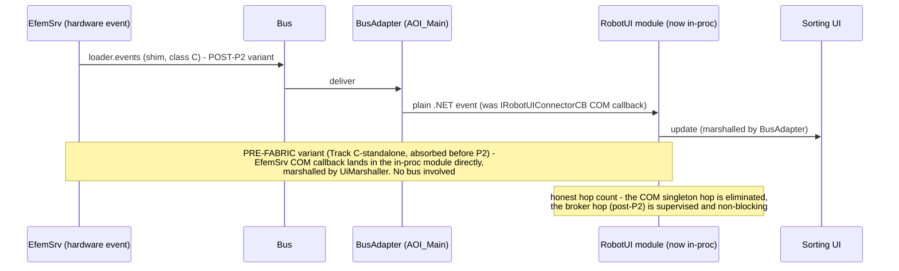

### Flow A4 — CMM inbound, today vs target (closing :50055)

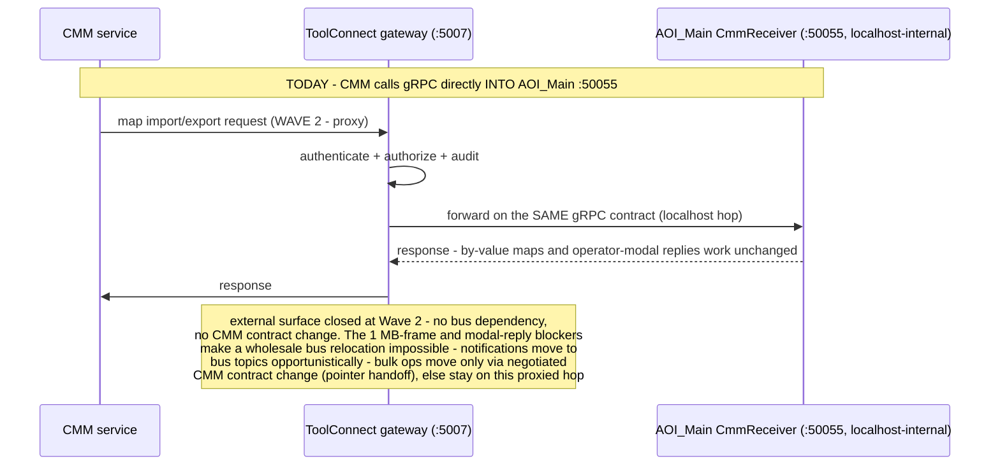

### Flow A5 — external automation via frozen façade (KEEP lane)

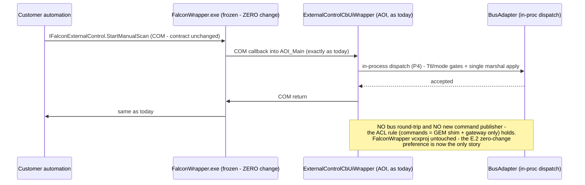

---

## 5. Migration — four planning lanes, TWO concurrent code streams, executed in waves

**Program-shape rules (from the ops review — "four parallel tracks" on one binary is one release train):**

1. **Max two concurrent code streams in AOI_Main**: (i) B-infra (bus/ToolHost/gateway — barely touches AOI until P2) and (ii) exactly **one** AOI-heavy stream per release (a C absorption *or* an S service *or* a B-P2 tranche — never B-P2 concurrent with a C absorption; they edit the same files).
2. **Fleet configuration management is a P0 deliverable, not a proposal**: ≤5 signed canonical profiles (arbitrary flag combinations refused at startup); a config fingerprint (hash of edge flags + versions) in every log header and on `tool.telemetry`; a Fleet.Main dashboard *before* the first production flag flip. The test matrix = per-profile FlaUI+contract runs plus each profile's single-flag rollback neighbors.
3. **Rollback-validity matrix + retention**: every edge classified *flag* (dual path shipped, exercised in CI) / *redeploy* / *reinstall*. Any retirement (CONS step 5, B-P1b) only after the **last** fleet tool has run the new path for a full release cycle (N-release retention); a rollback that is never drilled is a rumor.
4. **Named owner** for bus/ToolHost infrastructure is a pre-P0 entry criterion — the program's long-pole assignment.
5. **Calendar honesty**: full scope is a 10–20-release-cycle program. That number is the argument *for* the wave plan below — most value ships in the first 3–4 cycles.

### The wave plan

| Wave | Content | Teams | Delivers (§3.4 gains) |
|---|---|---|---|
| **0** | Gateway spool bug fixes (live today); ToolHost + broker + **comparator qualification** (P0 exit criterion with evidence); configuration manifest/fingerprint; §3.5.3b degraded-startup contract implemented; wrapper call-frequency telemetry (cheap, feeds every later decision); censuses (A-1 multi-PC, A-3 sole-consumer, S-pilot selection) | infra owner + gateway team | Foundation + the two live bugs |
| **1** | B-P1a dual-run (`scan.committed` + `tool.telemetry`) → **hold** → P1b retire :5005 after the retention window. In parallel (different files): **C-standalone** — RobotUI absorption with `UiMarshaller` (COM-retained variant), then 1–2 more census-passing modules | + 1 AOI dev | T5 scan-thread protection, T6 zero silent loss, T7 tool-down telemetry, :5005 gone, first process-count reduction |
| **2** | S pilot (census-selected service) proves seam + supported client stack; **CMM gateway proxy** (closes the :50055 external surface — no B-P4 dependency); remaining census-passing C modules, one per release | + ToolServices owner | T3 security containment, T2 completed, SVC pattern proven |
| **Deferred — trigger-based, explicitly unscheduled** | **B-P2** (`Fire*` sweep — triggers: A-1 + A-2 resolved AND a concrete new-consumer need) → **B-P3** (`tool.state`) → **B-P4** (GUI commands — trigger: a customer/MES requirement COM cannot meet) → **B-P5** (per-customer, re-qual) → CMM per-operation split (CMM-team contract change) → JobProvider via compatibility connector → GEM shim | per trigger | Full T1/T4 — the majority of cost and re-qual exposure for the most diffuse benefits; spent only against a named trigger |

Per-edge gate (all waves): call-frequency telemetry reviewed → contract/regression tests green → (bus edges) **unexplained** shadow divergence zero over N days → **rollback drill executed** → FlaUI suite green on the affected profile.

---

## 6. Risks & Open Items (beyond the fabric register)

| # | Item | Action |
|---|---|---|
| A-1 | **Multi-PC topology unverified** — if any BUS/SVC counterpart runs off-box, its lane assignment changes (bus is same-PC only; gRPC is not) | Census on real tool configs — **blocking for Track B P2+ and §2.1 machine topics** |
| A-2 | ScanManager host discrepancy (ScenarioManager.exe vs FalconWrapper.exe) | Repo reconciliation before B-P2 |
| A-3 | Sole-consumer assumptions (all CONS candidates) | Triage census is Track C step 0 — a second consumer found = move to SVC |
| A-4 | STA/threading of consolidated modules (RobotUI et al. ran in their own processes; now share AOI_Main's UI thread discipline) | Threading audit per absorbed module; BusAdapter marshal pattern reused |
| A-5 | Grpc.Core EOL — SVC track initially *extends* usage of a deprecated runtime on the AOI client side | Standardize new SVC clients on `Grpc.Net.Client`+WinHttpHandler from the pilot onward; Grpc.Core allowed only where already vendored; the hosted-server exposure is **contained at Wave 2** (gateway proxy) and **deleted only when the CMM per-operation split completes** |
| A-6 | Chatty property-gets (RobotUI/Machine wrappers) | Telemetry gate before any edge; snapshot topics (class B) where rates are high |
| A-7 | `.mdb` DAO logging | Out of scope here — separate DataServer/MDC modernization item |
| A-8 | STIL MMF producer identity unresolved | Resolve during Track F documentation pass; no design dependency |
| A-9 | **Class-A journal on gateway-disabled tools** — sole subscriber absent → journal never acks → disk leak | Bus contract addition (applied to the bus design): class-A publish with zero registered durable subscribers → immediate ack + counter; broker contract test |
| A-10 | **Connect-seam limits** (shared multi-language connectors; object-graph/live-object interfaces; call-site COM idioms like `Marshal.ReleaseComObject`) | B.2 rule 1 carries the three limits; per-edge COM-idiom sweep added to the SVC gate; shared services get compatibility façades |
| A-11 | **Dependency approvals (§0.4)** — `System.Threading.Channels` (net48), possible broker embed library | Elevated from Appendix E to here: owner = bus/ToolHost owner; decision date = P0 exit; the embed-vs-build broker decision hangs on it |
| A-12 | **Comparator qualification** is a P0 *exit criterion with evidence* (fault-injection suite), not an adjective | Wave 0 deliverable; no P1a entry without it |
| A-13 | SPC.exe hosts a second `ComCmmReceiverServer` (`apps\SPC\frmMain.frm:984`) | Added to inventory; same gateway-proxy containment applies when SPC is in scope |
| A-14 | **P3 atomicity rule (CM12):** a tool-state's reaction block (`ToolStateChanged` — GUI disable, `mBatch=null`, `InProductionMode`, light tower, job reload) migrates **as one atomic unit, never split across COM and bus disciplines**; the bus path is shadow-only (computes + compares, does not apply) until the flip. `stateSeq` (stamped in ToolManager's transition-commit lock, carried on snapshot + CB + bus event) is the P3 gate mechanism and the comparator's pairing key |
| A-15 | **P4 compensation table (CC10):** for every external-control command, the Ttl-expiry/NACK outcome maps to a synthesized completion/failure `Fire*` (`ManualScanDone`, export-failed) and defined return values for value-returning callbacks — a NACK that only exists on the in-proc path leaves customer automation holding S_OK and waiting forever |
| A-16 | **Live bugs found by the concurrency review** (work items, independent of the program): `NonBlockingUITask` timeout uses `.Milliseconds` not `.TotalMilliseconds` (any whole-second timeout ⇒ 0 ms, spurious cancellation); Fleet `ToolId` collapses to 0 for alphanumeric tool names (`int.TryParse("BH01")` — fleet-wide identity collision); no spool drain loop exists (restore only at process start). Full list: [camtek-fabric-concurrency-review.md §5](../02-reviews/camtek-fabric-concurrency-review.md) |

**The one decision this document embodies** (recommend ratifying as an ADR): *bus for fan-out, gRPC for services, consolidation for sole-consumers, freeze the rest* — with lane assignments per §2 and any reassignment requiring the same ADR process, so the BUS and SVC tracks never compete for the same edge again.

---

# Appendix A — BUS Lane: Complete Design (AOI_Main view)

> Authoritative bus internals: [camtek-messaging-bus-design.md](camtek-messaging-bus-design.md); system integration: [camtek-tool-fabric-complete-design.md](camtek-tool-fabric-complete-design.md). This appendix is the **AOI_Main-side** design.

## A.1 What AOI_Main puts on / takes off the bus

| Direction | Topic | Class | AOI_Main component |
|---|---|---|---|
| publish | `scan.committed` (stable paths) | A (journaled) | frmScanTab post-`CopyScanResults` hooks |
| publish | `scan.announced` (identifiers only, no paths) | C | frmScanTab, beside the legacy `Fire*` |
| publish | `scan.operations` | C | frmScanTab, modWaferAlignment, frmVerifyTab, CmmReceiver — via BusAdapter |
| publish | `scan.operations.requests` (the 3 ref-returning `Fire*` ops) | R-R | via BusAdapter — one class per topic; R-R ops get their own registered topic |
| publish | `scan.dds-node-status` (DDS "pizza" status, republished from ScenarioManager COM callbacks) | C | BusAdapter — tool-mgmt-owned name; no `dds.*` namespace violation |
| publish | `tool.telemetry` (errors, warnings, Lcc, ToolInfo) | A(err)/C(info) | error/log call sites (today's :5005 non-scan events) |
| subscribe | `gui.commands` (request/reply) | R-R | BusAdapter — serves `GuiStartManualScan`, `ExportMap`, state getters |
| subscribe | `tool.state` | B | BusAdapter — GUI enable/disable, light tower, job reload |
| subscribe | `loader.events` | C | BusAdapter → consolidated RobotUI/loader modules |

## A.2 The BusAdapter — AOI_Main's single bus organ

Replaces frmProduction's four COM wrappers; one component, six duties (all topics it touches are **registered** in the bus `Topics` registry with class + publish ACL — nothing here publishes a command topic):

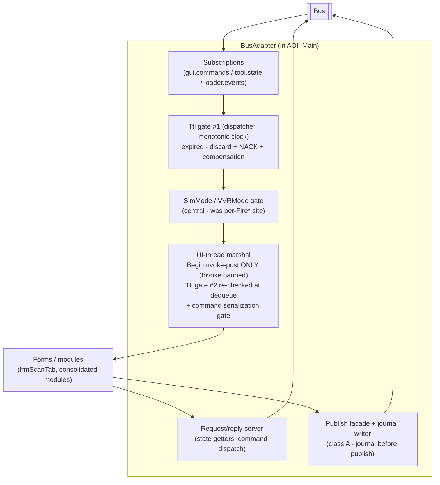

Threading contract: bus handlers arrive on pool threads; **only** the marshal step touches the UI thread — via the from-scratch `UiMarshaller` (`BeginInvoke`-post only; the `NonBlockingUITask` phrasing is retracted, see §3.5.4). **The publish path touches no disk on the caller thread** — the class-A journal is owned by the bus library's single journal-writer thread (bus design §6.1 rev. 3); the ≤1 ms bound is unconditional.

## A.3 Flow — command in, result out (the AOI round-trip)

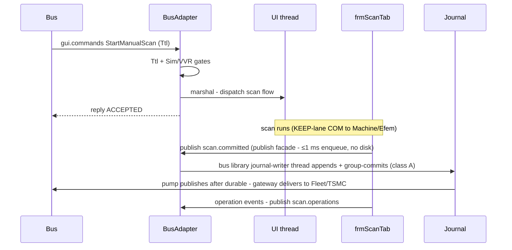

## A.4 AOI-side migration & tests

Phases = Track B (P1a…P5) in §5. Per-edge: dual-publish beside the legacy path → shadow compare (mode-aware) → flag flip → retire. AOI-specific test additions: BusAdapter contract tests against a fake bus (first-ever unit tests for frmProduction logic); one diagnostic subscription in P1a to burn in the dispatcher/marshal path (Gap 7 of the verification).

---

# Appendix B — SVC Lane: Complete Design (gRPC services)

## B.1 Shape and hosting

Service-shaped singletons (JobProvider, SystemLogger, WafersDatabase, InspectionMng, Maintenance, Automation) become gRPC services. **Hosting decision: one `Camtek.ToolServices` host** (net8, ToolHost child) using the DataServer service-module pattern (`Camtek.API.<Module>` contracts → internal service → gRPC adapter) — one process, not six; port from the tool's port plan (proposal: :5060). Alternative (evaluate at pilot): join DataServer's host itself.

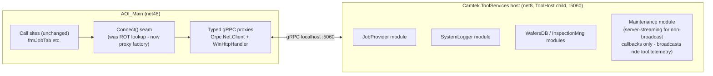

## B.2 The five pattern rules

1. **The `Connect()` seam is the swap point — with three verified limits.** The seam is real (one connector class per singleton, `SingletonUtils.GetSingleton`), but: (a) **connector assemblies are shared across processes and languages** — SecsGem clients, NetTAC, TAC.Net, ProductionGui, and *native C++* consume the same connectors, so a swapped `Connect()` flips every consumer at once; shared services therefore migrate via a **COM-visible net48 compatibility façade** wrapping the gRPC client, never a hard swap. (b) Singletons returning **object graphs or accepting live-object parameters** (JobProvider's `SdrServer/S21Server`, InspectionMng's module handles, RobotUI's `Initialize(hWnd, factories…)`) need **interface redesign** the seam cannot hide. (c) **Call-site COM idioms** (`Marshal.ReleaseComObject` throws on a non-COM proxy) are swept per migrated edge — "call sites do not change" holds only after that sweep. Rollback = seam flag back to ROT (valid within the retention window).
2. **Callbacks → server-streaming subscriptions** with client-side reconnect; where the "callback" is really a broadcast (Maintenance completion), prefer a bus topic instead (lane discipline).
3. **Stateful services → handle/lease**: explicit session id + keep-alive, so a client crash releases server state.
4. **Clients on supported runtime only**: `Grpc.Net.Client`+`WinHttpHandler` (the P0 TLS-localhost spike from the fabric program covers this lane too). Grpc.Core remains only where already vendored (ADC/CMM), until hygiene migration.
5. **Contracts = proto files in `Camtek.API.<Module>`**, additive-only evolution — same discipline as the bus envelope.
6. **Client failure policy is mandatory (CC15)** — the seam preserves interfaces, so calls stay synchronous on the UI thread; without this rule the migration converts today's *fail-fast* COM errors into 30-second GUI freezes: **per-call deadline (2–5 s default, per-service configurable); circuit breaker** (channel known-down → fail immediately, no wait); **per-service degraded behavior defined before migration** (SystemLogger → local-file fallback; JobProvider → error dialog, never a hang); contract test: *ToolServices host killed mid-call → caller unblocked in < deadline*.

## B.3 Flow — SVC service call + stream (the pattern; pilot = census winner)

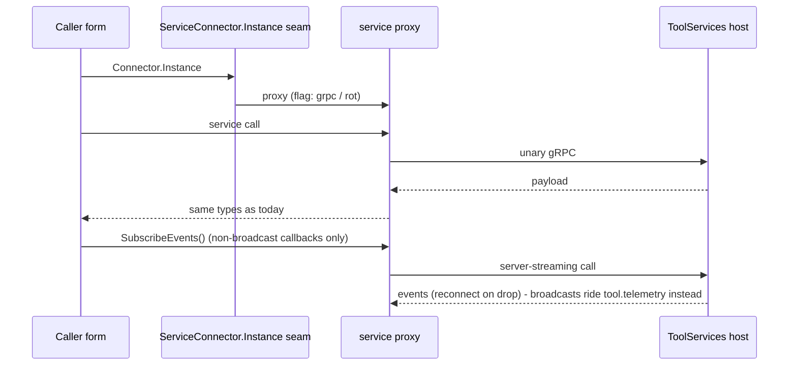

## B.4 Migration & tests

Order: census (fan-in + interface shape per service) → **pilot = the census winner** (criteria: AOI-only fan-in, flat interface, no live-object params — SystemLogger is the leading candidate pending census; **JobProvider is disqualified as pilot** by its GEM/TAC/native-C++ fan-in and object-graph interface) → **CMM gateway proxy (Wave 2 — early, independent of the service migrations)** → simple shared services via compatibility façades → WafersDB/InspectionMng → Maintenance/Automation → client hygiene (ADC/CMM to `Grpc.Net.Client`) → JobProvider late, via compatibility connector → CMM per-operation split (only with a negotiated CMM contract change). Per-service gate: seam flag rollback drill; proxy contract tests against a mock host; call-frequency telemetry reviewed (chattiness → batch APIs, not per-property gets); COM-idiom sweep of that service's call sites.

---

# Appendix C — CONS Lane: Complete Design (in-proc consolidation)

## C.1 Census first (step 0, mandatory) — first results are in

For each candidate: grep the repo for its ROT/`Connect()` lookups. **Exactly one consumer (AOI_Main) → CONS; more → out of this lane.** Executed so far (feasibility review, 2026-07-17):

| Candidate | Census result | Lane |
|---|---|---|
| **RobotUI** | ✅ PASSED — sole consumer is AOI_Main (`RobotUIEventHandlerWrapper.cs:1288`) | CONS flagship |
| **WaferLoader** | ❌ FAILED — E30Client, AutolineClient, StandaloneClient, NetTAC, native C++ `ToolManagementEventsImpl.cpp` | KEEP (GEM/TAC-coupled) |
| **BufferStationManager** | ❌ FAILED — `SecsGemObjects\Clients\BufferStationClient.cs:59` | KEEP (GEM/TAC-coupled) |
| WaferLevelCassette, BSI/EBI/FRT helpers, CamtekUtils, WaferMapServer | pending | TBD |

Two of three checked candidates failed — the census is load-bearing, not a formality. Remaining censuses complete in Wave 0.

**C-standalone (no fabric dependency):** the absorption pattern below works with the hardware link staying **COM** — the marshal discipline is the plain **`UiMarshaller`** class (no bus reference; the BusAdapter later composes the same class). This preserves Track C's "cheapest early win, needs no fabric" property honestly.

## C.2 The absorption pattern (per module)

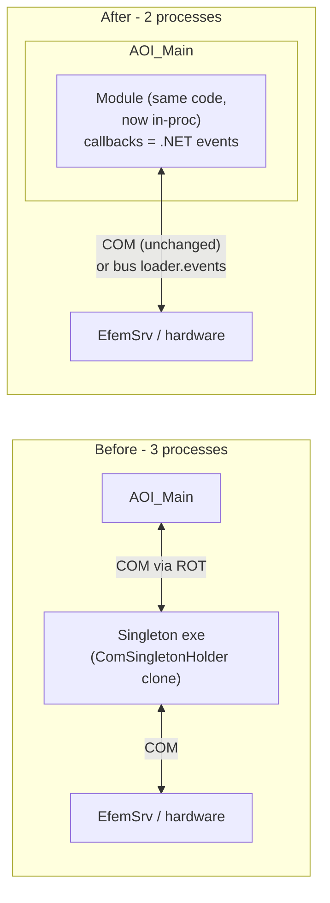

Steps: (1) reference the module assembly directly; (2) the `Connect()` seam returns an **in-proc instance** behind the same interface (flag: `inproc` / `rot` — rollback is the flag, valid for the retention window); (3) `I*CB` COM sink → plain .NET event subscription; (4) **single-STA consolidation — a structural acceptance criterion, not an audit (CC11):** the module's own STA thread/message pump is **deleted** — its form is created on AOI's main UI thread as an owned form, per-dialog STA threads become plain `ShowDialog`, and **all the module's COM proxies are acquired and confined to one apartment** (RobotUI verified: it spawns its own `Application.Run` pump + a `DoEvents` busy-loop + per-dialog STAs, and holds MachineSrv/EFEM/WafersDB/JobProvider proxies on mixed apartments — absorbed as-is, mutual-Invoke across two STAs is a *permanent* deadlock). If a transitional dual-STA window is unavoidable: written thread-ownership contract, GIT-based marshaling, **post-only (`BeginInvoke`) cross-STA calls in both directions — blocking `Invoke` banned**; (5) retire the exe + ROT registration + installer entry (after the retention window).

## C.3 Flow — RobotUI event after absorption

Covered by Flow A3 (§4): hardware → `loader.events` → BusAdapter → **plain .NET event** → sorting UI. One process hop total (the hardware's), was three.

## C.4 Order & gate

RobotUI first (census-verified flagship; richest callbacks — proves the threading audit against a module that runs its **own STA message pump** and owns MachineSrv/EFEM/WafersDB/JobProvider COM connections that move in with it), then the census-passing remainder (WaferLevel, module helpers, CamtekUtils-as-library, WaferMapServer) — one module per release. WaferLoader and BufferStation are **out** (census failed). Gate: FlaUI regression suite green on the affected profile; rollback flag valid for the retention window before the exe leaves the installer; process count on the tool is the visible KPI.

---

# Appendix D — KEEP Lane: Complete Design (actively managed, not ignored)

"KEEP" is a managed state with instruments and exit criteria — not neglect.

## D.1 What is kept and why

| Kept | Reason | Exit trigger |
|---|---|---|
| MachineSrv/EfemSrv/ScenarioManager **command** COM | Motion latency; tight loops live behind those boundaries | Each server's own .NET modernization program |
| MMF data plane (TilePool, STIL) | Bulk data never rides a control plane | None — permanent by design |
| GEM wire (Cimetrix driver + SecsGemObjects logic) | Fab-qualified | P5 per-customer, re-qual budgeted |
| FalconWrapper external contract | Customer automation contract (M11) | Contract renegotiation only |
| Shared INI / `c:\job` | Config + job coordination | Shrinks as JobProvider SVC matures |

## D.2 Active management — the instruments

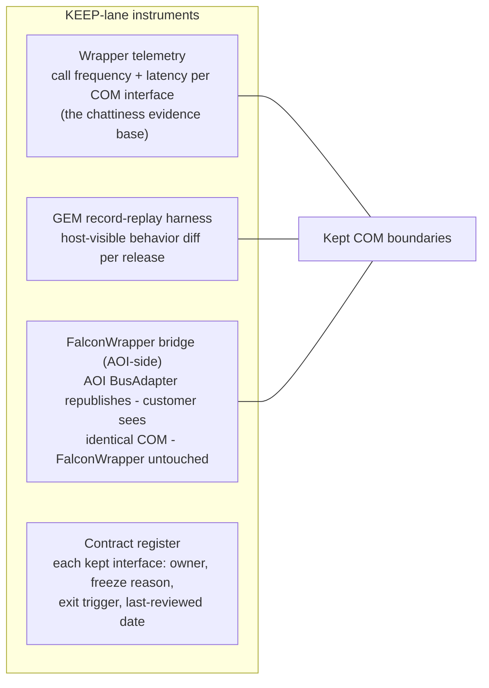

## D.3 Flow — customer automation through the frozen façade

Covered by Flow A5 (§4): customer COM contract byte-identical; the COM callback is dispatched **in-process through the BusAdapter** (Ttl/mode gates apply) — **no bus publish, no new command publisher** (the `*.commands` ACL holds).

## D.4 Governance

Every KEEP entry is reviewed once per release cycle against its exit trigger; moving an edge out of KEEP is an ADR-level change (same rule as lane reassignment). The wrapper-telemetry data is the standing input for that review — it converts "should we modernize MachineSrv's boundary?" from opinion to measurement.

---

# Appendix E — Impact Map: What Each Change Touches

> Per change: the affected projects (paths relative to `C:\CamtekGit\BIS\Sources` unless noted), the nature of the change, and the blast radius. Paths verified during the investigations; items marked *(census)* are finalized by the Track-C/S censuses.

## E.1 NEW projects (created, affect nothing until referenced)

| Project | Contents | Owner track |
|---|---|---|
| `Messaging\Camtek.Messaging` (net48;net8.0) | Bus client: API, queue, pump, journal, dedup | B |
| `Messaging\Camtek.Messaging.Contracts` (+ per-subsystem contracts later) | Envelope, topic descriptors, payload DTOs | B |
| `Messaging\Camtek.Messaging.Broker` (net8) | Broker (ToolHost child) | B |
| `Messaging\Camtek.Messaging.TestKit` / `.Tests` / `.Tap` | Contract kit, fault injection, bus-tap CLI | B |
| `ToolHost\Camtek.ToolHost` (net8) | Process supervisor service ([design](camtek-toolhost-design.md)) | B (entry criterion) |
| `ToolServices\Camtek.ToolServices.Host` + `Camtek.API.<Module>` per service | SVC host (:5060) + contracts | S |
| GEM record-replay harness (test project under `ToolManagement\`) | Host-visible regression net | D |

**⚠ Escalation items (policy §0.4 — new dependency approval required):** `System.Threading.Channels` package for net48 (bus client), and — only if the embed option wins at P0 — a broker library (NATS-class). `Newtonsoft.Json` is already repo-standard.

## E.2 BUS track — modified projects per phase

| Phase | Project (path) | Change | Blast radius |
|---|---|---|---|
| P1a | `apps\Falcon.Net\AOI_Main.csproj` | Add `Camtek.Messaging` reference (binary drop); publish calls at the frmScanTab hook sites (~:1888-1902, :10162); journal dir config | Low — additive beside `IPublisher` |
| P1a | `Utilities\ToolGateway\ToolGateway.BL` + `.Endpoint` (+ `.Tests`) | `BusSource` + `CommandPublisher`; net7→net8; **fix 2 live spool bugs** | Medium — gateway release; :5005 kept as fallback |
| P1a | `apps\Falcon.Net\Classes\clsInitAOI.cs` | Remove `EnsureToolGatewayRunning` (gateway becomes ToolHost child) | Low — startup path, flag-guarded |
| P1b | `system\CamtekSystem` (`PubSub\ToolApi\*`, `PublisherFactory`) | Retire `ToolApiPublisher` + `toolapi.proto`; later the MSMQ/RabbitMQ variants | Medium — shared assembly; many referencing projects rebuild, no API break if seam kept |
| P2 | `apps\Falcon.Net` — `Forms\frmScanTab.cs`, `Forms\frmProduction.cs`, `Modules\modWaferAlignment.cs`, `Forms\frmVerifyTab.cs`, `Cmm\CmmReceiverApiRequetsHandler.cs` | ~40 `Fire*` sites → `bus.Publish`; frmProduction wrappers → BusAdapter (staged) | **High file-count, mechanical** — the biggest AOI diff of the program; dual-publish keeps old path live |
| P2 | EFEM/AutoLoader COM server project *(exact csproj/vcxproj per census)* | `loader.events` publish shim (native → `camtek_bus.dll`) | Low — additive |
| P2–P4 | `ToolManagement\FalconWrapper` (vcxproj) | **Zero change (DECIDED — R1-C3):** bridge = AOI-side; AOI's BusAdapter republishes events (P2–P3), inbound commands dispatch in-proc (P4). FalconWrapper is never a bus client | Contract-sensitive — untouched by design |
| P3 | `ToolManagement\ToolManager` (`Server\ToolEvents.cs`) | 3-site dual-publish beside `CallbackHandler.Call` | Low code / **high semantic** — state machine timing; shadow-gated |
| P4 | `apps\Falcon.Net\CommonUtils\ComServerWrappers\ExternalControlCbUiWrapper.cs` (+ BusAdapter) | Full ~15-callback surface → **in-process dispatch through the BusAdapter** (Ttl/mode gates + single marshal; **no bus publish — ACL preserved**) | Medium-High — external-control behavior; FlaUI + record-replay gated |
| P4 | `ToolManagement\SecsGemObjects` (+ `SecsGemGui.Net`) | GEM bus shim (C#): publish `gui.commands`, subscribe events | Medium — inside the GEM client process; wire untouched |
| P5 *(optional)* | `ToolManagement\SecsGemObjects\Clients\RemoteControllers\RemoteControl.cs`; `ToolManager` command intake | `tool.commands` path | **High — re-qual, per customer** |

## E.3 SVC track — modified projects per service

| Change | Projects | Blast radius |
|---|---|---|
| Pilot: census winner (SystemLogger leading candidate) | New `Camtek.API.<Pilot>` + module in ToolServices host; AOI seam site per census | Proves seam + supported client stack. **JobProvider is NOT the pilot** — its connector is consumed by the GEM/TAC stack incl. native C++ (`ProcessProgramManager.cpp:84-88`); it migrates late via a COM-visible compatibility connector, touching `ToolManagement\JobProvider\*` and every consumer's retest |
| SystemLogger | Same pattern; AOI sites `frmJobTab.cs:2875,3109` | Low |
| WafersDatabase / InspectionMng (+SPC) | Same; AOI sites `MainContextModule.cs:142-159,1382-1383` | Medium — data-path correctness |
| Maintenance / Automation | Same; server-streaming for non-broadcast callbacks only (broadcasts → `tool.telemetry`); `clsCalibrationManager.cs:44`, `Modules\Automation.cs:31-111` | Medium — CB semantics |
| Client hygiene | `Camtek.ADC` + CMM client projects: Grpc.Core → `Grpc.Net.Client` | Low, mechanical |
| **CMM gateway proxy (Wave 2)** | Gateway gains a gRPC forward to :50055 (same contract); CMM reconfigured to :5007; :50055 binding verified localhost-only | Low-Medium — no CMM contract change; closes the external surface early |
| CMM per-operation split *(deferred, CMM contract change)* | `apps\Falcon.Net\Cmm\CmmReceiverApiRequetsHandler.cs` ops split: notifications → bus topics; bulk maps → pointer handoff; `ExportMapConfirmation` exempted (operator-modal) | Medium — external counterpart; only path that ever deletes the :50055 listener + Grpc.Core server dep |
| Retirement (end state) | `system\NetComSingleton\ComSingletonUtils` usage shrinks per migrated singleton | Installer + `ReservePorts.bat` (:5060 added, :50055 removed) |

## E.4 CONS track — per absorbed module

Pattern per module — four touch points: (1) module's own project (remove singleton-host assumptions, threading audit); (2) `AOI_Main.csproj` (direct project reference); (3) the `Connect()` seam file for that module (in-proc flag); (4) installer/`DeployUI` (exe + ROT registration removed).

| Module | Implementation project | AOI seam site |
|---|---|---|
| RobotUI ✅ | `machine\RobotUIControls.NET` (already referenced by `AOI_Main.csproj:2170`) | `RobotUIEventHandlerWrapper.cs:29,1288` |
| ~~WaferLoader~~ ❌ census failed → KEEP | — | — |
| ~~BufferStation~~ ❌ census failed → KEEP | — | — |
| WaferLevelCassette *(census pending)* | — | `WaferLevelManagerUIWrapper.cs:34` |
| BSI/EBI/FRT helpers | module projects | `Modules\*ModuleHelper.cs` |
| CamtekUtils | → plain library reference | `MainContextModule.cs:110` |
| WaferMapServer *(if census passes)* | — | `Utils\WaferMapConnector.cs:13` |

Blast radius per module: contained to AOI_Main + that module + installer; risk is **threading (A-4)**, not integration. `ComSingletonHolder.exe` itself is unchanged (fewer clones deployed).

## E.5 KEEP track — instrumentation only

| Change | Projects | Nature |
|---|---|---|
| Wrapper call-frequency telemetry | `apps\Falcon.Net\CommonUtils\ComServerWrappers\*` (all wrappers) | Additive logging — no behavior change; feeds every lane's gate |
| GEM record-replay harness | New test project + capture tooling | Off-tool instrument |
| Contract register | Doc, not code | — |
| **Zero change** | `MachineSrv`, `EfemSrv` (commands), Cimetrix driver, MMF (TilePool/STIL), grabbing libs, DAO `.mdb`, TestAutomationAPI | By design |

## E.6 Build / deploy / infra impact (cross-cutting)

| Item | Impact |
|---|---|
| `BIS\build\Falcon_2022.sln` | + Messaging projects (net48 targets); ToolServices/ToolHost/Broker live in their own net8 solutions |
| Binary drops `c:\bis\bin` + `c:\bis\bin\x64` | + `Camtek.Messaging.dll` (both bitnesses), `camtek_bus.dll` (native, later) |
| `DeployUI` (`DeployUI2.ps1`, `msbuild.actions.ps1`, `stopall.ps1`) | Publish steps for ToolHost/broker/gateway; stop/start via ToolHost API instead of process-name kills; remove per-singleton exe handling as CONS lands |
| Installers (WiX / Wise / RMS-installer patterns) | ToolHost `ServiceInstall` (the 3→1 consolidation); retire absorbed singleton entries; DataServer/RMS re-registration per ToolHost plan |
| `Install\Scripts\ReservePorts.bat` + firewall | + :5060 (ToolServices), + :5007 (gateway commands); − :5005, − :50055; bus = no ports (pipes) |
| CI (`xbuild\*.yml`) | New test projects into the PR pipelines; contract kit as a gate |
| `Packages\` (local NuGet store) | + `System.Threading.Channels` (needs §0.4 approval); nothing else new |

**Reading the map:** the heaviest single diff is P2's mechanical `Fire*` sweep in `apps\Falcon.Net`; the highest-risk small diffs are P3 (`ToolEvents.cs`, 3 lines, state-machine semantics) and P5 (`RemoteControl.cs`, re-qual). Everything else is additive new projects or seam-guarded swaps with flag rollback.
