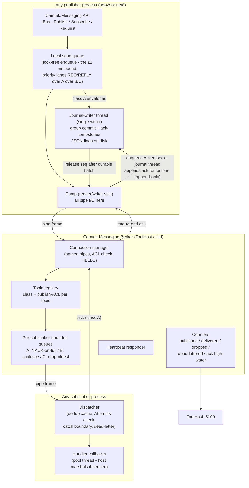
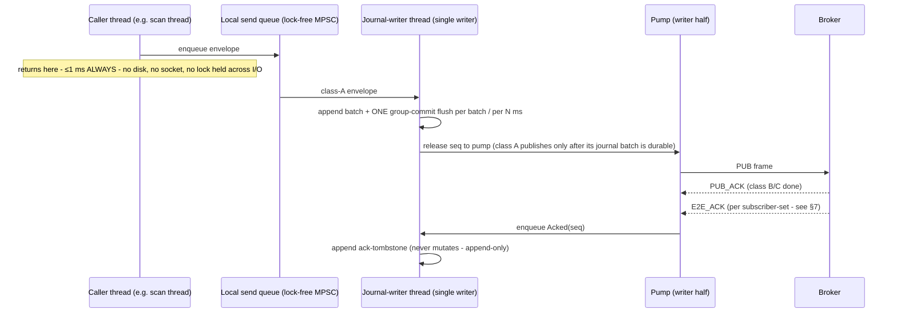
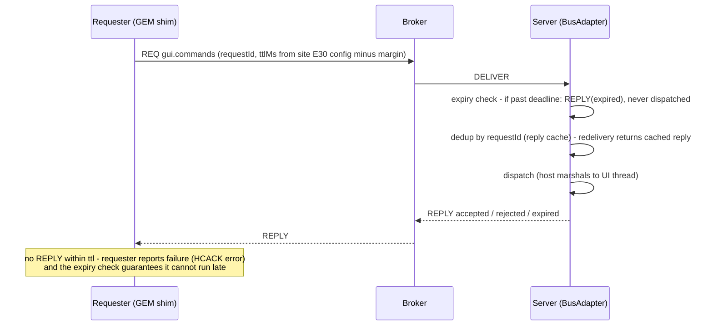

# Camtek.Messaging — Bus Fabric Detailed Design

> Implementation-level design for the `Camtek.Messaging` bus — the internal fabric of the fused A3 architecture ([a3-fused-bus-gateway-design.md](../04-history/a3-fused-bus-gateway-design.md), §3–§4).
> This document zooms from the architecture level down to: library layout, API, wire protocol, broker internals, the class-A ack/journal protocol, threading, security, and the test kit.
> **Status: proposed — nothing here exists in the repo today.** Prior art it supersedes: `CamtekSystem\PubSub` (MSMQ + `IPublisher`/`PublisherFactory`).
> Constraints inherited: multi-target `net48;net8.0`; binary-drop delivery to `c:\bis\bin` + `c:\bis\bin\x64`; publish bound ≤1 ms; durability classes A/B/C/R-R; broker as ToolHost child; localhost-only with ACLs.
> **Revision 3 (2026-07-18):** incorporates the concurrency/connectivity/load adversarial review ([camtek-fabric-concurrency-review.md](../02-reviews/camtek-fabric-concurrency-review.md)) — single-writer journal with group commit + ack-tombstones, reader/writer-split I/O with priority lanes, normative E2E-ack subscriber-set semantics, NACK redelivery schedule + `RESUME`, retained class B, seq-contiguity dedup, dequeue-boundary Ttl gates, storm control, load model, composite-fault TestKit.
> Date: 2026-07-16 / rev. 2026-07-18.

---

## 1. Scope

**Is:** a typed pub/sub + request/reply message layer for **one machine** — the transport that replaces the COM CB callback web between the tool's processes. First adopter: the tool-management/gateway edges of the fused A3 design. **Designed from day one as a machine-wide fabric** — other subsystems (DDS, machine layer, EBI, CMM…) are expected to adopt it for their COM event/command boundaries over time (§12).

**Is not:** a network bus (localhost/named-pipe only) · a persistence service (durability lives at the edges: publisher journal, gateway spool) · an orchestrator (no routing logic beyond topic matching) · a serialization framework (JSON v1, pluggable later) · **a COM replacement for everything** — it replaces *events and commands*, not COM object models (§12.3).

Design drivers (from the adversarial review): hard publish bound (fixes today's unbounded `ToolApiPublisher` path), per-subscriber isolation (fixes the COM CB stall class), explicit ack contract (no silent loss), poison-message containment, field diagnosability. Plus one from the machine-wide ambition: **language-neutral wire protocol** — the protocol must be implementable from native C++ (§12.2), which is why it is length-prefixed JSON frames over a named pipe and nothing fancier.

---

## 2. Architecture

Three deliverables: the **client library** (linked into every process), the **broker** (one child process under ToolHost), and the **test kit** (contract tests + fault injection, shipped with the library).



### 2.1 Projects and packaging

```
Sources\Messaging\
  Camtek.Messaging\              net48;net8.0  — client API, queue, pump, journal, dedup, request/reply
  Camtek.Messaging.Contracts\    net48;net8.0  — envelope, topic descriptors, payload DTOs (no logic)
  Camtek.Messaging.Broker\       net8.0        — broker host (console; ToolHost child)
  Camtek.Messaging.TestKit\      net48;net8.0  — contract-test base classes + fault-injection harness
  Camtek.Messaging.Tap\          net8.0        — bus-tap recorder CLI (diagnostics)
  Camtek.Messaging.Tests\        net8.0        — unit + protocol tests (xUnit + FakeItEasy, per ToolGateway precedent)
```

Packaging: post-build drop of the net48 binaries to `c:\bis\bin` **and** `c:\bis\bin\x64` (AOI_Main builds both bitnesses); broker + net8 binaries deploy with ToolHost. `TreatWarningsAsErrors` per repo props. Dependencies kept to what net48 tolerates as loose DLLs: `Newtonsoft.Json` (already everywhere in the repo), `System.Threading.Channels` (netstandard2.0 package — works on net48) — nothing else.

---

## 3. Public API (C# sketch)

```csharp
public interface IBus : IDisposable
{
    // Fire-and-forget publish. Hard bound: returns in ≤1 ms (lock-free enqueue only, never I/O).
    // Class A topics: the envelope is handed to the single journal-writer thread;
    // it is journaled (group commit) BEFORE the pump sends it to the broker (§6.1).
    void Publish<T>(Topic topic, T payload, PublishOptions options = null);

    // Subscribe with an async handler. Handler runs on a pool thread —
    // the HOST marshals to STA/UI if it needs to (BusAdapter's job, not the library's).
    ISubscription Subscribe<T>(Topic topic, Func<BusMessage<T>, Task> handler,
                               SubscribeOptions options = null);

    // Request/reply (commands). Ttl is mandatory; expired requests are never dispatched.
    Task<Reply> RequestAsync<T>(Topic topic, T payload, TimeSpan ttl,
                                CancellationToken ct = default);

    // Reply-side registration (e.g. BusAdapter serving gui.commands).
    ISubscription Serve<T>(Topic topic, Func<BusMessage<T>, Task<Reply>> handler);

    BusHealth Health { get; }          // connected, heartbeat age, queue depths, journal backlog
    IBusCounters Counters { get; }     // per-topic published/delivered/dropped/deadlettered
}

public static class BusFactory
{
    // Reads toolbus.json (broker pipe name, journal root, process identity).
    public static IBus Connect(string sourceName, BusConfig config = null);
}
```

Topics are **declared, not stringly-typed** — one static registry in `Camtek.Messaging.Contracts`:

```csharp
public static class Topics
{
    public static readonly Topic ScanCommitted =
        Topic.Define("scan.committed", DurabilityClass.A, typeof(ScanCommittedPayload),
                     publishers: Acl.AoiMain);
    public static readonly Topic ToolState =
        Topic.Define("tool.state", DurabilityClass.B, typeof(ToolStatePayload),
                     publishers: Acl.ToolManager);
    public static readonly Topic GuiCommands =
        Topic.Define("gui.commands", DurabilityClass.RR, typeof(GuiCommandPayload),
                     publishers: Acl.GemShim | Acl.Gateway);
    // ... scan.announced, scan.operations, tool.telemetry, tool.commands,
    //     loader.events, production.carrier
}
```

The descriptor carries the durability class, payload type, and publish ACL — so misuse (publishing `tool.commands` from an unauthorized process, putting a file path into `scan.announced`) fails at the library/broker boundary, not in review comments.

---

## 4. Envelope

JSON v1 (field-readable at 3am; protobuf is a later per-topic opt-in):

```json
{
  "messageId":   "0193f2a1-...",         // GUID — dedup key
  "topic":       "scan.committed",
  "correlationId": "wafer-BH01-20260716-0042",  // UnifiedLogger-aligned
  "moduleId":    "frmScanTab",
  "source":      "AOI_Main",              // process identity from HELLO
  "seq":         18734,                    // per-source monotonic — ordering + loss detection
  "timestampUtc":"2026-07-16T11:02:03.412Z",
  "schemaVersion": 1,                      // additive-only evolution; ignore unknown fields
  "ttlMs":       null,                     // commands only
  "attempts":    0,                        // incremented per delivery attempt (poison detection)
  "payloadType": "ScanCommittedPayload",
  "payload":     { "...": "..." }
}
```

Evolution rules (enforced by the TestKit, because ToolHost makes mixed-version processes the steady state): additive-only field changes; consumers must ignore unknown fields; `schemaVersion` bumps only on additive changes; breaking changes require a **new topic**.

---

## 5. Wire Protocol

Transport: **named pipes** (`\\.\pipe\camtek.bus`), length-prefixed JSON frames. One duplex pipe per process; multiplexed by frame type. Chosen over TCP-localhost for one reason: **Windows pipe ACLs give authenticated, per-account access control for free** (§8).

| Frame | Direction | Purpose |
|---|---|---|
| `HELLO` | client → broker | Process identity + credentials (implicit via pipe), declared subscriptions, `resumeFromSeq` per class-A topic |
| `SUB` / `UNSUB` | client → broker | Subscription management |
| `PUB` | client → broker | One envelope |
| `PUB_ACK` | broker → client | Broker accepted (enqueued to all matched subscriber queues) — sufficient for classes B/C |
| `DELIVER` | broker → client | Envelope to a subscriber |
| `DELIVER_ACK` | client → broker | Subscriber processed (class A) — forwarded to publisher as `E2E_ACK` |
| `E2E_ACK` | broker → publisher | Class A end-to-end confirmation (per subscriber-set) → journal thread appends the ack-tombstone |
| `NACK` | broker → publisher | Class-A subscriber queue full / no subscriber → entry stays in journal |
| `REQ` / `REPLY` | both | Request/reply with `requestId` + `ttlMs`. Broker R-R queue-full → immediate `REPLY(rejected-busy)` — the requester learns fast instead of eating the whole Ttl |
| `RESUME` | broker → publisher | Per-topic "subscriber queue drained below low-watermark" — publishers redeliver NACKed entries on this signal instead of blind-polling |
| `PING` / `PONG` | both | Application-level heartbeat. **Priority-dequeued ahead of data** on every connection; the broker self-check reports **measured loop lag**, so ToolHost distinguishes *degraded* from *hung* and restarts only the latter |

**Frame priority lanes (CC4):** every send queue (client and broker per-connection writers) drains in weighted priority order **`REQ`/`REPLY` > class A > B > C** — commands never serialize behind bulk backlog; weighting (not absolute priority) prevents total starvation of C.

**I/O model (CC4):** reader and writer are **split** (overlapped I/O or two threads) on both client and broker — *a peer must always be able to drain reads regardless of write progress* (kills the duplex write-write deadlock). Per-frame write deadline; deadline exceeded → reconnect (client) / disconnect subscriber (broker).

**`resumeFromSeq` semantics (CM5):** it is the **publisher** declaring its replay start per class-A topic; optionally the broker forwards subscriber trim hints to publishers to shorten replay. (The broker itself is stateless and never serves history.)

**NACK redelivery (CC6):** a NACKed class-A entry stays in the journal and is redelivered by the publisher on **exponential backoff + jitter, in journal seq order, one bounded in-flight window per topic — independent of reconnect**; `RESUME` short-circuits the wait.

Frame limit 1 MB (payloads are metadata + paths, never bulk image data — bulk stays on disk, the bus carries *pointers*).

---

## 6. Client Internals

### 6.1 Publish path (the ≤1 ms bound — Revision 3, post-concurrency-review)

> **Revision note (CC1/CC2):** the original design put the class-A journal append+flush on the caller thread and let the pump thread delete entries from the same file. Both were rejected by review: a `FlushFileBuffers` on a loaded tool disk spikes 10–100 ms (the exact caller-thread-I/O disease this design cures), and two threads mutating one JSON-lines file is a corruption/silent-loss mechanism. The fix below solves both with one structure.



**The three rules:**
1. **Caller = enqueue only.** No disk, ever, on the publish call. The ≤1 ms bound is unconditional (TestKit-asserted under disk co-load — see §11).
2. **Single journal writer.** Only the journal thread touches journal files. Callers enqueue `Append`; the pump enqueues `Acked(seq)`/`Nacked(seq)`. **"Delete" = an appended ack-tombstone** `{"ack": seq}` — O(1), append-only, crash-safe (replay = entries minus tombstones, seq order). Compaction (threshold + all-acked prefix): journal thread writes survivors to tmp → `FlushFileBuffers` → atomic `ReplaceFile`; no racing appender exists by construction.
3. **Honest durability contract (class A):** durable against **process crash immediately** (the buffered write survives process death in the OS page cache); durable against **power loss within the group-commit interval (≤ X ms, configured)**. Acceptable because scan results also exist at their stable file path — power-loss recovery is a higher-layer replay. The old "flush-per-append buys absolute durability" framing is dropped; it bought a broken latency bound instead.

- **Journal cap policy (per topic, CC-CM16):** `scan.committed` → refuse-new + loud alarm at cap; `tool.telemetry(err)` → drop+count beyond cap. **A journal-append failure (disk full/error) never throws to the caller** — fail-publish-with-counted-error + alarm.
- **Placement/quotas (CM9):** journals + spool on the system volume, **separate from scan-result/tile/zip data**; journal cap per topic (default 100k entries / 256 MB, alarm at 50%), spool 1 GB, bus-tap ring 512 MB. P0's fsync measurement runs **under co-load** (concurrent 100 MB/s writer on the same volume).
- **Disconnected/broker-down:** enqueue continues; class A accumulates in the journal, B/C in the bounded memory queue (coalesce/drop per class). Reconnect algorithm (CM1): **replay journal strictly in seq order to recorded high-water H, then drain the live queue discarding class-A entries ≤ H** — per-source FIFO holds; the caller never pauses.
- Journal path: `C:\Camtek\Bus\Journal\<source>\<topic>.jsonl` (+ `.deadletter.jsonl`). (The earlier "proven `FailedMessagesHandler` pattern" citation is retracted — that component is single-threaded batch retry, not a two-thread hot path.)

### 6.2 Subscriber dispatch

Per subscription: bounded in-process queue → dispatcher loop → handler. The dispatcher owns the safety obligations:

1. **Dedup (CM2)** — primary: **per-(source, topic) seq-contiguity tracking** (highest-contiguous-seq + a small out-of-order window) — O(1) memory, immune to replay-burst size; the `messageId` LRU remains only as a secondary net for R-R redeliveries (its eviction horizon lower-bounded by the redelivery window).
2. **Expiry (CM3)** — two gates: (a) at dequeue on the dispatcher, measured on a **monotonic clock** captured at frame receipt (NTP-immune); (b) **re-checked as the first statement of the marshaled delegate on the executing thread** — the only sound boundary. Expired anywhere → `REPLY(expired)` / command-expired event; never dispatched, never executed late.
3. **Catch boundary** — a handler exception is logged + counted, **never** escapes to kill the process.
4. **Poison containment** — `attempts >= N` (default 5) → envelope appended to the dead-letter file + alarm counter; not retried.
5. **Reply cache (CM3)** — atomic insert-or-get of an **in-progress placeholder** (`GetOrAdd` of a TCS): a concurrent redelivery of an in-flight request awaits the same completion instead of double-executing. Late REPLYs after requester timeout are counted (`reply.late`), never a protocol fault.
6. **Threading** — handlers run on pool threads. STA/UI marshaling is explicitly the host's job (in AOI_Main: the **MainContext-owned BusAdapter** — a plain class, not a Form; see the AOI design §3.5.2/§3.5.4 — **blocking `Invoke` is banned; `BeginInvoke`-post only**). The library documents this loudly rather than guessing.

### 6.3 Bus-client resilience contract (generalized — CM16)

Every bus client (AOI_Main, ToolManager, GEM shim, gateway, loader shim, native clients) implements: **non-blocking `Connect` with jittered exponential backoff (infinite retry, alarm after T)**; local subscription registration replayed on (re)connect; a **per-process degraded signal** (each process defines what it refuses/degrades when the bus is dark — AOI: §3.5.3b; GEM shim: fabric Part III degraded table; gateway `:5007`: immediate "fabric unavailable"); **requester-side deadline mandatory on every `RequestAsync`** (receiver-side Ttl alone cannot break cross-process wait cycles). Class-B subscribers receive the **retained last value** on subscribe (§7) — no initial-state fetch needed.

---

## 7. Broker Internals

Single net8 console process, ToolHost child, no config mutation at runtime.

- **Connection manager:** pipe server, one duplex connection per process; identity = pipe-authenticated account + `HELLO.sourceName`; rejects publishes that violate the topic's publish ACL. **Per-connection outbound writer task** (CM4) drains that connection's queues with a write deadline — a suspended/full subscriber is disconnected, never allowed to stall siblings (class A stays journal-protected, B coalesces, C drops-and-counts).
- **Class-A end-to-end ack semantics (CC3, normative):** `E2E_ACK` is issued per **(message, expected-subscriber-set snapshotted at PUB time)**. A subscriber that disconnects or unsubscribes is removed from every pending set it appears in — its durability claim ends with its registration (the zero-subscriber rule below is the degenerate case). Publisher disconnect purges its routing entries. The tracking map is bounded by the sum of per-subscriber queue capacities — asserted in the broker contract tests.
- **Per-subscriber queues:** bounded, per (subscriber, topic):
  - **Class A** — capacity hit → `NACK` to publisher (message stays in *publisher's* journal; broker memory can't be exhausted by the guaranteed-slow gateway); `RESUME` sent when the queue drains below low-watermark.
  - **Class B** — coalesce via a **locked keyed-slot structure with atomic dequeue-marks-consumed** (CM4 — a naive replace-in-channel loses updates); contract test: N concurrent publishers on one key ⇒ delivered value = seq-max. **Class B is retained**: the broker keeps the last value per (topic, key) and delivers it to every new subscriber on subscribe (CM11 — deletes the initial-state-fetch problem class).
  - **Class C** — drop-oldest + increment `dropped` counter (never silent); drop counters wired to an alarm threshold.
- **No broker persistence** — deliberate. Durability lives in publisher journals; the broker restart story is "clients reconnect and replay." Keeps the broker small enough to essentially never change (its updates silence the fabric, so rarity is a feature — maintenance-window-only).
- **Zero-subscriber policy (class A):** a class-A publish on a topic with **no registered durable subscriber** (e.g. `scan.committed` on a gateway-disabled tool) is **immediately acked + counted** — the publisher's journal entry deletes; no unbounded disk growth on partial-profile fleets. Broker contract test.
- **Heartbeat:** `PING/PONG` with a monotonic token, **priority-dequeued ahead of data**; the ToolHost probe (pipe frame, not HTTP — a new ToolHost probe type) receives **measured loop lag**, so ToolHost distinguishes *degraded/lagging* (no action beyond alarm) from *hung* (restart) — congestion is never converted into a self-inflicted outage. The hung threshold is sized from the high-rate tier, not the control tier.
- **Counters:** per-topic published/delivered/dropped/dead-lettered/NACKed + per-source `seq` high-water marks — **pushed to ToolHost on every heartbeat** (CC8), so the last snapshot survives broker death; exposed via :5100.
- **Supervision (CC8):** the broker's ToolHost child entry is `startOrder: 0`, health = pipe-frame loop-lag probe, **`quarantine: never`** (infinite restarts at max backoff + escalating alarm — quarantining the dependency of every bus citizen converts crash-loop containment into fleet downtime), `priorityClass: AboveNormal` (CM9 — it carries latency-critical R-R frames; DDS must not starve it). The **gateway** child gets the same `quarantine: never` class (sole class-A subscriber). Broker updates remain maintenance-window-only.

### Load model & sizing (normative — CM18)

| Traffic | Nominal | Burst | Storm (post-coalescing, §8b) |
|---|---|---|---|
| Per-wafer events (~25–40 msgs/wafer @ 60 wph) | ~0.5–1 msg/s | ~50 msgs in 2 s (wafer end / lot end ×10) | — |
| `tool.state`/`production.carrier` | ~10/day | — | — |
| `tool.telemetry` (error, class A) | ~0 | — | **capped at 10 msg/s sustained / 100 burst per source** |
| `dds.frame.*` (future high-rate tier) | — | — | class C only, own ring |

Derived sizing (each buffer: number + rationale + alarm): broker class-A queue ≥ 2× worst burst (**128**); journal cap **100k entries / 256 MB per topic, alarm at 50%**; gateway channel 1000 ≈ 30 min nominal-burst absorption; dedup seq-window 64; replay in-flight window 32. **P0 publishes measured single-instance ceilings** (broker msg/s + MB/s at p99, journal batch-fsync/s under co-load, FleetSink msg/s, TsmcSink wafers/h) with stated headroom — scale-out is a documented non-requirement with an expiry condition (revisit if the DDS tier exceeds the measured ceiling ÷ 10).

---

## 8. Security

| Layer | Mechanism |
|---|---|
| Transport | Named pipe with explicit ACL: ToolHost service account + the interactive AOI user account only. No TCP listener exists |
| Publish authorization | Per-topic ACL in the topic descriptor, enforced by the broker at `PUB` (identity from the authenticated pipe). `*.commands` topics: GEM shim + gateway CommandPublisher only |
| Subscribe authorization | Default open (local, authenticated); `*.commands` subscription restricted to declared consumers |
| Gateway REST :5006 | May publish **non-command** topics only (diagnostic surface); command intake goes exclusively through the gateway's validated/authorized/audited CommandPublisher (:5007) |
| Audit | Command publishes and ACL rejections logged with `correlationId` (UnifiedLogger) |

This is the answer to the review's M2: without it, any local process could drive the tool state machine.

---

## 9. Request/Reply Protocol



Semantics fixed by the reviews (decision recorded in the concurrency review record §4): **reply = ACCEPTED on successful post to the executing dispatcher** — never completion, and never gated on execution (a blocking wait would park pool threads and re-open the four-party deadlock, AOI review F1). The **final Ttl gate runs as the first statement of the marshaled delegate on the executing thread** (monotonic clock); expired-at-dequeue → a command-expired event + the per-command **compensation** defined by the consumer (e.g. AOI's synthesized `Fire*` completion for external automation). The reply cache gives at-most-once *effect* over at-least-once *delivery* (in-progress placeholder — §6.2.5). **Requester-side deadline is mandatory** (§6.3). Residual windows — host-told-accepted/command-expired — are compensated and documented; they cannot be zero.

**Storm control (§8b, CC12):** `tool.telemetry(error)` carries topic-contract rate control **in the client library**: coalesce by `(source, errorCode)` sliding window (first occurrence immediate; then class-A summaries "code X × N" every 10 s) + token bucket per source (10/s sustained, 100 burst, overflow counted). Without this, class A turns a flapping sensor into a disk/broker/WAN storm that today costs only log lines.

---

## 10. Diagnostics

- **Counters via ToolHost :5100** — per-topic, per-source; the support one-liner: `toolhost bus-status` → table of published/delivered/dropped/dead-lettered + journal backlog + seq gaps.
- **Bus-tap** (`Camtek.Messaging.Tap`) — wildcard subscriber CLI that records envelopes to a rolling file; the "wireshark of the tool." Read-only, refused for `*.commands` payload bodies unless elevated.
- **Dead-letter files** — JSON-lines next to the journals; a support engineer can read and (deliberately, manually) re-inject.
- **Correlation** — every shim (including the C# GEM shim) stamps `correlationId`/`moduleId`; one wafer traces from `frmScanTab` publish through broker delivery to the TSMC upload audit log.
- Journal/dead-letter replay ordering is by **`seq` per source**, never by timestamp (immune to NTP steps — review finding).

## 11. Test Kit (ships with the library — no edge migrates without it)

Contract assertions every topic/edge must pass:

| # | Assertion |
|---|---|
| 1 | Publish returns ≤1 ms at p99.9 under broker-down, broker-slow, broker-hung, **and disk co-load** (a concurrent writer saturating the journal volume; a filter delaying flushes 200 ms) |
| 2 | Per-source FIFO preserved per topic — **including across reconnect replay** (journal-to-high-water-then-live algorithm); `seq` gaps detected and counted |
| 3 | Duplicate delivery absorbed (seq-contiguity dedup) — handler side-effects once, **including a replay burst larger than any cache** |
| 4 | Slow/hung/**suspended** subscriber never delays publisher or sibling subscribers; **a publisher's own bulk backlog never delays its own `REQ`/`REPLY` frames** (priority lanes) |
| 5 | Class A: zero loss across broker kill, broker restart, publisher crash+restart, subscriber outage, **and gateway crash between DELIVER_ACK and sink persistence** (WAL ordering) — verified by **end-to-end delivery count** |
| 6 | Class B coalesces (concurrent-publish test: delivered = seq-max) **and retained value delivered on subscribe**; class C drops are counted, never silent |
| 7 | Expired command never dispatched **and never executed late** (dequeue-gate test: command queued behind a 5 s stall must not run); redelivered in-flight command executes once (placeholder test) |
| 8 | Poison message dead-letters after N attempts; process survives handler exceptions |
| 9 | Unknown envelope/payload fields ignored (mixed-version tolerance) |
| 10 | ACL: unauthorized publish rejected + audited |
| 11 | **NACK-with-healthy-pipe**: a class-A message NACKed N times with the connection up is delivered within T of queue drain (redelivery schedule + `RESUME`) |
| 12 | **Broker restart under load** with 3 publishers holding full journals → convergence without NACK oscillation (jitter + paced replay + credit) |
| 13 | **R-R round-trip p99 < X ms while the same pipe carries saturated bulk traffic** (class-A replay + class-C burst) |
| 14 | **T-L1 soak** 100 msg/s × 8 h (flat memory/journal) · **T-L2 burst** 1000 msgs/1 s drained < 30 s, no NACK cascade · **T-L3 storm** 1 kHz errors × 60 s → downstream ≤ 10 msg/s, publish bound held · **T-L4 outage-drain** 1 h backlog drains without restart < 10 min · **T-L5** = assertion-1 co-load variant · **T-L6 herd** 100 simulated gateways register + drain against one Fleet endpoint with jitter verified |

The composite scenarios (5, 11, 12, 13, T-L) exist because every reviewed failure lived in **hand-offs under concurrency** while component-isolated tests passed.

Fault-injection harness: scriptable broker (delay/drop/kill/hang per frame type) + a mock slow subscriber — used both in CI and in the P0 torture test (whose pass criteria are assertions 1, 4, 5 under sustained load).

## 12. Fabric-Wide Adoption — Replacing COM Beyond Tool Management

The first program (fused A3) migrates the tool-management edges, but the bus is deliberately designed so **any COM event/command boundary in the BIS suite** can adopt it. This section is what makes that a design property instead of an aspiration.

### 12.1 Topic namespace governance

Topics are namespaced by subsystem, and contracts are per-subsystem assemblies so teams version independently:

| Namespace | Owner | Example topics | Contracts assembly |
|---|---|---|---|
| `scan.*`, `tool.*`, `gui.*`, `loader.*`, `production.*` | Tool management (this program) | as §3 | `Camtek.Messaging.Contracts` (core) |
| `dds.*` | DDS / algorithms | `dds.frame.processed`, `dds.defects.batch` | `Camtek.Messaging.Contracts.Dds` |
| `machine.*` | Machine layer | `machine.efem.state`, `machine.safety.alarm` | `Camtek.Messaging.Contracts.Machine` |
| `cmm.*` | CMM | `cmm.measurement.completed` | `Camtek.Messaging.Contracts.Cmm` |
| `ebi.*` | EBI | — | `Camtek.Messaging.Contracts.Ebi` |

Rules: a subsystem may only *publish* into its own namespace (ACL-enforced, same mechanism as §8); cross-subsystem consumption is subscription, never a reverse publish; new namespaces register a durability class + ACL per topic like everyone else. The broker is namespace-agnostic — no code change to add one.

### 12.2 Native C++ client binding

The machine layer and DDS are native C++ — a .NET-only client would wall off exactly the processes with the worst COM entanglement today. Therefore:

- The wire protocol (§5) is deliberately trivial to implement natively: named pipe + 4-byte length prefix + UTF-8 JSON. No gRPC, no protobuf codegen, no .NET-specific framing.
- Deliverable added: **`camtek_bus.dll`** — a flat-C client (`bus_connect`, `bus_publish`, `bus_subscribe` with a callback, `bus_request`) wrapping the same queue/pump/journal model; C++ header ships beside it. Internally shares the protocol conformance test suite with the .NET client.
- The journal and dedup logic live client-side, so the C client must implement them too for class-A topics — **or** native publishers restrict themselves to class B/C initially (recommended first step; class-A native support is a later increment).
- COM shims already planned (AutoLoader, FalconWrapper transitional bridge) use this same binding where the host process is native.

### 12.3 What maps well — and what the bus must NOT be used for

Honest fit table, so adoption doesn't turn the bus into a bad COM:

| COM usage pattern today | Bus fit | Guidance |
|---|---|---|
| Event fan-out (`I*CB` callbacks, `Fire*` hubs) | **Excellent** | Topic per event family; this is the bus's reason to exist |
| Command + ack (host remote commands, GUI commands) | **Good** | Request/reply with Ttl (§9) |
| Synchronous state queries (`GuiCurrentLotId`…) | **Acceptable** | Request/reply; consider a class-B "state snapshot" topic instead when polled frequently |
| Fine-grained COM object models (create object, set 12 properties, call 8 methods — e.g. Job/recipe object graphs) | **Poor — do not migrate to the bus** | Stays COM, or becomes a real RPC API (gRPC on the .NET 8 side). A bus is not an object broker |
| Bulk data (images, frames, defect maps) | **Never on the bus** | Bus carries *pointers* (paths / shared-memory handles); 1 MB frame cap is a hard rule. DDS keeps its data plane; the bus is its *control/notification* plane only |
| Singleton activation/lifetime (`ComSingletonHolder`, ROT registration) | **Out of scope** | Process lifetime is ToolHost's job; the bus assumes processes exist |

### 12.4 Rate tiers

Tool-management traffic is tens of messages/second. DDS-class adopters change the envelope: per-frame notifications can reach **hundreds–thousands/second in bursts**. The design accommodates this without redesign, with two explicit tiers:

| Tier | Topics | Envelope | Broker handling |
|---|---|---|---|
| Control (default) | everything in §3 | JSON | as designed |
| High-rate (opt-in per topic) | `dds.frame.*`-class | JSON with pre-serialized payload pooling; protobuf opt-in becomes *required* here | Class C only; larger fixed-size ring per subscriber; counters sampled |

High-rate topics are **class C by definition** — if a subsystem needs guaranteed per-frame delivery, that is a data-plane problem (files/shared memory), not a bus problem. This line is what keeps the broker simple forever.

### 12.5 Adoption sequence (indicative, after fused-A3 P3)

1. **Machine layer alarms/state** (`machine.safety.alarm`, `machine.efem.state`) — natural class B/C, native C client's first user, replaces hardware-event COM callbacks into the GUI.
2. **CMM notifications** — currently gRPC receiver + `Fire*` into frmProduction; collapses to one topic.
3. **DDS control plane** — job start/stop/progress notifications (not frame data).
4. **EBI** — its gRPC hosts are already message-shaped; evaluate whether the bus or their existing gRPC is the better fit per edge (don't migrate for migration's sake).

Each adoption is its own funded mini-program with the same gate: contract kit + fault injection + dual-publish shadow + rollback flag. The TestKit and the migration pattern are subsystem-agnostic on purpose.

## 13. Open Decisions

1. **Broker build vs. embed** (NATS-class) — the protocol above is small enough to build; embedding trades code for a licensing/fab-qualification review. P0 decides with the torture test + procurement.
2. **Journal group-commit interval (X ms)** — the flush policy itself is **decided** (group commit on the journal-writer thread, §6.1 rev. 3; flush-per-append is rejected — its "<1 ms" claim was false under load and it broke the publish bound). Open: the value of X (power-loss window vs. flush rate), measured in P0 on tool-grade disks **under co-load**.
3. **Class-B coalesce keys** per topic (whole-topic vs. per-carrier for `production.carrier`).
4. **Dead-letter re-injection tool** UX — manual CLI only (recommended) vs. ToolHost API.
5. **Bus-tap retention** — rolling size/time budget on a tool PC disk.
