# Camtek Tool Fabric — Complete Design

> **The consolidated design document**: the fused tool architecture (bus fabric + ToolConnect gateway) in one place, with block diagrams at three zoom levels and communication-flow diagrams for each design, and the bus design as Appendix A.
> Incorporates: the three-agent adversarial review ([a3-fused-design-review.md](../02-reviews/a3-fused-design-review.md)) and the AOI communication verification ([bus-verification-vs-aoi-analysis.md](../02-reviews/bus-verification-vs-aoi-analysis.md)).
> Deep-dive companions: [a3-fused-bus-gateway-design.md](../04-history/a3-fused-bus-gateway-design.md) (full inventory/roadmap/risks), [camtek-messaging-bus-design.md](camtek-messaging-bus-design.md) (bus implementation detail), [camtek-toolhost-design.md](camtek-toolhost-design.md) (process supervision).
> **Status: proposal — nothing here exists in the repo today.** Constraint: AOI_Main stays .NET Framework 4.8. Date: 2026-07-17.

---

## 1. Executive Summary

One internal **message fabric** (`Camtek.Messaging` bus — Appendix A) becomes the tool's nervous system for *events and commands*, replacing the COM callback web edge-by-edge. One **gateway** (ToolConnect, evolved from today's ToolGateway) is the tool's only door to the outside world besides GEM. All headless processes run under one Windows service (**ToolHost**).

**Scope discipline** (ratified by the AOI communication verification — the bus is *not* the answer to all ~21 of AOI_Main's COM links):

| Link shape | Owner |
|---|---|
| One-to-many events, state, telemetry, lifecycle | **Bus** (this design) |
| One-to-one service APIs (JobProvider, WafersDB, InspectionMng…) | gRPC (separate program — already in-process in AOI_Main) |
| Sole-consumer singletons (RobotUI, WaferLoader…) | In-proc consolidation — no IPC at all |
| Bulk data (tiles, frames) | Shared memory / files — unchanged, the bus carries *pointers* only |
| External contracts (FalconWrapper customer automation, GEM host) | Frozen façades — bridged, not broken |

Key deletions vs. earlier alternatives: **ToolLink is never built** (the bus is the AOI↔gateway channel); gRPC :5005 and `ToolApiPublisher` retire after dual-run.

---

# Part I — System Design

## 2.1 High-level — context view

The tool has **two doors** (GEM for the factory host, ToolConnect for everything else), one fabric, and the machine core hanging off the fabric.

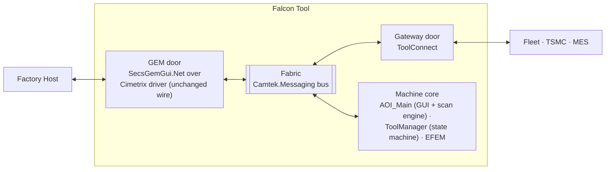

## 2.2 Mid-level — process view

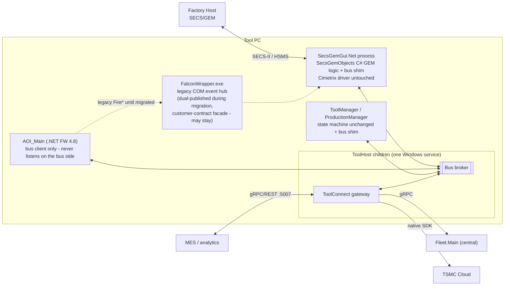

Baseline honesty note (from the AOI analysis): AOI_Main *also* runs two live gRPC links today (ADC inference client :5000; CMM client + a **hosted** `CmmReceiverServer` :50055 on Grpc.Core) — out of this design's scope, listed so no diagram pretends they don't exist.

## 2.3 Low-level — component view

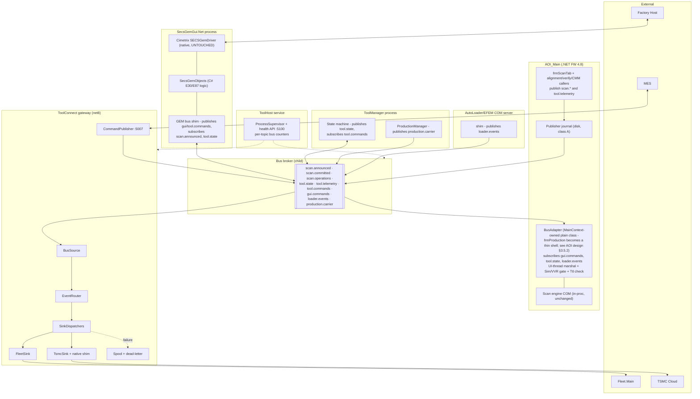

## 2.4 System communication flows

### Flow S1 — wafer scan results, operator to cloud (class A, journaled)

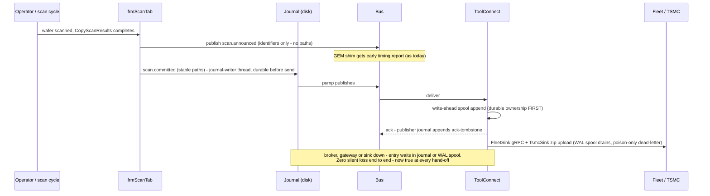

### Flow S2 — factory-host command to the GUI

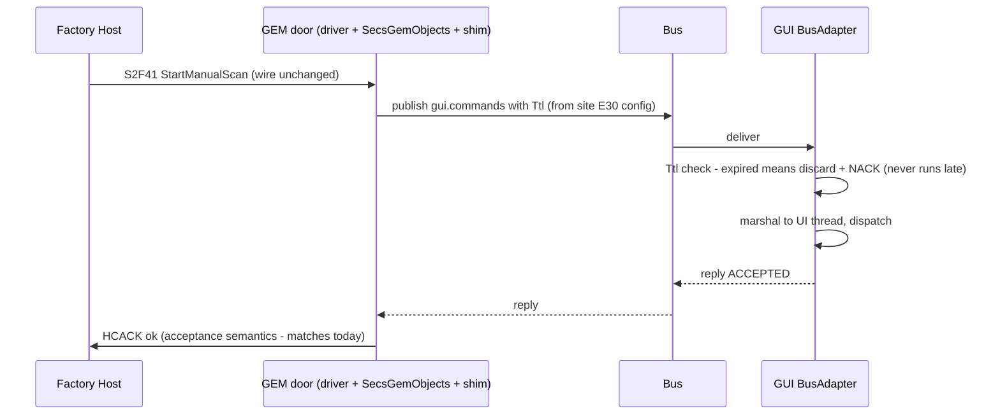

### Flow S3 — tool state change fan-out (class B)

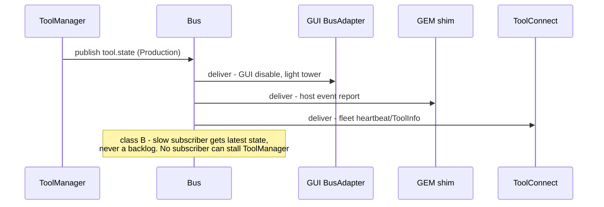

### Flow S4 — degraded mode (broker restart)

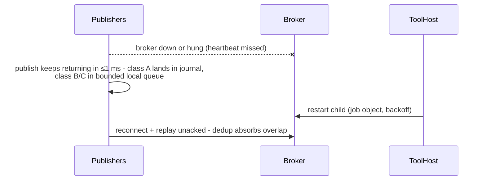

---

# Part II — ToolConnect Gateway Design

The evolved ToolGateway. **~70% exists today with a test suite** (EventRouter, SinkDispatchers, FleetSink, TsmcSink, spool, TSMC native chain); new parts are the two bus-facing adapters and the external command intake.

## 3.1 High-level — the gateway's place

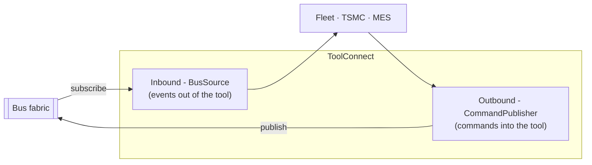

One sentence: **the gateway is a bus citizen with credentials to talk to strangers** — events flow out through it, external commands flow in through it, and nothing external ever touches the bus directly.

## 3.2 Mid-level — gateway process

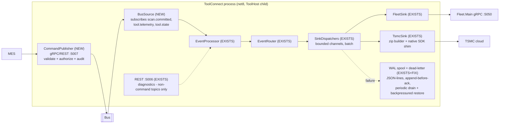

## 3.3 Low-level — what is new vs. existing

| Component | Status | Detail |
|---|---|---|
| `BusSource` | **NEW** (small) | Hosted service; subscribes class-A/B topics; **WAL-appends before DELIVER_ACK** (CC5); maps envelope → `EventMessage`; calls the existing `EventProcessor.ProcessMessage` — the BL layer is already transport-agnostic (verified: zero gRPC dependencies in ToolGateway.BL). **Gateway health = BusSource consumption liveness (CC6):** the health payload carries a monotonic last-DELIVER-processed token; ToolHost compares the broker's delivered-to-gateway high-water against the gateway's processed high-water — divergence *is* the hung-consumer detector (an HTTP 200 from a different thread is not health) |
| `CommandPublisher` | **NEW** | gRPC/REST endpoint :5007; per-caller authorization; audit log with `correlationId`; publishes request/reply commands with Ttl; tracks replies for the external caller |
| `ToolAPIGrpcServiceImpl` + :5005 | **RETIRED at P1b** | Kept alive during P1a dual-run as the rollback path |
| `EventRouter`, `SinkDispatcher` | EXISTS unchanged | Bounded `Channel`, batch 10, spool-on-full |
| `FleetSink`, `TsmcSink`, zip builder, `TsmcClientShim.dll` chain | EXISTS unchanged | Native crash risk stays isolated in this process |
| Spool / `FailedMessagesHandler` | EXISTS **+ 4 fixes + role change (CC5/CC13/CC14)** | The spool becomes a **write-ahead journal**: BusSource acks the bus only after the spool append (a gateway crash between ack and sink publish loses nothing). Fixes: (a) retry cap/age limit applies **only to poison** (fails while sink connected) — sink-outage messages retry forever under a disk quota + alarm (an age limit during a week-long Fleet maintenance must never dead-letter class-A data); (b) consume/alarm the `*.overflow.txt` black hole; (c) **periodic drain loop** (every 60 s while non-empty and sink healthy, ~50 msg/s cap, oldest-first, interleaved with live traffic — today drain happens only at process start); (d) **backpressured restore** (`WriteAsync`, not `TryWrite` — today ~9k of 10k restored entries silently re-spool). Acceptance: a 1-hour outage backlog drains without restart in <10 min |
| Test suite | EXISTS extended | BusSource + CommandPublisher contract tests replace the gRPC-source tests |
| net7 → net8 | Version bump | Single owner: this program's P1a |

## 3.4 Gateway flows

### Flow G1 — event outbound with spool recovery

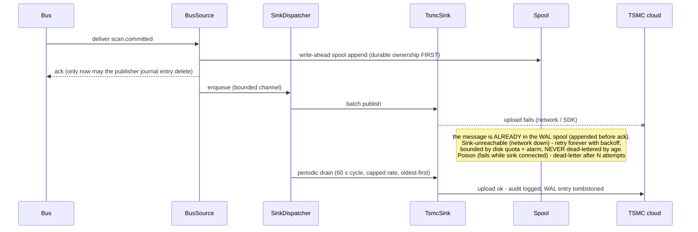

### Flow G2 — external command inbound (new capability)

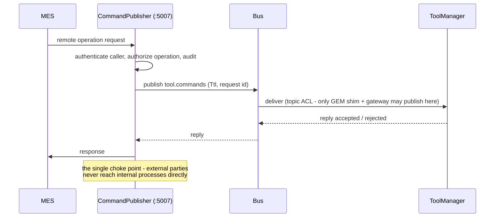

---

# Part III — GEM Door: What Is NEW (only)

Per instruction, this section covers **only the new parts**. The door itself is deliberately untouched:

| Layer | Status |
|---|---|
| Cimetrix `SECSGemDriver` (native wire engine — HSMS/SECS-II to the host) | **Untouched — the fab-qualified boundary** |
| `SecsGemObjects` (C# net48 — E30/E87/E116/E40/E94 logic, `RemoteControl.cs` command mapping) | **Untouched logic** |
| `SecsGemGui.Net` (the tool-client process hosting the above) | Untouched host process |
| **GEM bus shim** | **NEW — the only addition.** Plain C# inside the existing process |

## 4.1 Block — the shim's position

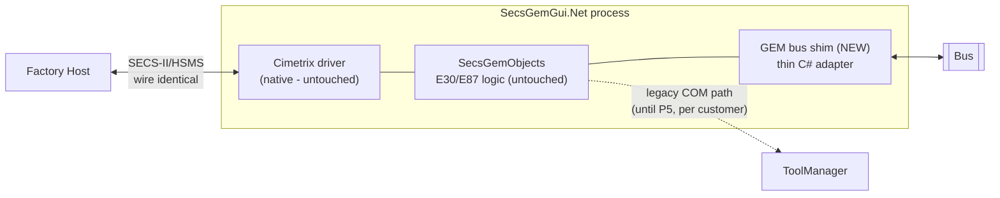

What the shim does — nothing more:

| Direction | Today (COM) | With shim (bus) | Phase |
|---|---|---|---|
| Host GUI commands (`StartManualScan`, `ExportMap`) → GUI | `IFalconExternalControlCB` COM callback | publish `gui.commands` (request/reply, Ttl) | P4 |
| Host production commands (Start/Stop/carrier ops) → ToolManager | `RemoteControl.cs` → COM calls | publish `tool.commands` | **P5 only — optional, per customer, re-qual budgeted** |
| Event reports ← tool | COM event hub subscriptions (FalconWrapper) | subscribe `scan.announced`, `tool.state`, `production.carrier` | P2–P3 |

## 4.2 Flow — host command through the new shim

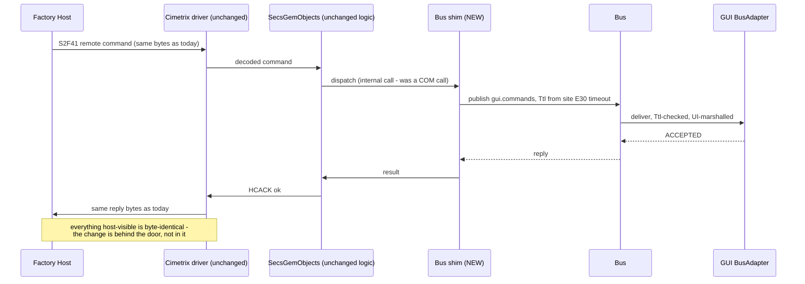

**Re-qualification stance:** P2–P4 aim for zero host-visible change (verified by GEM record-replay diffing, a P0 instrument). Only P5 — moving production control — knowingly risks host-visible timing and carries per-customer re-qualification budget.

## 4.3 GEM-process degraded contract (CC7 — the fab-facing equivalent of AOI §3.5.3b)

The shim adds a second connectivity axis to the GEM process. All four states are defined — the dangerous one is the third:

| HSMS (host link) | Bus | Behavior |
|---|---|---|
| up | up | Normal (flows 4.2 / S2) |
| down | up | E30 handles host loss (untouched); the shim **publishes host-link state** to `tool.telemetry` so Fleet sees "tool lost its host" |
| **up** | **down** | **The tool must degrade before the host discovers it via HCACK storms:** bus unreachable ≥ T → SecsGemObjects transitions the host-visible control state (ONLINE-LOCAL or a dedicated E30 alarm/SV) and **refuses ONLINE-REMOTE grant** until the bus heartbeat is green; a command arriving while dark gets a **deliberate HCACK denial code — never a timeout**; the event-report gap is counted and flagged. This is a GEM record-replay test scenario |
| down | down | Both degraded paths apply; local operation continues per E30 |

Start ordering: the shim's first action on process start is a bus handshake with timeout **before** enabling REMOTE. On every (re)connect the shim receives the **retained `tool.state`** (class-B retained delivery — bus §7), so it never reports stale state to the host.

---

# Part IV — Cross-Cutting Contracts (condensed — full text in the companion docs)

**Connectivity & operations addenda (2026-07-18 review — CC16, CM7/CM8/CM15/CM17):**

- **Endpoint manifest (single source of truth):** all tool addresses/ports (Fleet, TSMC agent, :5005/:5006/:5007/:5060/:5100, pipe name, journal/spool roots) live in **one ToolHost-owned manifest**; children receive endpoints from it. An **endpoint-config hash joins the fleet fingerprint** on `tool.telemetry` — config drift becomes visible on the Fleet dashboard. Fleet is addressed by **DNS name** (IP fallback only). Immediate live fix: today's `appsettings.json` carries the Fleet IP **twice**; deduplicate.
- **Fleet channel policy:** keepalive ping (delay/timeout named in config), per-call deadline (~10 s), `RegisterTool` **re-issued on every reconnect** (`_connected` false→true). Fab-wide power-up **herd control**: jittered RegisterTool retry (exp backoff ±50%), spool-drain start jitter 0–120 s, per-tool drain cap (~50 msg/s); Fleet.Main's ceiling documented and a throttle signal honored by slowing drain.
- **TSMC:** SDK-level retries are the *inner* attempt — only dispatcher attempts count toward dead-letter; the local TSMC agent (127.0.0.1:8081) gets a named owner + a reachability counter distinct from cloud-upload success; TsmcSink service time must be < 0.8× worst-case wafer interval (measured at P0), else 2–3 concurrent zip/upload workers (UniqueId idempotency exists); zips built on the data volume, never the journal volume.
- **CMM proxy per-operation policy:** modal ops (`ExportMapConfirmation`) get a long named deadline (site-config, ~10 min) + gateway concurrency cap 1; non-modal ops short deadlines; gateway restart mid-modal returns a distinguishable retryable error.
- **MES :5007:** returns an immediate "tool fabric unavailable" when the bus client is disconnected (`BusHealth`) — external callers never burn a Ttl discovering an internal outage; authn/authz mechanism decided at P0 (mTLS vs Windows auth), config in the endpoint manifest.
- **In-Production bus loss (CM8):** bus dark ≥ T while ToolState == Production → operator banner + local alarm; the cycle pauses at the next wafer boundary (product-owner sign-off); the gateway reports an explicit **stale-since** marker to Fleet, never last-value-forever.
- **ToolHost quarantine classes (CC8):** broker and gateway = `quarantine: never`; `EnsureBusRunning` handles "service up / child stopped" via the ToolHost restart API; a ToolHost crash now silences the fabric — its own SCM failure-actions and the §3.5.3b degraded contracts are the mitigations (added to the risk register).

**Durability classes:** A = never lose (`scan.committed`, error telemetry — publisher disk journal + end-to-end ack) · B = latest wins (`tool.state` — broker coalesces) · C = best effort, counted drops (`scan.announced`, `loader.events`) · R-R = commands (Ttl + expiry discard + reply cache — executed at most once, never late).

**Security:** named-pipe ACLs (ToolHost service account + AOI user); per-topic publish ACLs (`*.commands` = GEM shim + gateway only); no internal TCP listener; gateway :5006 REST restricted to non-command topics; :5007 command intake authenticated/authorized/audited.

**Publish bound:** ≤1 ms local enqueue, never I/O on the caller thread — a contract-test assertion (this *fixes* today's unbounded `ToolApiPublisher` path).

**Roadmap:** P0 measure/spike/build instruments → P1a first edge dual-run (`scan.committed` + `tool.telemetry`, gateway BusSource beside :5005) → P1b retire old path → P2 notification edges (+FalconWrapper dual-publish for its 5 subscriber processes) → P3 `tool.state` → P4 GUI commands (full ~15-callback external-control surface) → P5 production control (optional, per customer). Gate per phase: contract tests → fault injection → zero *unexplained* shadow divergence → GEM replay diff clean → rollback drill executed. Entry criterion: ToolHost Phase 1 shipped.

**Top risks** (full register in the fused doc §8): bus criticality incl. the external boundary (mitigated by the class-A journal + bounded queues), sync→async semantic drift (shadow mode + P0 audit), poison messages (dead-letter + attempts cap), the comparator itself (qualified, fail-open), field diagnosability (per-topic counters via ToolHost :5100 + bus-tap). **Open verification item that gates fabric-wide adoption: the multi-PC topology question** ([bus-verification-vs-aoi-analysis.md](../02-reviews/bus-verification-vs-aoi-analysis.md) Gap 3).

---

# Appendix A — The Bus (`Camtek.Messaging`) Design

Condensed from [camtek-messaging-bus-design.md](camtek-messaging-bus-design.md) (authoritative for implementation detail).

## A.1 High-level — three deliverables

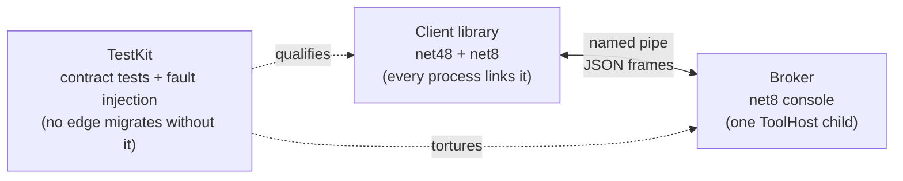

## A.2 Mid-level — client / broker / subscriber

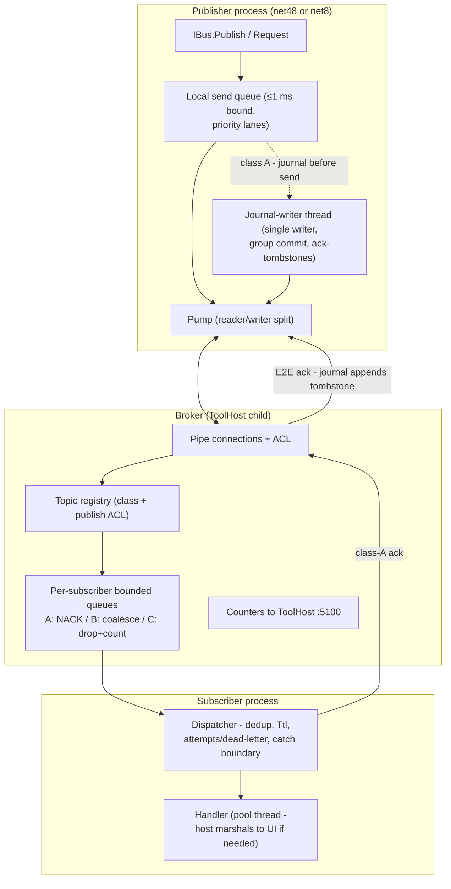

## A.3 Low-level — protocol and envelope

**Transport:** one duplex Windows named pipe per process (`\\.\pipe\camtek.bus`), localhost only, pipe-ACL authenticated — no TCP anywhere inside the tool. **Framing:** 4-byte length prefix + UTF-8 JSON — deliberately trivial so the native-C++ client (`camtek_bus.dll`, for machine-layer/DDS adoption) implements it without .NET or gRPC.

| Frame | Purpose |
|---|---|
| `HELLO` | identity, subscriptions, `resumeFromSeq` |
| `PUB` / `PUB_ACK` | publish / broker accepted (sufficient for B/C) |
| `DELIVER` / `DELIVER_ACK` | delivery / subscriber processed (class A) |
| `E2E_ACK` / `NACK` | class-A end-to-end confirm / queue-full refusal (stays in journal) |
| `REQ` / `REPLY` | commands with `requestId` + `ttlMs` |
| `PING` / `PONG` | application heartbeat (detects hung broker) |

**Envelope (JSON v1):** `messageId` (dedup) · `topic` · `correlationId`/`moduleId` (UnifiedLogger-aligned tracing) · `source` · `seq` (per-source order + loss detection) · `timestampUtc` · `schemaVersion` (additive-only, ignore-unknown — mixed-version processes are the steady state) · `ttlMs` · `attempts` (poison detection) · `payloadType` · `payload`. Frame cap 1 MB — the bus carries *pointers*, never bulk data.

## A.4 Flow — the publish path (the ≤1 ms bound + class-A ack)

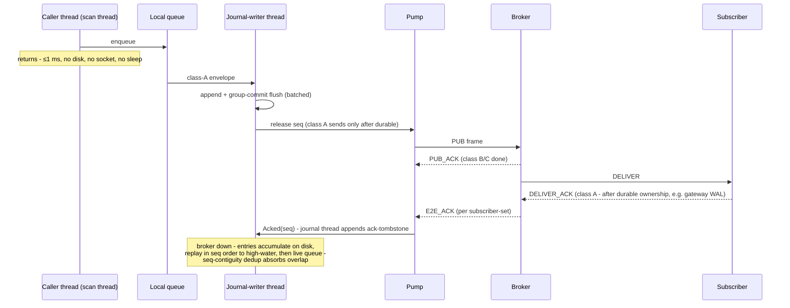

## A.5 API essentials

```csharp
IBus bus = BusFactory.Connect("AOI_Main");
bus.Publish(Topics.ScanCommitted, payload);                    // ≤1 ms enqueue; journaled before send (class A)
bus.Subscribe(Topics.ToolState, msg => Handle(msg));           // pool thread - host marshals to UI
Reply r = await bus.RequestAsync(Topics.GuiCommands, cmd, ttl); // reply = ACCEPTED, expired = discarded
bus.Serve(Topics.GuiCommands, msg => DispatchOnUi(msg));       // reply-side (BusAdapter)
```

Topics are **declared** (`Topic.Define(name, DurabilityClass, payloadType, publishers: Acl…)`) — durability class and publish ACL are properties of the topic, enforced at the library/broker boundary.

## A.6 Fit boundaries (what the bus must NOT be used for)

Event fan-out: **excellent** · commands with ack: **good** · sync state queries: acceptable only at low call rates (else class-B snapshot topic; call-frequency audit first) · **COM object models: no — RPC or stays COM** · **bulk data: never** (pointers only) · process lifetime/activation: ToolHost's job, not the bus's. Fabric-wide adoption (namespaces `machine.*`, `dds.*`, `cmm.*`, native C client, rate tiers): bus design §12 — **gated on the multi-PC topology verification**.
