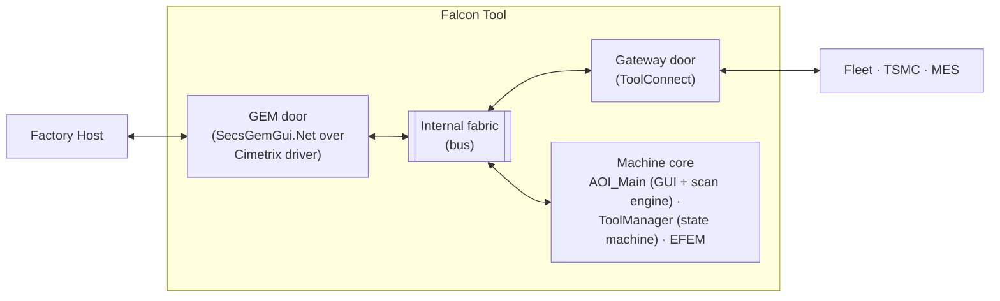
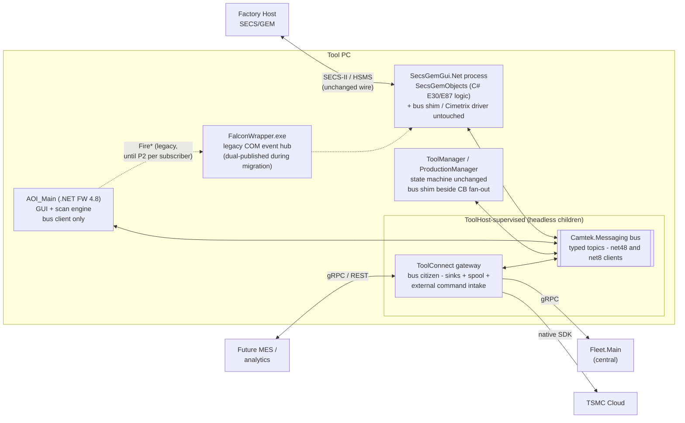
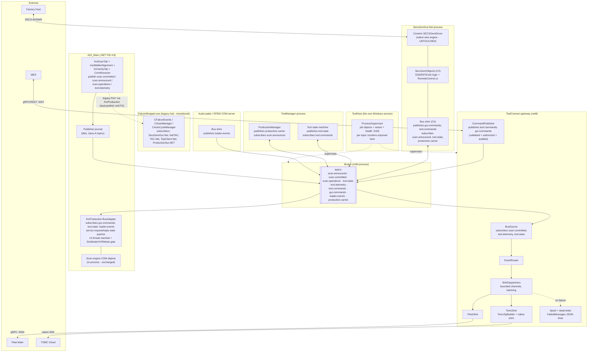
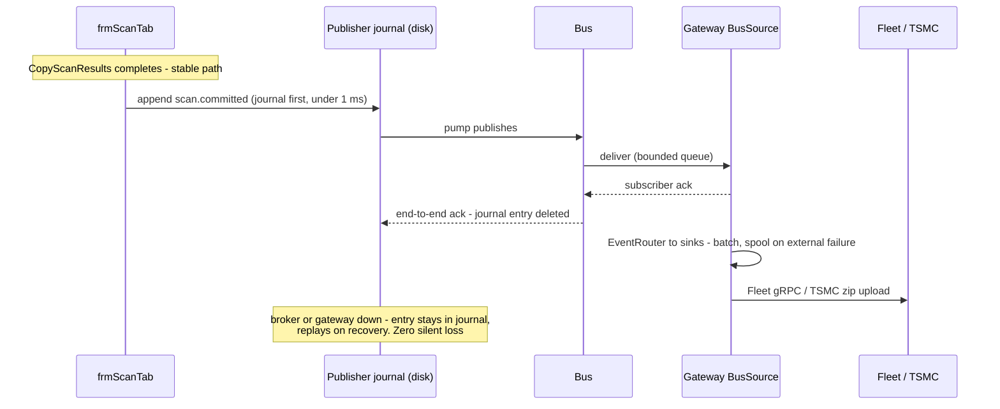
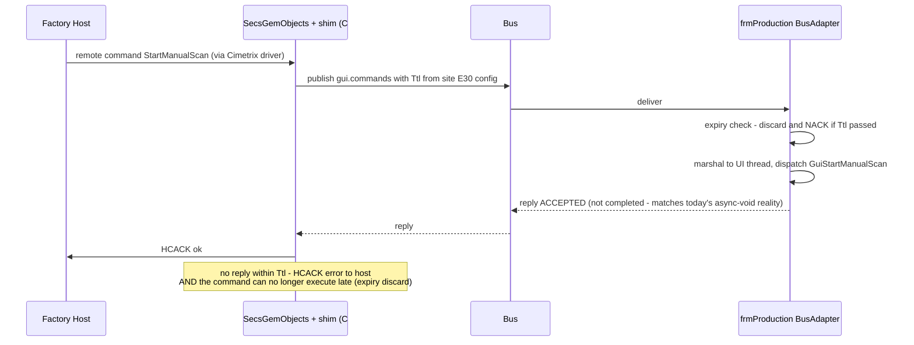
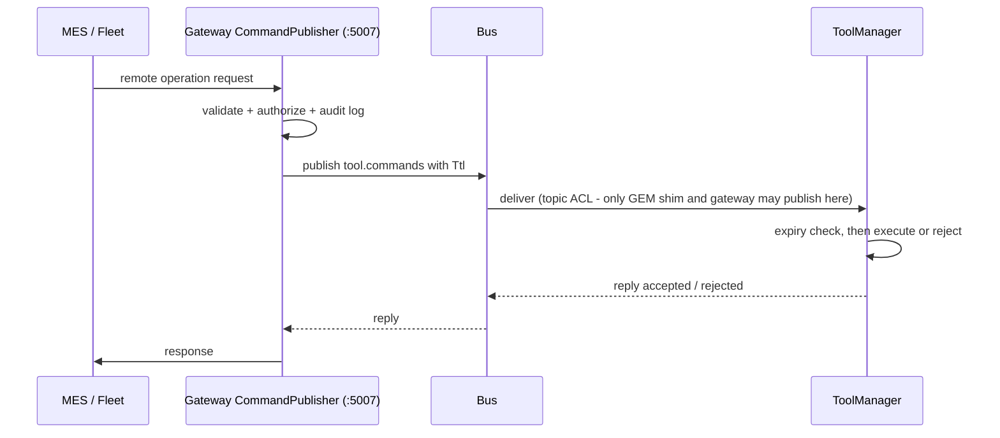
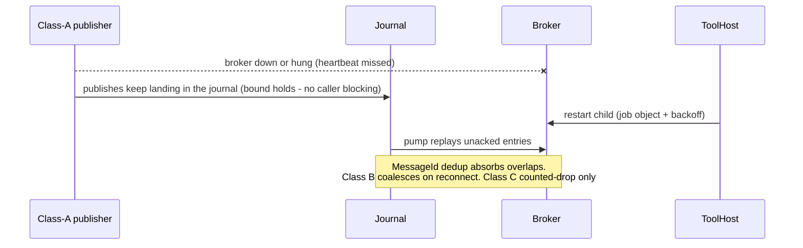

# A3 (Fused) — Tool Fabric Architecture: Bus + Gateway Combined

> Full design for the fused target architecture: **one internal message fabric (`Camtek.Messaging` bus) as the tool's only internal transport, with the ToolConnect gateway as a bus citizen bridging to the outside world.**
> Naming note: "A3" here is the **fused A1+A2 architecture** (F2 of the alternatives doc) — *not* the dropped "A3 control-plane extraction" alternative.
> Supersedes running A1 and A2 side by side — the fusion **deletes the ToolLink channel** and two risk items with it.
> **Hard constraint honored: AOI_Main stays .NET Framework 4.8** — it participates as a bus *client* only ("dials out, never listens").
> **Revision 2:** incorporates all findings of the three-agent adversarial review ([a3-fused-design-review.md](../02-reviews/a3-fused-design-review.md)) — corrected SECS/GEM stack, FalconWrapper.exe added, durability rewritten as a contract, P1 split for rollback, request/reply semantics defined.
> **⚠ Bus/durability mechanics superseded (2026-07-18):** the concurrency review ([camtek-fabric-concurrency-review.md](../02-reviews/camtek-fabric-concurrency-review.md)) revised the publish path and ack model — single journal-writer thread + group commit + **ack-tombstones** (no in-place journal deletion), gateway **WAL-spool-before-ack**, priority lanes, NACK redelivery schedule, retained class B. Authoritative: [camtek-messaging-bus-design.md](../01-proposal/camtek-messaging-bus-design.md) Rev. 3 + [camtek-tool-fabric-complete-design.md](../01-proposal/camtek-tool-fabric-complete-design.md). This doc's §4/§6 flows are kept as the historical Revision-2 record.
> Companion docs: [aoi-client-architecture-alternatives.md](aoi-client-architecture-alternatives.md), [camtek-toolhost-design.md](../01-proposal/camtek-toolhost-design.md), [architecture-review-and-toolgateway-investigation.md](architecture-review-and-toolgateway-investigation.md).
> Status: proposal (not approved). Date: 2026-07-16.

---

## 1. Design Thesis

| Principle | Meaning |
|---|---|
| **One fabric** | Every intra-tool event and command travels on the `Camtek.Messaging` bus (typed topics). The COM CB callback web is retired edge-by-edge. No second channel is ever built — **ToolLink (A1-G1's duplex stream) is never implemented** |
| **Gateway = bus citizen** | ToolConnect (evolved ToolGateway) subscribes to topics for outbound traffic (Fleet/TSMC/MES) and publishes topics for inbound commands. It owns the *external* boundary only |
| **AOI dials out, never listens** | AOI_Main (net48) is a bus client via the multi-targeted library — no hosting, no listening sockets, the .NET FW limitation never bites |
| **Explicit event semantics** | `scan.announced` (early, results copying) vs `scan.committed` (late, stable path) are separate topics **with a payload contract** (§3.2) — review finding C1 fixed structurally, not just nominally |
| **Durability is a contract, not a diagram** | Per-topic durability classes with an explicit ack model (§4). `scan.committed` is never lost silently — it is journaled to disk on the publisher until end-to-end acknowledged |
| **Publish is bounded** | `bus.Publish` = local enqueue with a hard ≤1 ms bound — never a connect, send, or sleep on the caller's thread. This *fixes* today's unbounded publish path (review T3), it doesn't just preserve it |
| **Supervised processes** | Headless processes (broker, gateway, DataServer, …) run as ToolHost children — one Windows service on the tool. ToolHost never supervises AOI_Main or the COM servers |
| **Fab-qualified path untouched by default** | The native **Cimetrix `SECSGemDriver`** (the actual wire engine) never changes in the core roadmap. The E30/E87 *logic* layer is C# (`SecsGemObjects`) — see §2. Production-control migration is a separately funded, per-customer late phase |

---

## 2. Target Architecture

Three zoom levels: context (2.1), process (2.2), component (2.3).

**Fact correction (review T1/T2), reflected in all diagrams below:** the live SECS/GEM stack in `Falcon_2022.sln` is **`SecsGemObjects` (C#, net48 — E30/E87/E116/E40/E94 logic) hosted in the `SecsGemGui.Net` tool-client process, over the native Cimetrix `SECSGemDriver`**. The C++ `SecsGemClient`/`E30RemoteControl.cpp` cited in earlier docs is legacy (Robostar.sln only). Host→ToolManager commands flow through `SecsGemObjects\Clients\RemoteControllers\RemoteControl.cs`. Additionally, the COM event hub (`CFalconEvents`/`CScanManager`/`CAutoCycleManager`) lives in **`FalconWrapper.exe`** — an out-of-proc ATL EXE with five client-process subscribers — and is a first-class element of the migration, not an in-process detail.

### 2.1 High-level — context view

The tool has exactly **two doors** — GEM for the factory host, the gateway for everything else — one internal fabric between them, and the **machine core** (the AOI itself) hanging off that fabric doing the actual work.

### 2.2 Mid-level — process view

### 2.3 Low-level — component view

**What no longer exists in this picture (vs. sequential A1+A2):**

| Deleted | Why |
|---|---|
| ToolLink duplex gRPC stream (AOI ↔ gateway) | The bus *is* the channel — AOI publishes, gateway subscribes, and vice versa |
| `toolapi.proto` / `ToolAPIGrpcServiceImpl` / `ToolApiPublisher` | Retired at P1b (after dual-run), once the gateway's BusSource is proven |
| Risk A1-R3 (net48 gRPC duplex spike) | AOI is only a bus client; `Camtek.Messaging` targets net48 natively |
| Risk A1-R4 (head-of-line blocking on one stream) | Per-topic, per-subscriber queues are native to the bus |
| Risk A1-R2 (stream-outage ring buffer) | Superseded by the §4 durability contract (disk journal for class-A topics) |

---

## 3. The Bus (`Camtek.Messaging`)

### 3.1 Core spec

| Aspect | Decision |
|---|---|
| Library | Multi-targeted `net48;net8.0`. **Delivery = binary drops to `c:\bis\bin` and `c:\bis\bin\x64`** (both bitnesses — AOI_Main builds x86 and x64), matching the repo's loose-DLL reference model; `TreatWarningsAsErrors` applies. Supersedes the existing `CamtekSystem\PubSub` MSMQ/`IPublisher` layer (prior art, same seam) |
| Transport | Embedded broker as a **ToolHost child** (preferred) or brokerless named-pipe mesh (fallback — note: brokerless changes delivery semantics and is a redesign, not a config flip) |
| Envelope | `MessageId`, `Topic`, `CorrelationId`, `ModuleId`, `Source`, `Seq`, `TimestampUtc`, **`SchemaVersion`**, **`Ttl`** (commands), **`Attempts`** (delivery count), `PayloadType`, `Payload` |
| Serialization | **JSON for v1** (debuggable in the field); protobuf as a later per-topic opt-in. Evolution rules: **additive-only changes; consumers must ignore unknown fields** — enforced by the contract-test kit, because ToolHost guarantees mixed-version processes as the steady state |
| Delivery | At-least-once; per-topic FIFO per publisher; `MessageId` dedup **in the library** (handlers opt out, not in). Cross-topic ordering is **not** guaranteed (see payload contract §3.2 for why that's safe) |
| **Publish bound** | `Publish()` = append to a local in-process queue, **hard bound ≤1 ms**, never a socket send/connect/sleep on the caller's thread; a background pump does all I/O. **Contract-test assertion.** (Today's `ToolApiPublisher` does a process-scan per publish and `Thread.Sleep(1000)` + spawn on the scan thread when the gateway is down, with no gRPC deadline — this design replaces an *unbounded* path with a bounded one) |
| Isolation | Per-subscriber **bounded** queues — a slow/hung subscriber never blocks the publisher or siblings (fixes review C3 by construction). Overflow policy is per durability class (§4) |
| Broker health | Application-level heartbeat (a hung-but-alive broker is detected), not just ToolHost process liveness |
| Request/reply | For edges that need synchronous semantics (§3.3). Reply = **accepted**, not completed; deadline-carrying; expired commands discarded |
| Security | Broker binds localhost / named pipe with **ACLs restricted to the ToolHost service account + the AOI user**. **Per-topic publish ACLs**: only the GEM shim and the gateway CommandPublisher may publish `tool.commands`/`gui.commands`. The gateway REST endpoint (:5006) may publish **non-command topics only** (dev/diagnostic surface) |
| Test kit | Contract tests (ordering, idempotency, timeout isolation, publish bound, schema tolerance) + fault-injection harness ship with the library; **no edge migrates without passing them** |

### 3.2 Payload contract (what actually prevents the early/late race)

Two named topics make the early/late distinction *visible*; the payload rule makes misuse *harmless*:

| Topic | Payload MUST contain | Payload MUST NOT contain |
|---|---|---|
| `scan.announced` | wafer/lot/slot identifiers, timing, counts | **any file path** — there is nothing to read, so a mis-wired consumer cannot read half-copied files |
| `scan.committed` | identifiers + **stable result paths** | — |

Consequence: subscribing the wrong topic degrades to "missing data," never to "corrupt read." This is the enforcement mechanism; the topic naming is just documentation.

### 3.3 Request/reply semantics (commands)

Derived from how today *actually* works (review T5: `GuiStartManualScan` is `async void`; the COM caller gets control back at the first `await` — today's HCACK already means *accepted*, not *completed*):

1. **Reply = accepted/dispatched** (HCACK-equivalent "will run"), never completion. Completion, where needed, is a separate event (e.g. a future `scan.operations` completion message) — matching today's de-facto semantics.
2. **Deadline propagation:** every command carries `Ttl` derived from the **per-site E30 timeout configuration** (fab-configured, 1–10 s typical) minus a marshal margin — never hard-coded.
3. **Expired-command discard:** the BusAdapter checks `TimestampUtc + Ttl` before dispatch; an expired command is **discarded and negatively acknowledged** — the tool never executes a command the host was already told failed (the "late execution" hazard is structurally closed).
4. **Idempotency by request id:** redelivered commands (at-least-once) are absorbed by the reply cache.
5. **Known request/reply edges (from the repo, not a guess):** `gui.commands` (incl. the synchronous state getters `GuiCurrentLotId`/`GuiCurrentWaferId` served by the BusAdapter), `tool.commands`, **and three `Fire*` edges that return data via ref params today** — `FireWaferScanResultsAreReady(ref dataCollectionSync)`, `FireOperationCompleted(ref res)`, `FireGetOnDemandJobName` (query). The P0 audit confirms the full list; it is already known to be larger than "commands only."

### 3.4 Topic taxonomy

| Topic | Class (§4) | Publishers | Subscribers | Replaces |
|---|---|---|---|---|
| `scan.announced` | C | frmScanTab | GEM shim, ProductionManager | Early `Fire*` announcement (no paths — §3.2) |
| `scan.committed` | **A** | frmScanTab (post-`CopyScanResults`, at the real hooks ~frmScanTab.cs:1888-1902 and :10162) | **Gateway BusSource**, future consumers | `ToolApiPublisher` push |
| `scan.operations` | C (notify) / R-R where ref-returning | frmScanTab, modWaferAlignment, frmVerifyTab, CmmReceiver (via BusAdapter) | GEM shim; **legacy FalconWrapper hub subscribers during transition** (dual-publish) | 24 `Fire*` methods through frmProduction → FalconWrapper.exe |
| `tool.state` | B (coalesce) | ToolManager | frmProduction BusAdapter, GEM shim, Gateway | `IToolManagerCB` fan-out |
| **`tool.telemetry`** | **A** (errors) / C (info) | AOI (errors, warnings, Lcc, ToolInfo) | **Gateway** → Fleet | The non-scan event types on today's :5005 push (**closes the P1→P3 telemetry gap**) |
| `tool.commands` | R-R | GEM shim (`RemoteControl.cs` path), Gateway CommandPublisher (late phase) | ToolManager | `SecsGemObjects` → ToolManager COM calls |
| `gui.commands` | R-R | GEM shim, Gateway CommandPublisher | frmProduction BusAdapter | `IFalconExternalControlCB` → `ExternalControlCbUiWrapper` (full ~15-callback surface, not 2 — review T7) |
| `loader.events` | C | AutoLoader COM shim | frmProduction BusAdapter | `IAutoLoader` events |
| `production.carrier` | B | ProductionManager | GEM shim, GUI, Gateway (optional) | `IProductionManagerCB` / `ICarrierExecuterCB` |

---

## 4. Durability — the Contract

### 4.1 Honest baseline (what "today" actually is — review T3/T4)

| Today's behavior | Evidence |
|---|---|
| Publish latency is **unbounded**: per-publish process scan; `Thread.Sleep(1000)` + process spawn **on the scan thread** when gateway is down; no gRPC deadline (hung gateway blocks forever) | `ToolApiPublisher.cs:103-137, 204-211` |
| Gateway-down loss is **permanent**: failed events append to a dead-letter file that **no code ever reads back** | `ToolApiPublisher.cs:159-173` |
| Gateway spool has a poison loop (no retry cap/age limit) and a write-only `*.overflow.txt` | `FailedMessagesHandler.cs:98-153` |

Any "no worse than today" claim must be measured against *this*, and P0 includes characterizing it (§7). The design below is **strictly better**, not "no worse."

### 4.2 Durability classes and the ack model

| Class | Topics | Guarantee | Mechanism |
|---|---|---|---|
| **A — never lose** | `scan.committed`, `tool.telemetry` (errors) | Survives publisher crash, broker crash/restart, subscriber outage | **Disk-backed publisher journal** (JSON-lines, the proven `FailedMessagesHandler` pattern): append **before** publish; entry deleted only on **end-to-end ack** from the class-A subscriber (gateway BusSource acks after handoff to its own pipeline, whose existing spool covers external failures from there). Journal replays on reconnect/restart; `MessageId` dedup absorbs overlaps |
| **B — latest wins** | `tool.state`, `production.carrier` | Current value always eventually delivered | Broker coalesces per subscriber (keep newest); no journal |
| **C — best effort** | `scan.announced`, `scan.operations` notifications, `loader.events`, `tool.telemetry` (info) | Delivered if the fabric is up | Bounded queue, drop-oldest + **counted** (never silent) |
| **R-R — commands** | `tool.commands`, `gui.commands` | Executed at most once, never late | §3.3: Ttl + expiry discard + reply cache |

**Ack points, explicitly:** broker acks the publisher on enqueue to all matched subscriber queues; for **class A only**, that ack is *not* sufficient — journal deletion requires the subscriber-level ack. Broker-resident class-A messages lost in a broker crash are therefore **re-sent from the journal**, closing the "routine broker restart silently eats in-flight messages" hole (review C4).

**Overflow policy per class:** A = never dropped (queue full → NACK → stays in journal, alarm); B = coalesce; C = drop-oldest + counter. The gateway — the guaranteed-slow subscriber (TSMC zips) — can therefore never OOM the broker via `scan.committed` backlog: backlog lives in the publisher's disk journal, not broker memory.

**Poison messages (F-R4):** `Attempts` in the envelope; after N failed deliveries → **per-topic dead-letter file** (same JSON-lines format) + alarm; library-level catch boundary so a handler exception never kills the subscriber process. The existing gateway spool loop and overflow black hole (T9) are fixed as prerequisite work items.

### 4.3 Loss-window comparison (derived, not asserted)

| Scenario | Today | Fused design |
|---|---|---|
| Gateway down 10 min | `scan.committed`-equivalents lost to a write-only file (permanent) | Zero loss (journal drains on recovery) |
| Broker restart (routine deploy) | n/a | Class A: zero (journal). Class B: coalesced. Class C: bounded drop, counted |
| Publisher (AOI) crash mid-scan | Event never sent, no trace | Class A: journaled pre-publish → replays on AOI restart |
| Diagnosability at 3am | 1 unread file + 1 spool | Per-topic counters (published/acked/delivered/dropped/dead-lettered + `Seq` high-water marks) via ToolHost :5100; journal + dead-letter files on disk; bus-tap recorder tool |

---

## 5. Component Inventory

### Untouched

| Component | Why safe |
|---|---|
| **Cimetrix `SECSGemDriver`** (native wire engine) | The actual fab-qualified boundary — never touched in P0–P4 |
| ToolManager / ProductionManager state-machine logic | Transport swap only (3-site dual-publish in `ToolEvents.cs`) |
| Scan engine COM objects in-process to AOI, EFEM drivers | Not on any migrated edge |
| Gateway sinks, Fleet/TSMC clients, TsmcClientShim chain | Source swap only |
| DataServer, MDC, RMS | Out of scope |

### Modified

| Component | Change | Phase |
|---|---|---|
| `frmProduction` | 4 wrapper fields → 1 `BusAdapter`. Central duties: UI-thread marshal, **SimMode/VVRMode gating (single place — today each of the 24 `Fire*` short-circuits individually)**, request/reply servicing (state getters), Ttl/expiry check | P2–P4 |
| `frmScanTab` | `Fire*` call sites → `bus.Publish`; publish hooks at the **real** sites (~:1888-1902, :10162) journal-then-publish | P1a–P2 |
| `modWaferAlignment`, `frmVerifyTab`, `CmmReceiverApiRequestsHandler` | Their `Fire*` call sites, same mechanical pattern | P2 |
| `ToolManager` (`ToolEvents.cs`) / `ProductionManager` | `bus.Publish` beside `CallbackHandler.Call` (dual-publish) | P3 / P5 |
| **`SecsGemObjects` / `SecsGemGui.Net`** | The GEM bus shim is **plain C# net48 work** in the existing client process (cheaper than the "C++ shim" previously designed — review T1) | P2–P4 |
| `ExternalControlCbUiWrapper` | **Full `IFalconExternalControlCB` surface migrates (~15 callbacks)**: 2 forwarded commands, `GuiSet2DOptics` execution, synchronous getters `GuiCurrentLotId`/`GuiCurrentWaferId` (become request/reply), return-events via its second `CFalconEvents` RCW | P4 (scope corrected up — review T7) |
| AutoLoader / EFEM COM server | Thin publish shim | P2 |
| ToolGateway → ToolConnect | + `BusSource` (subscribes `scan.committed`, `tool.telemetry`, `tool.state`), + `CommandPublisher` (:5007 gRPC/REST for MES); − gRPC :5005 source at P1b; net7 → net8 (single owner: this program's P1a; ToolHost's G0 note defers to it) | P1a–P1b |

### New

| Component | Notes |
|---|---|
| `Camtek.Messaging` + contract-test kit + fault-injection harness | The core build (§3). Binary-drop delivery, both bitnesses |
| Broker child under ToolHost | Bounded queues, coalescing, heartbeat; **broker updates are maintenance-window-only** (a broker deploy silences the fabric) |
| **Publisher journal** | Class-A disk journal (reuses the JSON-lines spool pattern — proven code) |
| Shadow comparator | **Qualified as production software (F-R5):** fail-open, out-of-process, bounded correlation memory (drop-and-count), sampled logging, **SimMode/VVRMode-aware**, and the gate metric is *unexplained* divergence under written equivalence rules (async-vs-sync ordering differences are expected and enumerated, else the gate never passes) |
| Diagnostics | Per-topic counters via ToolHost :5100; wildcard bus-tap recorder; dead-letter files; `CorrelationId`/`Seq` emitted by every shim including the GEM shim |

### Retired — phase-tagged (review M7: the end state is per-fleet, not universal)

| Retired | Phase | Replaced by |
|---|---|---|
| `ToolApiPublisher` + `toolapi.proto` + gRPC :5005 (+ firewall rule closed) | **P1b** (after P1a dual-run) | `scan.committed` + `tool.telemetry` subscription |
| `clsInitAOI.EnsureToolGatewayRunning` | P1a | ToolHost supervision (this **closes** old open question Q4: the gateway runs from boot) |
| `IFalconFireEvents` fan-out through **FalconWrapper.exe** | **P2–P4, per subscriber** — the hub has 5 client-process subscribers (SecsGemGui.Net, NetTAC, TAC.Net, TopiClient.Net, ProductionGui.NET); each migrates or FalconWrapper stays as a **permanent dual-publish bridge** for unmigrated clients | `scan.operations` / `scan.announced` |
| `IToolManagerCB` fan-out | P3 | `tool.state` |
| `IFalconExternalControlCB` (full surface) | P4 | `gui.commands` + request/reply |
| `IProductionManagerCB` / `ICarrierExecuterCB` | **P5 only — optional, per-customer** | `tool.commands` / `production.carrier` |
| **Steady state without P5** (most of the fleet) | — | Permanent dual transport: bus for events/GUI-commands, COM for production control. This is an accepted end state, not a failure |
| ToolLink | never built | The bus |

---

## 6. Flows

### 6.1 Scan results to the world (class A, journaled)

### 6.2 Host GUI command (GEM path — wire unchanged)

### 6.3 External command (MES / Fleet — new capability, late phase)

### 6.4 Degraded modes

---

## 7. Execution Roadmap

**Entry criterion for the whole program: ToolHost Phase 1 approved and shipped** (the broker and gateway need a supervised home; S-R3 made explicit).

| Phase | Content | Risk | Re-qual? |
|---|---|---|---|
| **P0 — Measure, spike, build instruments** | (1) **Characterize today's real behavior**: publish-latency distribution and actual event-loss at gateway-down (T3/T4) — the program's before/after claims depend on this baseline. (2) Sync-dependency audit — starting from the *known* request/reply edges (§3.3.5), produce the complete classification. (3) Broker torture test: kill/restart **and hung-broker and permanently-slow-subscriber**, pass criteria = **end-to-end delivery count per durability class**, not restart latency. (4) Build `Camtek.Messaging` + journal + contract kit + fault-injection + comparator (qualified per F-R5). (5) Fix the two live bugs (T9 spool loop/overflow, T10 stale exe name) as independent work items | Low | No |
| **P1a — First edge, dual-run** | `scan.committed` + `tool.telemetry` topics live (**no telemetry gap** — Error/Warning/Lcc/ToolInfo carried from day one); gateway `BusSource` runs **beside** the gRPC :5005 source; shadow compare N days; gateway becomes ToolHost child (net8) — closes Q4 | Low | No |
| **P1b — Retire the old path** | Rollback lever proven, then: retire `ToolApiPublisher`, `toolapi.proto`, :5005 endpoint + firewall rule; remove `EnsureToolGatewayRunning` | Low | No |
| **P2 — Notification edges** | `scan.operations` + `scan.announced` + `loader.events`. **Dual-publish into FalconWrapper.exe continues** for its 5 subscriber processes; the ref-returning `Fire*` edges use request/reply. Per-subscriber migration of hub clients begins (SecsGemGui.Net shim first) | Med (scope corrected up — T2/T6) | No |
| **P3 — State edge** | `tool.state` dual-publish → shadow → flip | Med | No |
| **P4 — GUI commands & external-control surface** | Full `IFalconExternalControlCB` migration (~15 callbacks incl. sync getters via request/reply); gateway `CommandPublisher` opens (:5007) for MES GUI-level ops | Med-High (scope corrected up — T7) | Aim: no (wire identical) |
| **P5 — Production control** *(optional, per-customer)* | `tool.commands` / `production.carrier`; host production ops via bus (`RemoteControl.cs` → shim). Re-qual anchor: any host-visible behavior at the **Cimetrix driver boundary** | **High** | **Yes** |

Gate per phase: contract tests green → fault injection green → **unexplained** shadow divergence zero over N production days (N: open question) → GEM record-replay diff clean → rollback drill executed.

---

## 8. Risks

Dispositions of inherited risks: **A1-R2, A1-R3, A1-R4 deleted** (with ToolLink); **A1-R1** (gateway on control path) applies from P4; **A1-R5** (GEM relocation) is **live again at P5 only** — re-anchored to the Cimetrix boundary; A2-R1…R6 and S-R1…S-R4 inherited in full (alternatives doc).

| # | Risk | Mitigation |
|---|---|---|
| F-R1 | **Bus criticality includes the external boundary** — broker outage or *degradation* (slow consumer) threatens Fleet/TSMC too | §4 contract: class-A journal makes broker outage lossless; bounded queues + per-class overflow make slow consumers non-fatal; heartbeat catches hung-broker; broker updates maintenance-window-only. Brokerless fallback exists but is a semantic redesign — decide at P0, not mid-program |
| F-R2 | **Everything gates on the bus** — program stall risk if P0/P1 slip | P1a deliberately tiny; "edge started = edge finished" per release; FalconWrapper dual-publish means unmigrated clients never block a phase |
| F-R3 | **Command duplicates / late execution** over at-least-once | §3.3: reply cache (duplicates) + Ttl expiry-discard (late execution) — both structural |
| F-R4 | **Poison messages** — redelivery loops, subscriber-killing payloads, dead spool entries | §4.2: `Attempts` + per-topic dead-letter + alarm; library catch boundary; fix existing spool loop (T9) |
| F-R5 | **The shadow comparator is production software** on 100+ tools for weeks | Qualified in §5-New: fail-open, out-of-proc, bounded memory, sampled logs, mode-aware, written equivalence rules |
| F-R6 | **Field diagnosability** — an event now crosses more stages than today | §4.3 row 4: class-A stages leave disk traces (journal, dead-letter, spool); per-topic counters via ToolHost :5100; bus-tap recorder; fleet-level edge-flag state reported to Fleet.Main as telemetry (mixed-fleet incident answer: "which tools consume tool.state from the bus?") |

---

## 9. Open Questions

1. **Broker product selection** — build vs. embed (NATS-class) vs. brokerless; licensing and fab-floor software-qualification constraints; decided by the P0 torture test **and** procurement review.
2. **Request/reply edge list** — P0 audit completes it; §3.3.5 already names the known ones (it is *not* "commands only").
3. **Gateway authorization model** for external commands (P4+): who may trigger what (MES vs Fleet vs host), audit/retention requirements; bus-level topic ACL details (§3.1 Security row) reviewed against customer cybersecurity requirements (SEMI E187-class).
4. ~~Gateway lifecycle~~ **Closed at P1a:** the gateway runs from boot as a ToolHost child — Fleet gains tool-down telemetry (`tool.telemetry` flows while AOI is closed). The ToolHost doc's Phase-3 question is answered by this program.
5. **Shadow-soak N** — how many production days per phase gate (per site? per wafer volume?).
6. **Per-customer profiles** — gateway-disabled tools (`ToolGatewayEnabled=0` today): does the bus+broker still deploy (recommended: yes — internal edges benefit regardless)? Who owns per-edge flip-flag state across 100+ tools (proposal: reported to Fleet.Main, F-R6)?
7. **FalconWrapper end-game** — migrate all 5 hub subscribers (retire the EXE) vs. keep it as a permanent bridge for legacy tool clients (NetTAC/TAC.Net/TopiClient); per-client decision, priced separately.
8. **P5 funding trigger** — which customer/site first requires production control through the modern path, with re-qualification priced in.
