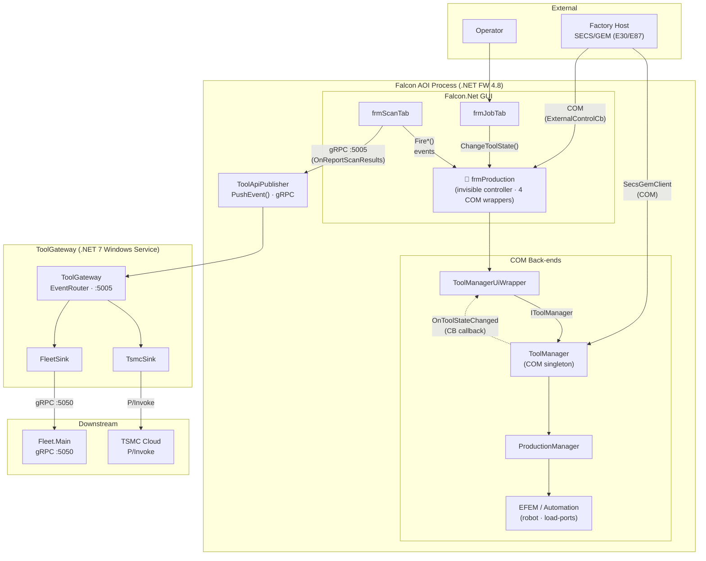
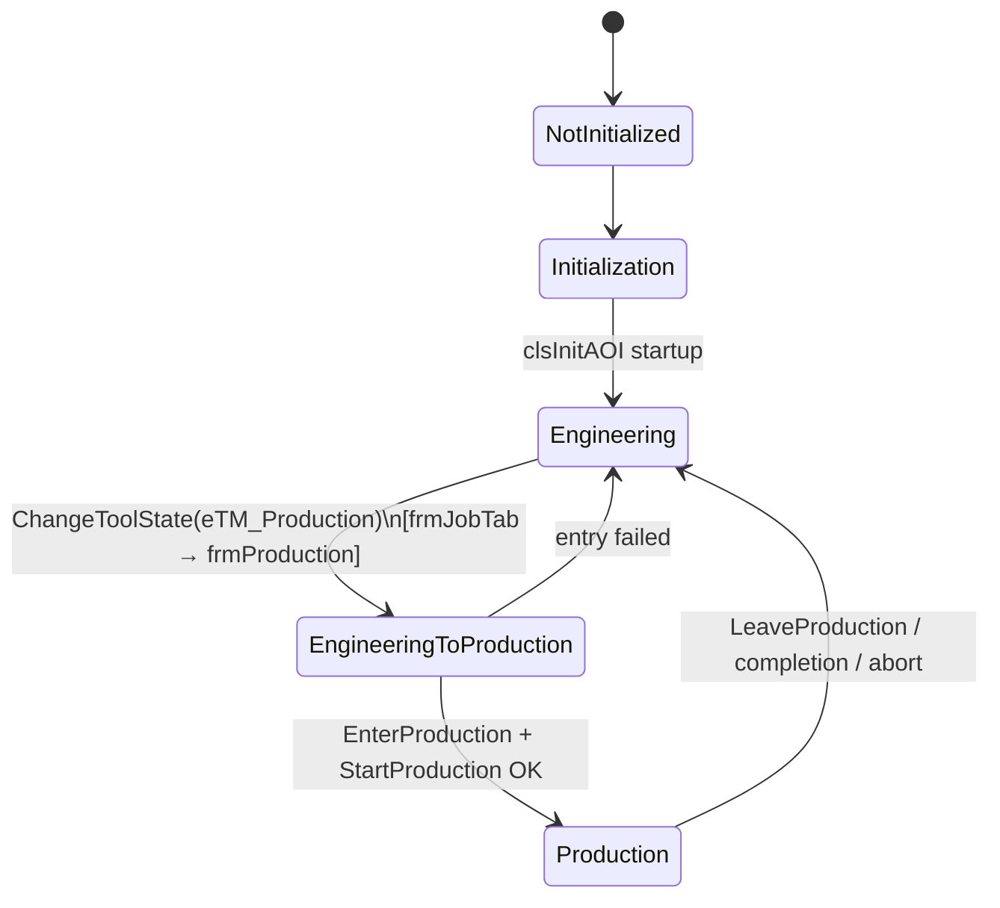

# Falcon AOI — Architecture Reference

> How the AOI communicates with external systems, the role of `frmProduction`, and system diagrams.
> Source: `c:\Amit\75049_3\camtek\frmProduction.md`
>
> **⚠ Corrections (2026-07-16, verified by adversarial code review — details in [a3-fused-design-review.md](../02-reviews/a3-fused-design-review.md)):** the live SECS/GEM stack is C# `SecsGemObjects` (in the `SecsGemGui.Net` process) over the native Cimetrix `SECSGemDriver` — `SecsGemClient\E30RemoteControl.cpp:46` cited below is legacy (not in `Falcon_2022.sln`); host commands flow via `SecsGemObjects\Clients\RemoteControllers\RemoteControl.cs`. The COM event hub lives in `FalconWrapper.exe` (out-of-proc). The ToolGateway push hooks in frmScanTab are at ~:1888–1902 and :10162 (not :7301), and the "<5 ms fire-and-forget" claim does not hold when the gateway is down.

---

## 1. How AOI Communicates with External Systems

> **On "DECA/DECS":** The document uses **SECS/GEM** for the factory automation host (SEMI E30/E87/E116). "DECA" or "DECS" likely refers to this same subsystem — the `SecsGemClient` C++ process that bridges the factory host to the AOI's ToolManager.

| System | Protocol | Direction | Trigger / Entry point |
|--------|----------|-----------|----------------------|
| **SECS/GEM Host** | COM (C++ SecsGemClient) | Bidirectional | Host commands (Start/Stop/Abort/GoRemote) → `E30RemoteControl.cpp:46` → mapped to `ICarrierExecuter` ops on `ProductionManager` |
| **ToolGateway** | gRPC port 5005 (fire-and-forget, <5 ms) | AOI → ToolGateway (one-way) | After scan results reach stable final path: `frmScanTab.cs:7301 OnReportScanResults` → `Tsmc/ScanResultsReady.cs` → `ToolApiPublisher.PushEvent()` |
| **Fleet.Main** | gRPC port 5050 (via ToolGateway) | AOI → ToolGateway → Fleet (indirect) | AOI does **not** talk to Fleet directly. ToolGateway's `FleetSink` forwards events to Fleet.Main after routing through `EventRouter` |
| **TSMC Cloud** | P/Invoke via TsmcClientShim.dll | AOI → ToolGateway → TSMC (indirect) | Same gRPC push as above; ToolGateway's `TsmcSink` builds zip → `TsmcSdkClient.UploadAsync()` → native DLL P/Invoke |

### SECS/GEM — two entry paths into AOI

1. **Production control:** host → `SecsGemClient` → `ToolManager` → `ProductionManager`
2. **GUI control:** host → `ExternalControlCbUiWrapper` → `frmProduction.GuiStartManualScan` / `GuiExportMap`

### ToolGateway trigger — bypasses frmProduction

The gRPC call originates in `frmScanTab` — **not** through `frmProduction`. It fires after `ToolResultHandler.CopyScanResults()` completes, so the path is always stable.

---

## 2. frmProduction — Role & Relationships

**An invisible WinForms controller**, not a screen. Despite the `frm` name its designer defines only a ToolTip — no visible controls. It is a VB6→C# port using the "form-as-code-module + COM host" pattern, accessed everywhere as `MainContext.Instance.Forms.frmProduction`.

**Single responsibility:** GUI-side bridge between Falcon AOI and out-of-process COM back-ends. Forwards GUI actions *down* and re-raises back-end events *up* into the GUI.

### Four COM wrappers it owns

| Field | Wrapper | Connects to | Purpose |
|-------|---------|-------------|---------|
| `toolManagerUi` | ToolManagerUiWrapper | IToolManager (COM) | Tool state machine + ProductionManager — primary path |
| `externalControlWrapper` | ExternalControlCbUiWrapper | CFalconExternalControl | SECS/GEM remote-control of GUI (2 methods forwarded to frmProduction) |
| `autoLoaderUi` | AutoLoaderUIWrapper | IAutoLoader (COM) | EFEM wafer/carrier hardware events |
| `mFalconFireEvents` | CFalconEvents (IFalconFireEvents) | ScanManager + AutoCycleManager | COM event hub — GUI pushes ~25 Fire* inspection events into scan engine |

### Relationship to ToolGateway

> `frmProduction` has **no direct relationship with ToolGateway**. The gRPC call triggering ToolGateway comes from `frmScanTab`, bypassing `frmProduction`. After `FireWaferScanResultsAreReady` the paths diverge: the COM event bus (SECS/GEM etc.) gets the Fire* callback; ToolGateway gets a separate gRPC push only after results are at their stable path.

### ChangeToolState — exactly 3 callers

| Caller | Line(s) | State transition |
|--------|---------|-----------------|
| `clsInitAOI.cs` | 167, 279, 328 | → Engineering (startup) |
| `frmJobTab.cs` | 948, 981 | → Production (operator Start Production, 2 code paths) |

### Fire* event bridge (~25 methods)

| Largest caller | What it fires |
|----------------|---------------|
| `frmScanTab.cs` (~40 sites) | FireOperationStarted/Completed, FireWaferScanResultsAreReady, FireWaferInspectionStarted, FireSpcBatchReportReady |
| `frmJobTab.cs` | FireJobLoaded |
| `modWaferAlignment.cs` | FireOperationStarted/Completed(Alignment) |
| `CmmReceiverApiRequestsHandler.cs` | FireCmmImport/Completed, FireOperationStarted/Completed(WaferMapExport/Import) |

---

## 3. Block Diagram — Full System Architecture



---

## 4. Flow Diagram — Enter Production Sequence

```mermaid
sequenceDiagram
    actor Op as Operator
    participant JT as frmJobTab
    participant FP as frmProduction
    participant TM as ToolManager (COM)
    participant PM as ProductionManager
    participant HW as EFEM / Automation

    Op->>JT: Click "Start Production"
    Note over JT: InProductionMode = true<br/>light tower → Production
    JT->>FP: ChangeToolState(eTM_Production)
    FP->>TM: IToolManager.ChangeToolState() [COM]
    TM-->>FP: fire eTM_EngineeringToProduction
    Note over TM: connect tool client<br/>wait Ready signal
    TM->>PM: EnterProduction() + StartProduction()
    PM->>HW: dock → map → batch-setup → execute
    TM-->>FP: fire eTM_Production [CB callback]
    Note over FP: RobotUI.ProductionStarted(true)<br/>DisableGUI(true)

    Note over FP,HW: During run: frmScanTab fires Fire*() events<br/>host can remotely drive scans via ExternalControlCb

    HW-->>PM: completion / failure
    TM-->>FP: fire eTM_Engineering [CB callback]
    Note over FP: clear batch; re-enable GUI<br/>InProductionMode = false; reload job
```

---

## 5. Tool State Machine



---

## 6. Key Files Reference

| Concern | File | Line |
|---------|------|------|
| GUI production controller | `apps\Falcon.Net\Forms\frmProduction.cs` | — |
| Form creation / startup order | `apps\Falcon.Net\MainContext\ModulesAndForms.cs` | 114 |
| Start-Production trigger | `apps\Falcon.Net\Forms\frmJobTab.cs` | 941–982 |
| GUI ↔ ToolManager wrapper | `apps\Falcon.Net\CommonUtils\ComServerWrappers\ToolManagerUiWrapper.cs` | — |
| Tool state machine | `ToolManagement\ToolManager\Server\ToolManager.cs` | 822 (enter: 439) |
| Production engine | `ToolManagement\ToolManager\ProductionManager\ProductionManager.cs` | 371 (cmds), 805 (HW) |
| Event bus | `ToolManagement\ToolManager\Server\ToolEvents.cs` | 50 |
| SECS/GEM host mapping | `ToolManagement\SecsGemClient\E30RemoteControl.cpp` | 46 |
| gRPC publisher | `system\CamtekSystem\PubSub\ToolApi\ToolApiPublisher.cs` | 88 |
| ToolGateway hook point (production) | `apps\Falcon.Net\Forms\frmScanTab.cs` | 7301 |
| ToolGateway hook point (non-production) | `apps\Falcon.Net\Forms\frmScanTab.cs` | 10155 |
| TSMC bridge | `apps\Falcon.Net\Modules\Tsmc\ScanResultsReady.cs` | — |
| ToolGateway subscriber | `ToolGateway.BL\Sinks\TsmcSink.cs` | 49 |
