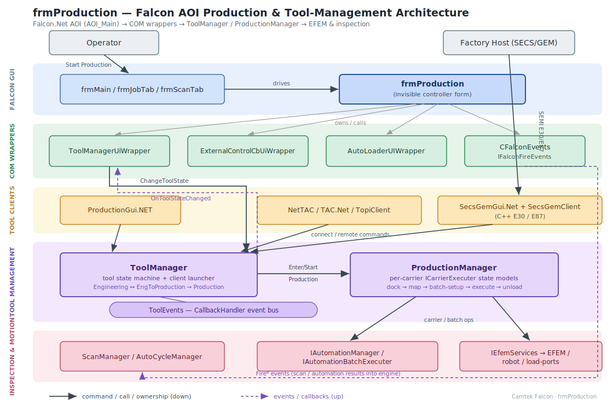
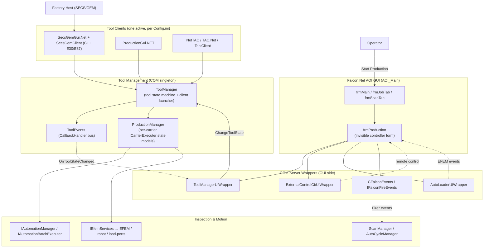
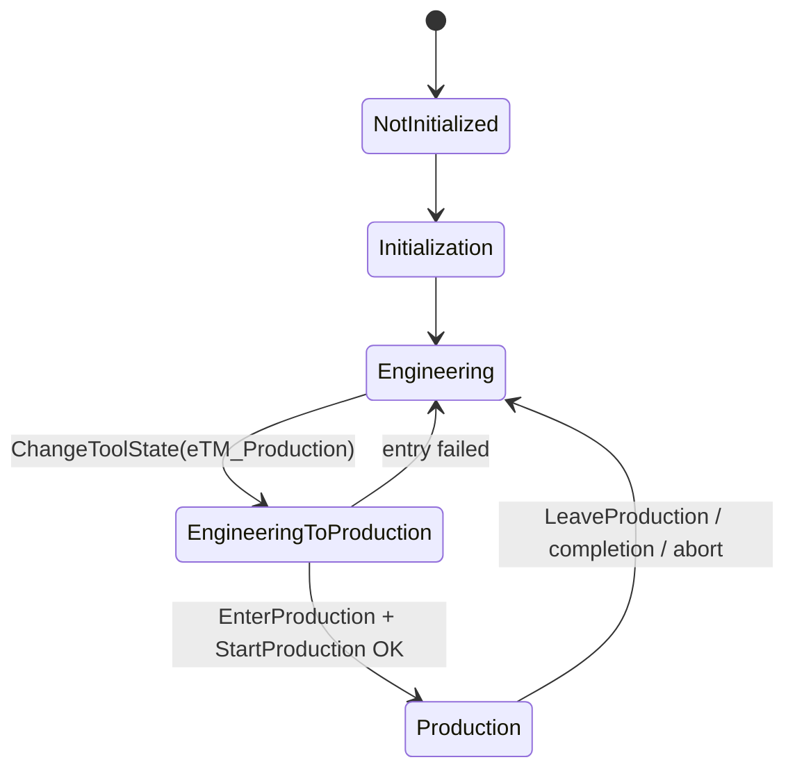

# frmProduction — Falcon AOI Production Controller

> Summary of the `frmProduction` form and its relationship to the Tool Management subsystem in the Camtek Falcon AOI application (`AOI_Main`).
> Source root: `C:\CamtekGit\BIS\Sources`.
>
> **⚠ Corrections (2026-07-16, verified by adversarial code review — details in [a3-fused-design-review.md](../02-reviews/a3-fused-design-review.md)):** (1) the live SECS/GEM stack is **C# `SecsGemObjects`** (hosted in `SecsGemGui.Net`) over the native Cimetrix `SECSGemDriver`; the C++ `SecsGemClient`/`E30RemoteControl.cpp:46` referenced below is legacy (not in `Falcon_2022.sln`) — host commands flow via `SecsGemObjects\Clients\RemoteControllers\RemoteControl.cs`. (2) `CFalconEvents`/ScanManager/AutoCycleManager are hosted in **`FalconWrapper.exe`** (out-of-proc ATL EXE; subscribers include SecsGemGui.Net, NetTAC, TAC.Net, TopiClient.Net, ProductionGui.NET). (3) The ToolGateway push hooks in frmScanTab are at ~:1888–1902 and :10162, not :7301; the "<5 ms non-blocking" claim in §7 does not hold when the gateway is down (`ToolApiPublisher` has no gRPC deadline and can sleep/spawn on the calling thread). (4) `ExternalControlCbUiWrapper` implements the full `IFalconExternalControlCB` surface (~15 callbacks incl. synchronous getters), not only the 2 forwarded commands. (5) `GuiStartManualScan` is `async void` — the COM caller regains control at the first await (acceptance, not completion); `FireManualScanDone` is commented out.

---

## 1. What it is

**"FRM production" = `frmProduction`** — the production-control *form* in the Falcon.Net AOI application.

Despite the `frm` name and `WinForms`/`BaseForm` base class, it is an **invisible controller**, not a screen:

- Its designer defines only a `ToolTip` — no controls (`Text = "Form1"`), tagged `[DontShowOnAltTab]`.
- It is a VB6 → C# port using the classic "form-as-code-module + COM host" pattern.

**Its single responsibility:** be the **GUI-side bridge** between the Falcon AOI application and the out-of-process COM back-ends (tool management, automation/scan engine, EFEM auto-loader, external host). It forwards GUI actions *down* and re-raises back-end events *up* into the GUI.

**File:** `apps\Falcon.Net\Forms\frmProduction.cs` (~1137 lines), accessed everywhere as `MainContext.Instance.Forms.frmProduction`.

---

## 2. Visual architecture



<sub>Rendered diagram above (SVG, opens anywhere). The Mermaid source below renders in VS Code / GitHub / Azure DevOps wiki.</sub>



---

## 3. `frmProduction` — the four back-end wrappers

Each is a thin managed proxy around a COM/.NET server; raises .NET events into the GUI and forwards GUI calls down.

| Field | Wrapper | Connects to | Purpose |
|---|---|---|---|
| `toolManagerUi` | `ToolManagerUiWrapper` | `IToolManager` (ToolManager server) | Tool state machine + `ProductionManager` |
| `externalControlWrapper` | `ExternalControlCbUiWrapper` | `CFalconExternalControl` (`IFalconExternalControlCB`) | SECS/GEM / external-host **remote control** of the GUI |
| `autoLoaderUi` | `AutoLoaderUIWrapper` | `IAutoLoader` (EFEM server) | Physical wafer/carrier handling events |
| `mFalconFireEvents` | `CFalconEvents` (`IFalconFireEvents`) | ScanManager + AutoCycleManager | COM event hub — GUI pushes inspection events **into** the engine |

### Responsibilities (grouped)
- **Lifecycle** — `FalconIsStartingUp()` (creates wrappers on an MTA thread for COM), `HWwasInitialized()` (auto-loader wrapper), `Init()` (`ToolManager.Init()`), `Terminate()`.
- **Tool-state handling** — `ChangeToolState(...)` sends transitions down; `ToolStateChanged(prev,curr)` reacts (enable/disable GUI, start/stop robot, reload job, light tower); `ToolErrorOccurred(...)` handles failed production entry.
- **`Fire*` event bridge (~25 methods)** — `FireOperationStarted/Completed`, `FireWaferScanResultsAreReady`, `FireWaferInspectionStarted`, `FireJobLoaded`, `FireSpcBatchReportReady`, `FireCmmImport/Completed`, `FireEnterOperatorAssistMode`, `FireUserLoggedIn/Out`. All push into `mFalconFireEvents`, run on a `NonBlockingUITask`, and short-circuit in `SimMode` / `VVRMode` (offline verification).
- **Remote/external control** — `GuiStartManualScan`, `GuiExportMap`, `SetRemoteControl`, `IsUnderRemoteControl`, `AutoCycleState`.
- **Wafer data + auto-loader** — `GetWaferDataByOrigin(station,slot)` (physical location → `IWaferData`), `WaferTypeLoaded`, `CarrierManualMappingRequired`.

### Who creates & drives it
- **Created lazily** by the forms container `Frms : IForms` (`MainContext\ModulesAndForms.cs:114`), on an STA dispatcher thread.
- **Startup order** in `Classes\clsInitAOI.cs → InitAOI()`: `FalconIsStartingUp()` (`:167`) → `HWwasInitialized()` (`:193`, HW only) → `Init()` (`:279`) → `ChangeToolState(eTM_Engineering)` (`:328`, default mode). Torn down at `frmMain.cs:1883`.
- **`Fire*` callers** are the scan/automation code — dominated by `Forms\frmScanTab.cs` (~40 calls), plus `modWaferAlignment.cs`, `frmVerifyTab.cs`, `Cmm\CmmReceiverApiRequetsHandler.cs`, `frmJobTab.cs`, `frmMain.cs`.
- **Production entered** from the Start-Production button in `frmJobTab.cs` (`cmdStartProduction_Click`, ~`:941-982`): sets `InProductionMode=true`, light tower → Production, calls `ChangeToolState(eTM_Production, …)`.

---

## 4. Tool Management subsystem

Root: `C:\CamtekGit\BIS\Sources\ToolManagement` (no master `.sln`; `ToolManager` builds as a `.csproj` referenced by the Falcon solution).

- **`ToolManager`** (`ToolManager\Server\ToolManager.cs:21`, `IToolManager`) — central **out-of-process COM singleton**. Owns the tool state machine, launches/monitors the one configured "tool client," owns the `ProductionManager`, fans events out via `ToolEvents`/`CallbackHandler`.
- **`ProductionManager`** (`ToolManager\ProductionManager\ProductionManager.cs:24`, `IProductionManager`) — the **production engine**. Owns one `ICarrierExecuter` per load-port/carrier; runs each through lock → dock → map → batch-setup → wait-for-start → execute → undock → unload, delegating motion to the automation/EFEM layer.

**Tool clients** (mutually exclusive, chosen by `[General]ToolClient` in `Config.ini`): `ProductionGui.NET` (local operator GUI), `SecsGemGui.Net` + C++ `SecsGemClient` (SEMI E30/E87/E116), `NetTAC` (customer adapters), `TAC.Net` (legacy), `TopiClient.Net`. Plus `PJCJManagement` (E40/E94), and peripherals `MeasurementMiddleware`, `BufferStationManager`, `WaferLevelCassetteManager`.

### Tool state machine



- **`eToolState`**: `NotInitialized → Initialization → Engineering ↔ EngineeringToProduction → Production`. `Engineering` = manual setup; `Production` = automated running; failure reverts to `Engineering`.
- **`eToolControlMode`**: `eTCM_Local` vs `eTCM_Remote`. In Remote, carrier executers "wait" so Start/Stop must come from the host (host `GoRemote`/`GoLocal`).
- **`eProductionStateModel`** (per carrier): `ReadyToLoad → VerifyingCarrierId → Docking → Mapping → BatchSetup → WaitingForStartCommand → Executing → Unloading …`.

---

## 5. Connections between them

### (a) Falcon GUI ↔ ToolManager — COM boundary + "CB" callback bus
- **Down:** `frmProduction.ChangeToolState` (`:533`) → `ToolManager.ChangeToolStateInternal` (`ToolManager.cs:822`) → `EnterProduction/LeaveProduction`.
- **Up:** `ToolManager.Fire*` → `ToolEvents` (`Server\ToolEvents.cs:50`, `CamtekSystem.Callback.CallbackHandler`) → each `IToolManagerCB` → wrapper re-raises `OnToolStateChanged` → `frmProduction.ToolStateChanged`. This "CB" pattern is the event bus throughout (`IProductionManagerCB`, `ICarrierExecuterCB`, …).

### (b) SECS/GEM host → production
`CE30RemoteControl::CommandCalled` (`SecsGemClient\E30RemoteControl.cpp:46`) maps host remote commands — `Start/Stop/Abort/GoRemote/GoLocal/GrantCarrier/CreateBatch` — onto `ICarrierExecuter` operations on `ProductionManager`. The client reports `ChangeClientState(..Ready)` which unblocks `ToolManager.WaitForClient` during `EnterProduction`.

### (c) ProductionManager → hardware (never moves motors directly)
Delegates through `IAutomationManager` (recipe/EFEM setup), `IAutomationBatchExecuter` (inspection engine), `IEfemServices` (Lock/Dock/Undock/Release carrier → EFEM/robot/load-ports).

### Enter-Production sequence

```mermaid
sequenceDiagram
    actor Op as Operator
    participant JT as frmJobTab
    participant FP as frmProduction
    participant W as ToolManagerUiWrapper
    participant TM as ToolManager (COM)
    participant PM as ProductionManager
    participant HW as EFEM / Automation

    Op->>JT: Click "Start Production"
    JT->>JT: InProductionMode = true; light tower → Production
    JT->>FP: ChangeToolState(eTM_Production)
    FP->>W: ToolManager.ChangeToolState(...)
    W->>TM: IToolManager.ChangeToolState (COM)
    TM-->>W: fire eTM_EngineeringToProduction
    TM->>TM: connect tool client, wait Ready
    TM->>PM: EnterProduction() + StartProduction()
    PM->>HW: dock → map → batch-setup → execute (per carrier)
    TM-->>W: fire eTM_Production
    W-->>FP: OnToolStateChanged → ToolStateChanged
    FP->>FP: RobotUI.ProductionStarted(true); DisableGUI(true)
    Note over FP,HW: During run: Fire* events (GUI→ScanManager); host can remotely drive scans
    HW-->>TM: completion / failure
    TM-->>W: fire eTM_Engineering
    W-->>FP: ToolStateChanged → clear batch, InProductionMode=false, re-enable GUI, reload job
```

---

## 6. Key files

| Concern | File |
|---|---|
| GUI production controller | `apps\Falcon.Net\Forms\frmProduction.cs` |
| Form creation / startup order | `apps\Falcon.Net\MainContext\ModulesAndForms.cs:114`, `Classes\clsInitAOI.cs` |
| Start-Production trigger | `apps\Falcon.Net\Forms\frmJobTab.cs:941-982` |
| GUI↔ToolManager wrapper | `apps\Falcon.Net\CommonUtils\ComServerWrappers\ToolManagerUiWrapper.cs` |
| Tool state machine | `ToolManagement\ToolManager\Server\ToolManager.cs:822` (`:439` enter production) |
| Production engine | `ToolManagement\ToolManager\ProductionManager\ProductionManager.cs` (`:371` commands, `:805` HW binding) |
| Event bus | `ToolManagement\ToolManager\Server\ToolEvents.cs:50` |
| SECS/GEM host mapping | `ToolManagement\SecsGemClient\E30RemoteControl.cpp:46` |
| State / enums | `ToolManagement\ToolManager\...\TollManagerDefinitions.cs` |
| External / remote control | `ToolManagement\FalconWrapper\FalconExternalControl.h` |
| COM event hub | `ToolManagement\FalconWrapper\FalconEvents.h` |

---

## 7. ToolGateway — relationship to this design

ToolGateway is a **separate .NET 7 Windows service** (feature 75049). It is not part of the COM/WinForms world and has no direct relationship with `frmProduction`. It connects to Falcon AOI through a single gRPC call made by `ToolApiPublisher` after scan results reach their stable final path.

### Where it hooks in

The existing gRPC publisher is `CamtekSystem\PubSub\ToolApi\ToolApiPublisher.cs` — it calls `PushEvent` on `localhost:5005`. The TSMC module (`Modules\Tsmc\ScanResultsReady.cs`, added as part of feature 75049) calls this publisher at the end of the results-copy step inside `frmScanTab.OnReportScanResults`.

```
frmScanTab.cs (production path)
  :12590  AutoCycle_WaferScanResultsAreReady()
  :12968    → frmProduction.FireWaferScanResultsAreReady()   ← COM event bus (SECS/GEM etc.)
              [results still being copied at this point]
  :7301   OnReportScanResults() — ToolResultHandler callback, results now at stable final path
            → Modules\Tsmc\ScanResultsReady.cs  [added by feature 75049]
                 → ToolApiPublisher.PushEvent(gRPC, localhost:5005)
                                                    ↓
                              ToolGateway: ToolAPIGrpcServiceImpl
                                → EventRouter → TsmcSink
                                    → TsmcZipBuilder → TsmcSdkClient (P/Invoke)
                                                            ↓
                                                         TSMC cloud
```

**Key files:**

| Role | File | Line |
|---|---|---|
| gRPC publisher | `system\CamtekSystem\PubSub\ToolApi\ToolApiPublisher.cs` | 88 (`PushEvent`) |
| Publisher factory (INI-driven) | `system\CamtekSystem\PubSub\Factories\PublisherFactory.cs` | 102 |
| Proto contract | `system\CamtekSystem\PubSub\ToolApi\Protos\toolapi.proto` | — |
| Hook point (production) | `apps\Falcon.Net\Forms\frmScanTab.cs` | 7301 (`OnReportScanResults`) |
| Hook point (non-production) | `apps\Falcon.Net\Forms\frmScanTab.cs` | 10155 (end of `MoveScanResult`) |
| TSMC bridge (to be added) | `apps\Falcon.Net\Modules\Tsmc\ScanResultsReady.cs` | — |
| ToolGateway subscriber | `ToolGateway.BL\Sinks\TsmcSink.cs` | 49 (`Accepts`) |

### Key points

- `frmProduction.FireWaferScanResultsAreReady` fires on the **COM event bus** — SECS/GEM, ProductionManager etc. ToolGateway is **not** a subscriber on that bus.
- ToolGateway's trigger is **later** — after `ToolResultHandler.CopyScanResults()` completes and the path is stable.
- The `ToolApiPublisher.PushEvent` call is **non-blocking** (< 5ms, fire-and-forget into ToolGateway's queue). The AOI scan thread is never held.
- `frmProduction` has **no direct relationship** with ToolGateway — the gRPC call originates in `frmScanTab` via the `IPublisher` DI service, bypassing `frmProduction` entirely.

### Full architecture with ToolGateway

```
frmProduction (invisible controller)
    ├── ToolManagerUiWrapper  → IToolManager (COM)             [tool state machine]
    ├── ExternalControlCbUiWrapper → IFalconExternalControlCB  [remote control]
    ├── AutoLoaderUIWrapper   → IAutoLoader (COM)              [EFEM hardware]
    └── IFalconFireEvents (COM event bus)
           └── WaferScanResultsAreReady → SECS/GEM, ProductionManager, …

frmScanTab
    ├── calls frmProduction.Fire*() (above)
    └── OnReportScanResults  (after results copied to final path)
           └── Tsmc/ScanResultsReady.Publish()    [Tsmc module — feature 75049]
                    └── ToolApiPublisher.PushEvent()   [gRPC → localhost:5005]
                               ↓
                       ToolGateway (separate process)
                           TsmcSink → TsmcZipBuilder → TsmcSdkClient (P/Invoke)
                                                            ↓
                                                        TSMC cloud
```

---

## 8. How frmProduction receives commands

Commands arrive from three distinct channels.

### Channel 1 — Local GUI (direct method calls)

| Caller | Line(s) | Method called | What |
|---|---|---|---|
| `Classes\clsInitAOI.cs` | 167,193,279,328,332 | `FalconIsStartingUp()` → `Init()` → `ChangeToolState(Engineering)` | Startup sequence |
| `Forms\frmJobTab.cs` | 948, 981 | `ChangeToolState(eTM_Production, ...)` | Operator clicks "Start Production" |
| `Forms\frmScanTab.cs` | 11977, 12030 | `SetRemoteControl(Local)` / `SetRemoteControl(Remote)` | Temporarily drops to Local before manual scan, restores Remote after |
| `Forms\frmScanTab.cs` | ~40 call sites | `FireOperationStarted/Completed(...)`, `FireWaferScanResultsAreReady(...)`, `FireWaferInspectionStarted(...)`, `FireSpcBatchReportReady(...)` | Every scan operation fires its result outbound via the COM event bus |
| `Forms\frmJobTab.cs` | 2667, 2789 | `FireJobLoaded(...)` | After job load |
| `Forms\frmMain.cs` | 7808, 2863, 3050, 2941 | `FireUserLoggedIn/Out`, `FireEnterOperatorAssistMode`, `FireExitOperatorAssistMode` | Session / assist-mode changes |
| `Modules\modWaferAlignment.cs` | 2072, 1282, 1958 | `FireOperationStarted/Completed(Alignment, ...)` | Alignment start/end |
| `Cmm\CmmReceiverApiRequetsHandler.cs` | 203,176,221,215,222,216 | `FireCmmImport/Completed`, `FireOperationStarted/Completed(WaferMapExport/Import)` | CMM export/import callbacks from the gRPC receiver |
| `Classes\clsCalibrationManager.cs` | 252 | `FirePeriodicCalibrationCompleted(...)` | Calibration done |
| `Forms\frmVerifyTab.cs` | 3348,3349,3778,6827,6845,1058,7110 | `FireInOutVerifyTabAtOffline`, `FireExportMapAfterReviewAtOffline`, `FireOperationStarted/Completed(WaferVerification)` | VVR offline-verify mode |

`ChangeToolState` has exactly **three callers**: `clsInitAOI` (Engineering on startup) and `frmJobTab` (Production on start-run, two code paths).

### Channel 2 — External / remote host (via `ExternalControlCbUiWrapper`)

The factory automation host (SECS/GEM etc.) talks over COM to the C++ `CFalconExternalControl` singleton, which fans callbacks out to the .NET `ExternalControlCbUiWrapper` (`IFalconExternalControlCB`).

Of all callbacks on that interface, **only two are forwarded to `frmProduction`**:

| COM host command | frmProduction method |
|---|---|
| `IFalconGui.StartManualScan()` | `GuiStartManualScan()` — triggers full manual scan flow |
| `IFalconGui.ExportMap()` | `GuiExportMap()` — triggers verify + export flow |

All other callbacks (`GuiLoadJob`, `GuiLoadRecipe`, `DataCollectionCompleted`, die-count queries, etc.) are handled directly inside `ExternalControlCbUiWrapper` without involving `frmProduction`.

**Wrapper file:** `apps\Falcon.Net\CommonUtils\ComServerWrappers\ExternalControlCbUiWrapper.cs`

### Channel 3 — Hardware events (via `AutoLoaderUIWrapper`)

`IAutoLoader` COM hardware server fires events → `AutoLoaderUIWrapper` re-raises them as .NET events → `frmProduction` subscribes to two:

| Hardware event | frmProduction handler | What |
|---|---|---|
| `eALEI_WaferTypeLoaded` | `WaferTypeLoaded(...)` | Updates SetupTab theme |
| `eALEI_CarrierManualMappingRequired` | `CarrierManualMappingRequired(...)` | Corrects carrier mapping under remote control |

`AutoLoaderUIWrapper` is purely event-driven — it never pushes commands into `frmProduction`.

### Summary diagram

```
Operator button (frmJobTab)       → direct call  → ChangeToolState(Production)
frmScanTab / modWaferAlignment    → direct calls → Fire*(OperationStarted/Completed/...)
Factory host (SECS/GEM)           → COM → ExternalControlCbUiWrapper
                                                → GuiStartManualScan / GuiExportMap only
EFEM / AutoLoader hardware        → COM → AutoLoaderUIWrapper
                                                → WaferTypeLoaded / ManualMappingRequired
```
