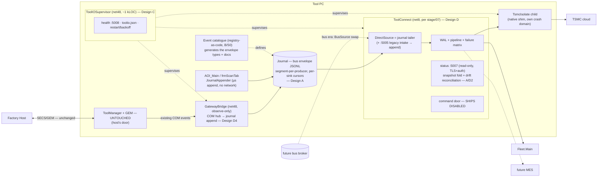

# ADR Review — Tool-Gateway Unification: Cross-Review of All Ten Candidate Designs

> **Role:** Principal-architect formal review and design recommendation.
> **Inputs:** the reviewed set ([tool-gateway-unification/](tool-gateway-unification/) — Alt 1, Alt 2, Alt 3 + two adversarial reviews + decided path), the `unitedDesgin\` studies (A–D), and the `newUnitedDesgin\` studies (D1–D4).
> **Problem & criteria:** [tool-gateway-unification/00-problem-and-current-state.md §0.4](tool-gateway-unification/00-problem-and-current-state.md) — the six success criteria are used unchanged.
> **Status:** review record + recommendation. Not normative until reconciled with [tool-gateway-unification/02-recommendation.md](tool-gateway-unification/02-recommendation.md) per the repo's consistency rule.

---

## 1. Executive Summary

Ten designs from three independent design efforts were reviewed. The single most important finding is **convergent evolution**: three sets, produced separately, independently rediscovered the same five primitives —

1. **Supervision first** (Alt 1 U0/U1 · Design C · D3 kernel · D4 B0) — every design needs a GUI-independent supervised lifecycle before anything else works.
2. **An observe-only tap on the existing COM rails** (D4 bridge · D1 tap · D2 observer · A's optional appender) — the only safe way to get ToolManager events out without touching ToolManager.
3. **Durability-first ingestion** (A journal · D2 journal-first pipeline · stage/07's WAL) — invert connection-first to append-first, which retires the two CRITICAL spool bugs *by construction*.
4. **A canonical event contract** (B registry · D1 envelope/topics) — the bus schema, delivered early.
5. **Process isolation for the native TSMC shim** (every design) — undisputed; only the hosting pattern differs.

When three teams independently converge on the same primitives, the correct decision is not to pick a winner among ten documents — it is to **ship the primitives once, in dependency order, arranged so that 100 % of the work survives into the bus era**. Design D (strangler ToolConnect) supplies the frame that makes that possible: the end-state gateway is *already designed and adversarially reviewed* in [stage/07-toolconnect-design.md](stage/07-toolconnect-design.md); everything else in the field is either a feeder primitive for it or a duplicate of something inside it.

**Recommendation (detail in §6):** a four-primitive hybrid — **Supervisor (C) → producer-side Journal with the bus envelope (A) → ToolConnect fed by a journal-reading DirectSource (D, merging A+D's rival durability layers into one) → COM-tap for tool-state (D4) — with B's registry adopted in catalogue-only form (S0) and its GEM-wrapping emitters explicitly rejected for this program.** This supersedes the currently-decided "Alt 1 → Alt 3" path *in implementation shape* while preserving every commitment that path made (U0 bug gates, no command relay, two doors, control core untouched). Confidence: **Medium-High**; the open items in §10 (chiefly net8-on-LTSC servicing policy and stage/07 owner availability) gate the final go.

---

## 2. Architecture Analysis — Each Proposal Individually

Format per proposal: essence → principles → evaluation highlights → assumptions/risks/debt → where it excels / where it fails.

### 2.1 Alt 1 — Unified Gateway Facade (reviewed, Rev 2)

**Essence.** Today's ToolGateway is promoted to a hardened Windows service and *declared* the single non-host surface; a separate least-privilege read-only shim observes ToolManager for a :5007 status endpoint. Nothing moves.

**Principles.** Facade; minimal intervention; "two doors" honesty (GEM stays the host's door).

**Evaluation.** Modularity unchanged (two engines remain). Separation of concerns: good — the review *removed* command relay, keeping the facade strictly read/egress. Reliability: materially improved only if the U0 spool fixes land (the review correctly made them gates, not chores). Testability: inherits the gateway's real xUnit suite. Security: forced the overdue :5005 hardening. Operational complexity: low. DX: low learning curve.

**Assumptions.** That "declared single surface" changes behavior — it changes *policy*, not structure; the next engineer can still bypass it.
**Risks.** The shim is a new (thin) COM coupling; low.
**Debt.** The shim is planned-throwaway (superseded by any deeper design — the recommendation itself admits this). The ad-hoc :5005 schema is frozen in place, unowned.
**Excels:** time-to-value, risk floor, and as a vehicle for the U0 bug fixes.
**Fails:** as an end state — it is a lifecycle fix wearing a unification costume. Criterion 1 is met by decree, not construction.

### 2.2 Alt 3 — Unified Tool Gateway Service (reviewed, Rev 2 / split hosting)

**Essence.** One supervisor owning both domains: a GUI-independent egress service plus a supervised interactive-session control process; the control unit (state machine + PM + GEM) carried in-process *unchanged* after the review corrected the original "extract coordination" claim.

**Principles.** Consolidated ownership; internal API at the *reporting* boundary only (the review's honest retreat from a clean-architecture re-slice the entangled code cannot support).

**Evaluation.** The post-review version is candid that this is **supervision + egress unification + a reporting API** — i.e., after Rev 2 corrections, Alt 3 has quietly converged toward "Design C + a reporting contract + eventual egress engine." Maintainability of the corrected form is good but no longer dramatically better than the composed primitives. Reversibility medium. Requires an owner and funding.

**Assumptions.** That a single named "Tool Gateway Service" owning both domains is worth more than the same parts under a neutral supervisor — this is now mostly a *naming and ownership* claim.
**Risks.** Any control-path timing shift → re-qualification exposure; mitigated by record-replay gates.
**Debt.** Low, but it builds a bespoke egress engine that stage/07's ToolConnect then replaces or absorbs — partial planned funeral.
**Excels:** organizational clarity (one owner, one deliverable).
**Fails:** where funding is uncertain (its own recommendation says so), and on throwaway-work grounds versus Design D.

### 2.3 Design A — Journal-First Gateway (`unitedDesgin`)

**Essence.** The gateway is not a process but a **durable local journal**: producers append and return (µs, no network); one JournalPump service tails, merges, and drains to sinks with per-sink cursors; status is a snapshot fold.

**Principles.** Log-centric architecture (Kafka's core idea, single-node); durability as the *primary* path, network as the drain; smart endpoints / dumb pipe (the pipe is a file).

**Evaluation.** Reliability: the standout — the `ToolApiPublisher` scan-thread hazard and both CRITICAL spool bugs become *structurally impossible*, not fixed. Testability: excellent (pure appender + crash-recovery harness + reused sink suite). Performance: adds ~100 ms tail latency — irrelevant for the only in-scope traffic (reporting). Operational complexity: real — rotation, retention, AV exclusions, torn-line recovery; the review must not hand-wave this. Extensibility: replay/back-fill for free.

**Assumptions.** Tool-PC disks and AV policy tolerate a hot append directory (must be verified per fleet); single-writer-per-segment discipline holds.
**Risks.** File-plane engineering is a hundred small correctness obligations; a silent fsync-policy mistake surfaces years later.
**Debt.** The envelope becomes a contract to govern (mitigated: it *is* the bus envelope).
**Excels:** producer protection and bus-durability delivered early.
**Fails:** if treated as the whole answer — it deliberately leaves "two engines" standing, and it **rivals stage/07's WAL** (two durability layers is one too many; see §5).

### 2.4 Design B — Semantic Model Unification (`unitedDesgin`)

**Essence.** Unify the *vocabulary*: one canonical event registry (CanonicalId + payload schema + GEM mapping + gateway mapping), one `Emit()` API with a pass-through GEM emitter and a fire-and-forget gateway emitter; call sites migrate one event at a time.

**Principles.** DDD ubiquitous language; single source of truth for the tool's public dictionary; schema-first.

**Evaluation.** This is the only design attacking the *root* of "integrations touch two worlds" — the missing dictionary. Maintainability upside is large and survives every topology outcome. **But:** the GEM emitter wraps fab-qualified call sites. "Pass-through, byte-identical by construction" is a design claim requiring per-event record-replay *proof*; the design says so honestly. That makes B the **only non-rejected candidate that touches the qualified path**, for a benefit (dual-emit collapse) that is real but not urgent.

**Assumptions.** Record-replay tooling exists and is trusted enough to gate per-event flags; someone will own the registry.
**Risks.** Requalification exposure creep; dual-emit divergence (mitigated by the `ReportingDegraded` counter-event — a good idea).
**Debt.** Registry governance is a new permanent duty (though the duty already exists today, unowned).
**Excels:** as a *catalogue* (its S0 phase — zero call sites moved) and as the bus schema registry delivered early.
**Fails:** if its S1+ call-site rewiring ships in this program — that risk belongs to the bus program's GEM-shim work, which already owns record-replay gating at scale.

### 2.5 Design C — ToolIO Supervisor (`unitedDesgin`)

**Essence.** Move no business logic; unify what the outside world *operates*: one ~1 kLOC net48 supervisor service (launch, job objects, health probes, restart/backoff/quarantine, one config root, one health endpoint :5008). Children: today's ToolGateway binary unchanged, a status shim, a TSMC isolate. It is the stage ToolHost pattern delivered early.

**Principles.** `systemd` thinking; strict single responsibility with an explicit anti-scope-creep rule ("the supervisor never parses tool data").

**Evaluation.** Delivers criterion 2 whole for effort S and criterion 4 as a side effect. The only design whose worst case is "we wasted ~1 kLOC." Highest reversibility in the field (config/flag at every phase). Weakness: contains the split rather than healing it — criteria 1 is untouched.

**Assumptions.** All children are headless (verified for today's three); the strictly-exclusive launch rule vs. AOI's process-sweep is designed out first.
**Risks.** A new SPOF, mitigated by size and children-survive-supervisor-death policy. Session/desktop constraints per new child.
**Debt.** Essentially none — this *is* infrastructure the target needs anyway.
**Excels:** as the universal first move; every other design needs it.
**Fails:** only if mistaken for the destination.

### 2.6 Design D — Strangler ToolConnect (`unitedDesgin`)

**Essence.** Stop designing interim gateways: build the already-reviewed stage/07 ToolConnect now, with a **DirectSource** implementing the BusSource intake contract (speaking today's :5005 wire), run it in shadow/compare mode, cut over lane by lane (Fleet → TSMC → status), retire ToolGateway. Bus era = swap DirectSource for BusSource; nothing else changes.

**Principles.** Strangler fig (Fowler); target-first delivery; hexagonal ports-and-adapters at the intake (BusSource *is* the port; DirectSource is just another adapter — the design's decisive insight).

**Evaluation.** The only path with **zero throwaway work** and the only one inheriting a multi-cycle-reviewed component design (WAL, failure matrix, threading model, test suite, and — critically — dual-run coexistence §7.11, the hardest part of any strangler, already specified). Longest time-to-first-value of the field. Reversibility high through cutover, redeploy after.

**Assumptions.** stage/07 survives contact with implementation (D0 shadow is the cheap falsification harness — good); net8 acceptable on the LTSC 2019 fleet *now*; the stage/07 owner co-owns the build.
**Risks.** Couples this program to the stage design's maturity; corrections must flow back into the normative set (consistency rule). The :5007 command door **must ship disabled** — the design states the guard; it must survive scope pressure.
**Debt.** Near zero by construction.
**Excels:** end-state economics.
**Fails:** if the bus program is *cancelled* (not merely delayed) — then ToolConnect's WAL/envelope conventions still stand alone fine, so even this failure mode is soft.

### 2.7 Design D1 — Tool Event Spine (`newUnitedDesgin`)

**Essence.** A localhost streaming hub with a versioned envelope + registered topics (a deliberate bus subset); producers publish, sinks subscribe; TM reached via an observe-only tap.

**Principles.** Contract-first; event-driven pub/sub; topic governance as code.

**Evaluation.** Its lasting insight is the **contract** (envelope + topic registry + schema-version gating + rejected-unregistered-topic rule). Its *hub*, however, is an interim message plane that Design D's frame condemns: ToolConnect's pipeline already is the hub, and the future bus is the real one. Building a third is throwaway.
**Excels:** contract discipline; producer-side deadline fixes bundled in.
**Fails:** on end-state economics — the hub has a planned funeral. **Verdict: adopt the contract, reject the hub.**

### 2.8 Design D2 — CQRS Projection Gateway (`newUnitedDesgin`)

**Essence.** Commands stay on GEM; the gateway becomes a journal-first, event-sourced **read model** — projectors (pure folds), snapshot-reconciliation against drift (`tool.state.corrected` events), query surface + push sinks as projection subscribers.

**Principles.** CQRS; event sourcing; observed-system reconciliation (the snapshot-vs-fold corrector is the strongest single idea here — it answers the classic "shadow state machine drifts silently" objection with *visible, counted* drift).

**Evaluation.** Structurally the strongest criterion-3 answer (no runtime link from query path to TM at all). Substantially overlaps Design A (both are journal-first; D2 adds projections/query). Its full query surface (jobs/carriers/watch streams) is ahead of any stated consumer demand — speculative generality.
**Excels:** post-mortem/audit/back-fill story; drift reconciliation.
**Fails:** as a first move — biggest gateway-side refactor in the field for read features nobody has asked for yet. **Verdict: adopt journal-first (via A) + the snapshot-fold status + the reconciliation pattern; defer the full projection/query catalogue until a consumer exists.**

### 2.9 Design D3 — Micro-Kernel Connectivity Supervisor (`newUnitedDesgin`)

**Essence.** A small frozen kernel (supervise/route/persist/health) with every integration as a crash-isolated connector *process* under a manifest contract; mixed net48/net8 runtimes dissolve because the plugin unit is a process.

**Principles.** Microkernel; Kafka-Connect-shaped connector contract; crash-only design.

**Evaluation.** Elegant, and its process-as-plugin move genuinely dissolves the framework-collision problem. But examined against the field: its supervisor half **is Design C**, its router/durable-queue half **is A's pump / stage/07's pipeline**, and its connector contract **is a generalization nobody currently needs** (two sinks exist; a third is roadmap). Classic YAGNI exposure — the kernel "earns its cost only under the stated roadmap," as its own §3.6 admits.
**Excels:** if and when integration count grows past ~4–5 with per-fab variation.
**Fails:** as scaffolding without tenants. **Verdict: adopt its isolation posture (already covered by C's TsmcIsolate) and keep the connector contract as the *documented growth path* for ToolConnect's sink side; do not build the kernel now.**

### 2.10 Design D4 — COM-Tap Bridge (`newUnitedDesgin`)

**Essence.** The tool already has an internal event bus — the COM connection-point hub (`FalconWrapper`/`ToolEvents`) with multiple existing subscribers. Add one ~500-line net48 observe-only bridge subscribing as a peer of `ToolManagerUiWrapper` and forwarding to the existing gateway ingress. Zero changes to TM or AOI; rollback = stop one exe.

**Principles.** Use existing rails; minimum total intervention; disposability as the safety argument.

**Evaluation.** The cheapest possible delivery of "tool state reaches Fleet with the GUI closed," on a mechanism the fab has run for years. Honest about its ceiling (~25 `Fire*` events + state changes; no replay; schema debt if left as end state). COM eventing quirks (callback threading, event storms, zombie subscriptions) are named and bounded.
**Excels:** as the TM-side *embryo* — every richer design's tap/observer is this bridge renamed.
**Fails:** as an end state (schema debt) — its own §4.8 says so. **Verdict: adopt, aimed at the journal rather than the legacy schema.**

---

## 3. Comparison Matrix

Scores: ●●● strong · ●● adequate · ● weak, for *this system's* context. (Alt 2 excluded — already rejected for cause; this review concurs: it violates criteria 3 and 4 outright.)

| Criterion | Alt 1 | Alt 3 | A journal | B semantic | C supervisor | D strangler | D1 spine | D2 CQRS | D3 kernel | D4 tap |
|---|---|---|---|---|---|---|---|---|---|---|
| Complexity (lower=●●●) | ●●● | ● | ●● | ●● | ●●● | ● | ●● | ● | ● | ●●● |
| Flexibility | ● | ●● | ●●● | ●●● | ●● | ●●● | ●●● | ●●● | ●●● | ● |
| Scalability (integrations) | ● | ●● | ●●● | ●●● | ● | ●●● | ●●● | ●●● | ●●● | ● |
| Coupling (lower=●●●) | ●● | ●● | ●●● | ● (wraps GEM sites) | ●●● | ●●● | ●●● | ●●● | ●●● | ●● |
| Cohesion | ●● | ●●● | ●●● | ●●● | ●●● | ●●● | ●● | ●● | ●● | ●● |
| Maintainability | ●● | ●●● | ●●● | ●●● | ●●● | ●●● | ●● | ●● | ●● | ●● |
| Cost of change (later) | ● | ●● | ●●● | ●●● | ●●● | ●●● | ●● | ●● | ●● | ● |
| Operational overhead (lower=●●●) | ●●● | ●● | ●● | ●●● | ●●● | ●● | ●● | ● | ● | ●●● |
| Team productivity (near-term) | ●●● | ● | ●● | ●● | ●●● | ● | ●● | ● | ● | ●●● |
| Learning curve (lower=●●●) | ●●● | ●● | ●● | ●● | ●●● | ●● | ●● | ● | ● | ●●● |
| Risk level (lower=●●●) | ●●● | ●● | ●● | ● (requal exposure) | ●●● | ●● | ●● | ●● | ●● | ●●● |
| Future-growth suitability | ● | ●● | ●●● | ●●● | ●● | ●●● | ●●● | ●●● | ●●● | ● |

## 4. Trade-off Analysis (why the scores fall as they do)

- **Complexity vs. end-state economics.** The three cheapest designs (Alt 1, C, D4) are also the three that leave the split standing; the three that heal it (Alt 3, D, D2) are the three most expensive. There is no single design that is both cheap and final — which is exactly why the answer must be *sequenced composition*, not selection.
- **Risk concentrates at exactly two places** in this system: the fab-qualified GEM path and the native shim's crash domain. Every design except B keeps distance from the first; every design handles the second. B's requal exposure is unique among survivors and buys nothing urgent — this dominates its assessment regardless of its (real) semantic merits.
- **Durability placement is the deepest technical fork.** Producer-side (A: append before any process is involved) vs. gateway-side (stage/07 WAL: durable once the gateway accepts). Producer-side is strictly stronger for the scan thread — it protects producers even when the gateway is *down*, and it removes the network from the producer's critical path entirely. Gateway-side is where replay/cursor logic naturally lives. The synthesis (§6) uses both placements but **one format**, so there are not two competing durability contracts.
- **Coupling.** D4 and Alt 1's shim couple to TM via COM observation — acceptable because observation is severable. B couples *into* qualified call sites — not severable without re-touching them. D1/D3 introduce coupling to new contracts (topics, connector manifests) that only pay off at integration counts the roadmap hasn't confirmed.
- **Operational overhead** rises with process count (D3 worst: kernel + N connectors) and with new persistent state (A, D2: journal ops). C is the paradox: it *adds* a process yet *reduces* net ops burden, because it converts N ad-hoc lifecycles into one supervised model — overhead should be measured per-fleet-incident, not per-exe.
- **Learning curve / team productivity.** Everything net48/COM-adjacent (C, D4, B's lib) matches existing team skills; journal/event-sourcing (A, D2) and the connector kernel (D3) import new disciplines. The strangler (D) has the mildest *conceptual* curve — the design is already written — but the highest engagement cost (stage/07 owner must co-own).

---

## 5. Best Ideas Across All Proposals — and What They Displace

| Idea | From | Why it's valuable | Coexists with | Displaces / conflicts |
|---|---|---|---|---|
| **Supervisor-first, business-logic-free** (~1 kLOC, hard anti-creep rule) | C (echoed in D3, Alt 1 U1) | Cheapest whole delivery of criterion 2; scaffolding every later winner needs; worst case ≈ zero | everything | Alt 1's "promote ToolGateway itself" — supervising the unchanged binary is strictly more reversible than promoting it |
| **Producer-side append-first journal, envelope = bus envelope** | A (echoed by D2) | Retires the scan-thread hazard + both CRITICAL spool bugs by construction; replay/audit for free; bus durability early | supervisor, strangler, tap | The spool (retired); D1's hub (unneeded once the journal is the handoff); *half* of stage/07's intake path (see next row) |
| **BusSource port + DirectSource adapter; strangle lane-by-lane with compare-mode shadow** | D | Zero throwaway; inherits a reviewed WAL/failure-matrix/test-suite; dual-run already specified (§7.11) | supervisor, journal, tap | Alt 3's bespoke egress engine; Alt 1's end-state claim; D1's hub; D3's kernel-as-router |
| **Journal-reading DirectSource** (merge of A + D) | A §J-phases + D §D.3 (both hint at it) | Resolves the A-vs-D rivalry: one durability format, two placements — producer append + gateway WAL cursoring over it | — | The idea that A and D are rivals (the `unitedDesgin` README's "choose one" — the merge is better than either) |
| **Observe-only COM tap as a disposable peer subscriber** | D4 (= D1's tap, D2's observer, A's appender wrapper) | TM events escape with zero TM changes, on fab-proven rails; kill-any-time safety argument | everything | Alt 1's ToolStatusShim as a *separate* long-lived artifact (the tap subsumes it) |
| **Snapshot-fold status + snapshot-vs-fold drift reconciliation with visible `corrected` events** | A (fold) + D2 (reconciliation) | Answers the shadow-state-drift objection measurably; status endpoint with no runtime TM dependency | tap, journal | Alt 1's live read-through shim on the request path |
| **Canonical event catalogue, registry-as-code, generated "what can this tool say" page** | B (S0 only), D1 (topic registry) | The missing dictionary; the bus schema registry delivered early; near-zero risk *in catalogue-only form* | everything | — |
| **Per-event/per-lane strictly-exclusive flags; no-double-egress rule in shadow** | D (D0 guard), Alt 1 review (exclusive launch) | The discipline that makes every migration reversible and every comparison honest | everything | — |
| **Command door ships disabled until authenticated transport exists** | Alt 1 review, restated by D | Closes the control-entry hole a direct-fed gateway cannot safely authorize | everything | Any scope pressure to "just add one command" |

**Explicitly rejected ideas:**
- **B's GEM-wrapping emitters (S1+)** — the only survivor touching qualified call sites; benefit is not urgent; the bus program's GEM-shim work already owns this risk class with proper record-replay scale. Keep the registry, reject the rewiring *in this program*.
- **D1's hub and D3's kernel** — interim message planes with planned funerals once ToolConnect stands. Their *contracts* (topics; connector manifest) are archived as ToolConnect's documented growth path.
- **D2's full query catalogue** — speculative generality; build projections when a consumer names itself.
- **Alt 3 as a distinct build** — after its own Rev 2 corrections it decomposes, almost without remainder, into C + a reporting contract + an egress engine; the strangler supplies a better egress engine (the reviewed one).
- **Alt 2** — remains rejected; nothing in the new field rehabilitates crash-domain merging.

---

## 6. Recommended Target Architecture — "Supervised Journal-Fed Strangler"

> **Complete design (build spec):** [sjfs-complete-design.md](sjfs-complete-design.md) — component specs, file-plane contract, interfaces, failure matrix, phased plan, test kit.

One sentence: **ship the convergent primitives in dependency order — supervisor, then journal, then ToolConnect strangling ToolGateway with a journal-reading DirectSource, then the COM tap — so that every line written is either a live bug fix or permanent bus-era code.**

**Boundaries & responsibilities.**
- *Producers* (AOI, tap) know only the appender library and the registry's event types. They never open a network connection on a hot path again.
- *The journal* is the sole handoff: a file-plane contract (envelope, segments, cursors), not a process. Dependency direction: everything depends on the contract; nothing depends on a process being up.
- *ToolConnect* owns all non-host egress + read-only status; its intake is the BusSource port with two adapters (journal tailer; :5005 legacy listener that appends). Sinks per stage/07's failure matrix; TSMC via the supervised isolate.
- *The supervisor* owns lifecycle/health for everything above except AOI and TM. It never parses tool data (C's hard rule).
- *The registry* owns meaning: every journaled event type is declared there; GEM-mapping columns exist but drive no emitters in this program.

**Failure handling.** Gateway down → producers unaffected (append continues), cursors lag, supervisor restarts with backoff/quarantine. Native crash → isolate dies alone, one upload lost, restart. Journal disk pressure → bounded per-producer budgets, drop-oldest **with in-journal drop counters** (A's honest-overflow rule). TM restart → tap re-resolves via ROT, appends a synthetic state refresh (D4), fold reconciles with a visible `corrected` event (D2).

**Deployment/scaling.** One MSI (supervisor + children), one config root, one health answer for the fleet. Scaling is per-integration: a new consumer is a new sink in ToolConnect reading the same journal — and post-bus, the same component with DirectSource→BusSource swapped.

**Why superior.** It is the only arrangement in which (a) all five convergent primitives ship, (b) the two CRITICAL spool bugs and the scan-thread hazard die by construction rather than by fix, (c) zero components have a planned funeral, and (d) every rollback is a flag or a config line until the final lane cutover.

---

## 7. Alternative Hybrid A — Conservative Evolution ("Contain and Fix")

**Overview.** U0 bug gates + Design C supervisor (today's ToolGateway binary unchanged as a supervised child, TSMC isolate, exclusive-launch rule) + D4 tap forwarding `tool.state` to the existing :5005 ingress. No journal, no ToolConnect, no new schema.

**Advantages.** Smallest field-change: ~1 kLOC supervisor + ~500-line bridge + bug fixes. Every criterion except 1 improves; criterion 1 improves *de facto* (tool state now flows through the gateway). Rollback is config at every step. Team skills fully match.
**Disadvantages.** The split stands; the ad-hoc schema grows (D4's stated schema debt); spool durability is *fixed* (patched) rather than *retired* (structural). Two engines forever until a later program.
**Risks.** COM-eventing quirks (bounded, bench-testable); the exclusive-launch race (designed out first, per Alt 1 review).
**Migration complexity.** Low; ~one release train.
**Prefer when:** no owner/funding for ToolConnect exists this year, or the bus program's fate is decided within ~2 quarters (don't build what the verdict may reshape).

## 8. Alternative Hybrid B — Ambitious Target ("Tool Digital Twin Gateway")

**Overview.** The §6 architecture *plus*: D2's full projection/query surface (jobs/carriers/watch streams, back-fill from journal replay), D3's connector contract as ToolConnect's sink-hosting model (each sink a manifested, crash-isolated worker), and B taken through S1–S2 (dual-emit call-site migration under record-replay gates) so host and fleet share one vocabulary end-to-end.

**Advantages.** The strongest maintainability/extensibility end state in the field; MES/analytics integration becomes a registry entry + connector drop-in; the fab and Fleet finally agree on what happened (B's unique win); complete audit/replay.
**Disadvantages.** Largest scope; imports three new disciplines at once (event sourcing, connector ops, registry governance); B's slice reintroduces the one requal-exposed change.
**Risks.** Organizational: three concurrent novelties on a safety-adjacent system; B's per-event gates must never be waived under schedule pressure.
**Migration complexity.** M–L on top of §6; strictly additive (each element lands on the §6 skeleton independently).
**Prefer when:** the bus program is funded and the MES/multi-fab roadmap is confirmed — i.e., when the integration count that justifies D3's kernel economics and D2's read model is real, not projected.

---

## 9. Migration Strategy (for the §6 recommendation)

Phases reuse the field's own vocabulary (U/V/J/D) so existing docs map cleanly. Every phase has a one-line rollback.

| Phase | Content | Sources | Gate | Rollback |
|---|---|---|---|---|
| **P0** | The non-negotiables from the reviewed set: spool drain + overflow fixes, Fleet `ToolId=0` verification/fix, :5005 TLS/auth + reflection off, exclusive-launch design | Alt 1 U0 | live-bug test evidence | n/a (pure fixes) |
| **P1** | Supervisor shipped, children list empty → TsmcIsolate → ToolGateway launch moves AOI→supervisor | C V0–V2 | soak: GUI open/close cycles, kill-child drills | config/flag per step |
| **P2** | Registry S0 (catalogue mirrors today's de-facto events) + JournalAppender + journal format + :5005 intake-appender; **pump in dry-run** (reads, compares, never emits) | B S0 + A J0–J1 | crash-recovery harness green; AV/disk policy verified per fleet profile | flag `JournalFirst=0` → byte-identical today |
| **P3** | ToolConnect under the supervisor, DirectSource tailing the journal, **all sinks compare-mode** (divergence logs only; old TG remains sole wire-writer) | D D0 | ≥ N days clean divergence logs | stop service |
| **P4** | Lane cutovers: Fleet → TSMC(via isolate) → status :5007 snapshot-fold; old ToolGateway retired one release later | D D1–D3 + A snapshot + D2 reconciliation | per-lane evidence + strictly-exclusive flags | flag back per lane |
| **P5** | Tap (GatewayBridge) appends `tool.state`/lifecycle events; drift-reconciliation live; catalogue published to Fleet/fab teams | D4 B1–B2 | bench soak vs FalconWrapper; storm/coalescing tests | stop one exe |
| **P6 (bus era)** | DirectSource → BusSource; supervisor optionally superseded by ToolHost; journal segments become publishable history | D D4 / stage program | stage gates | n/a — destination |

Ordering rationale: P1 before P2 because the pump/ToolConnect need supervision to exist; P2 before P3 because the journal is ToolConnect's feed; the tap (P5) *after* cutover so its events land in the surviving engine only — it can be pulled earlier (after P2, appending to the journal) if fleet-status urgency demands, at the cost of one more compare-mode stream in P3. Backward compatibility: the :5005 wire contract is preserved verbatim through P4 (legacy intake appends), so no producer outside this program ever changes. Estimated complexity: P0–P2 ≈ S–M; P3–P4 ≈ M; P5 ≈ S. Total ≈ M–L, comparable to Alt 3 alone but with the end state being the bus citizen.

---

## 10. Risks and Open Questions

**Self-challenge (second-architect pass) — and its effects on this recommendation:**

1. *"You are re-litigating a decided ADR (Alt 1 → Alt 3)."* Partly true. Response: the decision's own §2.2 contains the escape hatch — "if Alt 3 is committed, consider going straight to Alt 3." §6 is that clause executed with a better Alt 3 (the already-reviewed stage/07 component instead of a bespoke one) and with the decision's every guard retained (U0 gates, no command relay, two doors). This is amendment, not defection — but it **must** be reconciled into 02-recommendation.md if adopted (consistency rule).
2. *"The journal is the novel unproven element — you've made an unreviewed idea load-bearing."* Correct and the sharpest criticism. Mitigations: envelope adopted verbatim from the reviewed bus design; pump/ToolConnect dry-run and compare-mode phases mean the journal carries no production wire until proven; P2's rollback is byte-identical today. Residual: file-plane correctness (fsync policy, AV interaction, torn lines) needs its own adversarial review cycle **before P2 ships enabled** — schedule it.
3. *"Two durability layers after all?"* The WAL inside ToolConnect and the journal overlap in function. Resolution adopted: the journal is the *intake* durability (producer-side); stage/07's WAL entry states remain as *processing* state over journal cursors — one format, one owner (ToolConnect), no second contract. If implementation shows the WAL can *be* the journal cursors, simplify toward that; the reverse (dropping the producer-side journal) reopens the scan-thread hazard and is not acceptable.
4. *"What if the bus program is cancelled outright?"* ToolConnect + journal + supervisor stand alone as a complete, coherent tool gateway; only the BusSource swap evaporates. Soft failure.
5. *"net8 on Windows 10 LTSC 2019, fleet-wide, earlier than planned?"* Genuinely open (D's own flag). If per-customer servicing policy blocks it, fallback: keep today's net7 ToolGateway binary under the supervisor (Hybrid A) and hold P3–P4 until the runtime question resolves. This is the single most likely schedule risk.
6. *"Edge cases overlooked?"* Multi-producer clock skew in journal merge ordering (use `(ts, producerSeq)` with per-producer monotonic seq — A specifies; verify against DST/clock-step on tool PCs); event storms through the tap during state flapping (D4's coalescing rule — test explicitly); journal directory on the same disk as scan-result copies (I/O contention — measure in P2 dry-run).
7. *"When would another proposal actually be better?"* Hybrid A dominates when funding/ownership is absent (see §7); pure Alt 1 dominates only under the additional condition that even ~1 kLOC of supervisor is unfundable — at which point the org has a bigger problem than architecture.

**Open questions gating final commitment:** Fleet.Main's tool key (ToolId vs machineName — decides `ToolId=0` severity, P0); net8 servicing per customer (P3); stage/07 owner availability (P3); measured event rates and journal disk budget per producer (P2); AV-exclusion policy attainability on fab-managed PCs (P2).

---

## 11. Final Recommendation

**Adopt the §6 hybrid — Supervisor (C) + producer-side Journal with the bus envelope (A) + strangler ToolConnect with a journal-reading DirectSource (D) + COM-tap (D4) + registry-as-catalogue (B/S0) — via the P0–P6 plan in §9.**

- **Adopted from each proposal:** Alt 1 → U0 gates, no-command-relay, two-doors framing, exclusive-launch rule · Alt 3 → single-ownership goal and split-hosting realism (absorbed into supervisor + ToolConnect) · A → journal-first, honest overflow, snapshot fold · B → registry/catalogue (S0 only) · C → the supervisor, whole · D → the entire delivery frame (BusSource port, DirectSource, shadow/compare, lane strangling) · D1 → contract discipline folded into the registry + envelope · D2 → drift reconciliation with visible corrections · D3 → isolation posture; connector contract archived as the growth path · D4 → the tap, whole.
- **Rejected and why:** Alt 2 (crash-domain merge — criteria 3/4 fail); B S1+ (only survivor touching qualified call sites; wrong program for that risk); D1's hub & D3's kernel (interim planes with planned funerals); D2's full query catalogue (speculative until a consumer exists); Alt 3 as a distinct bespoke build (decomposes into cheaper, already-reviewed parts).
- **Remaining risks:** journal file-plane correctness (needs its own review cycle before P2 enables), net8-on-LTSC fleet policy, stage/07 owner engagement, tap event-storm behavior.
- **Confidence: Medium-High.** High on direction (the convergence of three independent design efforts on the same primitives is the strongest evidence in this repo) and on P0–P2; Medium on P3–P4 pending the three open questions above.
- **What would raise confidence to High:** the journal adversarial-review cycle; a two-week P3 shadow run's divergence logs; written net8 servicing confirmation for the top-3 customer profiles; and the stage/07 owner's named commitment.
