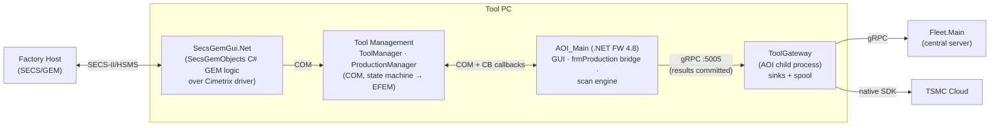
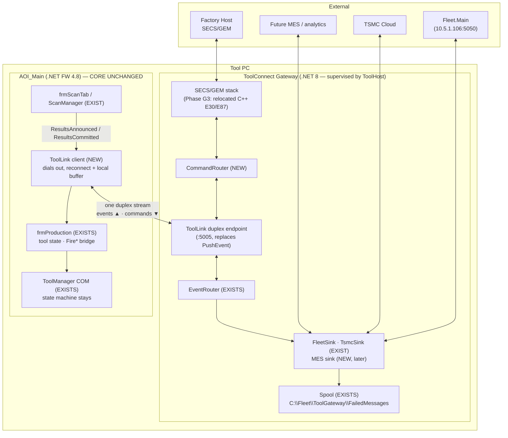
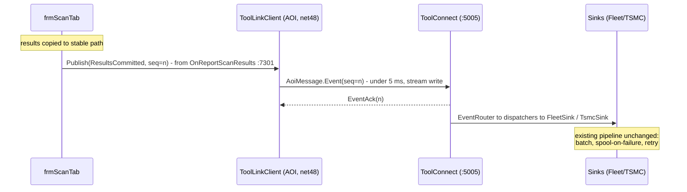
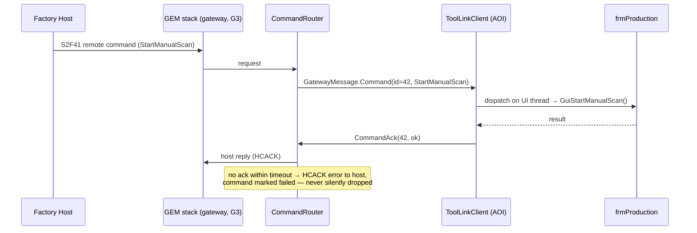
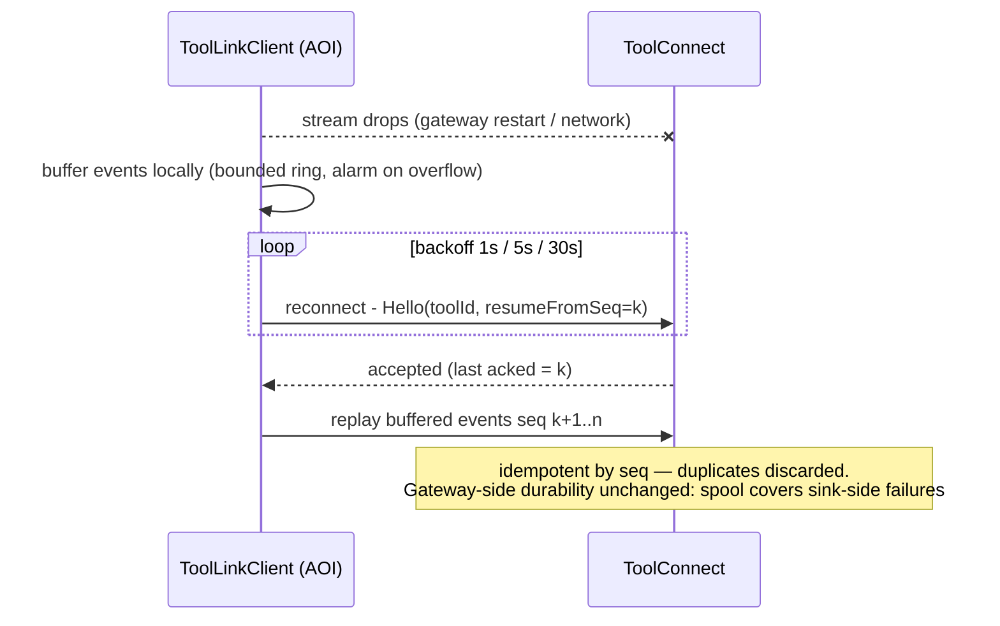
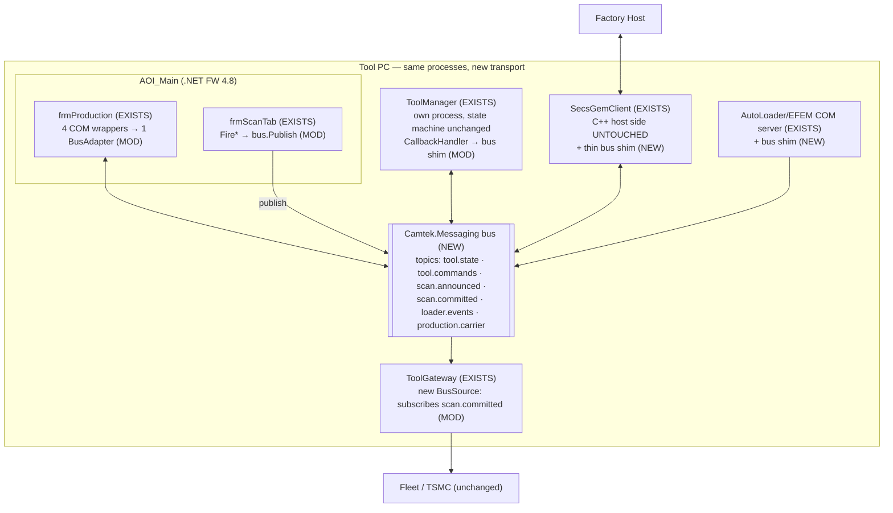
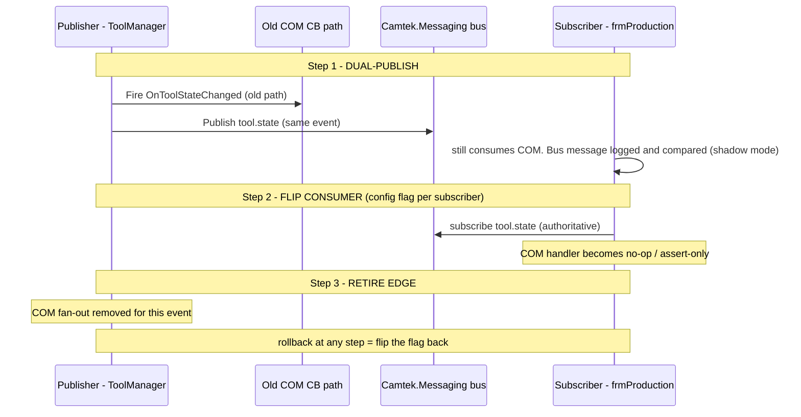
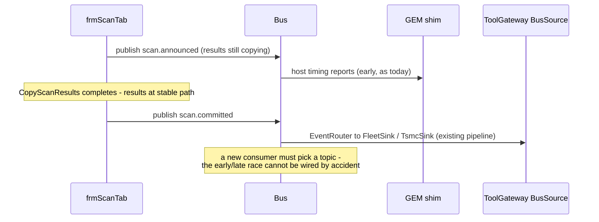
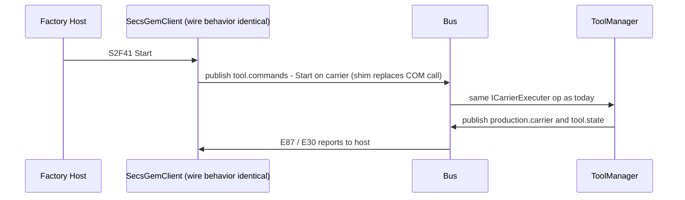
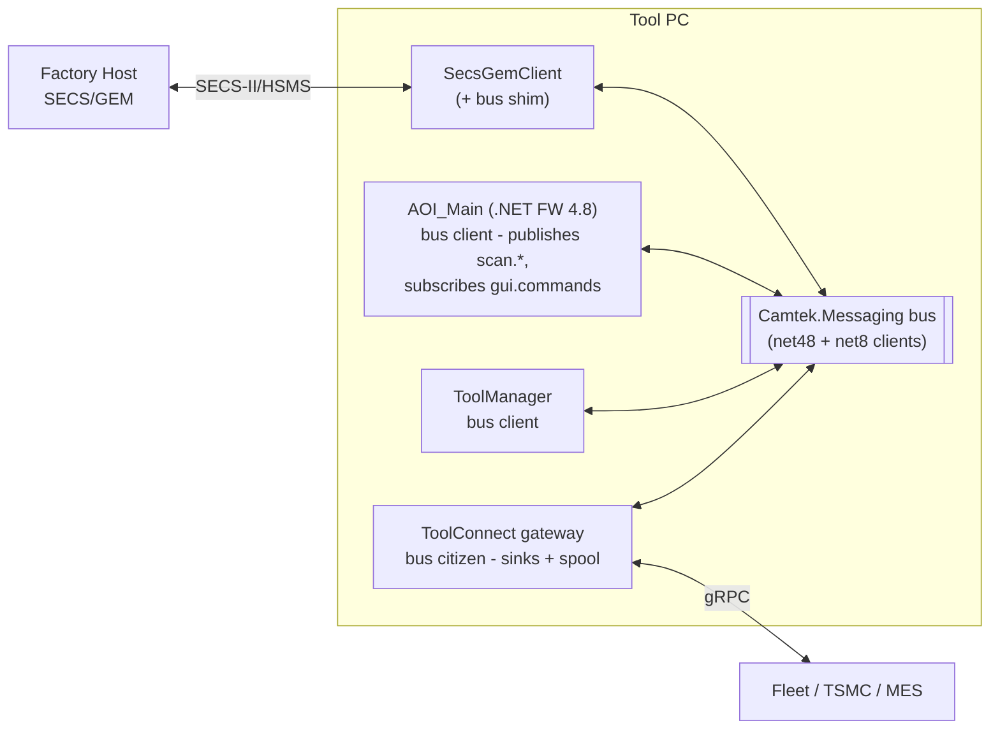

# AOI ↔ External Clients — Alternative Architectures A1 & A2

> Redesign alternatives for the AOI's integration with its external clients (SECS/GEM host, ToolGateway/Fleet/TSMC, future MES) **and** the communication protocols between them.
> **Hard constraint: AOI_Main stays .NET Framework 4.8** (WinForms, COM-hosted scan engine).
> Scope decision: **A3 (Control-Plane Extraction) was dropped** — focus is A1 and A2. A2 → A1 remains a strict progression, not two exclusive futures.
> Companion docs: [architecture-review-and-toolgateway-investigation.md](architecture-review-and-toolgateway-investigation.md), [camtek-toolhost-design.md](camtek-toolhost-design.md).
> Status: design alternatives (not approved). Date: 2026-07-16.

---

> **⚠ Revision note (2026-07-16, post-review):** an adversarial review ([a3-fused-design-review.md](a3-fused-design-review.md)) corrected two facts that this doc's A1/A2 detail sections still reflect in places: (1) the **live SECS/GEM stack is C#** — `SecsGemObjects` (E30/E87 logic) in the `SecsGemGui.Net` process over the native **Cimetrix `SECSGemDriver`** (the true fab-qualified boundary); the C++ `SecsGemClient`/`E30RemoteControl.cpp:46` is legacy, not in `Falcon_2022.sln` — host commands flow via `SecsGemObjects\Clients\RemoteControllers\RemoteControl.cs`. (2) The COM event hub (`CFalconEvents`/ScanManager/AutoCycleManager) lives in **`FalconWrapper.exe`** (out-of-proc, 5 client-process subscribers). Also: frmScanTab's real publish hooks are ~:1888-1902 and :10162 (not :7301), and today's "<5 ms fire-and-forget" is not true (see review T3). The **authoritative corrected design is [a3-fused-bus-gateway-design.md](a3-fused-bus-gateway-design.md)**; the baseline section below is corrected in place, while A1/A2 remain as historical alternatives.

# Current Architecture — Today (Baseline)

What A1/A2 are alternatives *to*. All facts verified in `C:\CamtekGit` (see companion investigation doc).

## Block diagram



Inside AOI_Main, one subtlety matters for everything that follows — scan results leave the AOI on **two different paths at two different times** (detailed below). Component-level detail (frmProduction's 4 wrappers, the `Fire*` bridge, DataServer, AutoLoader) is in the companion docs; the protocols table below carries the per-link specifics.

## Communication protocols in use

| Link | Protocol | Notes |
|---|---|---|
| Factory host ↔ tool | SECS-II/HSMS (TCP) via native Cimetrix `SECSGemDriver` | Fab-qualified wire engine; E30/E87 logic is C# (`SecsGemObjects`); host remote commands mapped in `SecsGemObjects\Clients\RemoteControllers\RemoteControl.cs` |
| GEM client / tool clients ↔ ToolManager | COM (out-of-proc) | One active tool client per `Config.ini` (`SecsGemGui.Net`, `ProductionGui.NET`, `NetTAC`, …) |
| ToolManager / ProductionManager ↔ GUI | COM + "CB" callback bus (`CallbackHandler`, `IToolManagerCB` etc., `ToolEvents.cs:50`) | Failure semantics uncharacterized (review C3) |
| Host GUI-control → frmProduction | COM CB (`IFalconExternalControlCB` → `ExternalControlCbUiWrapper`) | Only 2 commands forwarded |
| GUI → scan engine | COM (`IFalconFireEvents`, ~25 `Fire*` methods via frmProduction) | The **early** event path |
| AOI → ToolGateway | gRPC unary `PushEvent`, localhost:5005 | The **late** (stable-path) event path — from frmScanTab (~:1888-1902, :10162), bypasses frmProduction. Note: not truly fire-and-forget today — publish can block unboundedly when the gateway is down (review T3) |
| ToolGateway → Fleet.Main | gRPC (`fleetmain.proto`), remote :5050 | Spooled on failure (`C:\Fleet\ToolGateway\FailedMessages`) |
| ToolGateway → TSMC | P/Invoke native `TsmcClientShim.dll` → vendor SDK | Crash-isolated in the gateway process |
| MDC → DataServer | gRPC code-first protobuf-net, localhost:5050 | Separate concern; unchanged by A1/A2 |

## The two event paths (the load-bearing subtlety)

```
frmScanTab
 ├── frmProduction.FireWaferScanResultsAreReady()   ← EARLY: COM bus (SECS/GEM, ProductionManager)
 │        [results still being copied]
 └── post-CopyScanResults hooks (frmScanTab.cs ~:1888-1902, :10162)  ← LATE: results at stable final path
          → ToolApiPublisher.PushEvent (gRPC :5005)  → ToolGateway → Fleet / TSMC
```

Nothing in code enforces which path a new consumer must use — the distinction lives in docs and tribal knowledge.

## Weaknesses this baseline carries (from the architecture review)

| # | Weakness | Addressed by |
|---|---|---|
| C1 | Early/late event semantics implicit — a mis-wired consumer reads half-copied files | A1 (typed stream events) & A2 (`scan.announced` / `scan.committed` topics) |
| C2 | `frmScanTab` is the integration hotspot (10k+ lines, every new consumer edits it — line-7301 pattern) | A1 (one publish seam) & A2 (subscription model) |
| C3 | COM CB bus failure semantics uncharacterized (a hung subscriber can stall state callbacks) | A1 (at the external boundary) & A2 (everywhere, by construction) |
| C4 | `frmProduction` God-broker: 4 wrappers, ~1,137 lines, near-zero testability | A2 partially (wrappers → one BusAdapter); A1 leaves as-is |
| — | Inbound integration is bespoke per client (COM for host, gRPC for gateway, nothing for future MES) | A1 (single gateway surface) |

---

## 0. Ground Rules — what .NET FW 4.8 actually permits

The constraint is narrower than it looks. .NET FW 4.8 restricts *how AOI_Main hosts and speaks*, not what the rest of the tool does:

| Capability | On .NET FW 4.8 | Consequence |
|---|---|---|
| gRPC **client** | ✅ `Grpc.Net.Client` + `WinHttpHandler` (Win10 1607+/Win11), or protobuf-net.Grpc; `Grpc.Core` works but is deprecated | AOI can *call out* and hold **duplex streams** |
| gRPC **server** | ❌ effectively (only deprecated `Grpc.Core`) | AOI should **never listen** on gRPC |
| SignalR **client** | ✅ (`Microsoft.AspNetCore.SignalR.Client` supports .NET FW) | Alternative duplex channel |
| Named pipes | ✅ native | Fastest local IPC fallback |
| WCF | ✅ but legacy/being retired | Avoid for new design |
| COM | ✅ (current backbone) | Can stay *inside* the AOI process boundary |

**Design rule adopted by both alternatives — "the AOI dials out, never listens."**
Every channel is initiated by AOI_Main as a *client*; inbound commands arrive over duplex streams it opened. This sidesteps the FW-hosting limitation entirely, and is firewall/security-friendly as a bonus.

**Second rule — the event-semantics fix (review finding C1) is built into both:**
two named event classes, `ResultsAnnounced` (early, results still copying — GEM/host notifications) and `ResultsCommitted` (late, stable path — data consumers), so the current implicit early/late distinction becomes an explicit contract.

**Caution that applies to both — SECS/GEM compliance:** the fab-qualified boundary is the native Cimetrix `SECSGemDriver` wire engine; the E30/E87/E116 logic above it is C# (`SecsGemObjects` in the `SecsGemGui.Net` process). Fabs re-qualify tools when host-visible behavior changes. A2 avoids touching it; A1's later phases do not — budget host-interface re-qualification per customer there.

---

# Alternative 1 — Unified Edge Gateway ("ToolConnect")

**Idea:** grow ToolGateway into the *single* bidirectional integration surface of the tool. Every external client — SECS/GEM host, Fleet, TSMC, future MES — connects to the gateway. AOI_Main holds exactly **one duplex gRPC stream** to it (outbound-initiated, per the rule).

## A1.1 Block diagram



## A1.2 Component inventory — exists / modified / new / retired

### Reused AS-IS (already in `BIS\Sources\Utilities\ToolGateway`)

| Component | File | Role in A1 |
|---|---|---|
| `EventRouter` | `ToolGateway.BL\Sinks\EventRouter.cs` | Unchanged — fan-out to sink dispatchers |
| `SinkDispatcher` | `ToolGateway.BL\Sinks\SinkDispatcher.cs` | Unchanged — bounded channel (1000), batch 10, spool-on-full |
| `FailedMessagesHandler` (spool) | `ToolGateway.BL\EventMessages\FailedMessagesHandler.cs` | Unchanged — JSON-lines per sink, restore-on-start, ACL'd dir |
| `FleetSink` / `TsmcSink` | `ToolGateway.BL\Sinks\` | Unchanged — Fleet forward, TSMC zip+upload |
| `TsmcZipBuilder`, `TsmcSdkClient`, `TsmcClientShim.dll` | `ToolGateway.BL\Tsmc\` | Unchanged — native upload chain stays isolated in gateway |
| `FleetMainServerClientImpl` | `ToolGateway.Endpoint\Services\` | Unchanged — outbound Fleet gRPC |
| Test suite | `ToolGateway.Tests\` (xUnit + FakeItEasy) | Extended, never discarded — the only tested component in this area |
| `/health`, Serilog audit, Swagger | `Program.cs` | Unchanged |

### Modified

| Component | Today | A1 change |
|---|---|---|
| `ToolAPIGrpcServiceImpl` (`toolapi.proto`) | Unary `PushEvent` | Superseded by **ToolLink duplex** service on the same port :5005; `PushEvent` kept alive during migration (G1) then retired |
| `ToolApiPublisher` (Falcon: `system\CamtekSystem\PubSub\ToolApi\ToolApiPublisher.cs:88`) | Fire-and-forget unary push | Becomes the **ToolLink client**: persistent stream, sequence numbers, small local ring buffer for the reconnect window. Same `IPublisher` seam via `PublisherFactory` (INI-driven) — frmScanTab call sites untouched |
| `frmScanTab` hooks (`:7301` production, `:10155` non-prod) | Publish `ScanResultsReady` | Same call, now typed as `ResultsCommitted`; adds `ResultsAnnounced` publish next to `FireWaferScanResultsAreReady` for host-timing consumers (G3) |
| `frmProduction` command entry points | `GuiStartManualScan` / `GuiExportMap` invoked by `ExternalControlCbUiWrapper` (COM) | Same methods, invoked by the ToolLink command dispatcher (marshalled to the STA/UI thread) — entry points unchanged, transport swapped |
| `appsettings.json` | StartUp/Sinks/Kestrel | + `ToolLink` section (stream keepalive, replay window) and later `Gem` section (G3) |
| Project TFM | net7.0-windows (EOL) | net8.0 (prerequisite, Phase G0) |

### New

| Component | Where | Responsibility |
|---|---|---|
| `toollink.proto` | gateway `Protos\` | One duplex RPC: `rpc Link(stream AoiMessage) returns (stream GatewayMessage)`. `AoiMessage` = Hello (tool identity, resume-from-seq) \| Event (seq, `ResultsAnnounced`/`ResultsCommitted`/Error/Warning/Lcc/ToolInfo…) \| CommandAck (cmdId, result). `GatewayMessage` = EventAck (seq) \| Command (cmdId, `StartManualScan`/`ExportMap`/… ) \| Ping |
| `ToolLinkClient` | Falcon.Net (`CamtekSystem\PubSub`) | net48 gRPC client (`WinHttpHandler`); connect/retry/backoff; buffers events while disconnected (bounded, oldest-drop with alarm); resumes with `resume-from-seq` |
| `CommandDispatcher` | Falcon.Net | Receives `Command` messages, marshals to UI thread, invokes existing frmProduction/wrapper entry points, returns `CommandAck` |
| `CommandRouter` | gateway | Maps inbound host/GEM requests to `Command` messages on the stream; tracks pending acks with timeout → host error reply |
| GEM adapter (Phase G3 only) | gateway | Hosts/bridges the C++ E30/E87 engine (C++/CLI wrapper or keep `SecsGemClient` as a process talking gRPC to the gateway instead of COM to ToolManager) |

### Retired (phase-tagged)

| Component | Phase | Replaced by |
|---|---|---|
| `ToolApiPublisher` unary `PushEvent` path | G1 | ToolLink stream |
| `clsInitAOI.EnsureToolGatewayRunning` (AOI-child launch) | G1 | ToolHost child (see ToolHost design §3.5/3.6) |
| `ExternalControlCbUiWrapper` → frmProduction forwarding (2 commands) | G2 | CommandRouter → stream → CommandDispatcher |
| `CFalconExternalControl` C++ COM singleton (GUI-control role) | G2/G3 | Gateway command path |
| GEM-client link into ToolManager (`SecsGemObjects\...\RemoteControl.cs` path) | G3 | GEM adapter in gateway ↔ ToolManager via stream commands |

## A1.3 Flows

### Event up-flow (scan results)



### Command down-flow (host → GUI)



### Reconnect / replay



## A1.4 Migration phases

| Phase | Change | Risk | Re-qual? |
|---|---|---|---|
| **G0** | ToolGateway net7→net8; move under ToolHost as child | Low | No |
| **G1** | ToolLink duplex replaces unary push (events only); AOI gets `ToolLinkClient` behind existing `IPublisher` seam; keep `PushEvent` as fallback one release | Low-Med | No |
| **G2** | GUI-control commands (`StartManualScan`, `ExportMap`) move to the stream; retire `ExternalControlCbUiWrapper` forwarding | Med | Only if the host-visible behavior changes (aim: none — same GEM messages, new internal transport) |
| **G3** | Production control: E30/E87 host commands enter via gateway; `SecsGemClient` re-homed; ToolManager receives commands via stream | **High** | **Yes** — plan per-customer |

Each phase independently shippable; G3 is optional — A1 delivers most of its value at G2.

## A1.5 Pros / Cons

**Pros**
- One integration surface; adding a client = adding a sink; AOI untouched per new client.
- ~70% of the gateway already exists **with tests**; A1 is an extension, not a build-from-scratch.
- AOI core (COM, state machine, frmProduction role) unchanged through G2.
- Review findings C1 (typed events), C2 (one publish seam), C3-at-the-boundary (one supervised stream replaces COM callbacks externally) addressed.
- Composes with ToolHost (gateway = child #1).

**Cons / risks**
- Gateway enters the production-control critical path at G3 — needs ToolManager-grade reliability; stream reconnect semantics must be airtight (mitigated: seq/ack/replay protocol above).
- G3's GEM relocation is genuinely hard (E30/E87 ↔ `ICarrierExecuter` coupling) and triggers fab re-qualification.
- frmProduction God-broker (C4) not addressed — it keeps its role.

---

# Alternative 2 — Modern Local Bus (protocol swap in place)

**Idea:** keep today's topology — ToolManager singleton, tool clients, frmProduction, separate SECS/GEM process — but **replace the COM CB callback bus between processes** with a typed local pub/sub bus via one shared `Camtek.Messaging` library that compiles for **both** net48 and net8.0. Topology unchanged; nervous system replaced.

## A2.1 Block diagram



## A2.2 The bus itself (NEW)

| Decision | Choice | Rationale |
|---|---|---|
| Library | `Camtek.Messaging` — multi-targeted `net48;net8.0` | One API both worlds compile against; the *only* genuinely new code |
| Transport | Two candidates: (a) **brokerless named-pipe mesh** (each process hosts a pipe server, library handles discovery/fan-out) or (b) **embedded broker child under ToolHost** (e.g. lightweight NATS-class) | (a) = no new always-on infra, harder fan-out; (b) = simpler semantics, one more supervised child. Recommend (b) once ToolHost exists, (a) otherwise |
| Envelope | `MessageId`, `Topic`, `CorrelationId`, `ModuleId`, `Source`, `Seq`, `TimestampUtc`, `PayloadType`, `Payload` (JSON now, protobuf option later) | `CorrelationId`/`ModuleId` align with the existing UnifiedLogger convention — end-to-end traceability for free |
| Delivery | At-least-once, per-topic FIFO per publisher; handlers idempotent by `MessageId` | Matches what COM CB *implicitly* needed but never guaranteed — and it's now **written down and tested** (fixes C3 by construction) |
| Failure isolation | Subscriber timeout/exception never blocks the publisher or other subscribers (queue per subscriber, like `SinkDispatcher`) | Directly eliminates the "one slow `IToolManagerCB` stalls the state machine" class of risk |

### Topic taxonomy (initial)

| Topic | Publisher | Subscribers | Replaces |
|---|---|---|---|
| `scan.announced` (**ResultsAnnounced**) | frmScanTab (next to `FireWaferScanResultsAreReady`) | SECS/GEM shim, ProductionManager | Early COM `Fire*` event |
| `scan.committed` (**ResultsCommitted**) | frmScanTab (`OnReportScanResults`) | **ToolGateway**, future consumers | frmScanTab:7301 direct hook |
| `scan.operations` | frmScanTab, modWaferAlignment, frmVerifyTab, CmmReceiver | GEM shim, ScanManager side | ~25 `Fire*` bridge methods through frmProduction |
| `tool.state` | ToolManager | frmProduction BusAdapter (GUI reaction), GEM shim, ToolGateway (`ToolInfo`) | `IToolManagerCB.OnToolStateChanged` fan-out |
| `tool.commands` | GEM shim (host), ProductionGui/NetTAC shims | ToolManager | `SecsGemObjects\...\RemoteControl.cs` → `ICarrierExecuter` COM calls |
| `gui.commands` | GEM shim | frmProduction BusAdapter (`GuiStartManualScan`/`GuiExportMap`) | `ExternalControlCbUiWrapper` forwarding |
| `loader.events` | AutoLoader COM server shim | frmProduction BusAdapter (`WaferTypeLoaded`, `CarrierManualMappingRequired`) | `AutoLoaderUIWrapper` events |
| `production.carrier` | ProductionManager | GEM shim (E87 reports), GUI | `IProductionManagerCB` / `ICarrierExecuterCB` |

## A2.3 Component inventory — exists / modified / new / retired

### Untouched

| Component | Why safe |
|---|---|
| Cimetrix `SECSGemDriver` (native wire engine) + host-visible GEM behavior | Only the C# `SecsGemObjects` internal callout changes (shim); host wire behavior identical → **no fab re-qualification expected** |
| ToolManager state machine logic (`ChangeToolStateInternal`, `EnterProduction`…) | Same code; only its event fan-out transport changes |
| ProductionManager / `ICarrierExecuter` state models | Same |
| Scan engine (ScanManager/AutoCycleManager COM), EFEM drivers | Not on the migrated edges |
| ToolGateway sinks/spool/Fleet/TSMC chain | Only its *source* changes (subscribe vs. being pushed) |
| MDC, DataServer, RMS | Out of scope |

### Modified

| Component | Change |
|---|---|
| `frmProduction` | 4 wrappers (`ToolManagerUiWrapper`, `ExternalControlCbUiWrapper`, `AutoLoaderUIWrapper`, `CFalconEvents`) collapse into **one `BusAdapter`**; `Fire*` methods become one-line `bus.Publish(...)`; `ToolStateChanged` reacts to `tool.state`. Net effect: C4 (God-broker) *partially* dissolved — ~1,137 lines shrink substantially, logic becomes testable against a fake bus |
| `frmScanTab` | `Fire*` calls → `bus.Publish` (mechanical, ~40 sites); `:7301` hook removed (ToolGateway subscribes instead) — C2's growth pattern ends |
| ToolManager / ProductionManager | `CallbackHandler`/`ToolEvents.cs:50` fan-out → `bus.Publish`; dual-publish during migration |
| ToolGateway | New `BusSource` alongside (then instead of) `ToolAPIGrpcServiceImpl`; gRPC :5005 endpoint retained for anything external, or retired if bus-only |
| AutoLoader / other COM servers | Thin publish shims at their existing event-raise points |

### New

| Component | Notes |
|---|---|
| `Camtek.Messaging` library | The core deliverable — envelope, pub/sub API, per-subscriber queues, health/metrics counters; **ships with a contract-test kit** any edge migration must pass (ordering, timeout isolation, idempotency) |
| Broker child under ToolHost (if option b) | Supervised like any child; port/pipe local-only |
| Per-process bus shims | SecsGemClient (C++/CLI or C wrapper), AutoLoader, tool clients — each ~thin |
| Fault-injection test harness | Kill/hang/flood a subscriber, assert publisher and siblings unaffected — the C3 characterization the COM bus never had |

### Retired (edge by edge)

| COM edge | Replaced by topic |
|---|---|
| `IFalconFireEvents` (~25 `Fire*` into ScanManager/AutoCycleManager) | `scan.operations`, `scan.announced` |
| `IToolManagerCB` fan-out | `tool.state` |
| `IProductionManagerCB`, `ICarrierExecuterCB` | `production.carrier` |
| `IFalconExternalControlCB` → frmProduction (2 cmds) | `gui.commands` |
| `IAutoLoader` events → `AutoLoaderUIWrapper` | `loader.events` |
| frmScanTab:7301 → `ToolApiPublisher` direct push | `scan.committed` subscription |

## A2.4 Flows

### Edge migration pattern (applies to every edge — this is the whole method)



### Scan-results flow after migration (C1 fixed structurally)



### Host command flow (unchanged externally)



## A2.5 Migration order (risk-ascending, each edge independently shippable)

| Step | Edge | Direction | Risk |
|---|---|---|---|
| B0 | Build `Camtek.Messaging` + contract-test kit + fault-injection harness; broker under ToolHost | — | Low |
| B1 | `scan.committed`: frmScanTab publishes; ToolGateway subscribes; retire :7301 hook | one-way notify | Low |
| B2 | `scan.operations` + `scan.announced`: the ~25 `Fire*` methods | one-way notify | Low-Med (many call sites, mechanical) |
| B3 | `loader.events` | one-way notify | Low |
| B4 | `tool.state`: ToolManager fan-out → topic (dual-publish, shadow-compare, flip) | one-way notify, GUI-reactive | Med |
| B5 | `gui.commands`: retire `ExternalControlCbUiWrapper` forwarding | command | Med |
| B6 | `tool.commands` / `production.carrier`: host production control over the bus | command, production-critical | **High — do last, dual-run longest** |

## A2.6 Pros / Cons

**Pros**
- **Most incremental**: per-edge migration with dual-publish/shadow/flip/rollback at every step; no big-bang, no long branch.
- Fixes C1 (topics), C2 (subscription ends hook-growth), C3 (defined+tested semantics), and partially C4 (wrappers collapse) — the four review findings — as a side effect of the transport swap.
- **No fab re-qualification expected** — GEM wire behavior untouched.
- Everything becomes testable: frmProduction logic, ToolManager fan-out, ToolGateway source — all against a fake bus.
- Foundation for A1: once events are topics, the gateway is just another subscriber, and A1's G2/G3 become bounded steps.

**Cons / risks**
- No process/runtime modernization: COM out-of-proc hosting survives, only its nervous system is replaced; process count unchanged.
- The bus is new always-on local infrastructure (mitigated: ToolHost supervision, or brokerless pipes).
- Long dual-bus period; per-edge ordering between old COM path and new topic must be verified in shadow mode (that's what shadow mode is for).
- External clients still lack a modern front door — that's A1's job, not A2's.

---

# Comparison & Recommendation

## Weakness coverage scorecard — do A1/A2 actually solve the baseline weaknesses?

| Weakness | A1 (Edge Gateway) | A2 (Local Bus) |
|---|---|---|
| **C1 — early/late events implicit** | ✅ **Solved at G1** — stream carries typed `ResultsAnnounced`/`ResultsCommitted`; a consumer must pick one | ✅ **Solved at B1–B2** — separate `scan.announced`/`scan.committed` topics; mis-wiring becomes impossible |
| **C2 — frmScanTab hook growth** | ✅ **Solved at G1** — one publish seam; new consumers are gateway sinks, frmScanTab never edited again | ✅ **Solved at B1** — `:7301` hook deleted; new consumers subscribe. Caveat: ~40 `Fire*` call sites remain (become one-line `bus.Publish` at B2) — the *growth pattern* ends; the file's existing bulk stays |
| **C3 — CB bus failure semantics** | ⚠️ **Boundary only** — the external stream gets ack/timeout/replay semantics; the *internal* COM CB bus (ToolManager ↔ GUI) stays as uncharacterized as today | ✅ **Solved everywhere, edge-by-edge** — each migrated edge gets defined delivery semantics + fault-injection tests; fully closed only when B4 (`tool.state`) and B6 (production control) complete |
| **C4 — frmProduction God-broker** | ❌ **Not addressed** — keeps all four wrappers and its full role | ⚠️ **Partial** — 4 wrappers → 1 BusAdapter, logic testable against a fake bus, class shrinks substantially; but it still exists with its lifecycle/tool-state role (*full* dissolution was A3's job — dropped) |
| **Bespoke inbound integration** (COM for host, gRPC for gateway, nothing for MES) | ✅ **Solved** — single gateway surface; new client = new sink | ❌ **Not its job** — the bus is internal; external clients still need the gateway |

Three caveats that matter:

1. **The gaps are complementary — which is exactly why the recommendation is A2 → A1 in sequence.** A2 fixes C3 internally and dents C4; A1 fixes the external surface. Run both (A2 B0–B4, then A1 G0–G2) and every row is ✅ or the accepted-partial C4 — with no fab re-qualification, since the risky steps (B6, G3) stay optional.
2. **Timing is phase-gated.** Stopping A2 at B4 (as recommended) leaves C3 open on the production-control edges (`IProductionManagerCB`, `ICarrierExecuterCB`) until B6 is funded. Deliberate risk trade, not an oversight — those are the fab-qualified paths.
3. **What neither alternative touches** (so nobody over-promises): frmScanTab's existing 10k-line bulk, the COM out-of-proc hosting model itself, the single-instance/fixed-port assumptions (review C6), and AOI_Main's .NET FW 4.8 — the constraint, not a target.

## Risk register

### A1 — Edge Gateway

| # | Risk | Phase | L×I | Mitigation |
|---|---|---|---|---|
| A1-R1 | **Gateway enters the production-control critical path** — a gateway crash/hang while the host drives the tool means lost host control | G2 (2 GUI cmds) → G3 (full) | M×**H** | ToolHost supervision + restart; seq/ack protocol — un-acked command → HCACK error to host (never silently dropped); G2 deliberately limits exposure to 2 non-production commands |
| A1-R2 | **Stream outage event loss** — AOI's local ring buffer overflows during a long gateway outage | G1+ | L×M | Bounded buffer with overflow alarm; gateway-side spool covers all downstream failures; G1 keeps unary `PushEvent` as fallback for one release |
| A1-R3 | **net48 gRPC client quirks** — `WinHttpHandler` HTTP/2 needs TLS in some configurations; plaintext h2c support is version-sensitive | G1 | M×M | **Technical spike first** (localhost TLS with self-signed cert, or protobuf-net.Grpc/named-pipe fallback); go/no-go before G1 commits |
| A1-R4 | **Head-of-line blocking** — bulk events and time-critical commands sharing one stream | G2+ | L×M | Two streams (or priority lanes) in `toollink.proto` from day one — cheap now, expensive later |
| A1-R5 | **GEM relocation** — E30/E87 ↔ `ICarrierExecuter` coupling re-plumbed; C++ engine re-hosted; host-visible timing may shift | G3 only | M×**H** | G3 is optional and per-customer; dual-run behind a switch; budget fab re-qualification as a project line item, not a surprise |

### A2 — Local Bus

| # | Risk | Phase | L×I | Mitigation |
|---|---|---|---|---|
| A2-R1 | **Sync→async semantic drift** — COM CB callbacks are *synchronous* (publisher waits); the bus is async at-least-once. Code implicitly relying on callback completion order (e.g., GUI disabled *before* state transition proceeds) breaks subtly. **The biggest hidden risk in A2** | every edge, esp. B4/B6 | **M×H** | Per-edge semantic review before migration; shadow mode compares old/new ordering in production for a release before the flip; request/reply pattern on the bus for the few edges that genuinely need sync |
| A2-R2 | **Broker = new single point of failure** — today's COM is point-to-point with no central dependency; a dead broker silences the tool's nervous system | B0+ | L×**H** | Brokerless named-pipe option; ToolHost supervision + restart; publisher-side buffering during broker restart; per-edge rollback flag returns any edge to COM instantly |
| A2-R3 | **Idempotency retrofit** — at-least-once delivery means redelivery; legacy handlers were never written for duplicates | every edge | M×M | Envelope `MessageId` dedup in the library itself (handlers opt out, not in); contract-test kit enforces it per edge |
| A2-R4 | **UI-thread marshalling** — bus callbacks arrive on worker threads; frmProduction/GUI handlers expect the STA thread | B1+ | M×M | `BusAdapter` marshals to the dispatcher exactly as `NonBlockingUITask` does today — centralized in one place instead of per-wrapper |
| A2-R5 | **Wide mechanical regression surface** — B2 alone touches ~40 call sites across the GUI | B2 | M×L | Mechanical, reviewable pattern (one-line publish); dual-publish means the old path still works during verification |
| A2-R6 | **Dual-bus period drags on** — edges stall mid-migration, leaving two half-buses indefinitely | program | M×M | Each edge is small and independently shippable — enforce "an edge started is an edge finished" per release; track retired-COM-interface count as the program KPI |

### Shared / program-level

| # | Risk | Mitigation |
|---|---|---|
| S-R1 | **Test culture gap** — both designs *depend* on new tests (contract kit, fault injection), but only ToolGateway has a test culture today | Make the contract-test kit a deliverable of B0/G0, not an afterthought; no edge/phase merges without passing it |
| S-R2 | **Anything host-visible risks fab re-qualification** — even "internal-only" changes can shift host-observable timing | Freeze host-visible behavior as an explicit acceptance criterion per phase; GEM message/timing regression capture before/after (record-replay against the GEM client / Cimetrix driver boundary) |
| S-R3 | **Program collision with ToolHost** — both touch deployment and supervision | Sequence explicitly: ToolHost Phase 1 (or at least the supervision pattern) lands before A2's broker / A1's G0 need a home |
| S-R4 | **Skill/ownership split** — COM veterans vs. the new messaging/gRPC stack | The multi-targeted library (`net48;net8.0`) keeps one codebase both groups own; pair the edge migrations |

### Risk-profile summary

The two alternatives carry **opposite risk shapes**: **A2's risk is front-loaded, granular, and reversible** — many small steps, each with a rollback flag, dominated by the subtle sync→async drift (A2-R1) which shadow mode is designed to catch. **A1's risk is back-loaded and concentrated** — G0–G1 are cheap, G2 is moderate, and G3 holds most of the alternative's total risk in one step (A1-R5), which is why it's optional. The sequenced plan (A2 B0–B4 → A1 G0–G2) is also the *risk-minimal* path: it defers both H-impact concentrations (B6, G3) until there's a customer-driven reason and a proven bus/stream underneath them.

## Option comparison

| | **A1 — Edge Gateway** | **A2 — Local Bus** |
|---|---|---|
| Topology | Gateway grows; AOI core intact | Unchanged (transport swap) |
| New code | ToolLink proto/client/dispatcher, CommandRouter (+GEM adapter at G3) | `Camtek.Messaging` + shims |
| Reuse | ~70% of gateway exists, with tests | All processes exist; bus is the only build |
| AOI_Main impact | Small (client + dispatcher; entry points unchanged) | Medium but mechanical (wrappers→adapter, Fire*→publish) |
| SECS/GEM | Relocated at G3 → **re-qual** | Untouched → **no re-qual** |
| C1 / C2 / C3 / C4 | ✅ / ✅ / boundary-only / ✗ | ✅ / ✅ / ✅ everywhere / partial |
| New external clients | ✅ add a sink | ⚠️ still gateway's job |
| Kill-switch / rollback | Per phase (G1–G3) | Per edge (B1–B6, flag-flip) |
| Effort / Risk | M / M (G0–G2), H at G3 | M spread thin / **L-M** |

**Recommendation — sequence them, don't choose:**

1. **A2 first (B0–B4):** lowest risk, fixes all four review findings' worst instances, no re-qualification, and makes every later step easier.
2. **A1 G0–G2 next:** the gateway subscribes to the bus (its BusSource *is* B1), then takes over GUI commands. External surface modernized; still no GEM move.
3. **A1 G3 / A2 B6 (production control) last and optional** — the only steps touching fab-qualified behavior; do them only with a customer-driven reason, per site, behind dual-run.

---

# Follow-up Analyses

## F1 — Can A1 run without A2 first?

**Yes, through G2 — the A2-first ordering is a preference, not a dependency.** Honest accounting:

### What A1-standalone genuinely doesn't need

- **G0** (net8 + ToolHost child): fully independent.
- **G1** (ToolLink duplex replaces unary push): swaps one existing seam (`IPublisher`/`PublisherFactory`); frmScanTab call sites already exist. No bus involved.
- **G2** (2 GUI commands over the stream): replaces `ExternalControlCbUiWrapper` forwarding; independent of any internal transport.

### What skipping A2 costs

| Cost | Detail |
|---|---|
| Internal findings stay open | C3 (COM CB semantics) remains uncharacterized *inside* the tool; C4 (frmProduction's 4 wrappers) untouched; the ~25 `Fire*` early path stays COM |
| **G3 becomes architecturally ugly** | Without a bus, host production commands must reach ToolManager either **through the AOI GUI process** (gateway → ToolLink stream → CommandDispatcher → `ToolManagerUiWrapper` COM) — routing production control through the operator GUI, *worse than today's* direct GEM-client→ToolManager COM path — or via a **bespoke gateway↔ToolManager channel**, i.e., hand-building point-to-point what A2's bus provides generically |
| Small rework later | If A2 follows A1, the gateway's stream source gets refactored to a BusSource (bounded, not wasted — the sinks/spool don't change) |
| Instruments arrive late | A2's B0 deliverables (contract kit, shadow comparator, fault injection) are what make *every* later step safe; A1-first means building stream-specific tests only |

### When A1-first is the right call

- The near-term driver is **external**: an MES integration commitment, a new fab host variant, a Fleet feature — A2 delivers nothing externally visible.
- The org can only staff **one bounded team** (gateway team) — A2's edge migrations need cooperation from GUI + ToolManagement owners; A1 G0–G2 doesn't.
- **Decision rule:** A1-first is legitimate *if G3 is firmly out of scope*. The moment production-control-via-gateway enters the roadmap, do A2 (at least `tool.commands`/`tool.state` edges) before G3 — never route production control through the GUI process.

## F2 — "A3" as the fusion of A1 + A2 (combined target architecture)

Not the dropped control-plane-extraction A3 — a new one: **the bus is the tool's only internal fabric, and the gateway is just a bus citizen bridging to the outside world.** This is more than running A1 and A2 side by side — the combination *deletes a component*: **ToolLink becomes unnecessary.**



In the sequential plan, A1-G1 builds a dedicated AOI↔gateway duplex gRPC stream (ToolLink). In the fused design that channel is redundant: AOI publishes `scan.committed` to the bus; the gateway *subscribes*; host commands travel gateway → `gui.commands`/`tool.commands` topics → AOI/ToolManager subscribers. One transport concept instead of two.

| | Sequential A2 → A1 | Fused "A3" |
|---|---|---|
| AOI↔gateway channel | ToolLink duplex gRPC (built in G1) | **None — the bus is the channel** |
| A1-R3 (net48 gRPC duplex spike) | Must be resolved | **Eliminated** (AOI is only a bus client; `Camtek.Messaging` targets net48) |
| A1-R4 (head-of-line blocking) | Needs two streams | **Eliminated** (per-topic queues native to the bus) |
| Code volume | Bus + shims + ToolLink proto/client/dispatcher | Bus + shims only |
| Workstream independence | Gateway team can ship A1 G1–G2 alone | Everything gated on the bus landing first |
| Bus criticality | Internal events only | **Internal + external boundary** — a bus outage now also silences Fleet/TSMC (A2-R2 impact grows); gateway spool semantics must compose with bus delivery (subscriber-side ack/replay) |
| Early external value | A1 G1 deliverable without touching GUI teams | Nothing external until B0–B1 land |

**Verdict:** the fused A3 is the **better end-state** — fewer moving parts, two full risk items deleted, one transport concept. The sequential plan is the **better road** — independent workstreams, earlier external value, rollback per step. And they are not in conflict: **run the sequence, but make A1-G1 decision-aware** — if A2-B0/B1 are already funded and landing first, *skip building ToolLink* and let the gateway's first AOI-facing interface be the BusSource. The only scenario that truly needs ToolLink is F1's "A1-first, A2 never" world.

**Revised recommendation incorporating F1/F2:** commit to the fused A3 as the target picture; execute it as A2 B0–B1 → gateway BusSource (skipping ToolLink) → A1 G2 semantics over bus topics → remaining A2 edges B2–B4. Decide up front which world you're in — "bus is coming" (skip ToolLink) or "gateway only" (build ToolLink) — because building ToolLink and then retiring it is the one combination that wastes real work.
