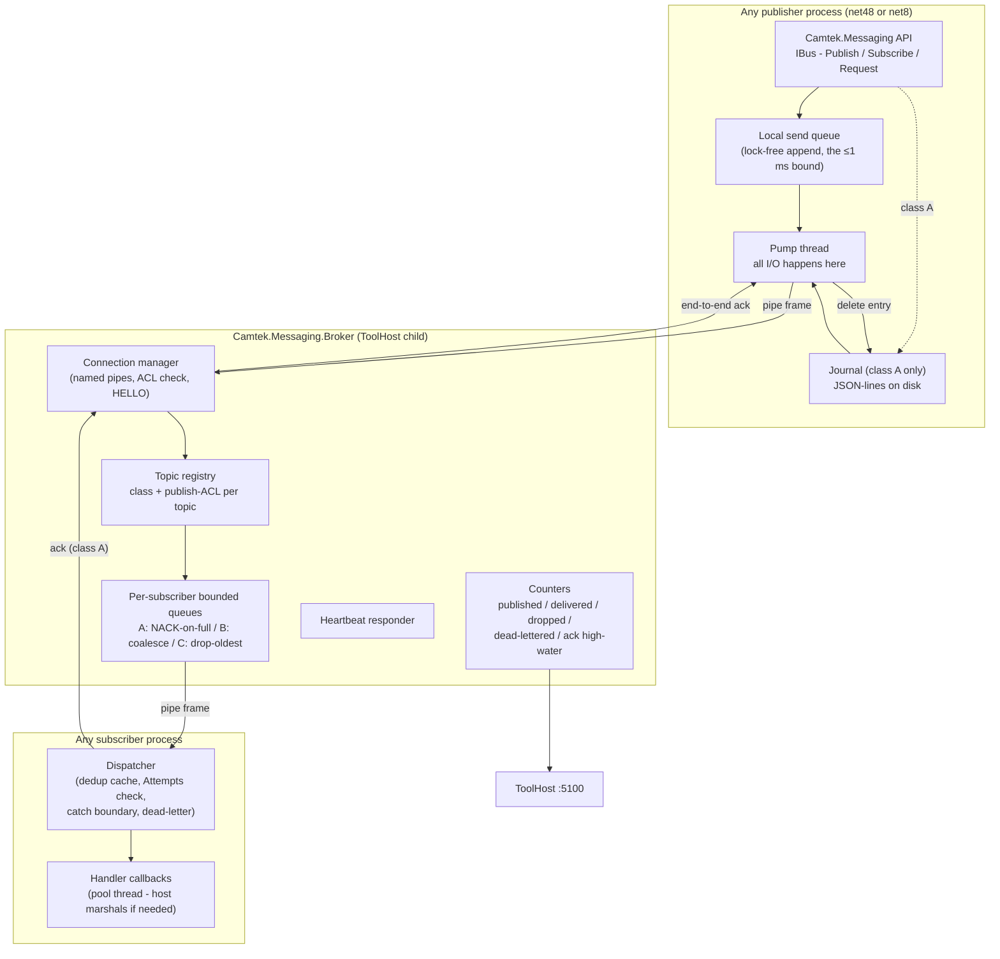
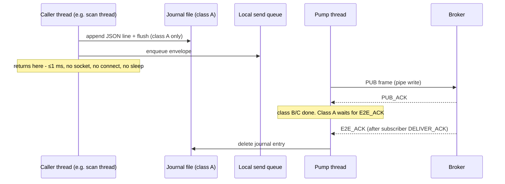
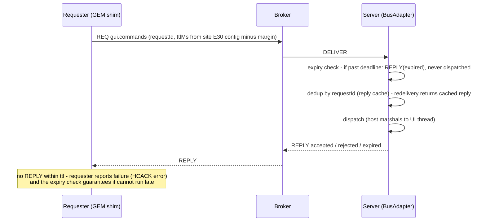

# Camtek.Messaging — Bus Fabric Detailed Design

> Implementation-level design for the `Camtek.Messaging` bus — the internal fabric of the fused A3 architecture ([a3-fused-bus-gateway-design.md](a3-fused-bus-gateway-design.md), §3–§4).
> This document zooms from the architecture level down to: library layout, API, wire protocol, broker internals, the class-A ack/journal protocol, threading, security, and the test kit.
> **Status: proposed — nothing here exists in the repo today.** Prior art it supersedes: `CamtekSystem\PubSub` (MSMQ + `IPublisher`/`PublisherFactory`).
> Constraints inherited: multi-target `net48;net8.0`; binary-drop delivery to `c:\bis\bin` + `c:\bis\bin\x64`; publish bound ≤1 ms; durability classes A/B/C/R-R; broker as ToolHost child; localhost-only with ACLs.
> Date: 2026-07-16.

---

## 1. Scope

**Is:** a typed pub/sub + request/reply message layer for **one machine** — the transport that replaces the COM CB callback web between the tool's processes. First adopter: the tool-management/gateway edges of the fused A3 design. **Designed from day one as a machine-wide fabric** — other subsystems (DDS, machine layer, EBI, CMM…) are expected to adopt it for their COM event/command boundaries over time (§12).

**Is not:** a network bus (localhost/named-pipe only) · a persistence service (durability lives at the edges: publisher journal, gateway spool) · an orchestrator (no routing logic beyond topic matching) · a serialization framework (JSON v1, pluggable later) · **a COM replacement for everything** — it replaces *events and commands*, not COM object models (§12.3).

Design drivers (from the adversarial review): hard publish bound (fixes today's unbounded `ToolApiPublisher` path), per-subscriber isolation (fixes the COM CB stall class), explicit ack contract (no silent loss), poison-message containment, field diagnosability. Plus one from the machine-wide ambition: **language-neutral wire protocol** — the protocol must be implementable from native C++ (§12.2), which is why it is length-prefixed JSON frames over a named pipe and nothing fancier.

---

## 2. Architecture

Three deliverables: the **client library** (linked into every process), the **broker** (one child process under ToolHost), and the **test kit** (contract tests + fault injection, shipped with the library).



### 2.1 Projects and packaging

```
Sources\Messaging\
  Camtek.Messaging\              net48;net8.0  — client API, queue, pump, journal, dedup, request/reply
  Camtek.Messaging.Contracts\    net48;net8.0  — envelope, topic descriptors, payload DTOs (no logic)
  Camtek.Messaging.Broker\       net8.0        — broker host (console; ToolHost child)
  Camtek.Messaging.TestKit\      net48;net8.0  — contract-test base classes + fault-injection harness
  Camtek.Messaging.Tap\          net8.0        — bus-tap recorder CLI (diagnostics)
  Camtek.Messaging.Tests\        net8.0        — unit + protocol tests (xUnit + FakeItEasy, per ToolGateway precedent)
```

Packaging: post-build drop of the net48 binaries to `c:\bis\bin` **and** `c:\bis\bin\x64` (AOI_Main builds both bitnesses); broker + net8 binaries deploy with ToolHost. `TreatWarningsAsErrors` per repo props. Dependencies kept to what net48 tolerates as loose DLLs: `Newtonsoft.Json` (already everywhere in the repo), `System.Threading.Channels` (netstandard2.0 package — works on net48) — nothing else.

---

## 3. Public API (C# sketch)

```csharp
public interface IBus : IDisposable
{
    // Fire-and-forget publish. Hard bound: returns in ≤1 ms (enqueue only, never I/O).
    // Class A topics: the envelope is journaled to disk BEFORE this returns.
    void Publish<T>(Topic topic, T payload, PublishOptions options = null);

    // Subscribe with an async handler. Handler runs on a pool thread —
    // the HOST marshals to STA/UI if it needs to (BusAdapter's job, not the library's).
    ISubscription Subscribe<T>(Topic topic, Func<BusMessage<T>, Task> handler,
                               SubscribeOptions options = null);

    // Request/reply (commands). Ttl is mandatory; expired requests are never dispatched.
    Task<Reply> RequestAsync<T>(Topic topic, T payload, TimeSpan ttl,
                                CancellationToken ct = default);

    // Reply-side registration (e.g. BusAdapter serving gui.commands).
    ISubscription Serve<T>(Topic topic, Func<BusMessage<T>, Task<Reply>> handler);

    BusHealth Health { get; }          // connected, heartbeat age, queue depths, journal backlog
    IBusCounters Counters { get; }     // per-topic published/delivered/dropped/deadlettered
}

public static class BusFactory
{
    // Reads toolbus.json (broker pipe name, journal root, process identity).
    public static IBus Connect(string sourceName, BusConfig config = null);
}
```

Topics are **declared, not stringly-typed** — one static registry in `Camtek.Messaging.Contracts`:

```csharp
public static class Topics
{
    public static readonly Topic ScanCommitted =
        Topic.Define("scan.committed", DurabilityClass.A, typeof(ScanCommittedPayload),
                     publishers: Acl.AoiMain);
    public static readonly Topic ToolState =
        Topic.Define("tool.state", DurabilityClass.B, typeof(ToolStatePayload),
                     publishers: Acl.ToolManager);
    public static readonly Topic GuiCommands =
        Topic.Define("gui.commands", DurabilityClass.RR, typeof(GuiCommandPayload),
                     publishers: Acl.GemShim | Acl.Gateway);
    // ... scan.announced, scan.operations, tool.telemetry, tool.commands,
    //     loader.events, production.carrier
}
```

The descriptor carries the durability class, payload type, and publish ACL — so misuse (publishing `tool.commands` from an unauthorized process, putting a file path into `scan.announced`) fails at the library/broker boundary, not in review comments.

---

## 4. Envelope

JSON v1 (field-readable at 3am; protobuf is a later per-topic opt-in):

```json
{
  "messageId":   "0193f2a1-...",         // GUID — dedup key
  "topic":       "scan.committed",
  "correlationId": "wafer-BH01-20260716-0042",  // UnifiedLogger-aligned
  "moduleId":    "frmScanTab",
  "source":      "AOI_Main",              // process identity from HELLO
  "seq":         18734,                    // per-source monotonic — ordering + loss detection
  "timestampUtc":"2026-07-16T11:02:03.412Z",
  "schemaVersion": 1,                      // additive-only evolution; ignore unknown fields
  "ttlMs":       null,                     // commands only
  "attempts":    0,                        // incremented per delivery attempt (poison detection)
  "payloadType": "ScanCommittedPayload",
  "payload":     { "...": "..." }
}
```

Evolution rules (enforced by the TestKit, because ToolHost makes mixed-version processes the steady state): additive-only field changes; consumers must ignore unknown fields; `schemaVersion` bumps only on additive changes; breaking changes require a **new topic**.

---

## 5. Wire Protocol

Transport: **named pipes** (`\\.\pipe\camtek.bus`), length-prefixed JSON frames. One duplex pipe per process; multiplexed by frame type. Chosen over TCP-localhost for one reason: **Windows pipe ACLs give authenticated, per-account access control for free** (§8).

| Frame | Direction | Purpose |
|---|---|---|
| `HELLO` | client → broker | Process identity + credentials (implicit via pipe), declared subscriptions, `resumeFromSeq` per class-A topic |
| `SUB` / `UNSUB` | client → broker | Subscription management |
| `PUB` | client → broker | One envelope |
| `PUB_ACK` | broker → client | Broker accepted (enqueued to all matched subscriber queues) — sufficient for classes B/C |
| `DELIVER` | broker → client | Envelope to a subscriber |
| `DELIVER_ACK` | client → broker | Subscriber processed (class A) — forwarded to publisher as `E2E_ACK` |
| `E2E_ACK` | broker → publisher | Class A end-to-end confirmation → journal entry deleted |
| `NACK` | broker → publisher | Class-A subscriber queue full / no subscriber → entry stays in journal |
| `REQ` / `REPLY` | both | Request/reply with `requestId` + `ttlMs` |
| `PING` / `PONG` | both | Application-level heartbeat (detects hung-but-alive broker) |

Frame limit 1 MB (payloads are metadata + paths, never bulk image data — bulk stays on disk, the bus carries *pointers*).

---

## 6. Client Internals

### 6.1 Publish path (the ≤1 ms bound)



- The caller thread touches **only** the journal append (measured; a local NTFS append+flush of a <4 KB line is well under 1 ms) and a lock-free queue. All pipe I/O, reconnect, backoff live on the pump thread.
- **Disconnected/broker-down:** enqueue continues; class A accumulates in the journal (disk-bounded, alarmed via counters), B/C in the bounded memory queue (coalesce/drop per class). On reconnect, `HELLO(resumeFromSeq)` + journal replay; `messageId` dedup on the subscriber side absorbs overlaps.
- Journal format = the proven `FailedMessagesHandler` JSON-lines pattern, one file per class-A topic: `C:\Camtek\Bus\Journal\<source>\<topic>.jsonl` (+ `.deadletter.jsonl`).

### 6.2 Subscriber dispatch

Per subscription: bounded in-process queue → dispatcher loop → handler. The dispatcher owns the safety obligations:

1. **Dedup** — LRU cache of `messageId` (size- and time-bounded).
2. **Expiry** — `REQ` frames past `timestampUtc + ttlMs` are discarded + `REPLY(expired)` — never dispatched (the late-execution fix).
3. **Catch boundary** — a handler exception is logged + counted, **never** escapes to kill the process.
4. **Poison containment** — `attempts >= N` (default 5) → envelope appended to the dead-letter file + alarm counter; not retried.
5. **Threading** — handlers run on pool threads. STA/UI marshaling is explicitly the host's job (frmProduction's BusAdapter wraps its handlers in the dispatcher-invoke it already uses today). The library documents this loudly rather than guessing.

---

## 7. Broker Internals

Single net8 console process, ToolHost child, no config mutation at runtime.

- **Connection manager:** pipe server, one duplex connection per process; identity = pipe-authenticated account + `HELLO.sourceName`; rejects publishes that violate the topic's publish ACL.
- **Per-subscriber queues:** `Channel<Envelope>` per (subscriber, topic), bounded:
  - **Class A** — capacity hit → `NACK` to publisher (message stays in *publisher's* journal; broker memory can't be exhausted by the guaranteed-slow gateway).
  - **Class B** — coalesce: replace queued value per key (topic default: whole topic; optional per-carrier key).
  - **Class C** — drop-oldest + increment `dropped` counter (never silent).
- **No broker persistence** — deliberate. Durability lives in publisher journals; the broker restart story is "clients reconnect and replay." Keeps the broker small enough to essentially never change (its updates silence the fabric, so rarity is a feature — maintenance-window-only).
- **Heartbeat:** `PING/PONG` with a monotonic token; ToolHost's health probe calls a broker self-check endpoint (pipe frame, not HTTP) — detects a hung event loop, not just process death.
- **Counters:** per-topic published/delivered/dropped/dead-lettered/NACKed + per-source `seq` high-water marks, exposed to ToolHost (:5100) — the field engineer's "where is my event" answer.

Sizing reality check: the tool's event rate is *low* (per-wafer events, state transitions — tens per second peak, not thousands). The design optimizes for **latency bound, isolation, and diagnosability**, not throughput; every buffer can be small.

---

## 8. Security

| Layer | Mechanism |
|---|---|
| Transport | Named pipe with explicit ACL: ToolHost service account + the interactive AOI user account only. No TCP listener exists |
| Publish authorization | Per-topic ACL in the topic descriptor, enforced by the broker at `PUB` (identity from the authenticated pipe). `*.commands` topics: GEM shim + gateway CommandPublisher only |
| Subscribe authorization | Default open (local, authenticated); `*.commands` subscription restricted to declared consumers |
| Gateway REST :5006 | May publish **non-command** topics only (diagnostic surface); command intake goes exclusively through the gateway's validated/authorized/audited CommandPublisher (:5007) |
| Audit | Command publishes and ACL rejections logged with `correlationId` (UnifiedLogger) |

This is the answer to the review's M2: without it, any local process could drive the tool state machine.

---

## 9. Request/Reply Protocol



Semantics fixed by the review: **reply = accepted/dispatched, never completed** (matches today's `async void` reality); completion is a separate event on a notify topic. The reply cache gives at-most-once *effect* over at-least-once *delivery*.

---

## 10. Diagnostics

- **Counters via ToolHost :5100** — per-topic, per-source; the support one-liner: `toolhost bus-status` → table of published/delivered/dropped/dead-lettered + journal backlog + seq gaps.
- **Bus-tap** (`Camtek.Messaging.Tap`) — wildcard subscriber CLI that records envelopes to a rolling file; the "wireshark of the tool." Read-only, refused for `*.commands` payload bodies unless elevated.
- **Dead-letter files** — JSON-lines next to the journals; a support engineer can read and (deliberately, manually) re-inject.
- **Correlation** — every shim (including the C# GEM shim) stamps `correlationId`/`moduleId`; one wafer traces from `frmScanTab` publish through broker delivery to the TSMC upload audit log.
- Journal/dead-letter replay ordering is by **`seq` per source**, never by timestamp (immune to NTP steps — review finding).

## 11. Test Kit (ships with the library — no edge migrates without it)

Contract assertions every topic/edge must pass:

| # | Assertion |
|---|---|
| 1 | Publish returns ≤1 ms at p99.9 under broker-down, broker-slow, broker-hung |
| 2 | Per-source FIFO preserved per topic; `seq` gaps detected and counted |
| 3 | Duplicate delivery absorbed (dedup) — handler side-effects once |
| 4 | Slow/hung/crashing subscriber never delays publisher or sibling subscribers |
| 5 | Class A: zero loss across broker kill, broker restart, publisher crash+restart, subscriber outage (verified by **end-to-end delivery count**) |
| 6 | Class B coalesces; class C drops are counted, never silent |
| 7 | Expired command never dispatched; redelivered command answered from reply cache |
| 8 | Poison message dead-letters after N attempts; process survives handler exceptions |
| 9 | Unknown envelope/payload fields ignored (mixed-version tolerance) |
| 10 | ACL: unauthorized publish rejected + audited |

Fault-injection harness: scriptable broker (delay/drop/kill/hang per frame type) + a mock slow subscriber — used both in CI and in the P0 torture test (whose pass criteria are assertions 1, 4, 5 under sustained load).

## 12. Fabric-Wide Adoption — Replacing COM Beyond Tool Management

The first program (fused A3) migrates the tool-management edges, but the bus is deliberately designed so **any COM event/command boundary in the BIS suite** can adopt it. This section is what makes that a design property instead of an aspiration.

### 12.1 Topic namespace governance

Topics are namespaced by subsystem, and contracts are per-subsystem assemblies so teams version independently:

| Namespace | Owner | Example topics | Contracts assembly |
|---|---|---|---|
| `scan.*`, `tool.*`, `gui.*`, `loader.*`, `production.*` | Tool management (this program) | as §3 | `Camtek.Messaging.Contracts` (core) |
| `dds.*` | DDS / algorithms | `dds.frame.processed`, `dds.defects.batch` | `Camtek.Messaging.Contracts.Dds` |
| `machine.*` | Machine layer | `machine.efem.state`, `machine.safety.alarm` | `Camtek.Messaging.Contracts.Machine` |
| `cmm.*` | CMM | `cmm.measurement.completed` | `Camtek.Messaging.Contracts.Cmm` |
| `ebi.*` | EBI | — | `Camtek.Messaging.Contracts.Ebi` |

Rules: a subsystem may only *publish* into its own namespace (ACL-enforced, same mechanism as §8); cross-subsystem consumption is subscription, never a reverse publish; new namespaces register a durability class + ACL per topic like everyone else. The broker is namespace-agnostic — no code change to add one.

### 12.2 Native C++ client binding

The machine layer and DDS are native C++ — a .NET-only client would wall off exactly the processes with the worst COM entanglement today. Therefore:

- The wire protocol (§5) is deliberately trivial to implement natively: named pipe + 4-byte length prefix + UTF-8 JSON. No gRPC, no protobuf codegen, no .NET-specific framing.
- Deliverable added: **`camtek_bus.dll`** — a flat-C client (`bus_connect`, `bus_publish`, `bus_subscribe` with a callback, `bus_request`) wrapping the same queue/pump/journal model; C++ header ships beside it. Internally shares the protocol conformance test suite with the .NET client.
- The journal and dedup logic live client-side, so the C client must implement them too for class-A topics — **or** native publishers restrict themselves to class B/C initially (recommended first step; class-A native support is a later increment).
- COM shims already planned (AutoLoader, FalconWrapper transitional bridge) use this same binding where the host process is native.

### 12.3 What maps well — and what the bus must NOT be used for

Honest fit table, so adoption doesn't turn the bus into a bad COM:

| COM usage pattern today | Bus fit | Guidance |
|---|---|---|
| Event fan-out (`I*CB` callbacks, `Fire*` hubs) | **Excellent** | Topic per event family; this is the bus's reason to exist |
| Command + ack (host remote commands, GUI commands) | **Good** | Request/reply with Ttl (§9) |
| Synchronous state queries (`GuiCurrentLotId`…) | **Acceptable** | Request/reply; consider a class-B "state snapshot" topic instead when polled frequently |
| Fine-grained COM object models (create object, set 12 properties, call 8 methods — e.g. Job/recipe object graphs) | **Poor — do not migrate to the bus** | Stays COM, or becomes a real RPC API (gRPC on the .NET 8 side). A bus is not an object broker |
| Bulk data (images, frames, defect maps) | **Never on the bus** | Bus carries *pointers* (paths / shared-memory handles); 1 MB frame cap is a hard rule. DDS keeps its data plane; the bus is its *control/notification* plane only |
| Singleton activation/lifetime (`ComSingletonHolder`, ROT registration) | **Out of scope** | Process lifetime is ToolHost's job; the bus assumes processes exist |

### 12.4 Rate tiers

Tool-management traffic is tens of messages/second. DDS-class adopters change the envelope: per-frame notifications can reach **hundreds–thousands/second in bursts**. The design accommodates this without redesign, with two explicit tiers:

| Tier | Topics | Envelope | Broker handling |
|---|---|---|---|
| Control (default) | everything in §3 | JSON | as designed |
| High-rate (opt-in per topic) | `dds.frame.*`-class | JSON with pre-serialized payload pooling; protobuf opt-in becomes *required* here | Class C only; larger fixed-size ring per subscriber; counters sampled |

High-rate topics are **class C by definition** — if a subsystem needs guaranteed per-frame delivery, that is a data-plane problem (files/shared memory), not a bus problem. This line is what keeps the broker simple forever.

### 12.5 Adoption sequence (indicative, after fused-A3 P3)

1. **Machine layer alarms/state** (`machine.safety.alarm`, `machine.efem.state`) — natural class B/C, native C client's first user, replaces hardware-event COM callbacks into the GUI.
2. **CMM notifications** — currently gRPC receiver + `Fire*` into frmProduction; collapses to one topic.
3. **DDS control plane** — job start/stop/progress notifications (not frame data).
4. **EBI** — its gRPC hosts are already message-shaped; evaluate whether the bus or their existing gRPC is the better fit per edge (don't migrate for migration's sake).

Each adoption is its own funded mini-program with the same gate: contract kit + fault injection + dual-publish shadow + rollback flag. The TestKit and the migration pattern are subsystem-agnostic on purpose.

## 13. Open Decisions

1. **Broker build vs. embed** (NATS-class) — the protocol above is small enough to build; embedding trades code for a licensing/fab-qualification review. P0 decides with the torture test + procurement.
2. **Journal fsync policy** — flush-per-append (safest, still <1 ms) vs. batched flush (faster, small crash window). Measure in P0 on tool-grade disks.
3. **Class-B coalesce keys** per topic (whole-topic vs. per-carrier for `production.carrier`).
4. **Dead-letter re-injection tool** UX — manual CLI only (recommended) vs. ToolHost API.
5. **Bus-tap retention** — rolling size/time budget on a tool PC disk.
