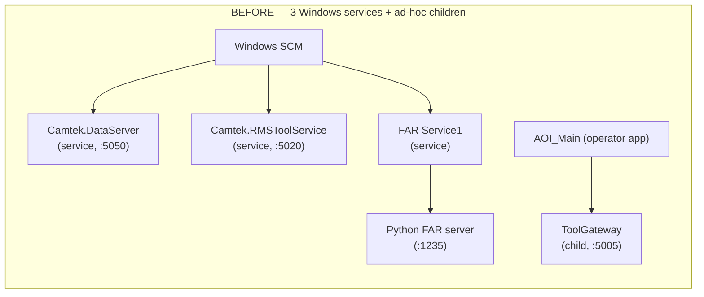
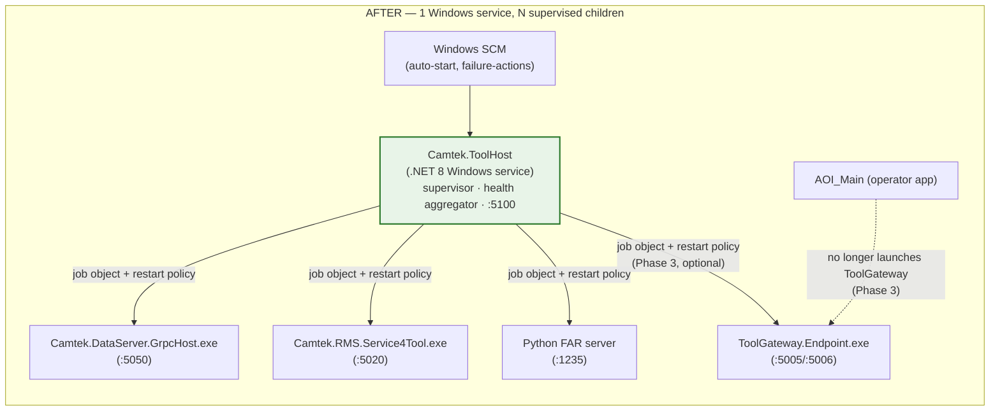
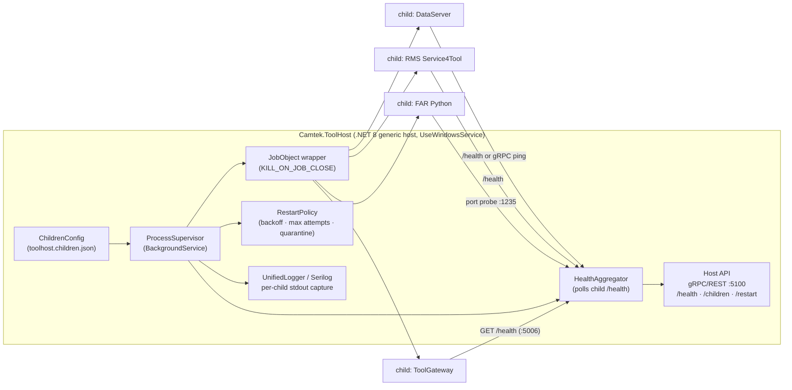
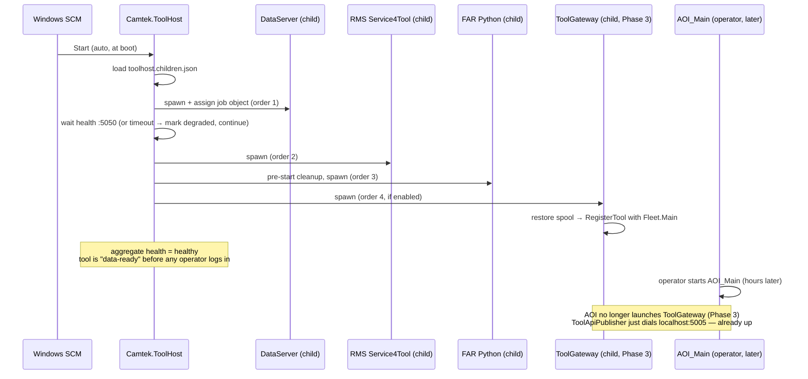
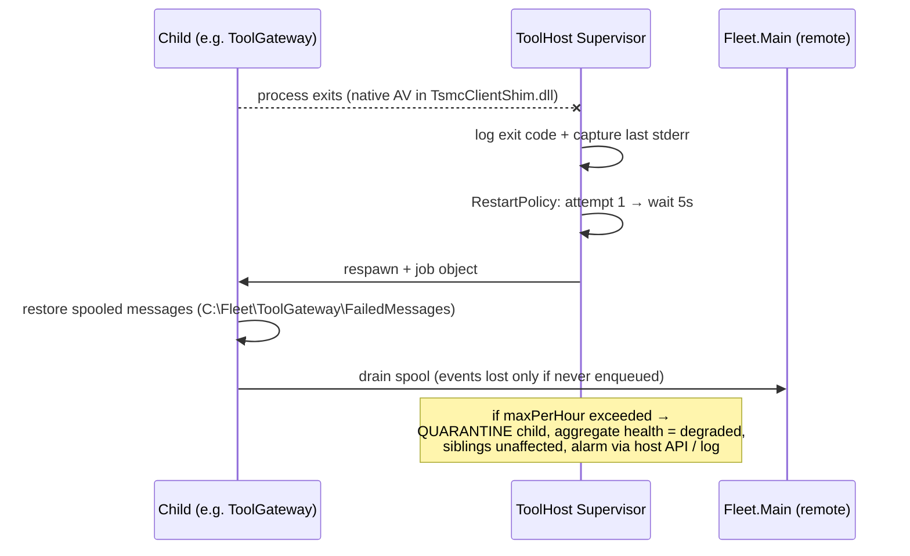
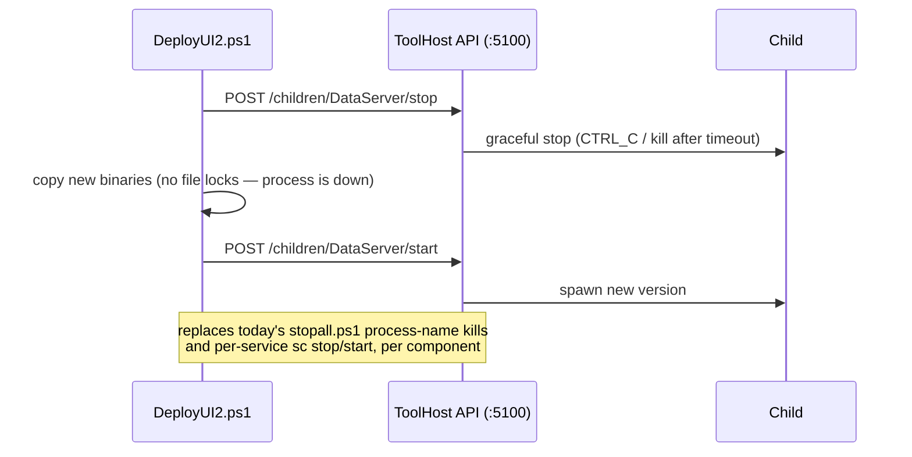
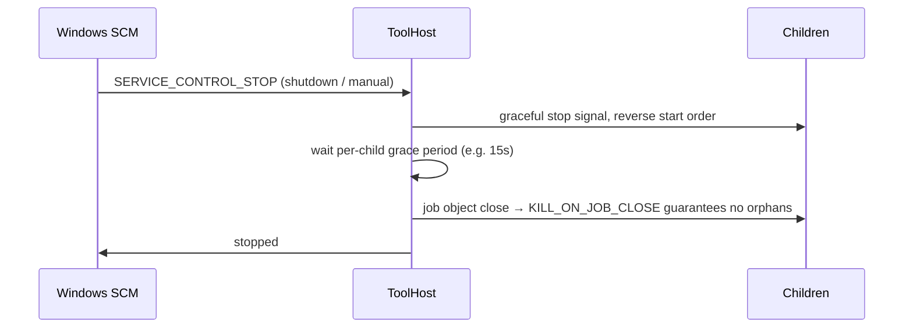
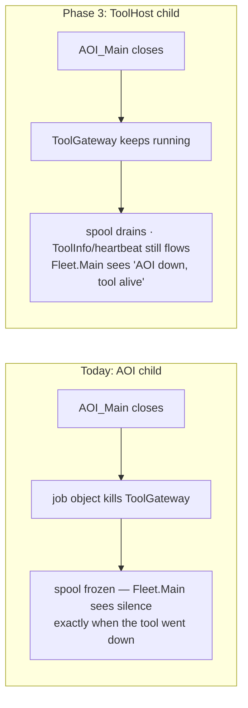

# Camtek.ToolHost — Design Proposal

> Detailed design for consolidating the per-tool Windows services into a single supervisor service.
> Goal: **reduce the Windows-service count on a Falcon tool PC from 3 to 1** while *keeping* process/crash isolation.
> Companion doc: [architecture-review-and-toolgateway-investigation.md](architecture-review-and-toolgateway-investigation.md) (§4 — inventory & option analysis).
> Status: proposal (not approved). Date: 2026-07-16.

---

## 1. Problem

Today a Falcon tool PC runs **3 independent Windows services** plus several supervised child processes, each with its own installer, service account, restart policy, and monitoring story:

| Today | Kind | TFM | Port | Installer |
|---|---|---|---|---|
| `Camtek.DataServer` | Windows service | net8.0 | :5050 | WiX MSI (`Product.wxs`) |
| `Camtek.RMSToolService` | Windows service | net6.0 (EOL) | :5020 | RMS Installer → `sc create` |
| FAR/EDC `Service1` | Windows service (supervisor only) | .NET FW 4.6.1 | Python child :1235 | InstallUtil/sc |
| ToolGateway | **AOI_Main child process** (job object) | net7.0 (EOL) | :5005/:5006 | none — `dotnet publish` + `clsInitAOI` launch |
| EBI servers | child console processes | — | :1234 | app fleet |

Three different install mechanisms, three service accounts to manage, three things for IT/support to check — and inconsistent supervision (SCM failure-actions vs. job objects vs. nothing).

The repo already contains the supervision pattern **three times**:

1. `AOI_Main` → ToolGateway (`clsInitAOI.cs:380-495`, `ChildProcessJobObject`, 5s backoff, max 3 restarts)
2. FAR `Service1` → Python gRPC server (kill stray processes, relaunch, pipe logs)
3. BSIHR `ServiceControl` → MainServer process loader

**Camtek.ToolHost generalizes that pattern into one product-grade supervisor.**

---

## 2. Target Architecture

### 2.1 Block diagram — before / after





Key properties:

- **Every child keeps its own process** → crash isolation preserved (a `TsmcClientShim.dll` native fault still kills only ToolGateway; a Python hang still affects only FAR).
- **Every child keeps its exe, ports, and config** → zero client impact (MDC still dials `localhost:5050`; Falcon's `ToolApiPublisher` still dials `localhost:5005`).
- **One `ServiceInstall`**, one service account, one thing in `services.msc`, one health surface.

### 2.2 ToolHost internal design



Components:

| Component | Responsibility | Source of the pattern in repo |
|---|---|---|
| `ProcessSupervisor` | Start children in dependency order, watch exit, apply restart policy | `clsInitAOI.EnsureToolGatewayRunning` |
| `JobObject` wrapper | `CREATE_SUSPENDED` + assign to job with `JOB_OBJECT_LIMIT_KILL_ON_JOB_CLOSE` → children can never orphan | Falcon.Net `ChildProcessJobObject` |
| `RestartPolicy` | Per-child: backoff (e.g. 5s → 30s → 120s), max attempts per window, then **quarantine** (stop restarting, mark unhealthy, keep other children running) | AOI's "5s backoff, max 3" — hardened |
| `HealthAggregator` | Poll each child's health endpoint / port; compute tool-level status | ToolGateway `/health`, DataServer gRPC |
| Host API (:5100) | `GET /health` (aggregate), `GET /children` (status/uptime/restarts), `POST /children/{name}/restart` (for DeployUI) | new — replaces `stopall.ps1` process-kill for these components |
| Log capture | Redirect each child's stdout/stderr into per-child rolling files | FAR `Service1` piping to `EDCPythonServerServiceLog.txt` |

**ToolHost owns no business logic.** It never inspects payloads, opens data files, or serves domain gRPC. That rule is what keeps it small, stable, and rarely-changing — a supervisor that needs frequent updates defeats its purpose.

### 2.3 Child contract

A child is anything that satisfies:

1. Runs as a plain console process (all four candidates already do — `UseWindowsService()` is a no-op outside the SCM).
2. Exits nonzero on fatal error (lets the supervisor distinguish crash from clean stop).
3. Optionally exposes a health probe (HTTP `/health`, gRPC health, or just an open port).
4. Tolerates being started at boot before other components exist (retry-on-connect rather than fail-fast).

Declarative child config (deployed with ToolHost, one file to rule the tool):

```json
{
  "children": [
    {
      "name": "DataServer",
      "exe": "C:\\bis\\bin\\x64\\DataServer\\Camtek.DataServer.GrpcHost.exe",
      "health": { "type": "grpcPort", "port": 5050 },
      "restart": { "backoffSeconds": [5, 30, 120], "maxPerHour": 6 },
      "startOrder": 1
    },
    {
      "name": "RmsToolService",
      "exe": "C:\\bis\\bin\\x64\\RMS\\Camtek.RMS.Service4Tool.exe",
      "args": "--console",
      "health": { "type": "httpPort", "port": 5020 },
      "restart": { "backoffSeconds": [5, 30, 120], "maxPerHour": 6 },
      "startOrder": 2
    },
    {
      "name": "FarPython",
      "exe": "C:\\bis\\...\\venv\\Scripts\\python.exe",
      "args": "GRPC.Server.py",
      "preStart": { "killProcessNames": ["python", "pythonw"] },
      "health": { "type": "tcpPort", "port": 1235 },
      "startOrder": 3
    },
    {
      "name": "ToolGateway",
      "enabled": false,
      "exe": "C:\\bis\\bin\\x64\\ToolGateway\\ToolGateway.Endpoint.exe",
      "health": { "type": "httpGet", "url": "http://localhost:5006/health" },
      "startOrder": 4
    }
  ]
}
```

(`ToolGateway.enabled=false` mirrors today's `system.ini` `ToolGatewayEnabled` opt-in until Phase 3.)

---

## 3. Flows

### 3.1 Boot sequence



Startup ordering is **best-effort, not blocking**: a child failing its health probe marks the aggregate as *degraded* but never prevents siblings from starting (mirrors today's behavior where the three services boot independently).

### 3.2 Crash / restart flow



This is strictly better than today's two mechanisms:
- SCM failure-actions (DataServer/RMS) restart max 3 times with **no quarantine and no visibility** beyond the event log.
- AOI's ToolGateway restart gives up after 3 attempts **silently** until the next AOI restart.

### 3.3 Deploy / update flow (DeployUI integration)



Updating **one child never restarts the others** — component teams keep independent release cadence. Updating ToolHost itself (rare, it has no business logic) restarts everything once, equivalent to a reboot today.

### 3.4 Shutdown flow



The job object is the safety net: even if ToolHost itself is killed (`taskkill /f`), the OS tears down every child. **No orphaned processes** — a real problem today (`stopall.ps1` exists precisely because processes orphan).

### 3.5 The ToolGateway lifecycle fix (Phase 3)



This is the only *functional* change in the whole proposal, and it is optional and reversible (flip `enabled` in the children config vs. `ToolGatewayEnabled` in `system.ini`).

### 3.6 AOI-side impact — frmProduction

**None, in every phase.** `frmProduction` is deliberately outside the ToolGateway data path (the gRPC push originates in `frmScanTab.OnReportScanResults`, *not* on frmProduction's COM `Fire*` bus), and ToolHost keeps it that way:

- **Phases 0–2** touch only services living outside the AOI process — no AOI code changes at all.
- **Phase 3** makes exactly one AOI-side edit: deleting `EnsureToolGatewayRunning` from `clsInitAOI.cs` (~line 380). That code is *adjacent to* frmProduction's startup calls (`FalconIsStartingUp` → `Init` → `ChangeToolState`) in the same file, but functionally independent of them.
- **Boot-order nuance:** today ToolGateway starts after frmProduction initializes (both driven by AOI startup); under ToolHost it runs from machine boot, hours before frmProduction exists. Nothing depends on that ordering — `ToolApiPublisher` dials `localhost:5005` per call, and ToolGateway idles until events arrive.
- The `frmProduction.FireWaferScanResultsAreReady` early-COM-bus flow (SECS/GEM, ProductionManager) is byte-for-byte identical before and after.

Full per-option frmProduction impact analysis (including the rejected merge options, where the impact is *not* zero): companion doc §5.

---

## 4. Migration Plan — each phase independently shippable

| Phase | Change | Service count | Risk | Effort |
|---|---|---|---|---|
| **0** | Framework hygiene: ToolGateway net7→net8, RMS Service4Tool net6→net8 (EOL runtimes) | 3 | Low — mechanical | S |
| **1** | Build ToolHost; absorb **FAR supervisor** (its only job is supervision; retires a .NET FW 4.6.1 service). FAR Python becomes ToolHost child | 3 → 2 | Low — like-for-like supervision | M |
| **2a** | **DataServer** re-registered: remove `ServiceInstall` from `Product.wxs`, add to children config. Exe/code untouched | 2 → 1* | Medium — installer + service-account/ACL migration | M |
| **2b** | **RMS Service4Tool** same treatment via RMS Installer change | (1) | Medium — same | S |
| **3** *(optional)* | ToolGateway moves from AOI child → ToolHost child: delete `EnsureToolGatewayRunning` from `clsInitAOI.cs`, enable in children config | 1 | Medium — startup-order + service-account `%TEMP%`/ACL checks (see §5) | M |

\* ToolHost itself is the 1 remaining service.

Rollback per phase = restore the previous service registration; binaries are identical.

---

## 5. Risks & Mitigations

| Risk | Mitigation |
|---|---|
| **ToolHost becomes a SPOF** — if it dies, SCM restarts it, but that respawns all children | SCM failure-actions on ToolHost (restart ×3); keep ToolHost tiny/no-business-logic so it essentially never crashes; children keep running only if job handle survives — accept full-restart semantics (same as reboot today) |
| **Service-account changes** — DataServer runs under `[SERVICEUSERNAME]` today; ToolGateway's spool ACL grants "current user"; `%TEMP%\ToolGateway` moves when the account changes | One decision: run ToolHost under the same account DataServer uses today; children inherit. Audit `EnsureSpoolDirectory` ACL and TSMC `tsmc_config.ini` `%TEMP%` path under that account before Phase 3 |
| **Boot-time start vs. AOI-time start** (Phase 3) — ToolGateway would run for hours with no AOI; `RegisterToolAsync` fires at boot | Verify Fleet.Main treats early registration + idle correctly; ToolGateway already tolerates no-traffic operation |
| **Deploy tooling breakage** — `stopall.ps1` / `msbuild.actions.ps1` kill by process name | Add ToolHost API stop/start calls to DeployUI helpers in the same phase as each child migrates |
| **Coupled restart on ToolHost update** | ToolHost has no domain logic → updates are rare; schedule with maintenance windows like OS patching |
| **SystemStopper references** | It already references a stale name (`Fleet.ToolAPI.Endpoint`) — fix alongside Phase 3 |
| **New code with no track record** | ToolHost is ~90% pattern-lift from `ChildProcessJobObject` + FAR supervisor; ship with a real test suite (follow ToolGateway.Tests, the only tested component in this area) and soak it in Phase 1 where blast radius is smallest (FAR only) |

---

## 6. What ToolHost is NOT

- **Not a merge** — no child's code moves into ToolHost's process (that was rejected Option R3: max coupling, native-DLL blast radius, coupled releases).
- **Not an orchestrator of business flows** — it never touches scan results, recipes, or events.
- **Not for AOI_Main / COM servers** — the operator app, ToolManager, and the GEM client process (`SecsGemGui.Net`) stay exactly as they are; ToolHost supervises only the headless side-services.
- **Not BSIHR** — BSIHR's ServiceControl/DatabaseServer belong to the next-gen product line; alignment is a later, separate discussion (though ToolHost's child contract was designed so they *could* fit).

---

## 7. Open Questions (need answers before Phase 2)

1. **Fleet product question:** does Fleet.Main need tool-down telemetry (AOI closed, tool PC alive)? → decides Phase 3.
2. **Service account policy:** which account do IT/security want for the single service (DataServer's `[SERVICEUSERNAME]` convention vs. LocalService + explicit ACLs)?
3. **RMS Installer ownership:** RMS has its own installer app — does the RMS team accept ToolHost owning Service4Tool's lifecycle, or does their installer just gain a "register with ToolHost" mode?
4. **EBI servers in scope?** They follow the child-process pattern already (mutex-guarded, launched by the app fleet) — candidates for a later phase, not required for the 3→1 goal.
