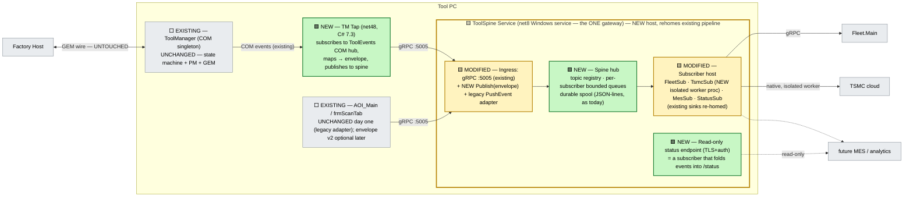

# D1 — Tool Event Spine (contract-first unification; mini-bus precursor)

> **Status: EXPLORATORY DRAFT** — see [README.md](README.md).
> Axis: unify by **contract**. One envelope, one localhost stream, N producers, M subscribers.
> Solves: [00-problem-and-current-state.md](../tool-gateway-unification/00-problem-and-current-state.md) criteria 1–6.

---

## 1.1 The reframe

Alt 1/2/3 all ask *"who hosts what?"*. This design asks a different question:

> **Why does the tool have two external surfaces? Because it has no internal contract.**
> `frmScanTab → gRPC :5005` is a point-to-point hack; ToolManager's events die inside the COM fan-out; every new consumer invents a new pipe.

So instead of moving components, D1 introduces the **one thing the tool has never had: a single, versioned, internal event contract** — the **Tool Event Spine** — and makes the gateway its host. Once every producer speaks the envelope and every consumer subscribes to the spine, "one tool gateway" falls out as a corollary rather than being forced by re-hosting anything.

This is deliberately a **subset of the future bus** ([../stage/06-bus-implementation.md](../stage/06-bus-implementation.md)): same envelope fields, same topic naming, no broker federation, no cross-tool routing — a *bus larva* that lives on one machine.

## 1.2 Architecture



> **Legend:** 🟩 **NEW** = does not exist today · 🟨 **MODIFIED** = existing component re-homed / extended · ⬜ **EXISTING** = untouched.

## 1.3 The contract (the actual deliverable)

```protobuf
// toolspine.v1 — deliberately a strict subset of the stage\ bus envelope
message ToolEvent {
  string event_id    = 1;  // ULID — idempotency key end-to-end
  string topic       = 2;  // "tool.state", "scan.results", "carrier.progress", "health.gateway"
  string source      = 3;  // "ToolManager" | "AOI_Main" | "ToolSpine"
  int64  ts_utc      = 4;  // producer clock, ms
  uint32 schema_ver  = 5;  // per-topic payload version
  bytes  payload     = 6;  // per-topic proto — NOT JSON blobs
  map<string,string> attrs = 7; // tool_id, job_id, wafer_id …
}

service ToolSpine {
  rpc Publish   (ToolEvent)        returns (PublishAck);   // producers
  rpc Subscribe (SubscribeRequest) returns (stream ToolEvent); // in-proc + future out-of-proc subscribers
}
```

Rules that make it a contract, not a convention:
- **Topic registry is code**, checked in, with one owner per topic. Publishing an unregistered topic is a `PublishAck.REJECTED`, not a silent drop.
- **`event_id` idempotency** flows into every sink → replays after spool recovery cannot double-send to Fleet (fixes a class of today's spool bugs).
- **`schema_ver` gates subscribers**: a subscriber declares the versions it accepts; the hub never delivers a payload version a subscriber didn't claim — new producers can't silently break old sinks.
- The legacy `PushEvent` RPC stays alive as an **adapter** that wraps old calls into `ToolEvent{topic:"scan.results", schema_ver:1}` — so AOI_Main does not have to change on day one.

## 1.4 What moves / what stays

| ⬜ Stays put (EXISTING) | 🟩 NEW / 🟨 MODIFIED |
|---|---|
| ToolManager: **zero code change** (the tap subscribes to the existing COM event hub — see [D4](04-design-com-tap-bridge.md) for the tap mechanics) | **ToolSpine service** — today's ToolGateway pipeline (EventProcessor → Router → SinkDispatcher, spool, xUnit suite) *rehomed* as the spine hub + subscriber host; promoted to a real Windows service |
| GEM wire, ProductionManager, EFEM, tool clients | **TM Tap** — small net48 exe/COM client; the only new code near the control plane, and it is **observe-only** |
| AOI_Main publish path (via legacy adapter) | `toolspine.v1` proto package + topic registry (the contract) |
| Spool location & format (`C:\Fleet\ToolGateway\FailedMessages`) | TSMC native DLL moves to an **isolated sink worker process** (kernel-style, borrowed from [D3](03-design-microkernel-connectors.md)) |

## 1.5 Key flows

**Tool state change reaches Fleet even with the GUI closed:**
`ToolManager.OnToolStateChanged` → COM hub → TM Tap maps to `tool.state` envelope → `Publish` :5005 → hub fans out → FleetSub → Fleet.Main. AOI_Main is nowhere in this path — criterion 2's headline failure ("reporting dies when the operator closes the app") is gone *structurally*, not just by service promotion.

**Scan results (today's path, unchanged semantics):**
`frmScanTab → ToolApiPublisher.PushEvent :5005` → legacy adapter wraps → `scan.results` topic → FleetSub + TsmcSub. The known `ToolApiPublisher` hazard (blocking the scan thread — `Thread.Sleep(1000)` + no gRPC deadline) is fixed on the producer side in the same wave: deadline + fire-and-forget queue (this is live-bug territory already tracked in [../stage/05-roadmap-and-risks.md §5.5](../stage/05-roadmap-and-risks.md)).

**Spine down:** producers get `UNAVAILABLE` fast (deadline), buffer small & bounded locally (tap: ring buffer, drop-oldest with counter; AOI: as today). The spine's own spool covers sink outages; producer-side loss is bounded and *measured* (a `health.gateway` topic reports drops — no silent loss).

## 1.6 Scoring vs the six criteria

1. **Single non-host surface — ✅.** Everything non-host attaches to the spine (publish or subscribe). "Add MES" = register a topic subscription; one component, one contract.
2. **Single lifecycle — ✅.** One Windows service, GUI-independent, health-checked (`health.gateway` topic + endpoint).
3. **Control core protected — ✅.** TM untouched; the tap is observe-only, out-of-proc, and killable without affecting TM (COM connection-point unsubscribe is benign).
4. **Native-DLL blast radius — ✅.** TsmcSub runs the shim in a child worker; worker crash = spool + restart, spine unaffected.
5. **Reversible — ✅.** Flag `general/ToolSpineEnabled`. Off ⇒ exact today's topology (legacy adapter *is* today's endpoint). The tap is unplugged by not starting it.
6. **Forward-compatible — ✅✅ (this is D1's superpower).** Migration to the real bus = swap the hub's transport for the broker and re-point `Publish`; **every producer, topic, and subscriber survives verbatim** because the envelope was designed as a bus subset. D1 retires *into* the bus rather than being replaced by it.

## 1.7 Risks & honest limits

- **The contract is the hard part, not the code.** Topic/payload design needs the same rigor as the bus envelope work in `stage\06`; skimping here recreates today's ad-hoc pipes with extra steps. Mitigation: lift topic taxonomy directly from the stage link-disposition table ([../stage/02-aoi-architecture.md §2.9](../stage/02-aoi-architecture.md)).
- **Tap fidelity ceiling.** The tap only sees what the COM hub already fires (~25 `Fire*` events + `OnToolStateChanged`). Events TM never surfaces can't be published without touching TM — accepted; that's Wave-2 work, and by then the bus program may own it.
- **Two hops for TM events** (COM → tap → spine) adds ~ms latency — irrelevant for reporting-class traffic; stated so nobody later "optimizes" the tap into TM's process.
- **Ordering:** per-producer FIFO only (per-topic sequence from `event_id` monotonicity per source); no cross-producer total order — same stance as the bus, documented in the contract.

## 1.8 Effort & phases

| Phase | Content | Effort |
|---|---|---|
| E0 | Service promotion of today's gateway + spool-drain fix (identical to Alt 1's U0 — shared work, not duplicate) | S |
| E1 | `toolspine.v1` contract + hub (rehome existing pipeline) + legacy adapter; AOI unchanged | M |
| E2 | TM Tap + `tool.state` topic → FleetSub; read-only status endpoint as a fold subscriber | S–M |
| E3 | TSMC sink → isolated worker; producer-side deadline fixes | S |

**Total: M.** Reversibility: **high**. Fab re-qual: **none**. Compared to Alt 3 it delivers less internal consolidation but strictly more *future* (the contract), for roughly Alt 1 + ε cost.
