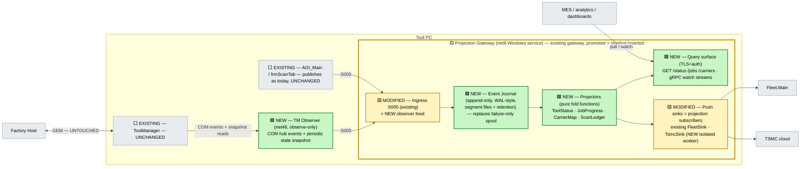

# D2 — CQRS Projection Gateway (unify the *read side*; commands stay on GEM)

> **Status: EXPLORATORY DRAFT** — see [README.md](README.md).
> Axis: unify by **data model**. The gateway becomes the tool's single durable, replayable **read model**; the command plane is not merely protected — it is *out of scope by construction*.

---

## 2.1 The reframe

Look at what the two components actually *do* with information:

- **ToolManager** *decides* (state machine, ProductionManager) — a **command/write plane**.
- **ToolGateway** *tells* (Fleet, TSMC) — a **query/read plane**.

The problem statement's criterion 1 already concedes the host keeps its own door (GEM). So the honest scope of "one tool gateway" is: **unify everything that *reads* tool state.** That is textbook **CQRS**: don't touch the write side; build one authoritative read side.

Where Alt 1 exposes a *live shim* (read-through to a running ToolManager) and D1 exposes *streams*, D2 exposes **state**: a durable, event-sourced **projection** of the tool that answers "what is / was the tool doing?" even when ToolManager is restarting, the GUI is closed, or the consumer was offline for an hour. Every non-host consumer — Fleet sink, TSMC sink, MES pull, dashboards, even post-mortem analysis — reads the same projections.

## 2.2 Architecture

> **Legend:** 🟩 **NEW** = does not exist today · 🟨 **MODIFIED** = existing component re-homed / extended · ⬜ **EXISTING** = untouched.

## 2.3 The three load-bearing ideas

### a) Journal-first, sinks-second
Every inbound event is **appended to the journal before any sink sees it** (today it's the inverse: spool only on failure). Consequences:
- **Replay** — a new sink (MES) can be brought up and back-filled from the journal; a wedged Fleet outage recovers by resuming from the sink's acked offset, not by draining a failure spool. The spool *concept* disappears; it becomes "sink offset lag".
- **Audit** — "what did we tell Fleet at 03:12?" is answerable from disk. On a fab tool this is worth the disk it costs.
- The journal format is deliberately the **bus journal shape** from [../stage/06-bus-implementation.md](../stage/06-bus-implementation.md) — same segment/retention/offset semantics, single-node.

### b) Projections, not proxies
A projector is a **pure fold**: `state' = f(state, event)`, snapshotted periodically. `ToolStatus` folds `tool.state` events + observer snapshots; `ScanLedger` folds scan-result events into a per-wafer ledger. The query surface serves projections **from the gateway's own store** — it never calls into ToolManager on the request path. That is the decisive difference from Alt 1's shim: **an external status request can never touch, block, or destabilize the control plane**, because there is no runtime dependency at all (criterion 3 by construction, not by discipline).

### c) Snapshot + events = self-healing truth
Event-sourced observation of a component you don't own has a known failure mode: **missed events → silent drift**. Countermeasure: the TM Observer pairs the event tap with a **low-frequency full-state snapshot** (read-only COM getters, e.g. every 30 s and on reconnect). The projector reconciles: snapshot disagrees with folded state ⇒ emit a `tool.state.corrected` event (visible! counted! alertable!) and adopt the snapshot. Drift is bounded to one snapshot interval and is *observable* instead of silent — this is the design's answer to the classic "shadow state machine" objection that killed similar proposals in review ([../tool-gateway-unification/04-alt1-review.md](../tool-gateway-unification/04-alt1-review.md) territory).

## 2.4 What moves / what stays

| ⬜ Stays put (EXISTING) | 🟩 NEW / 🟨 MODIFIED |
|---|---|
| ToolManager, PM, EFEM, GEM wire — **zero change** | **Projection Gateway service**: today's gateway pipeline refactored journal-first; sinks become journal subscribers with acked offsets |
| AOI_Main publish path (`:5005` preserved verbatim) | **Journal** (append-only segments) replaces the failure-only spool |
| Fleet/TSMC wire protocols (sinks emit the same messages) | **Projectors + query surface** (read-only, TLS+auth) |
| — | **TM Observer** (net48): COM tap + periodic snapshot; observe-only |

## 2.5 Scoring vs the six criteria

1. **Single non-host surface — ✅.** All non-host consumers either subscribe to projections (push sinks) or query them (pull). One component, one store, one answer to "what is the tool doing?"
2. **Single lifecycle — ✅.** One Windows service; and uniquely, its *data* outlives everything — consumers get correct history even across gateway restarts.
3. **Control core protected — ✅✅.** Strongest of any design here: the request path has **no** runtime link to TM. Observer is one-way, killable, rate-limited by design.
4. **Native-DLL blast radius — ✅.** TsmcSink in an isolated worker reading the journal; crash = offset stalls, restart resumes. Nothing else notices.
5. **Reversible — ✅.** Flag-gated; legacy `:5005` semantics preserved, so "off" is literally today. Journal files are additive artifacts.
6. **Forward-compatible — ✅.** The journal *is* the bus journal, single-node; migration = the broker adopts the journal and projectors become bus consumers. The projections themselves are exactly the "read model" the stage design wants gateway citizens to own.

## 2.6 Risks & honest limits

- **Freshness, not immediacy.** Projections trail reality by tap latency (+ up to one snapshot interval after a missed event). Fine for reporting/fleet/MES; **not** a source for control decisions — the doc must say so in bold and the query API should carry `as_of_ts` on every response to keep consumers honest.
- **Journal ops burden.** Segments, retention, disk-full behavior — real operational surface. Mitigation: lift the tested policies from `stage\06` (14-group test kit includes journal cases) instead of inventing new ones.
- **Projector correctness is now a product concern.** A buggy fold misreports the fleet-wide view. Mitigation: pure functions + golden-event-log replay tests (record once on a real tool, assert folds forever — cheap and brutal).
- **Biggest refactor of the four D-designs** on the gateway side (journal-first inverts the pipeline), though all of it is in the *already-tested, non-safety* component.

## 2.7 Effort & phases

| Phase | Content | Effort |
|---|---|---|
| Q0 | Service promotion + flag (shared with Alt 1 U0 / D1 E0) | S |
| Q1 | Journal-first pipeline; sinks → offset subscribers (spool retired) | M |
| Q2 | TM Observer + `ToolStatus` projector + query surface | M |
| Q3 | `ScanLedger` / `JobProgress` projectors; MES back-fill demo from journal replay | S |

**Total: M–L.** Reversibility: **high**. Fab re-qual: **none**.
Best fit when the org's pain is *"we can never answer what the tool was doing"* (post-mortems, fleet dashboards, offline consumers) rather than just "two components".
