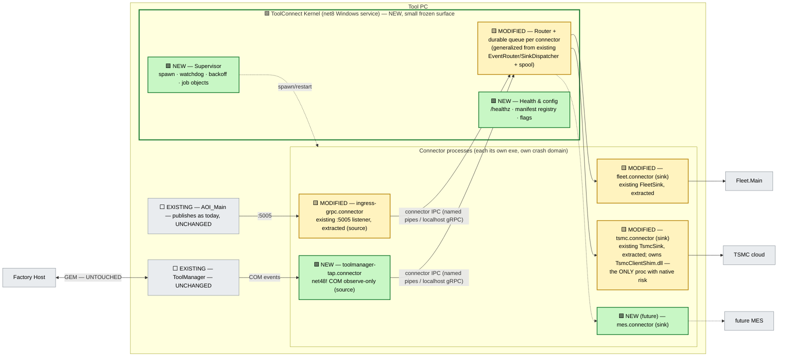

# D3 — Micro-Kernel Connectivity Supervisor (process-isolated connector plugins)

> **Status: EXPLORATORY DRAFT** — see [README.md](README.md).
> Axis: unify by **plugin kernel**. One tiny, boring, ultra-stable supervisor owns lifecycle/health/routing/durability; every external integration is a **crash-isolated connector process** conforming to one connector contract.

---

## 3.1 The reframe

Criterion 4 ("a `TsmcClientShim.dll` crash must not take down tool control") is treated by the other designs as a *mitigation detail* — "run the TSMC sink in a worker". D3 flips it into the **organizing principle**:

> The tool's real long-term problem is not that it has two gateways — it's that **every integration so far has been welded into a host it can crash** (native shim in-proc with Kestrel; publisher that can block the scan thread; reporting that dies with the GUI). The unification that lasts is one that makes *"add an integration"* a **drop-in, crash-isolated, independently-updatable unit** forever.

So D3 builds the smallest possible **kernel** — it does lifecycle, health, routing, and durability, *and nothing else* — and expresses **every** external connection (Fleet, TSMC, MES, even the ingress listener itself) as a **connector**: a separate process speaking one small contract. The kernel is the "one tool gateway"; connectors are its replaceable organs.

This is the OS-microkernel / Kafka-Connect shape, sized for one Windows tool PC.

## 3.2 Architecture



> **Legend:** 🟩 **NEW** = does not exist today · 🟨 **MODIFIED** = existing component re-homed / extracted · ⬜ **EXISTING** = untouched.

## 3.3 The connector contract (the whole trick)

One small IPC interface (localhost gRPC or named pipes), one manifest file per connector:

```yaml
# tsmc.connector.yaml
name: tsmc
kind: sink
exe: connectors\tsmc\TsmcConnector.exe     # its own process, its own runtime
runtime: net8                               # tap connector says net48 — kernel doesn't care
subscribes: [scan.results, tool.state]
delivery: at-least-once                     # kernel keeps per-connector durable queue + acked offset
isolation: { job_object: true, restart: backoff(1s..60s), max_mem_mb: 512 }
health: { heartbeat_s: 5, unhealthy_after: 3 }
```

```protobuf
service Connector {           // implemented BY the connector, called by kernel
  rpc Deliver (stream Event) returns (stream Ack);   // sinks
  rpc Health  (Ping)         returns (Pong);
}
service Kernel {              // implemented by kernel, called by source connectors
  rpc Publish (stream Event) returns (stream Ack);
}
```

Why this is the load-bearing element:
- **Mixed runtimes solved cleanly.** The net48-vs-net8 collision that sinks Alt 2 simply *evaporates*: the ToolManager tap connector is a net48 exe, the TSMC connector is net8+native, the kernel never loads either — processes, not assemblies, are the plugin unit.
- **Crash domains are per-integration.** TSMC shim heap-corrupts ⇒ `tsmc.connector` dies ⇒ kernel backs off, restarts it, resumes from its acked offset. Fleet delivery, ingress, and — above all — tool control never feel it. Criterion 4 is not mitigated; it is **structural**.
- **Independently updatable.** Shipping a new TSMC shim version = replacing one connector folder on the tool, kernel untouched. In a fleet of qualified tools, "we can update Fleet reporting without touching anything the fab qualified" is a genuinely new capability.
- **The kernel can be finished.** Its surface (supervise, route, persist, health) is small enough to write, test hard (it inherits/extends today's xUnit suite), and then *stop changing* — churn migrates to connectors where blast radius is contained.

## 3.4 What moves / what stays

| ⬜ Stays put (EXISTING) | 🟩 NEW / 🟨 MODIFIED |
|---|---|
| ToolManager, PM, EFEM, GEM wire — **zero change** | **Kernel service** (supervisor + router + durable queues + health) — the router/spool logic is today's `EventRouter`/`SinkDispatcher`/spool extracted and generalized |
| AOI_Main publish path — `:5005` still answered, now by the ingress connector | Today's FleetSink / TsmcSink become **connector exes** (mostly mechanical extraction — the sink logic already exists and is tested) |
| Fleet/TSMC wire protocols | **toolmanager-tap connector** (net48, observe-only — the [D4](04-design-com-tap-bridge.md) tap, packaged as a connector) |
| Spool durability semantics (generalized to per-connector queues) | Connector manifest + IPC contract |

## 3.5 Scoring vs the six criteria

1. **Single non-host surface — ✅.** The kernel + its connector set *is* the tool's non-host I/O, declared in one manifest registry. "What talks to the outside?" = `dir connectors\`.
2. **Single lifecycle — ✅✅.** The kernel is *the* supervisor: one service starts, watches, restarts, health-aggregates every external connection. This is the strongest criterion-2 answer of all seven designs (existing three + these four).
3. **Control core protected — ✅.** TM untouched; the tap is one observe-only connector among peers, killable in isolation.
4. **Native-DLL blast radius — ✅✅.** The design's founding principle.
5. **Reversible — ✅.** Per-connector flags (disable `tsmc.connector` alone!) plus the global flag back to today's topology. Finer-grained rollback than any alternative.
6. **Forward-compatible — ✅.** When the bus arrives, the kernel's router is replaced by a bus client and **connectors survive unchanged** (their contract is Deliver/Ack streams — exactly a bus consumer's shape). Alternatively the kernel itself becomes the tool's bus edge citizen.

## 3.6 Risks & honest limits

- **More processes on the tool PC** (kernel + 3–5 connectors). Mitigated by job objects, tiny idle footprints, and the kernel's watchdog — but ops must monitor a process *tree*, not one exe; `/healthz` must aggregate to a single fleet-visible verdict.
- **IPC hop per event.** Localhost pipe/gRPC adds sub-ms per hop at reporting-class rates (tens/sec) — negligible; measured in the perf gate anyway.
- **Contract discipline.** A leaky connector contract (connectors calling each other, sharing files) rebuilds the mud ball with more exes. The kernel must *enforce* topology: connectors talk only to the kernel; the review gate checks it.
- **Overkill risk.** If the tool never grows past Fleet+TSMC, a kernel is scaffolding without tenants. This design earns its cost only under the stated roadmap (MES, analytics, per-fab integrations) — say so honestly in the recommendation.

## 3.7 Effort & phases

| Phase | Content | Effort |
|---|---|---|
| K0 | Service promotion + flag (shared U0/E0/Q0 step) | S |
| K1 | Kernel: supervisor + per-connector durable queues (generalize today's spool); ingress connector answering `:5005` | M |
| K2 | Extract FleetSink → `fleet.connector`; TsmcSink → `tsmc.connector` (native risk leaves the Kestrel host **here**) | S–M |
| K3 | `toolmanager-tap.connector` (net48) → tool state reaches Fleet, GUI-independent | S |

**Total: M.** Reversibility: **high (finest-grained)**. Fab re-qual: **none**.
Best fit when the roadmap genuinely contains **many** integrations and per-fab variation — the kernel converts integration count from a liability curve into a flat cost.
