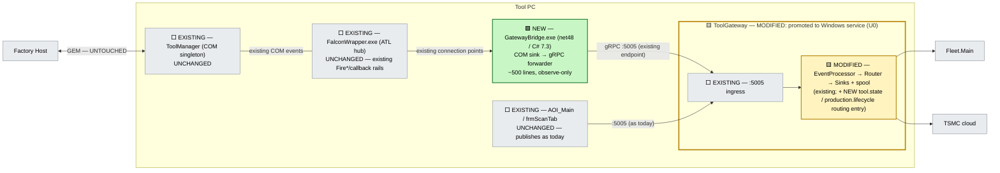

# D4 — COM-Tap Bridge (zero-touch unification on existing rails)

> **Status: EXPLORATORY DRAFT** — see [README.md](README.md).
> Axis: unify using **rails that already exist**. The tool already *has* an internal event bus — the COM connection-point hub. Nobody ever pointed the gateway at it. D4 does exactly that, and nothing else.

---

## 4.1 The reframe

Every other design (existing Alts and D1–D3) builds something new near ToolManager — a shim, a tap-with-contract, an observer, a connector. D4 starts from an inventory question a senior architect should ask first:

> **What integration mechanism already exists, already works, and is already qualified in the field?**

Answer, from the verified baseline ([00-problem-and-current-state.md §0.2](../tool-gateway-unification/00-problem-and-current-state.md), key-facts in the repo root):

- ToolManager already **broadcasts** its lifecycle on a COM event bus: callbacks fire *up* via `OnToolStateChanged` (`ToolEvents.cs` connection points), and `frmProduction` pushes ~25 `Fire*` events *down* into `mFalconFireEvents`, hosted out-of-proc by **`FalconWrapper.exe`** (ATL EXE).
- Multiple subscribers already attach to these connection points today (`ToolManagerUiWrapper`, `ExternalControlCbUiWrapper`) — **adding a subscriber is a supported, already-exercised operation**, not a new pattern.
- ToolGateway already has a hardened ingress (`:5005`), pipeline, spool, and tests.

So the *minimum total intervention* that satisfies "one non-host surface" is: **a small net48 bridge process that subscribes to the existing COM events and forwards them to the existing gateway ingress.** ToolManager: zero changes. AOI_Main: zero changes. Gateway: one new event family. The unification is achieved by *connecting two things that already exist*.

## 4.2 Architecture

> **Legend:** 🟩 **NEW** = does not exist today · 🟨 **MODIFIED** = existing component extended / re-hosted · ⬜ **EXISTING** = untouched.

## 4.3 The bridge, precisely

**`GatewayBridge.exe`** — net48 console/service, C# 7.3 idiom (no records, no switch expressions), because it lives in COM-interop land:

- **Subscribes** to the same connection-point interfaces the UI wrappers use (`I*CB` for `OnToolStateChanged`; the `mFalconFireEvents` family for production lifecycle events). It is a *peer of `ToolManagerUiWrapper`*, minus the UI.
- **Maps** each COM event to the existing gateway event schema and calls `PushEvent` on `:5005` — with a **gRPC deadline (2 s) and a bounded local ring buffer** (drop-oldest + drop counter), so a down gateway can never wedge the bridge, and a wedged bridge can never touch ToolManager (COM connection-point callbacks are queued by the hub; the bridge acks immediately and forwards async).
- **Reconnects** both sides independently: ROT re-resolve on TM restart; channel re-dial on gateway restart. On COM reconnect it pushes one synthetic `tool.state` refresh (read via the existing read-only getters) so the fleet view re-syncs.
- **Is disposable.** Kill it any time: TM notices nothing (dead subscriber is dropped by the hub), the gateway notices nothing (one client gone). That property *is* the safety argument.

**Gateway side:** one new event family (`tool.state`, `production.lifecycle`) routed to FleetSink — a routing-table entry plus payload contract, all in the already-tested pipeline.

**Lifecycle:** the promoted gateway service supervises the bridge as a child (job object — same pattern `clsInitAOI.EnsureToolGatewayRunning` uses today, just with a competent parent).

## 4.4 What this deliberately does NOT do

Honesty is the point of this design, so its limits are front-and-center:

- **No new contract** — it speaks today's gateway schema. (D1 adds the contract later; the bridge then becomes D1's TM Tap with a one-file change.)
- **No state store / replay** — events missed while the bridge is down are gone, except for the reconnect snapshot. (D2 adds the journal later.)
- **No native-DLL isolation** — the TSMC shim stays where it is today (in-proc with the gateway; **already** out-of-proc from tool control, so criterion 4 is *met at the "tool control" bar* but not improved). D3's worker extraction is the follow-up.
- **No new capabilities for TM events not already fired on the COM hub.** The ~25 `Fire*` events + state changes are the ceiling. Known blind spot inherited from the baseline: ToolGateway's scan-results feed still comes from `frmScanTab`, because `FireWaferScanResultsAreReady` fires **before** results are copied to their stable path (a documented fact, not an oversight) — D4 does not try to fix event timing inside TM.

## 4.5 Scoring vs the six criteria

1. **Single non-host surface — ✅.** Fleet/TSMC/status all flow through the gateway, now including tool state & production lifecycle, with **zero producer changes**.
2. **Single lifecycle — ✅.** Requires the same U0 service-promotion as every other design; the gateway then supervises the bridge. Tool state reaches Fleet with the GUI closed — the headline complaint dies in the **first** deliverable.
3. **Control core protected — ✅✅.** The only design with **literally zero new code loaded anywhere near ToolManager's process or codebase**. The integration mechanism (COM connection points) is the one the fab has been running for years.
4. **Native-DLL blast radius — ➖/✅.** Unchanged from today (shim already outside tool control). Not improved; explicitly deferred to D3-style extraction.
5. **Reversible — ✅✅.** Rollback = stop one exe. There is no smaller rollback surface possible.
6. **Forward-compatible — ✅.** The bridge is the embryo of every richer design's TM-side component: D1's tap, D2's observer, D3's tap-connector, and ultimately the stage GEM-shim-adjacent publisher. Nothing is thrown away; it is *renamed and grown*.

## 4.6 Risks & honest limits

- **COM eventing quirks are the risk budget:** connection-point threading (the hub marshals on its own terms — the bridge must ack fast and never block in the callback), event storms on state flapping (ring buffer + coalescing `tool.state` to latest-wins), zombie subscriptions after TM crash (heartbeat re-resolve via ROT). All are known, bounded, and testable against `FalconWrapper` on a bench tool.
- **Schema debt.** Forwarding in today's ad-hoc gateway schema grows the thing D1 exists to kill. Acceptable *only* because D4 is explicitly a Wave-0 tactic; the recommendation must pair it with a contract follow-up, not present it as the end state.
- **Fidelity ceiling** as §4.4 — no events TM doesn't already fire.

## 4.7 Effort & phases

| Phase | Content | Effort |
|---|---|---|
| B0 | Gateway service promotion + spool-drain fix (the shared U0) | S |
| B1 | `GatewayBridge.exe`: `OnToolStateChanged` → `tool.state` → FleetSink; reconnect + snapshot logic | S |
| B2 | `Fire*` production-lifecycle family mapped; coalescing + drop counters; bench soak against FalconWrapper | S |

**Total: S (weeks, not months).** Reversibility: **maximal**. Fab re-qual: **none**.

## 4.8 Where it fits

D4 is the **tactical opening move**, not the destination: it buys the two headline wins (single surface, GUI-independent reporting of tool state) at near-zero risk and near-zero cost, *while the org decides* between D1 (contract), D2 (projections), D3 (kernel), or the reviewed Alt 3 path — and it is the common embryo of all of their TM-side components, so none of its code is wasted whichever way the decision goes.
