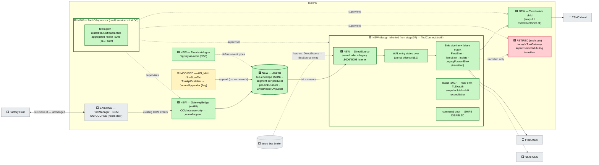

# Supervised Journal-Fed Strangler (SJFS) — Complete Design

> **Level: complete design (build spec).** The recommended target architecture from
> [ADR-tool-gateway-unification-review.md §6](ADR-tool-gateway-unification-review.md), designed to
> implementation depth.
> **Status: DRAFT — pending adversarial review.** The journal file-plane (§4) is the one
> load-bearing element with no prior review cycle; per the ADR's self-challenge (§10.2), it must
> pass its own review before phase P2 ships enabled.
> **Problem & criteria:** [tool-gateway-unification/00-problem-and-current-state.md §0.4](tool-gateway-unification/00-problem-and-current-state.md).
> **Inherited component design:** ToolConnect internals are normatively defined by
> [stage/07-toolconnect-design.md](stage/07-toolconnect-design.md); this document specifies only
> what SJFS **adds, adapts, or constrains** (§5). Where the two disagree, stage/07 governs
> ToolConnect internals and this document governs the integration.

---

## 1. Scope and posture

**One sentence:** supervise first, journal second, strangle third — one supervisor owns every
external-I/O process; producers append to a durable local journal instead of calling anything;
the already-reviewed ToolConnect gateway consumes the journal and strangles today's ToolGateway
lane by lane, until the tool has exactly one non-host gateway that is already the bus-era
component.

**Invariants (non-negotiable, inherited from the reviewed set):**

- **Two doors.** The factory host keeps the fab-qualified SECS/GEM wire. Nothing here routes,
  wraps, or times that path. No fab re-qualification.
- **Control core untouched.** ToolManager, the state machine, ProductionManager, EFEM/motion:
  zero code changes. The only new artifact near them is an out-of-proc, observe-only COM
  subscriber (§6) that can be killed at any moment without effect.
- **No command relay.** ToolConnect's :5007 command door ships **disabled** and stays disabled
  until an authenticated, audited command transport exists (bus era). Read-only status only.
- **Native containment.** `TsmcClientShim.dll` runs only inside `TsmcIsolate` (§7), never in
  ToolConnect, never anywhere near tool control.
- **Reversibility.** Every phase has a flag- or config-level rollback until the final lane
  cutover; the `:5005` wire contract is preserved verbatim throughout so no producer outside
  this program ever changes.

## 2. Component inventory

| Component | Runtime | Status | Origin design | Section |
|---|---|---|---|---|
| `ToolIOSupervisor` | net48 Windows service | 🟩 NEW (~1 kLOC) | C | §3 |
| Journal (format + directory contract) | file plane | 🟩 NEW | A | §4 |
| `JournalAppender` library | net48 lib (C# 7.3) | 🟩 NEW | A | §4.5 |
| ToolConnect | net8 service | 🟩 NEW code / 🟨 inherited design (stage/07) | D | §5 |
| `DirectSource` (journal tailer + legacy listener) | inside ToolConnect | 🟩 NEW (the one from-scratch ToolConnect artifact) | D + A merge | §5.2 |
| `GatewayBridge` (COM tap) | net48 exe (C# 7.3) | 🟩 NEW (~500 LOC) | D4 | §6 |
| `TsmcIsolate` | net8 child exe | 🟩 NEW (thin host; shim itself existing) | C / stage/07 | §7 |
| Event catalogue (registry-as-code) | net48 lib + docgen | 🟩 NEW | B (S0 only) | §8 |
| ToolGateway (today's) | net7 | 🟥 RETIRED at end state (supervised child → sink target → removed) | — | §5.4 |
| AOI_Main / `frmScanTab` / `ToolApiPublisher` | net48 | 🟨 MODIFIED (publisher swaps gRPC push for journal append behind a flag) | — | §4.5 |
| ToolManager + GEM stack | net48/COM/native | ⬜ EXISTING — untouched | — | — |

## 3. System architecture

> **Legend:** 🟩 NEW · 🟨 MODIFIED / inherited-design · 🟥 RETIRED at end state · ⬜ EXISTING untouched.



### 3.1 🟩 NEW — ToolIOSupervisor — specification

Job: read one config file, launch children, watch them, restart them, aggregate health.
**Hard rule (from Design C, kept verbatim):** the supervisor never opens a tool-data
connection, never parses an event, never routes a message. Its inputs are exit codes, health
probes, and `toolio.json`; its outputs are process starts and one health document.

**`toolio.json` (schema by example):**

```json
{
  "logRoot": "C:\\bis\\ToolIO\\logs",
  "health":  { "port": 5008, "tls": true, "auth": "client-cert" },
  "children": [
    { "name": "toolconnect",   "exe": "ToolConnect\\ToolConnect.exe",
      "restart": { "backoffMs": [1000, 5000, 15000, 60000], "quarantineAfter": 5, "quarantineWindowMin": 10 },
      "health":  { "probe": "http://127.0.0.1:5007/healthz", "intervalS": 5, "unhealthyAfter": 3 },
      "jobObject": { "killOnClose": true } },
    { "name": "tsmc-isolate",  "exe": "TsmcIsolate\\TsmcIsolate.exe",
      "restart": { "backoffMs": [1000, 5000, 30000], "quarantineAfter": 10, "quarantineWindowMin": 10 },
      "health":  { "probe": "pipe:tsmc-isolate-health", "intervalS": 5, "unhealthyAfter": 3 },
      "jobObject": { "killOnClose": true } },
    { "name": "gateway-bridge","exe": "GatewayBridge\\GatewayBridge.exe",
      "restart": { "backoffMs": [1000, 5000], "quarantineAfter": 20, "quarantineWindowMin": 10 },
      "jobObject": { "killOnClose": false } },
    { "name": "toolgateway-legacy", "exe": "...\\ToolGateway.exe", "transitionOnly": true,
      "restart": { "backoffMs": [1000, 5000, 15000] }, "jobObject": { "killOnClose": false } }
  ]
}
```

Decisions:
- **Per-child `killOnClose`.** Children whose loss is worse than a brief orphan (legacy
  ToolGateway mid-drain, the bridge) survive a supervisor crash; the supervisor re-attaches by
  named-mutex discovery on restart. ToolConnect and the isolate die with the job object —
  they are stateless above the journal/WAL and restart clean.
- **Quarantine** (N crashes in window → stop restarting, health turns RED, event logged) —
  prevents crash-loop heat; a quarantined child is a fleet-visible incident, not a silent loop.
- **Strictly-exclusive launch.** Before launching `toolgateway-legacy` the supervisor asserts
  the launch mutex the Alt 1 review defined; `clsInitAOI.EnsureToolGatewayRunning` is disabled
  by the same flag that enables supervision (`general/ToolIOSupervised=1`). Two launchers
  racing for one gateway is designed out, not warned about.
- **Health :5008** returns one aggregated JSON document: per-child `{state, pid, restarts,
  lastExit, probe}` plus a single roll-up verdict (`GREEN/AMBER/RED`) — the one answer fab IT
  and Fleet get to ask.
- Runs as a least-privilege service account; session 0; all of today's children are verified
  headless (Design C §C.5). Any future interactive-session child gets the Alt 3 split-hosting
  treatment — the supervisor refuses (config validation) to host a child marked `interactive`.

## 4. 🟩 NEW — The Journal — file-plane contract

The journal is the load-bearing novelty; these rules are strict because multi-writer files are
where this idea usually dies.

### 4.1 Layout & format

```
C:\bis\ToolIO\journal\
  producers\
    aoi_main\            20260719-000.jsonl        ← single writer: AOI's appender
    gateway_bridge\      20260719-000.jsonl        ← single writer: the tap
    legacy_intake\       20260719-000.jsonl        ← single writer: DirectSource's listener
  cursors\
    fleet.json           { "segment": "...", "offset": 41231, "msgId": "01J..." }
    tsmc.json
    legacyforward.json
  overflow.log           ← append-only record of every drop decision
```

- **Segment-per-producer, single writer per segment.** No shared handles, no cross-process
  locking, ever. The only multi-segment reader is DirectSource, which merges by
  `(tsUtc, producerSeq)` — `producerSeq` is a per-producer monotonic counter persisted by the
  appender, so ordering survives clock steps/DST within a producer; cross-producer order is
  best-effort by timestamp (same stance as the bus; stated, not hidden).
- **Line format = the bus envelope, verbatim** (field set of [stage/06-bus-implementation.md](stage/06-bus-implementation.md)):

```json
{"msgId":"01JG8W5B7R2Q4X9M3F0KZE6TAP","source":"aoi_main","type":"scan.results.ready",
 "tsUtc":1789475123456,"seq":18231,"schemaVer":2,
 "attrs":{"toolId":"F5-1123","jobId":"J-4481","waferId":"W07"},
 "payload":{ "...per-type schema from the catalogue (§8)..." }}
```

`msgId` is a ULID — the idempotency key end-to-end: every sink dedupes on it, so replays after
crash recovery can never double-send.

### 4.2 Durability & recovery rules

- **Append is line-atomic by policy:** the appender writes whole lines (`\n`-terminated) with
  `FileOptions.WriteThrough`; a torn final line (no terminator) is discarded on recovery and
  counted. Nothing else in a segment is ever rewritten.
- **Flush policy:** flush-per-append at reporting rates (tens/sec — measured in P2 dry-run);
  if measurement shows contention with scan-result disk copies, fall back to group-flush at
  25 ms, accepting a ≤25 ms durability window (config `flushMode`).
- **Rotation:** new segment at 64 MB or at UTC midnight, whichever first.
- **Retention:** per-producer disk budget (default 2 GB). On breach: **drop the oldest whole
  segment**, append one `journal.overflow` event (with dropped segment name, line count, span)
  to the *current* segment and to `overflow.log`. Loss is bounded, visible, and fleet-alertable
  — the exact inverse of the shipped spool's silent-overwrite defect, which this retires.
- **Cursors advance only after remote ack** (`ack-after-durable`): Fleet down for a weekend is
  a cursor 2 days behind, drained Monday. Cursor files are written temp-then-rename (atomic).
- **AV/backup policy:** the journal root must be excluded from on-access AV scanning and
  file-lock-taking backup agents; the installer requests the exclusion and P2's gate includes
  verifying it per customer profile. If exclusion is refused, appender falls back to
  retry-on-share-violation with the drop counter as the honest overflow.

### 4.3 Security

- Directory ACLs: each producer account gets write access to **its own** `producers\<name>\`
  subtree only; ToolConnect's account gets read on `producers\*` and write on `cursors\`;
  nothing else has access. No network exposure at all — the journal replaces a `0.0.0.0:5005`
  hop with a local file the OS protects.

### 4.4 What the journal is NOT

Not a request/response channel (status is a fold, §5.5); not a general IPC mechanism; not
readable by anything but DirectSource (one reader — resist "let me just tail it from my tool").
The catalogue (§8) is the only place event types may be introduced.

### 4.5 🟩 NEW — `JournalAppender` — producer library (net48, C# 7.3) · 🟨 MODIFIES AOI's `ToolApiPublisher` (flag branch only)

```csharp
public sealed class JournalAppender : IDisposable
{
    // Opens (creating if needed) the producer's segment directory; recovers seq counter.
    public static JournalAppender Open(string producerName, JournalOptions options);

    // NEVER throws, NEVER blocks beyond a bounded in-memory enqueue (µs).
    // Serialization + file I/O happen on the appender's single background writer thread.
    public void Append(string eventType, int schemaVer, string payloadJson,
                       IDictionary<string, string> attrs);

    // Monotonic counters: appended, dropped (ring overflow), ioErrors, lastError.
    public JournalAppenderStats Stats { get; }
}
```

- Internally: bounded ring (default 4096 entries) → single writer thread → append+flush.
  Ring full ⇒ drop-oldest + counter (and the counter itself is journaled as
  `journal.appender.degraded` when the writer catches up). The producer thread can *never* be
  blocked by disk, AV, or anything else — this is the structural fix for the
  `ToolApiPublisher` scan-thread hazard, and it is why `Append` has no return value to check.
- **AOI integration:** `ToolApiPublisher.PushEvent` gains a flag branch
  (`general/JournalFirst=1`): serialize exactly the proto payload it sends today into the
  envelope's `payload`, `type` from the catalogue's mirror of today's de-facto events. Flag
  off ⇒ byte-identical today's gRPC path. That flag is the P2 rollback.

## 5. 🟩 NEW code (🟨 inherited design) — ToolConnect — adaptation spec (internals per stage/07)

### 5.1 What is inherited unchanged

WAL entry state machine (§7.4), sink pipeline + failure matrix (§7.9), threading model,
dual-run coexistence discipline (§7.11), test suite structure (§7.12), :5007 endpoint design
(§7.6) with the command pipeline **disabled**. Corrections discovered during this build flow
back into stage/07 per the repo consistency rule.

### 5.2 🟩 NEW — `DirectSource` — the BusSource port, journal-backed

`DirectSource` implements stage/07's BusSource intake contract (§7.5) with two feeds:

```csharp
public interface IBusSource                        // stage/07 §7.5, unchanged
{
    IAsyncEnumerable<Envelope> ReadAsync(SourceCursor from, CancellationToken ct);
    Task CommitAsync(SourceCursor upTo, CancellationToken ct);
}

public sealed class DirectSource : IBusSource
{
    // Feed 1: journal tailer — merge producers\*\*.jsonl by (tsUtc, seq);
    //         FileSystemWatcher hint + 100 ms poll fallback; torn-tail rule per §4.2.
    // Feed 2: legacy listener — :5006 during coexistence (old TG owns :5005);
    //         a received PushEvent is APPENDED to producers\legacy_intake\ and served
    //         from the tail like everything else — one durability path, no bypass.
}
```

The bus era swaps this class for `BusSource`; nothing above the interface changes. That swap
is the entire migration.

### 5.3 WAL ↔ journal: one durability contract (ADR §10.3 resolved)

The WAL does **not** copy payloads. A WAL entry is
`{ msgId, journalPosition(segment,offset), perSink: { fleet: Received|Dispatched|Acked, ... } }`
— processing state *over* journal offsets. The journal owns bytes; the WAL owns delivery
state; the per-sink cursor files (§4.1) are the WAL's durable projection. If implementation
shows the cursor files alone can carry the entry states, the WAL collapses into them —
simplification allowed; a second payload store is not.

### 5.4 🟥 RETIRES today's ToolGateway — via the 🟩 NEW `LegacyForwardSink` mechanism

The strangler's trick: **the old gateway becomes a sink before it becomes dead.**

- **P2:** AOI's flag flips to journal-append. So the old ToolGateway (still the only wire
  writer to Fleet/TSMC) is now fed by ToolConnect's `LegacyForwardSink`, which forwards
  journal events to old TG's `:5005` exactly as AOI used to. Wire behavior unchanged
  (+~100 ms reporting latency, in budget); the journal is primary intake from this moment.
- **P3 (shadow):** FleetSink/TsmcSink run in **compare mode** — they build the exact batches
  they *would* send and write divergence logs against the forwarded stream (dual-run per
  stage/07 §7.11). **No-double-egress is absolute:** one wire writer per lane, enforced by the
  same strictly-exclusive flag mechanism as launch.
- **P4 (cutover, per lane):** Fleet lane first — FleetSink goes live, `LegacyForwardSink`
  stops forwarding Fleet-routed types, old TG's Fleet lane disabled by config. Then TSMC
  (via the isolate). Then status. Old TG now serves nothing; retired from `toolio.json` one
  release later. `:5005` binding is handed to DirectSource's legacy listener at retirement so
  any unknown straggler caller keeps working.
- Rollback at any lane: flip the lane flag back; `LegacyForwardSink` resumes for that lane.
  Idempotency (`msgId` dedupe at sinks) makes the flip safe mid-stream.

### 5.5 🟩 NEW — Status endpoint :5007 — snapshot fold + drift reconciliation

- A `StatusFold` subscriber tails the journal like a sink: folds `tool.state.*`,
  `production.*`, `journal.overflow`, appender-degraded events into one in-memory status
  document (rebuilt on restart by re-folding from the last daily segment — bounded work).
- Served read-only over TLS+client-auth; response carries `asOfTsUtc` on every field group so
  consumers cannot mistake freshness (D2's honesty rule).
- **Drift reconciliation:** every 30 s (and on every reconnect) the GatewayBridge appends a
  full `tool.state.snapshot` read via existing read-only COM getters. The fold compares
  snapshot vs folded state; on mismatch it adopts the snapshot **and emits
  `tool.state.corrected`** — drift is bounded to one interval and is counted, alertable
  evidence, never silent (the answer to the shadow-state objection).

## 6. 🟩 NEW — `GatewayBridge` — the COM tap (net48, C# 7.3, observe-only; ⬜ ToolManager & FalconWrapper untouched)

- Subscribes as a **peer of `ToolManagerUiWrapper`** to the existing connection points:
  `OnToolStateChanged` (`I*CB`) and the reporting-relevant subset of the ~25
  `mFalconFireEvents` `Fire*` events. Adding a subscriber is an already-exercised operation on
  these rails — no ToolManager or FalconWrapper change.
- **Callback discipline:** the COM callback does exactly one thing — enqueue to a bounded ring
  (1024) and return. Mapping + journal append happen on the bridge's own thread. The hub can
  never be blocked by the bridge; the bridge can never be blocked by the journal (appender
  §4.5 guarantees).
- **Coalescing:** `tool.state` is latest-wins under storm (state flapping produces one final
  event per coalesce window + a `coalescedCount` attr). Discrete production events are not
  coalesced (ring + drop counter bounds them).
- **Reconnect:** heartbeat ROT re-resolve every 5 s; on TM restart it re-subscribes and
  appends a synthetic `tool.state.snapshot` so the fold re-syncs immediately.
- **Disposability is the safety argument:** kill it any time — TM drops a dead subscriber
  harmlessly; the journal just stops receiving TM events until restart (supervisor backoff);
  the 30 s snapshot cadence bounds the visibility gap.

## 7. 🟩 NEW — `TsmcIsolate` (hosts ⬜ existing `TsmcClientShim.dll`)

Thin net8 child: named-pipe server receiving `(zipPath, metadata)` work items from
ToolConnect's TsmcSink, P/Invoking `TsmcClientShim.dll`, replying ack/nack. Native crash ⇒
the isolate dies alone; the sink nacks the WAL entry, the supervisor restarts with backoff;
one upload retried, nothing else affected. Health = pipe ping. No queue of its own — the
journal + cursor is the queue (one durability contract, §5.3).

## 8. 🟩 NEW — Event catalogue (registry-as-code — Design B, S0 scope only)

One net48 registry lib, one static table, one generated document ("what can this tool say"):

```csharp
public static class ToolEventCatalog
{
    public static readonly EventDef ScanResultsReady = new EventDef(
        type: "scan.results.ready", schemaVer: 2,
        payloadSchema: "schemas/scan.results.ready.v2.json",
        gemMapping: GemRef.CEID(3021),          // documented for the bus era —
        emits: EmitTargets.Journal);             // NO GEM emitter in this program (B S1+ rejected)
    // tool.state.changed · tool.state.snapshot · tool.state.corrected ·
    // production.* (Fire* subset) · journal.overflow · journal.appender.degraded · ...
}
```

Rules: every `type` that may appear in the journal is declared here (DirectSource rejects
unregistered types to a quarantine file + counter — D1's registry-enforcement idea);
`schemaVer` bumps require a review touch on this one file; the generated catalogue page ships
to Fleet and fab teams. **The GEM-mapping column is documentation only** — no call-site
wrapping, no dual emitters, per the ADR's rejection of B S1+.

## 9. Failure matrix

| Failure | Effect | Detection | Recovery | Data loss |
|---|---|---|---|---|
| ToolConnect down | producers unaffected (append continues); cursors lag | :5007 probe → supervisor → :5008 RED | restart w/ backoff; resume from cursors | none |
| Supervisor dies | children keep running (per-child `killOnClose`); ToolConnect/isolate die if job-bound | service recovery (SCM auto-restart) | SCM restarts; re-attach / relaunch children | none |
| Journal disk budget hit | oldest segment dropped | `journal.overflow` event → status + Fleet alert | ops enlarge budget / fix drain | bounded, counted, visible |
| Disk full (hard) | appender ring absorbs, then drop-oldest + counters | `journal.appender.degraded` | free space; ring drains | bounded, counted |
| AV locks a segment | appender retries; ring absorbs | ioErrors counter | AV exclusion (installer-requested; P2 gate) | none unless prolonged → counted |
| Native shim crash | TsmcIsolate dies alone | pipe probe fails | supervisor restart; WAL nack → retry | one upload retried |
| TM restart | bridge events pause | heartbeat re-resolve | re-subscribe + synthetic snapshot | gap ≤ snapshot cadence, reconciled |
| Fleet outage (days) | fleet cursor lags | cursor-lag metric on :5008 | auto-drain on return (`msgId` dedupe) | none |
| Clock step / DST | cross-producer merge order skews | — | per-producer `seq` preserves producer order; consumers key on `msgId` | none |
| Torn tail line (power cut) | last line invalid | recovery scan on open | discard + count | ≤ 1 event, counted |
| Double-launch race (AOI vs supervisor) | — | launch mutex assert | strictly-exclusive flag; loser logs and exits | none |
| Old TG down during transition | LegacyForwardSink nacks; cursor waits | supervisor probe | restart old TG; forward resumes | none (journal holds) |

## 10. Phased plan (P0–P6), gates, rollback

| Phase | Delivers | Gate to pass | Rollback |
|---|---|---|---|
| **P0** | Reviewed-set prerequisites: spool drain + overflow fixes in old TG, Fleet `ToolId=0` verified/fixed, :5005 loopback-bind + auth + reflection off, exclusive-launch mutex | live-bug tests green (LB set) | n/a — pure fixes |
| **P1** | Supervisor live: empty→isolate→old-TG launch moves AOI→supervisor | 72 h soak: GUI open/close ×100, kill-child drills, quarantine drill | `ToolIOSupervised=0` per step |
| **P2** | Catalogue S0 + appender + journal + `JournalFirst=1` + LegacyForwardSink (old TG fed from journal); **journal adversarial review passed**; AV exclusion verified | crash-recovery harness green; divergence: journal-fed old-TG output ≡ direct-fed (N days); I/O contention measured | `JournalFirst=0` → byte-identical today |
| **P3** | ToolConnect shadow: Fleet/TSMC sinks in compare mode | ≥ 14 days clean divergence logs; §7.12 suite green | stop service |
| **P4** | Lane cutovers Fleet → TSMC(isolate) → status :5007; old TG retired +1 release | per-lane divergence evidence; strictly-exclusive lane flags | lane flag back |
| **P5** | GatewayBridge live: `tool.state`/production events + snapshots + reconciliation; catalogue published | bench soak vs FalconWrapper; storm/coalesce tests; corrected-event rate ≈ 0 | stop one exe |
| **P6** | Bus era: `DirectSource`→`BusSource`; supervisor superseded by ToolHost if that program lands | stage program gates | n/a — destination |

Effort: P0–P2 ≈ S–M · P3–P4 ≈ M · P5 ≈ S. Total ≈ M–L. Fab re-qual: **none** (no qualified
path touched at any phase).

## 11. Test kit

| Group | Contents |
|---|---|
| T1 Appender | property tests: never-throws, never-blocks (>1 ms fails), ring overflow honesty, seq monotonicity across restarts |
| T2 Crash | kill -9 / power-cut simulation mid-append; torn-tail recovery; cursor temp-rename atomicity |
| T3 Merge | multi-producer ordering under clock step/DST; dedupe on replay |
| T4 Dual-run | compare-mode harness (per stage/07 §7.12) + divergence classifier; no-double-egress assertion |
| T5 Lifecycle | supervisor soak (GUI cycles, kill drills, quarantine, re-attach after supervisor crash) |
| T6 Bridge | COM storm/coalescing, zombie-subscription, ROT re-resolve, disposability (kill during callback) |
| T7 Security | port scans (:5005/:5006 loopback-only, :5007/:5008 TLS+auth), journal ACL matrix, reflection off |
| T8 Rollback | scripted drills for every rollback cell in §10 — a rollback that was never rehearsed is not a rollback |

## 12. Configuration flags (summary)

| Flag | Location | Meaning |
|---|---|---|
| `general/ToolIOSupervised` | system.ini | supervisor owns launches; disables `EnsureToolGatewayRunning` |
| `general/JournalFirst` | system.ini | AOI publisher appends instead of gRPC push |
| `toolconnect/lane.fleet` = `legacy\|shadow\|live` | ToolConnect config | per-lane strangler state (strictly exclusive) |
| `toolconnect/lane.tsmc`, `toolconnect/lane.status` | ToolConnect config | same |
| `toolconnect/commandDoor` = `disabled` | ToolConnect config | frozen until bus-era auth exists |
| `journal/flushMode` = `perAppend\|group25ms` | appender config | durability window trade (default perAppend) |

## 13. Open items (gating, from the ADR)

1. net8 servicing policy on Windows 10 LTSC 2019 per top customer profiles (**gates P3**; fallback = hold at P2, which is already a complete Hybrid-A-plus outcome).
2. Fleet.Main tool key (ToolId vs machineName) — decides `ToolId=0` severity (**gates P0 scope**).
3. stage/07 owner named as co-owner of the ToolConnect build (**gates P3**).
4. Measured producer event rates + journal I/O vs scan-copy contention on a bench tool (**gates P2 flush policy**).
5. AV/backup exclusion attainability on fab-managed PCs per customer (**gates P2**).
6. Journal file-plane adversarial review cycle scheduled (**gates P2 enable**).
