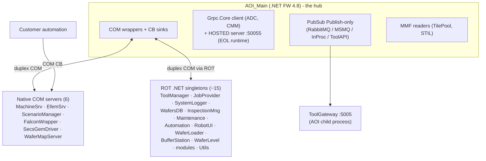

# 0 — Context & Case: Today's Architecture and Why We Change It

> Level: **decision**. What exists today (verified in the codebase), what it costs, what the migration buys, and what it costs to do — the condensed business case. Next: [01-system-architecture.md](01-system-architecture.md).

---

## 0.1 Current architecture (verified baseline)

AOI_Main is a **hub-and-spoke of bidirectional out-of-process COM**: ~21 counterparts, each pairing an outbound call with a `*CB` callback sink registered back into the hub.

Plus 3 Windows services per tool (DataServer, RMS tool service, FAR supervisor), the GEM stack (C# `SecsGemObjects` over the native Cimetrix driver — the fab-qualified wire), and file/DB channels.

### The seven verified pain points

| # | Today | Consequence |
|---|---|---|
| T1 | ~21 duplex COM links, callbacks with undefined failure semantics | A hung subscriber can stall the state machine or GUI; near-zero testability; COM/STA tribal knowledge required for every change |
| T2 | ~15 singleton **processes** (one `ComSingletonHolder` clone each) + 3 services | Install/monitor/restart/debug surface per process, ×100+ tools |
| T3 | AOI_Main **hosts** a gRPC server (:50055) on EOL Grpc.Core; the tool's genuinely externally-reachable unauthenticated listener is ToolGateway **:5005 on `0.0.0.0`** (installer opens an inbound firewall rule) | Dead runtime in the hub (:50055 is `Insecure` but **loopback-bound** — `clsCMM.cs:35`); a real unauthenticated network door at :5005 |
| T4 | Event "bus" is publish-only; the `Fire*` COM hub (`FalconWrapper.exe`) has no subscription model | Every new consumer edits publisher code; the early/late results race is undocumented |
| T5 | Publish path unbounded — `Thread.Sleep(1000)` + process spawn **on the scan thread**, no gRPC deadline | Scan-thread jeopardy whenever the gateway is down |
| T6 | Failed events → a dead-letter file **no code ever reads** | Silent, unrecoverable loss of data customers pay for |
| T7 | Everything terminates in AOI_Main | No tool telemetry when the GUI is closed — exactly when the fleet most needs it |

**Five live defects** were found in shipped code during this program's investigation, including a fleet-wide identity collision (every alphanumeric tool registers with Fleet as ToolId 0) and a timeout bug in a shared UI primitive (details: [05-roadmap-and-risks.md §5.5](05-roadmap-and-risks.md)).

## 0.2 What the migration buys (mapped against the pain)

| Gain | Against | Measure |
|---|---|---|
| Defined failure semantics — per-class delivery, per-subscriber isolation, poison containment | T1 | A hung consumer can no longer stall anything — contract-tested |
| Fewer processes | T2 | ~5–7 processes deleted; 3 Windows services → 1 (ToolHost) |
| No externally-reachable internal listeners; one audited door | T3 | :5005 (the real external door) retired; :50055 (already loopback-bound) contained early as EOL-runtime hygiene then deleted; SEMI-E187-class posture. **Net-surface caveat:** the new doors (:5007 command intake, :5060, :5100) must land their authn/authz (see security work-stream, [05-roadmap-and-risks.md §5.6](05-roadmap-and-risks.md)) or P1a *increases* command attack surface |
| Decoupling — consumers subscribe, publishers never change | T4 | New Fleet/MES/analytics consumer = a sink or subscription, zero AOI edits; the results race structurally closed (payload contract) |
| Scan thread protected | T5 | Publish = ≤1 ms enqueue, contract-enforced |
| Zero silent loss | T6 | Class-A disk journal + WAL + end-to-end acks — survives process/broker/gateway crashes |
| Tool visible when GUI closed | T7 | Gateway + bus run from boot under ToolHost |
| Testability, observability, onboarding | T1/T4 | Contract kits, fake-bus tests, per-topic counters, correlation IDs, mainstream patterns |

## 0.3 Costs and trade-offs (honest)

- **One new component to own** (the bus) — small by design; owner must be named before start; its riskiest internals were redesigned under adversarial review *before* implementation.
- **A multi-release program** — full scope 10–20 cycles, but the wave plan front-loads ~80% of the value into the first 3–4 cycles with two teams and **no fab re-qualification** in the funded scope.
- **Dual-run overhead during migration** — deliberate: every step reversible by a config flag within a defined retention window.
- **Explicitly untouched:** the fab-qualified GEM wire, the customer automation contract (FalconWrapper), motion COM, bulk-data MMF paths.

## 0.4 Recommendation

Adopt the four-lane target architecture as an ADR and fund Waves 0–2 ([05-roadmap-and-risks.md](05-roadmap-and-risks.md)). The design was stress-tested through four adversarial review cycles (consistency, feasibility-against-code, operations, concurrency, connectivity, load — thirteen reviewers), and a **fifth cycle adding the three dimensions the earlier cycles omitted — security, data-integrity, test-strategy** ([stage-review.md](stage-review.md)). That fifth cycle surfaced ≈8 design-decision gaps (durable-subscriber protocol, retained-state-after-restart, publisher epoch, WAL idempotency, the GEM degraded-contract implementation, a security work-stream that did not yet exist, and one verified-false code premise — the "transition-commit lock" that ToolManager does not actually have) — **all now resolved, every fork decided, the design READY** ([stage-review.md](stage-review.md) round-2). What remains is normal program governance — ratify the decisions, name owners (an existing pre-P0 criterion), routine P0 measurements, Wave-0 builds, the P3 code spike, one optional cross-team hardening, and one customer commissioning choice — not further design work. **Design-READY is not the same as cleared-to-fund** (which still needs those owners and P0 gates); that gap is ordinary program governance, not an open design defect. The alternative is still not free: it is the indefinite accrual of T1–T7, paid at an increasing rate as the COM expertise pool shrinks — but Waves 0–2 must be funded with those gaps closed, not around them.
