# 1 — System Architecture

> Level: **system** (processes on the tool PC and the tool's external connections).
> Up-link: why we change → [00-context-and-case.md](00-context-and-case.md).
> Down-links: AOI_Main internals → [02-aoi-architecture.md](02-aoi-architecture.md) · migration method → [03-appendix-four-lanes.md](03-appendix-four-lanes.md) · project impact → [04-impact-analysis.md](04-impact-analysis.md) · program plan → [05-roadmap-and-risks.md](05-roadmap-and-risks.md) · bus build spec → [06-bus-implementation.md](06-bus-implementation.md).

---

## 1.1 Architecture views

### View 1 — Context (highest level)

The tool has exactly **two doors** — GEM for the factory host, ToolConnect for everything else — one internal **fabric**, and the **machine core** doing the work.

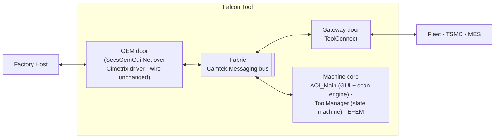

### View 2 — Process view

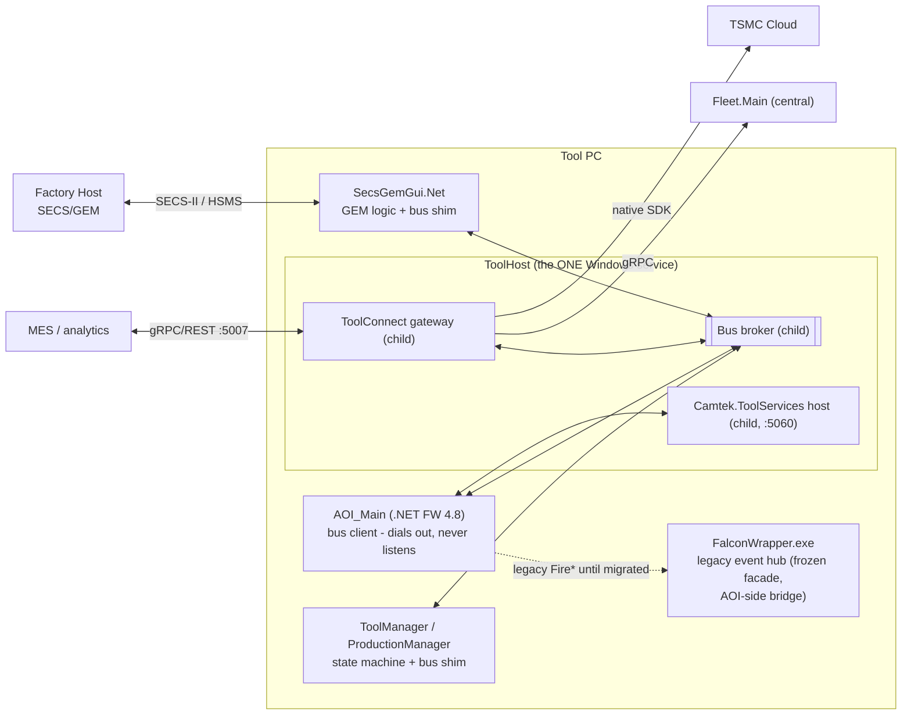

### View 3 — Component view (system altitude)

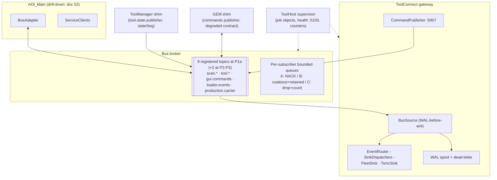

## 1.2 System communication flows

### Flow SYS-1 — wafer scan results, operator → cloud (class A, zero silent loss)

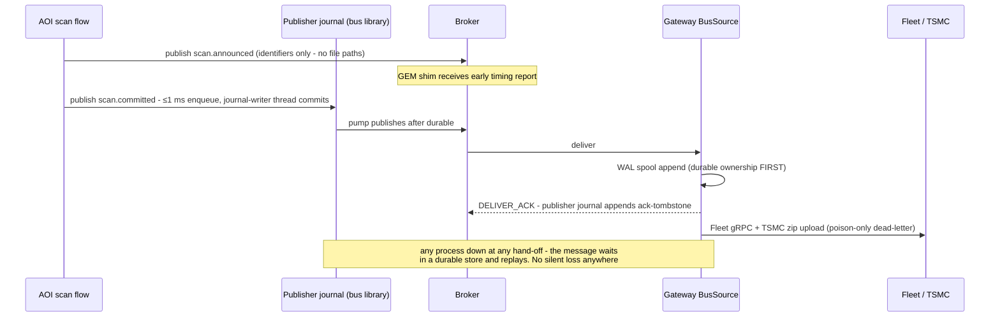

### Flow SYS-2 — factory-host command (wire unchanged)

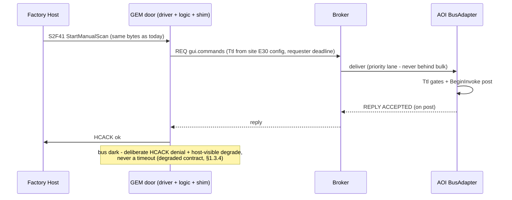

### Flow SYS-3 — external command (MES, new capability)

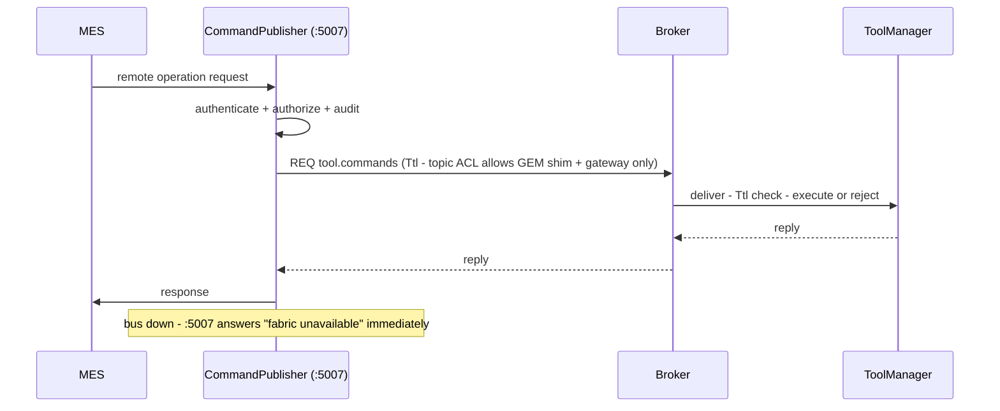

### Flow SYS-4 — degraded mode (broker restart)

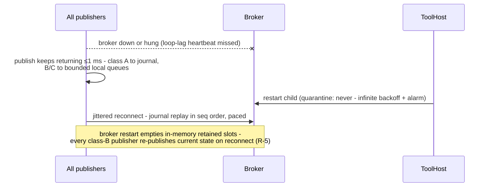

## 1.3 System-level new components — complete designs

### 1.3.1 Bus broker (`Camtek.Messaging.Broker`)

**Responsibility:** route typed topic messages between local processes with per-class delivery guarantees. Holds **no business logic and no persistence** — durability lives at the edges.

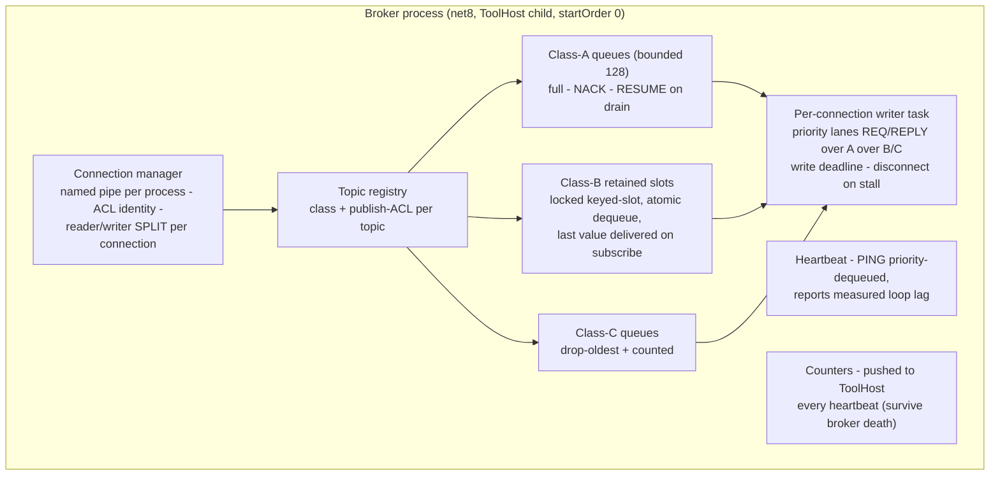

Key decisions: E2E-ack per **(message, declared durable-subscriber set)** — durable subscribers are a **static topic-registry property** (e.g. `scan.committed → {ToolGateway}`), so a merely *disconnected* durable subscriber (gateway restart) does **not** shrink the set — the message waits in the publisher journal and redelivers (this closes the gateway-restart silent-loss channel, R-1); only a genuinely **gateway-disabled** tool (no *declared* durable subscriber, set by signed profile) acks immediately; identity is the **OS-authenticated pipe account**, not a self-asserted `sourceName` (R-7); loop-lag heartbeat so ToolHost distinguishes *degraded* from *hung*; `quarantine: never` + `priorityClass: AboveNormal`.

**Flow — class-A delivery with a slow subscriber:** deliver → subscriber queue fills → `NACK` (message stays in the *publisher's* journal, broker memory bounded) → queue drains → `RESUME` → publisher redelivers in seq order with a bounded in-flight window. The broker can never be OOM'd by its slowest consumer.

### 1.3.2 ToolConnect gateway (evolved ToolGateway)

**Responsibility:** the tool's only door besides GEM — events out (Fleet/TSMC), authorized commands in (MES/CMM). ~70% exists today with tests; the additions:

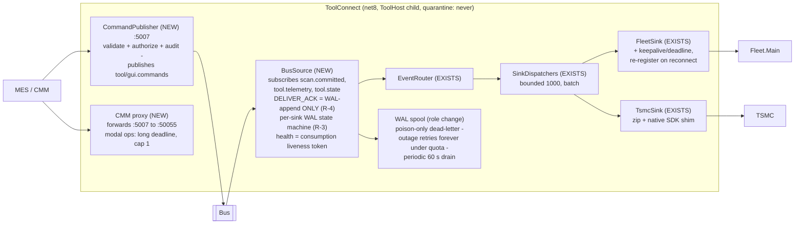

**Flow — outage recovery:** sink down → messages sit in the WAL spool (DELIVER_ACK already sent on WAL append — **not** gated on sink routing, R-4) → periodic drain retries at a capped rate, oldest-first, interleaved with live traffic → a one-hour outage drains in <10 min without any restart. Each WAL entry tracks **per-sink** completion (R-3), so a message delivered to Fleet but pending for TSMC is retried only to TSMC, never re-sent to Fleet. Dead-lettering happens only for *poison* (fails while the sink is connected). At WAL quota the gateway **withholds DELIVER_ACK** (backpressure to the alarmed publisher journal) rather than dropping — loss is never taken at the sink hop (R-4).

### 1.3.3 ToolHost supervisor

**Responsibility:** the single Windows service (3 → 1); supervises the tool's headless children with job objects, per-child restart classes, and the tool's health/diagnostics surface.

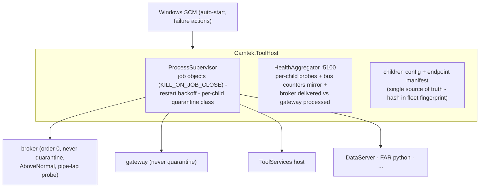

**Flow — crash containment:** child exits → log + backoff restart → `maxPerHour` exceeded → *leaf* children quarantine (siblings unaffected); **broker/gateway never quarantine** (infinite max-backoff restarts + escalating alarm — a dark fabric costs more than a 2-minute retry). A killed ToolHost tears down all children via job objects — no orphans, ever.

### 1.3.4 GEM shim (inside `SecsGemObjects` / SecsGemGui.Net — plain C#)

**Responsibility:** the only change at the GEM door. Publishes host commands to the bus; subscribes to state/results for host event reports. The Cimetrix driver and E30/E87 logic are untouched — host wire behavior is byte-identical.

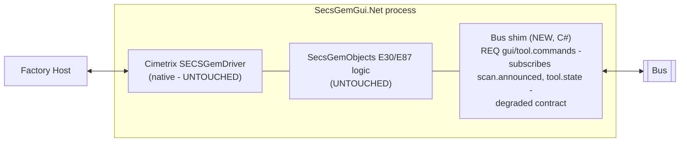

**Degraded contract — an explicit 4-state machine (resolves R-6).** The fab-facing promise is: *the fab never discovers a bus outage through mysterious host timeouts.* The shim is a state machine over **HSMS × bus**, not two booleans, and it **starts in the degraded state** — it leaves only when a bus **handshake** (a real REQ/PONG round-trip, not a `Health.IsConnected` flag read) completes:

| HSMS | Bus | Shim behavior |
|---|---|---|
| up | up (handshake done) | Normal. Host commands → REQ `gui/tool.commands`; **REMOTE is host/operator-granted** (the shim never auto-grants). |
| up | **down/hung** | Host-visible control state → **ONLINE-LOCAL** + dedicated alarm CEID; REMOTE refused; a host command is answered with a deliberate **HCACK denial**, *decided on the reader thread and returned immediately* — never a `Task.Wait` that parks the SECS reader for ~Ttl (the exact timeout the contract forbids). The command is completed **asynchronously off the reader thread** within the E30 window. |
| down | up | Bus fine, no host — nothing to report; shim idle. |
| down | down | Both alarms; recovery re-handshakes bus, host re-selects. |

**"Bus available" is the composite signal** — connected AND heartbeat-fresh AND loop-lag < L — not the raw socket flag (a hung broker holds the pipe open). On recovery the shim returns to **ONLINE-LOCAL and lets the host re-grant REMOTE** (auto-promotion to REMOTE is a compliance bug). `SecsGemGui.Net` is a **ToolHost-supervised child** with startOrder > broker (it was previously unmanaged, so its handshake had no ordering guarantee).

**No missed E30 transitions (resolves the class-B gap, DI-8).** `tool.state` stays class-B/retained for the *current-state* consumers, but the GEM shim additionally subscribes to a small **bounded last-N transition ring** (the last N `tool.state` transitions, N ≈ 16) republished by ToolManager, so after a reconnect blip the shim replays the intermediate transitions — e.g. an `Engineering → EngineeringToProduction → Engineering` failure cycle — and reports every E30 CEID the host expects. This makes the design independent of a per-site "does the host need intermediate transitions?" answer: it always delivers them, so **no per-site host sign-off is required**. (`stateSeq` already lets the shim *detect* a gap; the ring lets it *recover* one.)

**Standing (a normal P0 gate, not a design gap):** the Ttl margin `ttl + margin < E30` uses per-site E30 timeouts — a **P0 measurement of the same class the design already carries** (group-commit interval, single-instance ceilings, TsmcSink service time; §5.2 Wave 0). The shim **asserts `ttl + margin < E30` at config load and fails loudly** if a site's config violates it, so a bad number is caught at startup, never in production. The machine is fully specified; the numbers are measured at P0 like every other tool.

## 1.4 Cross-cutting contracts (summary — normative text in the proposal set)

| Contract | Rule |
|---|---|
| **Durability classes** | **A** never-lose (journal + WAL + **declared-durable-subscriber** E2E ack, R-1; dedup keyed by `(source, epoch, topic, seq)`, R-2): `scan.committed` · **A-ErrorsOnly** never-lose up to the storm-cap, drop+count beyond (honest bound ~2.8 h at 10/s/source): error telemetry · **B** latest-wins, retained, republished-on-reconnect (R-5): `tool.state`, `production.carrier` · **C** best-effort, counted drops: `scan.announced`, `loader.events`, `scan.operations` · **R-R** commands: Ttl + dequeue-gate + reply cache — at-most-once effect, never late |
| **Publish bound** | ≤1 ms unconditional (lock-free enqueue; single journal-writer thread group-commits off the caller) — contract-tested under disk co-load |
| **Payload contract** | `scan.announced` carries **no file paths** — a mis-wired consumer cannot read half-copied files |
| **Security** (R-7 — see [§6.8](06-bus-implementation.md)) | Publish ACLs key on the **OS-authenticated pipe account** (distinct service accounts per privileged publisher), never a self-asserted `sourceName`; default-deny; **signed+verified child manifest** (fail-closed); `:5007` default-deny, authenticated (**mTLS — decided**; Windows-auth fallback), minimum-interface bound + rate-limited; spool/journal/dead-letter at-rest ACLs; **append-only off-bus audit** before publish. Owner: Security (Ofek Harel) — a P1a entry criterion |
| **Storm control** | Error telemetry coalesced per `(source, errorCode)` + token bucket in the library — a flapping sensor costs summaries, not 300k journaled messages |
| **Endpoints** | One ToolHost-owned manifest; endpoint hash in the fleet fingerprint; DNS for Fleet |
| **Ports** | :5007 gateway commands · :5060 ToolServices · :5100 ToolHost health · :5050 Fleet (remote) · retired: :5005; contained→retired: :50055. The bus uses **no ports** (named pipes) |

Load: nominal <1 msg/s, wafer bursts ~50, storms capped at 10/s per source — every buffer is sized against this model with 4–5 orders of magnitude of single-instance headroom (no load balancing needed on-tool; fleet-side herd control via jitter + drain caps).
