# 1 — System Architecture

> Level: **system** (processes on the tool PC and the tool's external connections).
> Up-link: why we change → [00-context-and-case.md](00-context-and-case.md).
> Down-links: AOI_Main internals → [02-aoi-architecture.md](02-aoi-architecture.md) · migration method → [03-appendix-four-lanes.md](03-appendix-four-lanes.md) · project impact → [04-impact-analysis.md](04-impact-analysis.md) · program plan → [05-roadmap-and-risks.md](05-roadmap-and-risks.md) · bus build spec → [06-bus-implementation.md](06-bus-implementation.md).

---

## 1.1 Architecture views

### View 1 — Context (highest level)

The tool has exactly **two doors** — GEM for the factory host, ToolConnect for everything else — one internal **fabric**, and the **machine core** doing the work.

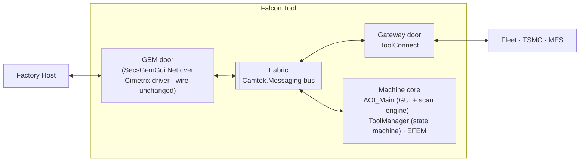

### View 2 — Process view

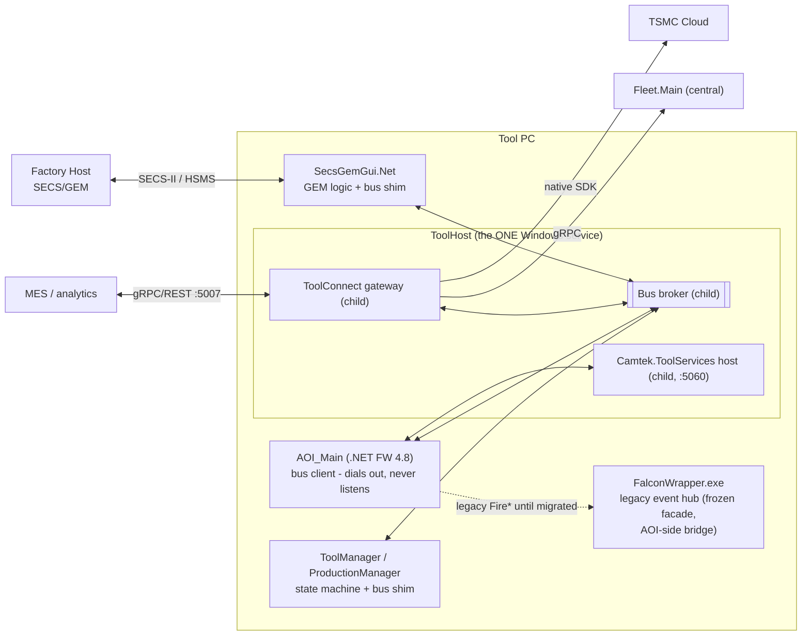

### View 3 — Component view (system altitude)

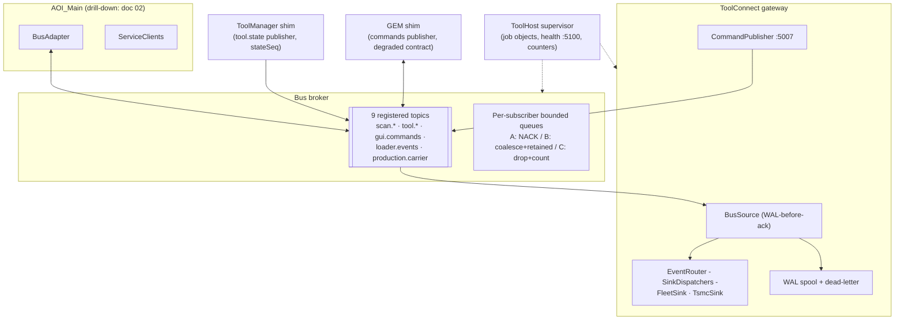

## 1.2 System communication flows

### Flow SYS-1 — wafer scan results, operator → cloud (class A, zero silent loss)

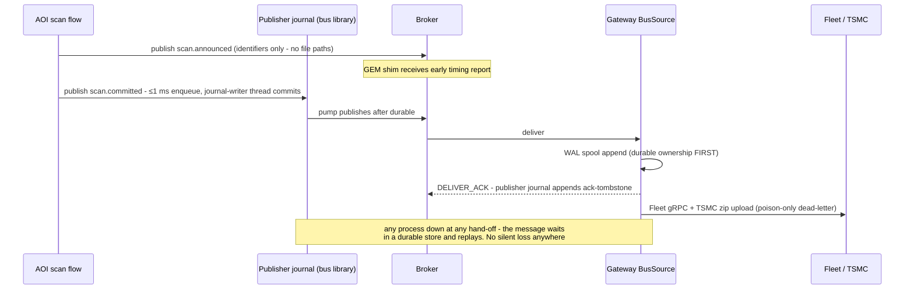

### Flow SYS-2 — factory-host command (wire unchanged)

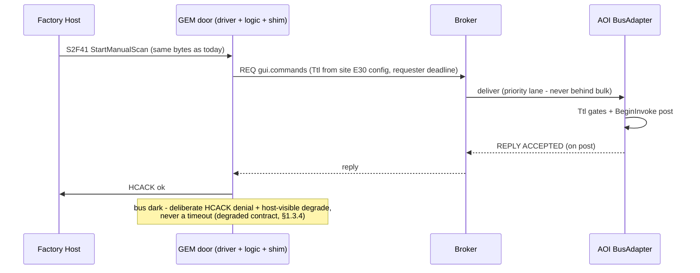

### Flow SYS-3 — external command (MES, new capability)

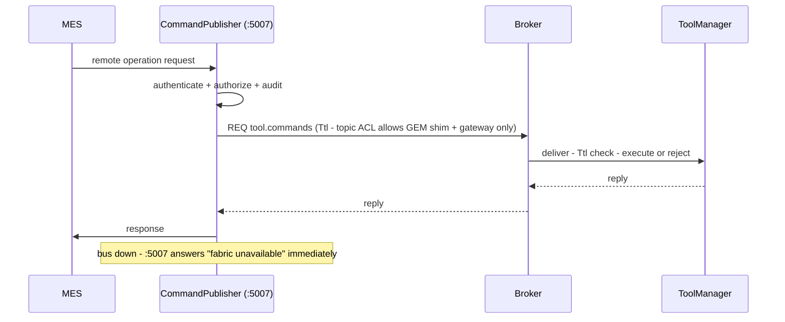

### Flow SYS-4 — degraded mode (broker restart)

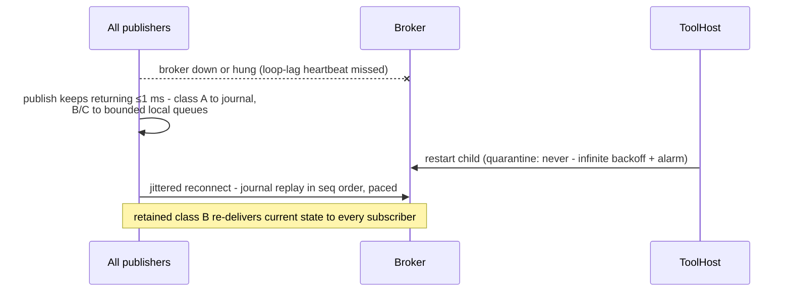

## 1.3 System-level new components — complete designs

### 1.3.1 Bus broker (`Camtek.Messaging.Broker`)

**Responsibility:** route typed topic messages between local processes with per-class delivery guarantees. Holds **no business logic and no persistence** — durability lives at the edges.

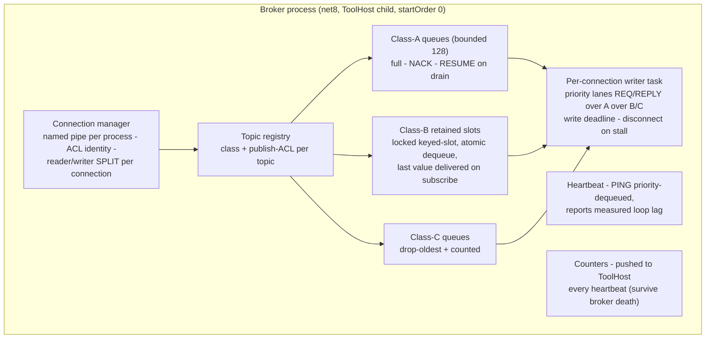

Key decisions: E2E-ack per **(message, subscriber-set snapshot at PUB)** — a disconnecting subscriber leaves every pending set (its durability claim ends with registration); zero-durable-subscriber publish acks immediately (no journal leak on gateway-disabled tools); loop-lag heartbeat so ToolHost distinguishes *degraded* from *hung*; `quarantine: never` + `priorityClass: AboveNormal`.

**Flow — class-A delivery with a slow subscriber:** deliver → subscriber queue fills → `NACK` (message stays in the *publisher's* journal, broker memory bounded) → queue drains → `RESUME` → publisher redelivers in seq order with a bounded in-flight window. The broker can never be OOM'd by its slowest consumer.

### 1.3.2 ToolConnect gateway (evolved ToolGateway)

**Responsibility:** the tool's only door besides GEM — events out (Fleet/TSMC), authorized commands in (MES/CMM). ~70% exists today with tests; the additions:

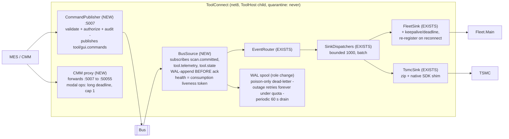

**Flow — outage recovery:** sink down → messages sit in the WAL spool (already appended pre-ack) → periodic drain retries at a capped rate, oldest-first, interleaved with live traffic → a one-hour outage drains in <10 min without any restart. Dead-lettering happens only for *poison* (fails while the sink is connected).

### 1.3.3 ToolHost supervisor

**Responsibility:** the single Windows service (3 → 1); supervises the tool's headless children with job objects, per-child restart classes, and the tool's health/diagnostics surface.

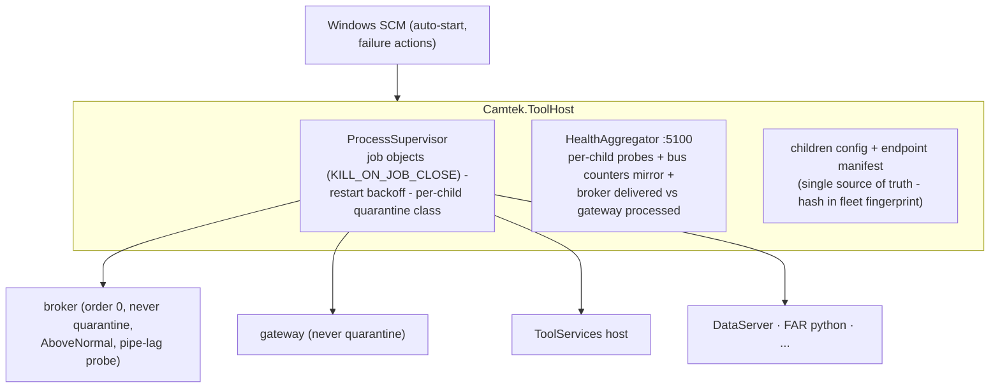

**Flow — crash containment:** child exits → log + backoff restart → `maxPerHour` exceeded → *leaf* children quarantine (siblings unaffected); **broker/gateway never quarantine** (infinite max-backoff restarts + escalating alarm — a dark fabric costs more than a 2-minute retry). A killed ToolHost tears down all children via job objects — no orphans, ever.

### 1.3.4 GEM shim (inside `SecsGemObjects` / SecsGemGui.Net — plain C#)

**Responsibility:** the only change at the GEM door. Publishes host commands to the bus; subscribes to state/results for host event reports. The Cimetrix driver and E30/E87 logic are untouched — host wire behavior is byte-identical.

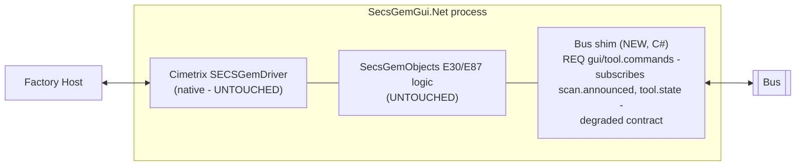

**Degraded contract (the fab-facing rule):** four HSMS×bus states are defined; the critical one — *HSMS up / bus down* — forces the shim to degrade the **host-visible control state** (ONLINE-LOCAL / dedicated alarm, REMOTE grant refused) and answer commands with a deliberate HCACK denial code, so the fab never discovers a tool outage through mysterious timeouts. The shim's first action at start is a bus handshake **before** enabling REMOTE; retained `tool.state` removes staleness on reconnect.

## 1.4 Cross-cutting contracts (summary — normative text in the proposal set)

| Contract | Rule |
|---|---|
| **Durability classes** | **A** never-lose (journal + WAL + subscriber-set E2E ack): `scan.committed`, error telemetry · **B** latest-wins, retained: `tool.state`, `production.carrier` · **C** best-effort, counted drops: `scan.announced`, `loader.events`, `scan.operations` · **R-R** commands: Ttl + dequeue-gate + reply cache — at-most-once effect, never late |
| **Publish bound** | ≤1 ms unconditional (lock-free enqueue; single journal-writer thread group-commits off the caller) — contract-tested under disk co-load |
| **Payload contract** | `scan.announced` carries **no file paths** — a mis-wired consumer cannot read half-copied files |
| **Security** | Pipe ACLs (identity per connection); per-topic publish ACLs (`*.commands` = GEM shim + gateway only); no internal TCP listeners; one audited external door (:5007) |
| **Storm control** | Error telemetry coalesced per `(source, errorCode)` + token bucket in the library — a flapping sensor costs summaries, not 300k journaled messages |
| **Endpoints** | One ToolHost-owned manifest; endpoint hash in the fleet fingerprint; DNS for Fleet |
| **Ports** | :5007 gateway commands · :5060 ToolServices · :5100 ToolHost health · :5050 Fleet (remote) · retired: :5005; contained→retired: :50055. The bus uses **no ports** (named pipes) |

Load: nominal <1 msg/s, wafer bursts ~50, storms capped at 10/s per source — every buffer is sized against this model with 4–5 orders of magnitude of single-instance headroom (no load balancing needed on-tool; fleet-side herd control via jitter + drain caps).
