# 1 — System Architecture

> Level: **system** (processes on the tool PC and the tool's external connections).
> Up-link: why we change → [00-context-and-case.md](00-context-and-case.md).
> Down-links: AOI_Main internals → [02-aoi-architecture.md](02-aoi-architecture.md) · migration method → [03-appendix-four-lanes.md](03-appendix-four-lanes.md) · project impact → [04-impact-analysis.md](04-impact-analysis.md) · program plan → [05-roadmap-and-risks.md](05-roadmap-and-risks.md) · bus build spec → [06-bus-implementation.md](06-bus-implementation.md).

---

## 1.1 Architecture views

### View 1 — Context (highest level)

The tool has exactly **two doors** — GEM for the factory host, ToolConnect for everything else — one internal **fabric**, and the **machine core** doing the work.

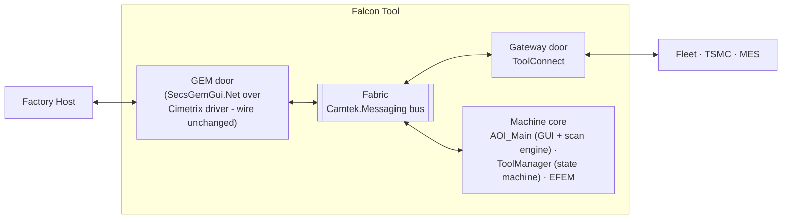

### View 2 — Process view

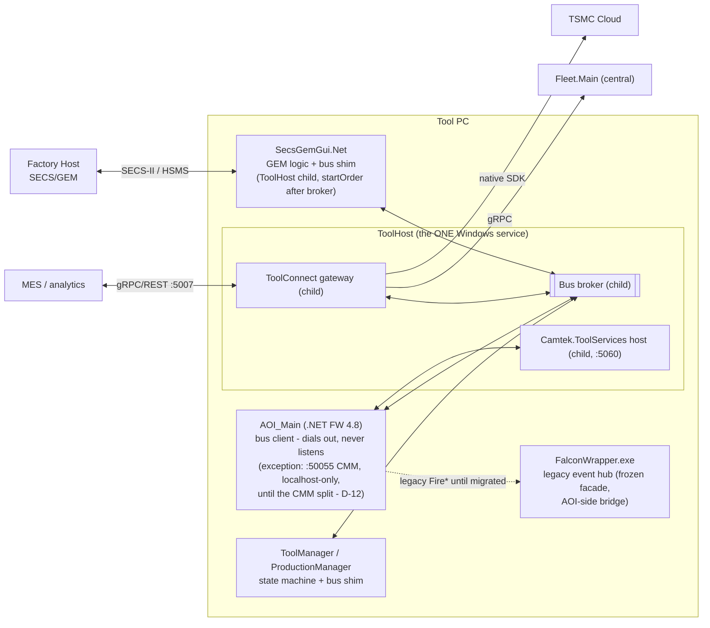

### View 3 — Component view (system altitude)

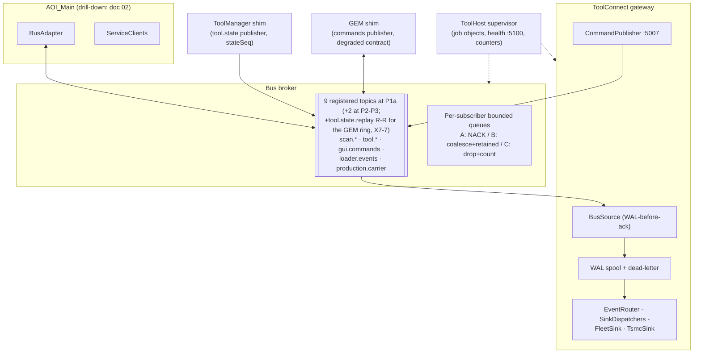

## 1.2 System communication flows

### Flow SYS-1 — wafer scan results, operator → cloud (class A, zero silent loss)

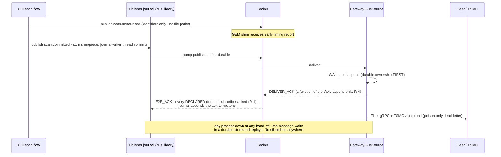

### Flow SYS-2 — factory-host command (wire unchanged)

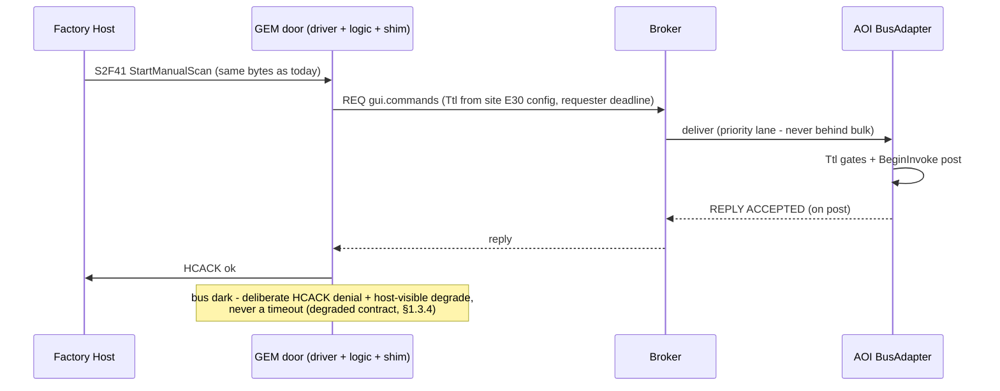

### Flow SYS-3 — external command (MES, new capability)

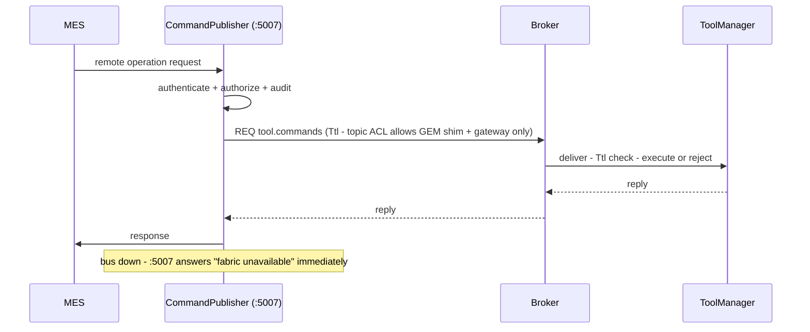

### Flow SYS-4 — degraded mode (broker restart)

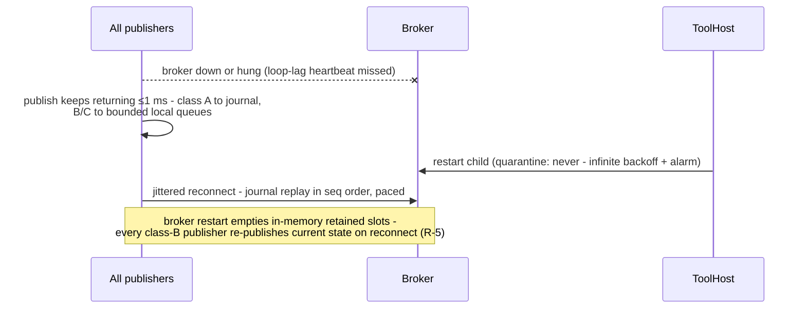

## 1.3 System-level new components — complete designs

### 1.3.1 Bus broker (`Camtek.Messaging.Broker`)

**Responsibility:** route typed topic messages between local processes with per-class delivery guarantees. Holds **no business logic and no persistence** — durability lives at the edges.

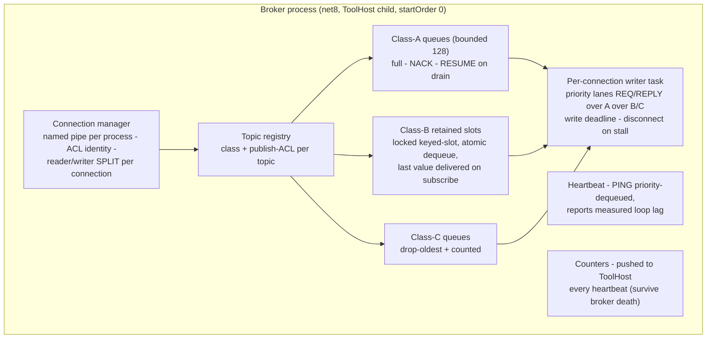

Key decisions: E2E-ack per **(message, declared durable-subscriber set)** — durable subscribers are a **static topic-registry property** (e.g. `scan.committed → {ToolGateway}`), so a merely *disconnected* durable subscriber (gateway restart) does **not** shrink the set — the message waits in the publisher journal and redelivers (this closes the gateway-restart silent-loss channel, R-1); only a genuinely **gateway-disabled** tool (no *declared* durable subscriber, set by signed profile) acks immediately; identity is the **OS-authenticated pipe account**, not a self-asserted `sourceName` (R-7); loop-lag heartbeat so ToolHost distinguishes *degraded* from *hung*; `quarantine: never` + `priorityClass: AboveNormal`.

**Flow — class-A delivery with a slow subscriber:** deliver → subscriber queue fills → `NACK` (message stays in the *publisher's* journal, broker memory bounded) → queue drains → `RESUME` → publisher redelivers in seq order with a bounded in-flight window. The broker can never be OOM'd by its slowest consumer.

### 1.3.2 ToolConnect gateway (evolved ToolGateway)

**Responsibility:** the tool's only door besides GEM — events out (Fleet/TSMC), authorized commands in (MES/CMM). ~70% exists today with tests; the additions:

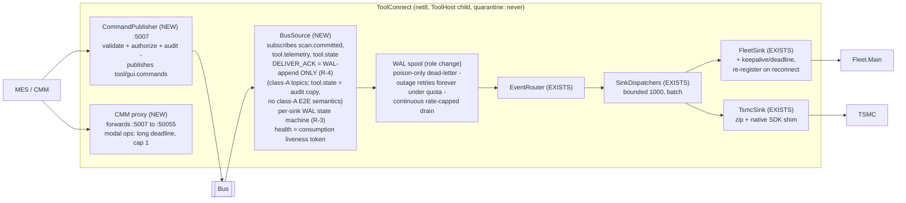

**Flow — outage recovery:** sink down → messages sit in the WAL spool (DELIVER_ACK already sent on WAL append — **not** gated on sink routing, R-4) → periodic drain retries at a capped rate, oldest-first, interleaved with live traffic → a one-hour outage drains in <10 min without any restart. Each WAL entry tracks **per-sink** completion (R-3), so a message delivered to Fleet but pending for TSMC is retried only to TSMC, never re-sent to Fleet. Dead-lettering happens only for *poison* (fails while the sink is connected). At WAL quota the gateway **withholds DELIVER_ACK** (backpressure to the alarmed publisher journal) rather than dropping — loss is never taken at the sink hop (R-4).

**Complete internal design** (WAL entry state machine, class design, CommandPublisher pipeline, CMM proxy, threading model, failure matrix): **[07-toolconnect-design.md](07-toolconnect-design.md)** — this section is the system-altitude view only.

### 1.3.3 ToolHost supervisor

**Responsibility:** the single Windows service (3 → 1); supervises the tool's headless children with job objects, per-child restart classes, and the tool's health/diagnostics surface.

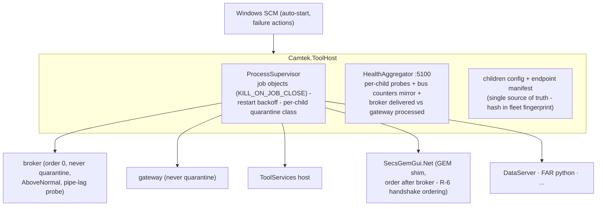

**Flow — crash containment:** child exits → log + backoff restart → `maxPerHour` exceeded → *leaf* children quarantine (siblings unaffected); **broker/gateway never quarantine** (infinite max-backoff restarts + escalating alarm — a dark fabric costs more than a 2-minute retry). A killed ToolHost tears down all children via job objects — no orphans, ever.

**Graceful stop vs supervision (M-19/CC7-9).** A `SERVICE_CONTROL_STOP` sets a supervisor-level **`Stopping` latch *before* the first drain signal**; while `Stopping`, any child exit is treated as **final** — no restart, no alarm escalation — so the reverse-order drain (R-OPS-3) is not fought by the `quarantine: never` restart loop it would otherwise trigger (which would restart the broker/gateway mid-drain and then job-object-kill the fresh instance). `OnStop` = set latch → `await StopAllAsync` (reverse startOrder, per-child drain timeout) → cancel the run token. Supervision is suspended for the duration of an ordered stop.

**Class design** (realized in [codeSnippets/14-toolhost.cs](codeSnippets/14-toolhost.cs)):

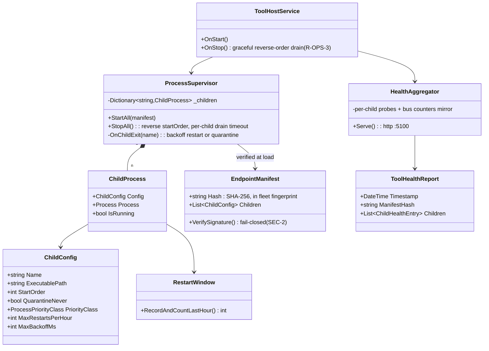

### 1.3.4 GEM shim (inside `SecsGemObjects` / SecsGemGui.Net — plain C#)

**Responsibility:** the only change at the GEM door. Publishes host commands to the bus; subscribes to state/results for host event reports. The Cimetrix driver and E30/E87 logic are untouched — host wire behavior is byte-identical **for events and state**; the async host-command *accept* path shifts to HCACK=4 (see below, X7-8), a host-visible change carried in the P4/P5 re-qual budget.

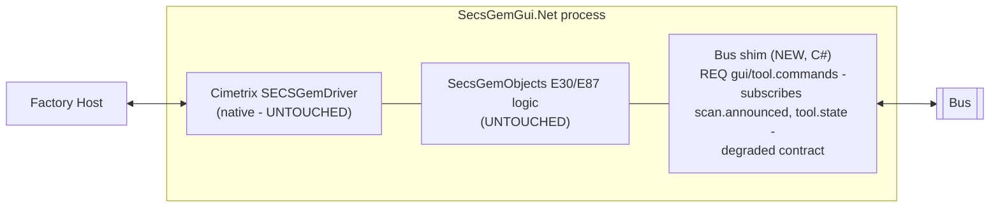

**Degraded contract — an explicit 4-state machine (resolves R-6).** The fab-facing promise is: *the fab never discovers a bus outage through mysterious host timeouts.* The shim is a state machine over **HSMS × bus**, not two booleans, and it **starts in the degraded state** — it leaves only when a bus **handshake** (a real REQ/PONG round-trip, not a `Health.IsConnected` flag read) completes:

| HSMS | Bus | Shim behavior |
|---|---|---|
| up | up (handshake done) | Normal. Host commands → REQ `gui/tool.commands`; **REMOTE is host/operator-granted** (the shim never auto-grants). |
| up | **down/hung** | Host-visible control state → **ONLINE-LOCAL** + dedicated alarm CEID; REMOTE refused; a host command is answered with a deliberate **HCACK denial**, *decided on the reader thread and returned immediately* — never a `Task.Wait` that parks the SECS reader for ~Ttl (the exact timeout the contract forbids). |
| down | up | Bus fine, no host — nothing to report; shim idle. |
| down | down | Both alarms; recovery re-handshakes bus, host re-selects. |

**The async-accept path uses HCACK=4, not HCACK=0-on-completion (X7-8 — a host-visible change, so scoped honestly).** A normal-state host command that must complete off the reader thread is answered with **`eCmdPerformLater` (HCACK=4)** — "accepted, will be performed later" — with the true outcome delivered as a **named completion CEID**; `IGemTransaction.CompleteHcack` *raises that event*. This is what the untouched Cimetrix driver actually offers: its `IE30CommandCB.CommandCalled([in,out] eCommandResults)` derives HCACK from the value written **before the callback returns** — there is no deferred-reply handle, so "accepted, completed async as HCACK=0" is impossible without parking the reader (the thing R-6 forbids). Consequently the **"byte-identical host wire" claim holds for events and state but *not* for host commands** — the accept path changes the HCACK sequence and is therefore in the **P4/P5 host-requalification budget** ([04 §4.2](04-impact-analysis.md)), not the untouched core. The *denial* path is unchanged (reader-thread HCACK denial). **"Bus available" is the composite signal** — connected AND heartbeat-fresh AND loop-lag < L — not the raw socket flag (a hung broker holds the pipe open). On recovery the shim returns to **ONLINE-LOCAL and lets the host re-grant REMOTE** (auto-promotion to REMOTE is a compliance bug). `SecsGemGui.Net` is a **ToolHost-supervised child** with startOrder > broker (it was previously unmanaged, so its handshake had no ordering guarantee).

**No missed E30 transitions (resolves the class-B gap, DI-8) — via a registered replay topic, not prose (X7-7).** `tool.state` stays class-B/retained for the *current-state* consumers, but the GEM shim additionally recovers the last-N transitions after a reconnect blip through **`tool.state.replay`, a registered R-R topic** ([06 §6.6](06-bus-implementation.md)) served by the ToolManager shim from a bounded last-N buffer the R-8 fan-out worker appends to (§2.4 produces exactly the `(prev, new, seq)` records it needs). So the shim replays the intermediate transitions — e.g. an `Engineering → EngineeringToProduction → Engineering` failure cycle — and reports every E30 CEID the host expects. This is a first-class topic with an ACL, counted in View 3 — the earlier "bounded last-N ring republished by ToolManager" named no topic, no server, and no storage (class-B retains only the *last* value), so it had no mechanism. **`ToolStatePayload` carries `PrevState` (M-8)** because the live E30 mapping dispatches on `(prev, curr)` edges (`AlarmsManager`, `E30Client`); the first retained delivery after subscribe is marked a snapshot (`prev = unknown`) and consumers run no edge logic on it. N ≈ 16 is validated against a P0 "max transitions per outage window" measurement (§5.2), not asserted. (`stateSeq`, ordered as `(SourceEpoch, StateSeq)` so a ToolManager restart cannot freeze it — M-9 — lets the shim *detect* a gap; the replay topic lets it *recover* one.)

**Standing (a normal P0 gate, not a design gap):** the Ttl margin `ttl + margin < E30` uses per-site E30 timeouts — a **P0 measurement of the same class the design already carries** (group-commit interval, single-instance ceilings, TsmcSink service time; §5.2 Wave 0). The shim **asserts `ttl + margin < E30` at config load and fails loudly** if a site's config violates it, so a bad number is caught at startup, never in production. The machine is fully specified; the numbers are measured at P0 like every other tool.

**Class design** (realized in [codeSnippets/13-gem-shim.cs](codeSnippets/13-gem-shim.cs) — normative where the sketch diverges, per S-10/S-16):

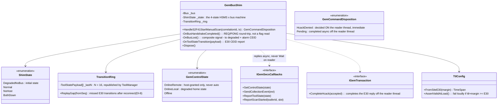

### 1.3.5 ToolServices host (`Camtek.ToolServices.Host`, :5060)

**Responsibility:** the **one** gRPC host for the service-shaped internals that Lane B migrates (SystemLogger pilot, then JobProvider/WafersDB/InspectionMng/Maintenance/Automation as census-gated modules) — never six processes. Host-side only; the mandatory *client* policy (deadline, breaker, fallback) is the consumer's contract ([02 §2.5](02-aoi-architecture.md)); the migration method is Lane B's ([03](03-appendix-four-lanes.md)).

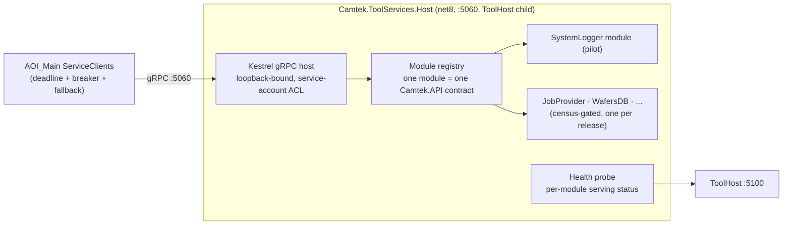

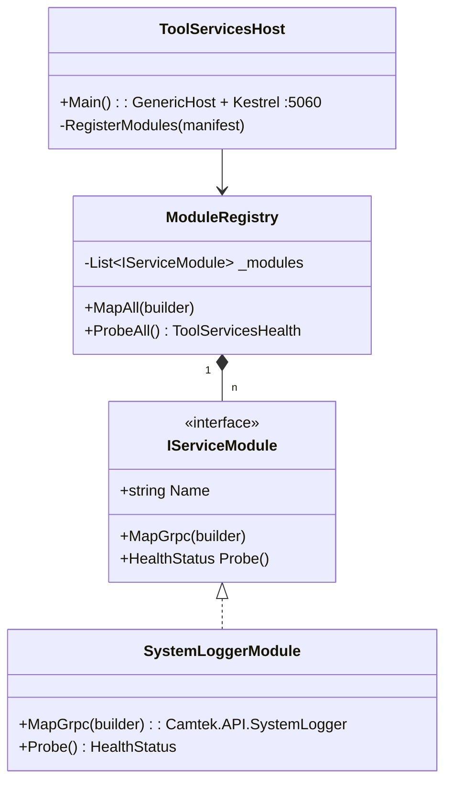

**Flow — request:** consumer proxy (3 s deadline) → Kestrel → module → response; module down ≠ host down (per-module serving status); host down → consumer's breaker opens → per-service fallback (e.g. logging falls back to a local file — never blocks, never loses). **Contracts:** loopback-bound + service-account ACL (not externally reachable — external callers come only through ToolConnect); one `Camtek.API.*` contract per module, additive-only versioning; ToolHost child (normal quarantine class — a leaf, unlike broker/gateway); health probed per module into :5100. **Deliberately thin:** the host is Kestrel boilerplate by design — the per-service design weight lives in each module's contract + result-equivalence tests (Lane B gate), not in the host.

## 1.4 Cross-cutting contracts (summary — normative text in the proposal set)

| Contract | Rule |
|---|---|
| **Durability classes** | **A** never-lose (journal + WAL + **declared-durable-subscriber** E2E ack, R-1; dedup keyed by `(source, epoch, topic, seq)`, R-2): `scan.committed` · **A-ErrorsOnly** never-lose up to the storm-cap, drop+count beyond (honest bound ~2.8 h at 10/s/source): error telemetry · **B** latest-wins, retained, republished-on-reconnect (R-5): `tool.state`, `production.carrier` · **C** best-effort, counted drops: `scan.announced`, `loader.events`, `scan.operations` · **R-R** commands: Ttl + dequeue-gate + reply cache — at-most-once effect, never late |
| **Publish bound** | ≤1 ms unconditional (lock-free enqueue; single journal-writer thread group-commits off the caller) — contract-tested under disk co-load |
| **Payload contract** | `scan.announced` carries **no file paths** — a mis-wired consumer cannot read half-copied files |
| **Security** (R-7 — see [§6.8](06-bus-implementation.md)) | Publish ACLs key on the **OS-authenticated pipe account** (distinct service accounts per privileged publisher), never a self-asserted `sourceName`; default-deny; **signed+verified child manifest** (fail-closed); `:5007` default-deny, authenticated (**mTLS — decided**; Windows-auth fallback), minimum-interface bound + rate-limited; spool/journal/dead-letter at-rest ACLs; **append-only off-bus audit** before publish. Owner: Security (Ofek Harel) — a P1a entry criterion |
| **Storm control** | Error telemetry coalesced per `(source, errorCode)` + token bucket in the library — a flapping sensor costs summaries, not 300k journaled messages |
| **Endpoints** | One ToolHost-owned manifest; endpoint hash in the fleet fingerprint; DNS for Fleet |
| **Ports (with binding — SEC7-3/4/8)** | :5007 gateway commands (**MES VLAN**, mTLS, per-op authz) · :5060 ToolServices (**loopback**, svc-account ACL) · :5100 ToolHost health (**loopback/mgmt iface**, authenticated — an open :5100 leaks the manifest hash) · gateway diagnostic REST (**loopback**, own authn) · :5050 Fleet egress (**outbound**, cleartext today — residual accepted risk, M-15) · retired: :5005; contained→retired: :50055 (loopback). The bus uses **no ports** (named pipes) |

Load: nominal <1 msg/s, wafer bursts ~50, storms capped at 10/s per source — every buffer is sized against this model with 4–5 orders of magnitude of single-instance headroom (no load balancing needed on-tool; fleet-side herd control via jitter + drain caps).
