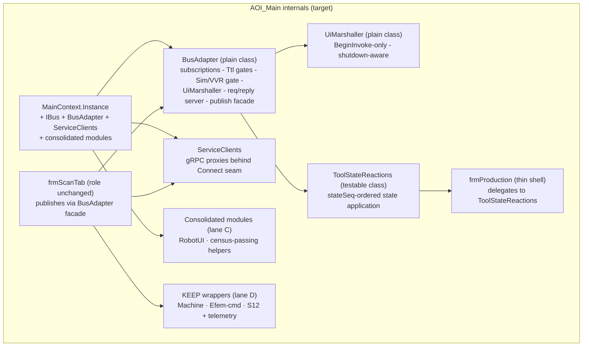
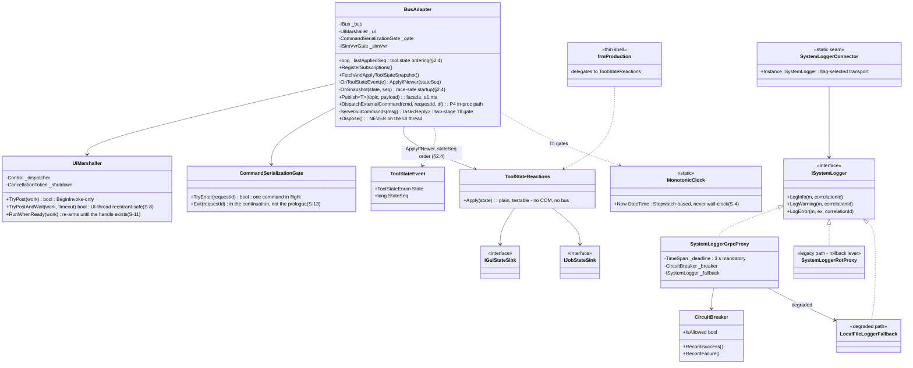
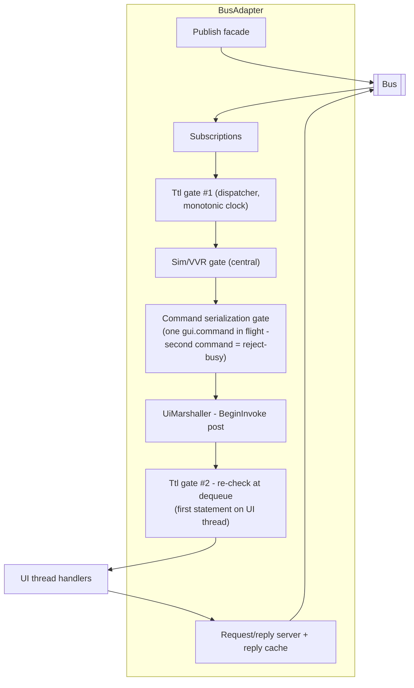
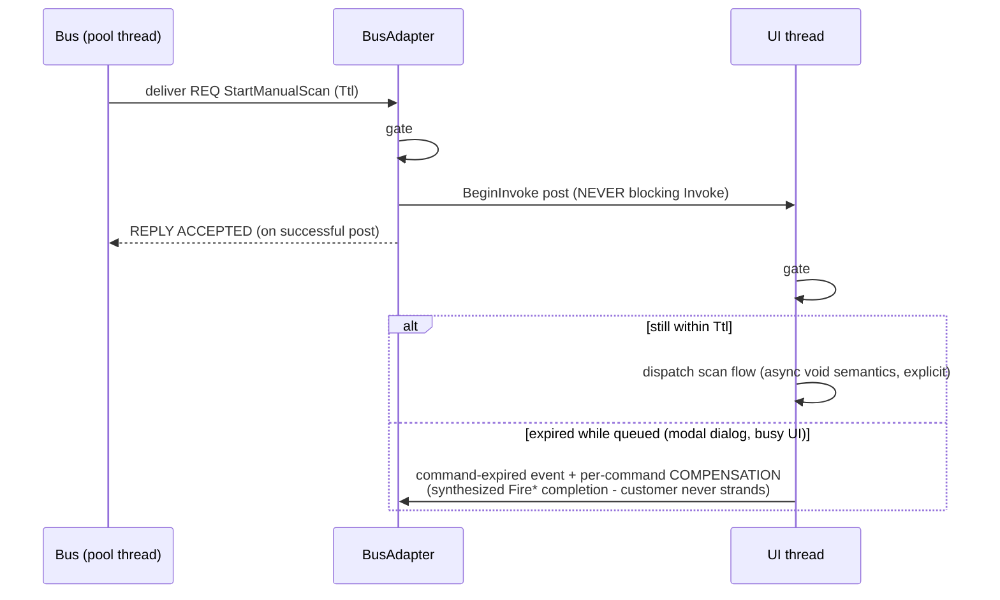
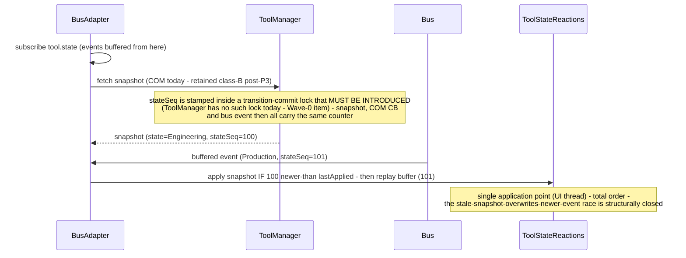
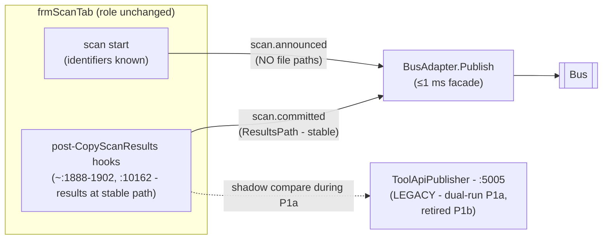
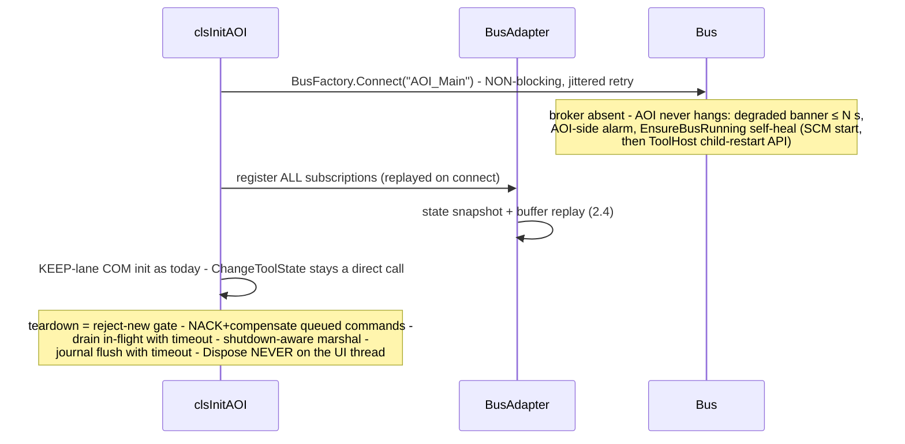

# 2 — AOI_Main Architecture (drill-down)

> Level: **process internals** of the hub (`apps\Falcon.Net`, .NET FW 4.8).
> Up-link: system context → [01-system-architecture.md](01-system-architecture.md).
> Down-links: migration method per link → [03-appendix-four-lanes.md](03-appendix-four-lanes.md) · affected projects → [04-impact-analysis.md](04-impact-analysis.md). The complete link-disposition table is **§2.9 below**.
> Code snippets are **design-level sketches** (C# 7.3 / net48-compatible) of the critical sections — not production code.

---

## 2.1 Internal architecture — today vs target

**Today:** communication concerns are smeared across an invisible Form (`frmProduction`: 4 COM wrappers + ~23 `Fire*` methods across ~80 call sites/12 files, each with its own Sim/VVR short-circuit — see the polarity note in §2.2), `frmScanTab` (result publishing + gateway push), per-wrapper ad-hoc UI marshaling, a hosted gRPC server (:50055), and a reentrant `DoEvents` pump primitive.

**Target:** three plain, testable components own all communication; `frmProduction` becomes a thin shell.



What disappears from AOI_Main: ~5–7 singleton processes' connections, the `:50055` listener (**loopback-bound today**, `clsCMM.cs:35` — contained via the gateway proxy as EOL-runtime hygiene, then later deleted; it is *not* the external door — that is ToolGateway :5005 on `0.0.0.0`), the `ToolApiPublisher` push, three COM wrapper classes + the raw `CFalconEvents` ref, and per migrated edge the `*CB` sink registrations.

### Class design — the new AOI-side components together

(Members realized in [codeSnippets/](codeSnippets/) 05–08 and 11; component contracts in §2.2–§2.5 below.)



## 2.2 Component: BusAdapter

**Responsibility:** *all* bus interaction for the process — subscriptions (`gui.commands`, `tool.state`, `loader.events`), the two-stage Ttl gate, the central Sim/VVR gate, request/reply serving (state getters), and the publish façade (the class-A journal itself lives inside the bus library's journal-writer thread — the caller never touches disk).

> **The Sim/VVR gate is a per-command *policy table*, not one blanket suppress-when-offline rule (M-10/GS7-5).** The real `Fire*` sites carry **three** polarities, verified in `frmProduction.cs`: *suppress-in-Sim/VVR* (most, e.g. `FireWaferScanResultsAreReady`), ***fire only in VVR*** (`FireExportMapAfterReviewAtOffline:899`, `FireInOutVerifyTabAtOffline`, `FireSetLotIdAndWaferIdAtOffline` — the offline-verify automation), and ***ungated*** (`FireManualScanDone`, `FireFalconGuiLifeCycleChanged`). A single suppress-when-offline gate would kill the offline-verify flow and newly suppress `ManualScanDone` in the simulator. The central gate is therefore a table keyed by topic/command → `{ SuppressOffline | OnlyVvr | Always }`; the P2 census ([03](03-appendix-four-lanes.md) lane A) records the polarity per `Fire*` **before** the mechanical sweep.



### Flow — `gui.commands` round-trip (deadlock-free by construction)



### Critical section — the two-stage gate + post (code sketch)

```csharp
// BusAdapter.ServeGuiCommands — the deadlock/late-execution kill.
// RULES (review CC9): blocking Invoke is BANNED; reply = ACCEPTED on post;
// Ttl re-checked as the FIRST statement on the executing (UI) thread.
// Handler shape is Func<BusMessage<T>, Task<Reply>> (§6.2) — replies are wrapped in a Task.
_bus.Serve<GuiCommandPayload>(Topics.GuiCommands, msg =>
{
    // Gate #1 — dispatcher thread, monotonic clock captured at frame receipt.
    if (msg.ExpiresAt <= MonotonicClock.Now)
        return Task.FromResult(Reply.Expired());       // never dispatched

    if (_simVvrGate.IsOffline(msg))                    // central Sim/VVR gate
        return Task.FromResult(Reply.Rejected("offline-mode"));

    // One command in flight → REJECT-BUSY (review D-2/CON-4). Busy is NOT expiry: it must never
    // run the compensation table (that would report a never-accepted command as COMPLETED).
    if (!_commandGate.TryEnter(msg.RequestId))
        return Task.FromResult(Reply.RejectedBusy());

    bool posted = _uiMarshaller.TryPost(() =>          // BeginInvoke, never Invoke
    {
        // Gate #2 — FIRST statement on the UI thread. A command that sat behind a modal
        // dialog past its deadline must not run.
        if (msg.ExpiresAt <= MonotonicClock.Now)
        {
            _compensations.Run(msg.Command);           // e.g. synthesize ManualScanDone
            _bus.Publish(Topics.ToolTelemetry, TelemetryEvent.CommandExpired(msg));
            _commandGate.Exit(msg.RequestId);
            return;
        }
        // Release the gate on TRUE completion, not the async-void prologue (review S-13/CC-12).
        Task exec = _dispatch.Execute(msg.Command);    // ICommandDispatch.Execute returns Task
        exec.ContinueWith(_ => _commandGate.Exit(msg.RequestId));
    });

    return Task.FromResult(posted ? Reply.Accepted()   // "queued to the UI dispatcher"
                                  : Reply.Rejected("shutting-down"));
});
```

## 2.3 Component: UiMarshaller

**Responsibility:** the process's **single** marshal primitive. Replaces per-wrapper ad-hoc marshaling. Explicitly **not** based on `NonBlockingUITask` (that primitive is a reentrant `DoEvents` pump and carries a live `.Milliseconds`-vs-`.TotalMilliseconds` timeout bug).

```csharp
// UiMarshaller — BeginInvoke-only, shutdown-aware. No DoEvents. Ever.
public sealed class UiMarshaller
{
    private readonly Control _dispatcher;              // main-form handle owner
    private readonly CancellationToken _shutdown;      // set by teardown step 1

    public bool TryPost(Action work)
    {
        if (_shutdown.IsCancellationRequested) return false;
        if (!_dispatcher.IsHandleCreated || _dispatcher.IsDisposed) return false;
        _dispatcher.BeginInvoke(work);                 // POST - never Invoke
        return true;
    }

    // For the rare caller that needs a result: post + wait-with-REAL-timeout.
    public bool TryPostAndWait(Action work, TimeSpan timeout)
    {
        using (var done = new ManualResetEventSlim())
        {
            if (!TryPost(() => { try { work(); } finally { done.Set(); } }))
                return false;
            return done.Wait((int)timeout.TotalMilliseconds, _shutdown);
        }   // caller decides what an abandoned wait means - never blocks forever
    }

    // Run `work` as soon as the dispatcher handle exists; if it isn't ready yet
    // (startup ordering) re-arm on a pooled timer without blocking — a caller like
    // the §2.4 snapshot post can never be silently dropped (S-11).
    public void RunWhenReady(Action work)
    {
        if (_shutdown.IsCancellationRequested) return;
        if (TryPost(work)) return;
        Timer t = null;                                // net48-safe re-arm; rooted until it fires
        t = new Timer(_ => { RunWhenReady(work); t.Dispose(); },
                      null, 100, Timeout.Infinite);
    }
}
```

Pre-fabric absorbed modules (lane C) marshal their COM callbacks through this same class — it has no bus dependency; the BusAdapter composes it.

## 2.4 Component: ToolStateReactions (+ `stateSeq`)

**Responsibility:** the GUI reactions to tool-state transitions (`DisableGUI`, light tower, `mBatch=null`, `InProductionMode`, job reload) — extracted from `frmProduction.ToolStateChanged` (~60 lines, verified no direct control access) into a testable class, applied in **`stateSeq` order** so a stale snapshot can never overwrite a newer streamed event.

### Flow — race-safe startup state



```csharp
// BusAdapter.ApplyToolState — the ordering rule (review CM11).
private long _lastAppliedSeq = -1;
private readonly List<ToolStateEvent> _preSnapshotBuffer = new List<ToolStateEvent>();
private bool _snapshotApplied;

void OnToolStateEvent(ToolStateEvent e)         // marshalled, UI thread
{
    if (!_snapshotApplied) { _preSnapshotBuffer.Add(e); return; }
    ApplyIfNewer(e.State, e.StateSeq);
}

void OnSnapshot(ToolState state, long seq)      // marshalled, UI thread
{
    ApplyIfNewer(state, seq);
    foreach (var e in _preSnapshotBuffer.OrderBy(x => x.StateSeq))
        ApplyIfNewer(e.State, e.StateSeq);
    _preSnapshotBuffer.Clear();
    _snapshotApplied = true;
}

void ApplyIfNewer(ToolState s, long epoch, long seq)   // order by (epoch, seq) — M-9/GS7-4
{
    // A ToolManager restart resets stateSeq to 0; ordering by seq alone would drop the
    // fresh stream for days. A higher SourceEpoch is always newer.
    if (epoch < _lastEpoch || (epoch == _lastEpoch && seq <= _lastAppliedSeq)) return;
    _lastEpoch = epoch; _lastAppliedSeq = seq;
    _reactions.Apply(s);                         // ToolStateReactions - atomic block,
}                                                // never split across disciplines (P3 rule)
```

### R-8 resolution — introducing transition serialization into ToolManager (design-complete, code-verified)

> **Status: design-complete and verified against the real code; implementation + test-run pending P3.** This is as closed as a design review reaches — the remaining work is writing and running the P3 code, not deciding the design.

**Verified against `C:\CamtekGit` (not "provisional").** `ToolManager` is a **COM `ISingleton`** (`ToolManager.cs:21`) hosted in a holder process; multiple client *processes* call `IToolManager.ChangeToolState` over COM. `_toolState` is a plain field (`:879`) written **unlocked** in `FireToolStateChanged` (`:782`); `ChangeToolStateInternal` (`:822-877`) has no lock/`Interlocked`. The fan-out `ToolEvents.ToolStateChanged` → `CallbackHandler.Call` (`ToolEvents.cs:50`) is **synchronous and in-line on the calling thread** — each subscriber is a cross-process `IToolManagerCB` COM callback invoked directly (a throwing subscriber is silently unsubscribed, `CallbackHandler.cs:107-111`; a hung one stalls the loop, no timeout). There is **no existing dispatcher thread** to ride — transitions arrive on arbitrary COM RPC threads.

**Complete writer census (grep-verified across all `BIS\Sources` — `\.ChangeToolState\s*\(`):**

| Writer | Site | Process |
|---|---|---|
| AOI production controller | `frmProduction.cs:540` (from `frmJobTab.cs:1342,:1375` + `clsInitAOI.cs:328`) | AOI_Main |
| AOI state re-check | `frmProduction.CheckState` → `frmProduction.cs:648` | AOI_Main |
| Production GUI | `ProductionGui.NET\frmProductionGuiBL.cs:305` | **separate process** |
| Buffer station | `BufferStationManager\ToolManagementAdapter.cs:87, :105` | **separate process** |
| Internal engine (reentrant) | `ChangeToolStateInternal` `:229, :247`; `EnterProduction`/`LeaveProduction` fan-outs `:384,:445,:482,:520` | ToolManager itself |

The three client processes call **concurrently** over COM — the unlocked `_toolState` is a genuine cross-process race, not a theoretical one.

**Mechanism — lock the stamp, fan out *outside* the lock (grounded in the above).** A bare `lock` held **across** the synchronous cross-process fan-out would deadlock: a subscriber's callback, running in another apartment, can call back into a ToolManager getter that needs the same lock (the CC-8 cross-apartment reentrancy cycle). Resolution: a short lock covers **only** `_toolState = new; stateSeq = ++counter;` and captures an immutable `(prev, new, seq)` record; the record is handed to a **single-consumer fan-out worker** that drains in `seq` order and performs the COM callbacks + `tool.state` publish **with no lock held**. This gives *total ordering* (one worker, seq order) **and** no lock across COM. Callbacks then fire on the worker thread rather than the caller's — a decoupling that also stops a hung subscriber from stalling the caller (fixes the `CallbackHandler` no-timeout stall). This is lighter than a full single-dispatcher-owns-everything redesign and fits a COM singleton with no existing pump.

**Deadlock-audit method (the P3 spike executes this against the build):** for each census writer, confirm the call mutates+stamps under the lock and returns without waiting on the fan-out worker; confirm no `IToolManagerCB` subscriber, inside its callback, makes a *synchronous* call back into ToolManager that would await the worker; the worker never calls back into a caller synchronously. **Acceptance test:** all three client processes drive concurrent transitions + reentrant internal transitions under load → (a) every `stateSeq` unique + monotonic, (b) snapshot / COM CB / bus event for one transition carry the same counter, (c) no deadlock over a soak with a mutual-callback canary.

**What remains (P3 implementation, not design):** write the lock + worker in `ToolManager.cs`/`ToolEvents.cs`, run the acceptance test on the real build. The design and the deadlock argument are settled here.

## 2.5 Component: ServiceClients (the `Connect()` seam)

**Responsibility:** typed gRPC proxies for SVC-lane services behind the existing connector seam — call sites keep their interfaces; a per-service flag selects the transport (rollback lever).

```csharp
// The seam — one swap point per service (pattern; limits in lane B, doc 03).
public static class SystemLoggerConnector
{
    public static ISystemLogger Instance => _lazy.Value;
    private static readonly Lazy<ISystemLogger> _lazy = new Lazy<ISystemLogger>(() =>
    {
        switch (ToolConfig.ServiceTransport("SystemLogger"))   // "grpc" | "rot"
        {
            case "grpc": return new SystemLoggerGrpcProxy(     // mandatory policy:
                deadline: TimeSpan.FromSeconds(3),             //  per-call deadline,
                breaker: CircuitBreaker.Default,               //  fail-fast when down,
                degraded: LocalFileLoggerFallback.Instance);   //  defined fallback
            default:     return new SystemLoggerRotProxy();    // legacy ROT COM path
        }
    });
}
```

The failure policy is not optional: without deadlines + breaker + fallback, the migration would convert today's fail-fast COM errors into 30-second UI freezes.

## 2.6 Publisher integration (frmScanTab & friends)

**Responsibility:** replace the two scan-result egress mechanisms (`ToolApiPublisher` gRPC push and, at P2, the relevant `Fire*` sites) with one-line publishes through the BusAdapter façade; the ≤1 ms bound makes them scan-thread-safe by contract.



The early/late results race is closed **structurally**: `scan.announced` carries identifiers only (a mis-wired consumer has no path to read half-copied files); `scan.committed` fires only after the copy to the stable path — the same ordering today's gateway push relies on, now enforced by the payload contract.

```csharp
// frmScanTab — post-CopyScanResults hook (the real sites: ~:1888-1902, :10162).
// Class A: the bus library journals on ITS writer thread before sending;
// this call is a lock-free enqueue - no disk, no socket, no sleep. Ever.
_busAdapter.Publish(Topics.ScanCommitted, new ScanCommittedPayload
{
    WaferId  = wafer.Id, LotId = lot.Id, Slot = slot,
    ResultsPath = stableFinalPath          // paths ONLY on committed - never on announced
});
```

## 2.7 Startup & teardown



Per-phase severity when the bus is dark: P1 = degrade loudly, production continues; P4+ = **refuse Production entry**; already-in-Production = banner + pause at the next wafer boundary; the gateway reports *stale-since* to Fleet.

## 2.8 Consolidated modules & KEEP wrappers (placement only)

Census-passing sole-consumer modules (RobotUI first) live in-process under MainContext, receive plain .NET events, and obey the **single-STA rule** — their design and absorption pattern are lane C's subject ([03-appendix-four-lanes.md](03-appendix-four-lanes.md), no duplication here). KEEP-lane COM wrappers (Machine, Efem commands, S12) stay untouched but gain call-frequency telemetry — lane D's subject.

## 2.9 Complete link disposition — every AOI_Main communication link → lane

Lane rules: [03-appendix-four-lanes.md](03-appendix-four-lanes.md). Phases/waves: [05-roadmap-and-risks.md](05-roadmap-and-risks.md).

### Native COM servers (6)

| Counterpart | Lane | Target | Phase |
|---|---|---|---|
| MachineSrv.exe (`IMachineCallback`, XYTable, ChuckNavigator) | **KEEP** → BUS(events) later | Motion COM stays; future `machine.efem.state`/`machine.safety.alarm` topics gated on the multi-PC census | Own program |
| EfemSrv.exe (`IAutoLoader/CB`, `IDoorCB`) | **BUS(events) + KEEP(cmds)** | `loader.events` (class C) replaces CB events; wafer-move commands stay COM | P2 |
| ScenarioManager.exe (ScanManager, inking, DDS-node status) | **KEEP — AOI republishes** | Untouched; AOI's BusAdapter republishes `scan.operations` + `scan.dds-node-status` from its existing COM callbacks. ⚠ Host-process reconciliation (A-2) before P2. ⚠ **`scan.dds-node-status` rate is unmeasured** (native `PizzasConnectionStatus` emit period) — P0 must measure it before it is sized/registered; per-ink-dot `GetInkingParams` (defect-scaling) **never rides the bus** | P2–P3 (AOI-side) |
| FalconWrapper.exe (external control + `Fire*` hub) | **KEEP (frozen façade) — AOI-side bridge** | Customer contract; the exe is never modified and never a bus client; 5 subscriber processes served by dual-publish | P2–P4 (AOI-side) |
| SecsGemDriver (`IS12` wafer maps) | **KEEP** | Fab-qualified S12 exchange, unchanged | — |
| WaferMapServer.exe | **CONS candidate** *(census)* | Absorb if sole-consumer confirmed | Track C |

### .NET ROT singletons (~15)

| Singleton | Lane | Note |
|---|---|---|
| ToolManager (TAC) | **BUS** | `tool.state` (P3, retained + `stateSeq`); `tool.commands` request/reply (P5, per-customer). Owned by the fabric program |
| JobProvider (SDR) | **SVC — late, compatibility connector** | **Disqualified as pilot**: consumed by the GEM/TAC stack incl. native C++; object-graph interface with stateful locks |
| SystemLogger | **SVC — pilot candidate** *(census)* | Pilot = first service with AOI-only fan-in, flat interface, no live-object params |
| WafersDatabase / InspectionMng (+SPC) | **SVC** | Query services via compatibility façades |
| WaferHandling / AutomationManager | **SVC** (broadcast events → BUS) | |
| MaintenanceManager (+CB) | **SVC + BUS(events)** | Calibration events → `tool.telemetry`; streaming only for non-broadcast callbacks |
| BufferStationManager | **KEEP** | ❌ census FAILED (GEM stack consumer) |
| WaferLoader | **KEEP** | ❌ census FAILED (GEM/TAC + native C++ consumers) |
| WaferLevelCassetteManager | **CONS candidate** *(census)* | |
| RobotUI | **CONS — flagship** | ✅ census PASSED; single-STA acceptance criterion; brings its own MachineSrv/EFEM/WafersDB/JobProvider COM refs in |
| BSI / EBI / FRT / BsiHR module helpers | **CONS candidates** *(census)* | |
| CamtekUtils | **CONS** *(census — object-graph getters to clear)* | Library, not a process |

### Everything else

| Link | Lane | Target |
|---|---|---|
| ADC inference client (:5000), CMM gRPC client | **KEEP → hygiene** | Stay; migrate off EOL Grpc.Core to `Grpc.Net.Client` with the SVC client policy |
| **Hosted `CmmReceiverServer` :50055** | **CONTAIN → SPLIT** | **Loopback-bound today** (`clsCMM.cs:35`) — containment is EOL-Grpc.Core-runtime hygiene, not external-surface closure. Wave 2: gateway gRPC proxy (no CMM contract change — by-value maps and the operator-modal reply keep working); the per-operation split (notifications → bus; bulk maps → pointer handoff; `ExportMapConfirmation` exempted from Ttl'd request/reply) only via negotiated CMM contract change. (SPC.exe's second receiver is **commented-out dead code today**, `frmMain.frm:2119-2121` — no live second listener; revisit only if it is ever enabled) |
| STIL + TilePool MMF | **KEEP** | Data plane by design — the bus carries pointers only |
| Grabbing libraries (TCP+MMF inside) | **KEEP** | In-proc library boundary |
| PubSub `Publish` sites | **BUS** | This *is* P1a — the existing seam |
| DAO `.mdb` (FalconLog, spc), INI / `c:\job` files | **out of scope / KEEP** | Separate DataServer/MDC modernization; job files shrink as JobProvider SVC matures |
| Inbound: FalconWrapper CB · all `*CB` sinks · CMM :50055 · TestAutomationAPI (FlaUI) · host via ToolManager | Frozen façade / retired per edge / proxied / **untouched** / fabric program | FlaUI suite is the external-behavior regression net at every phase |
