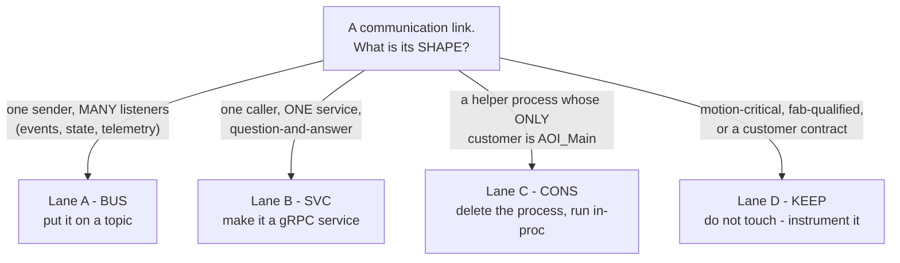
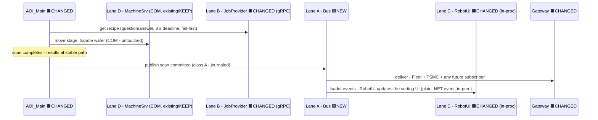
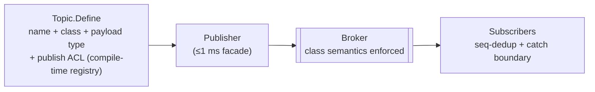
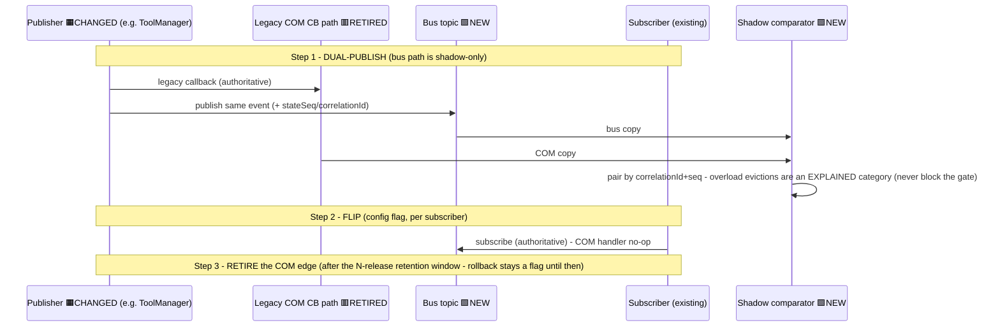
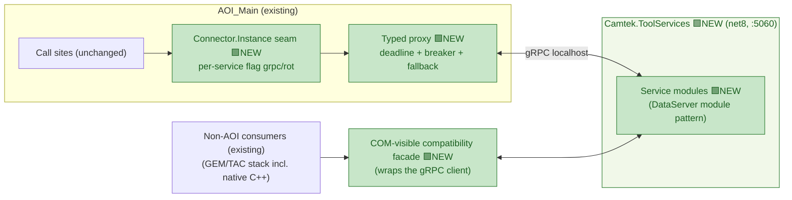
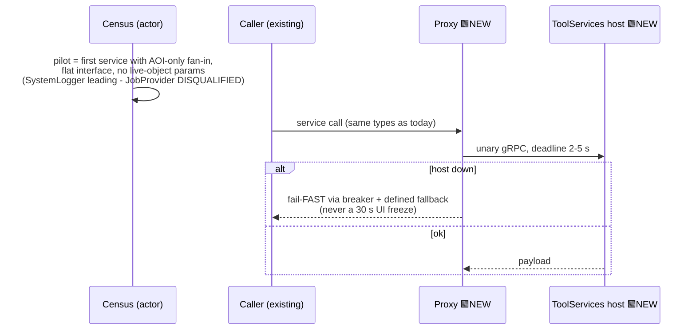
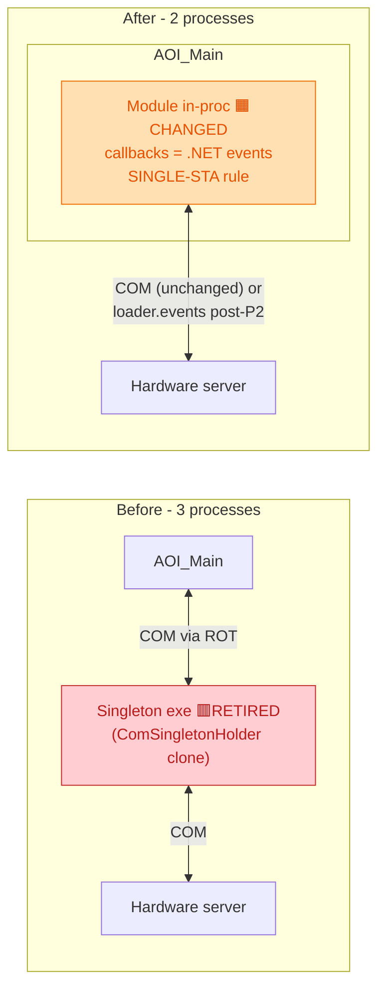
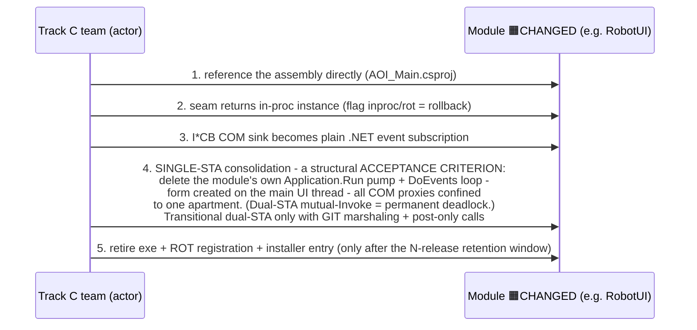
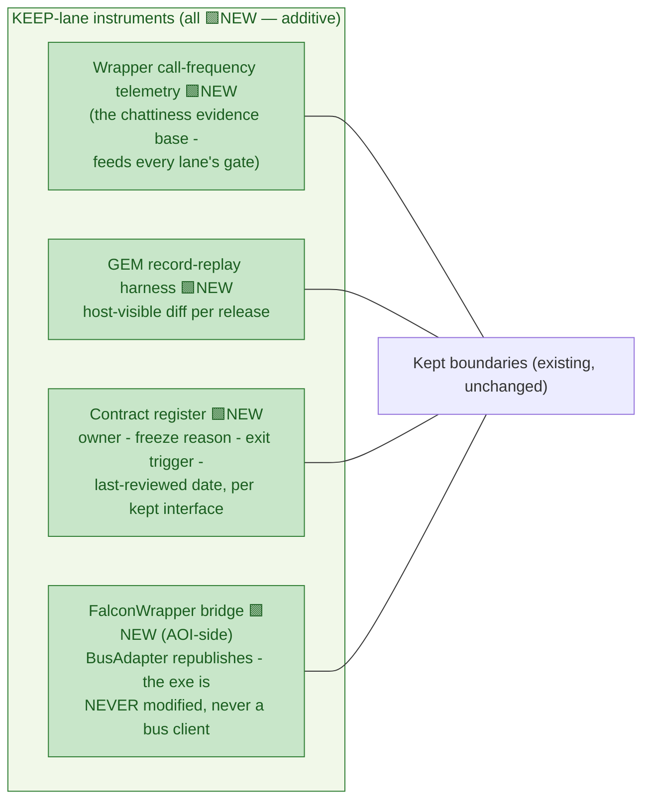
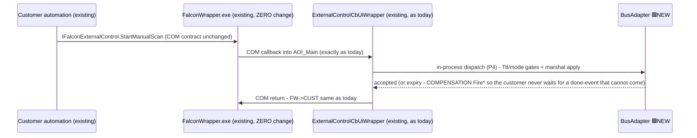

# 3 — Appendix: The Four Lanes (complete design per lane)

> Level: **method** — how every communication link migrates. The lane *rules* are the system-wide ADR; the lane *assignments* for AOI_Main's ~21 links are the disposition table in [02-aoi-architecture.md §2.9](02-aoi-architecture.md).
> Up-links: system context → [01-system-architecture.md](01-system-architecture.md) · AOI internals → [02-aoi-architecture.md](02-aoi-architecture.md).
> Lane assignment is by **shape**, decided once: one-to-many events → **A (BUS)** · one-to-one service APIs → **B (SVC)** · sole-consumer helpers → **C (CONS)** · latency-critical / fab-qualified / contractual → **D (KEEP)**.
> This appendix owns the *migration mechanics* only — components are designed in docs 01 and 02.

---

> **Diagram legend — new vs existing** (applies to the component "Block" diagrams in this doc):
> 🟩 **NEW** = new component built by this program · 🟧 **CHANGED** = existing component
> modified or relocated in-proc · 🟥 **RETIRED** = existing component removed · plain / untagged
> = unchanged or external. The lane decision-tree (§3.0) stays untagged (routing outcomes, not
> components), but the **sequence-diagram participants are now tagged** (same scheme, in the
> participant label); actor-only participants (Census, Track C team) stay plain. Authoritative
> accounting: [04-impact-analysis.md](04-impact-analysis.md).

## 3.0 Primer — the bus and the lanes, plainly

**The lanes are a sorting rule for wires; the bus is one of the destinations.** Today every link is COM point-to-point wiring with three hidden problems (undefined failure behavior, untestable, adding a listener edits the sender). The redesign asks one question about every wire — *what is its shape?* — and the answer sorts it:



Real examples of the question at work:

| Real link | Shape question | Lane |
|---|---|---|
| "Wafer finished" — GEM, Fleet, TSMC (and tomorrow MES) all want to know | Many listeners? **yes** | **A** → `scan.committed` |
| frmJobTab asks JobProvider "download job X" | Question/answer to one service? **yes** | **B** → gRPC |
| RobotUI — a process whose only customer is AOI_Main | Sole consumer? **yes** (census-verified) | **C** → absorbed |
| MachineSrv "move stage to X,Y" | Latency-critical? **yes** | **D** → COM stays + telemetry |
| WaferLoader — *looked* like C, but the census found GEM-stack consumers | Sole consumer? **no** | **D** — the lanes are evidence-based, not wishes |

**The bus is Lane A's destination — the tool's event bulletin board.** Publishers pin notes to named boards (topics); subscribers watch boards; the publisher never knows who's watching — which is why a future consumer costs zero sender edits. Each board has a service level (the durability class): **A** = the note is written to disk before pinning and stays until every registered watcher confirms (money data — `scan.committed`); **B** = only the newest note stays, new watchers see it immediately (`tool.state`); **C** = best effort, drops are counted (`scan.announced`); **R-R** = the note carries a deadline — a command can never execute after being reported failed (`gui.commands`). Physically: a small broker over authenticated local named pipes, with the caller's cost fixed at ≤1 ms (pinning hands the note to a background clerk; the disk write is on the clerk's time, never the scan thread's).

**One wafer touches all four lanes:**



**Three sentences to keep:** (1) the lanes are a sorting rule — one shape question per wire, answered once, recorded in the ADR; (2) the bus is Lane A's destination — a bulletin board with per-topic service levels whose superpower is that senders never know their listeners; (3) they meet but don't overlap — other lanes may *use* the bus (an absorbed module receives events from it, the KEEP-lane bridge republishes onto it), but a link's *lane* records what migration happened to the link, while the bus is just where Lane A's traffic lives.

---

## Lane A — BUS (events, state, telemetry, commands-with-accept-semantics)

**Rule:** anything one-to-many, or any command that needs accept-semantics + audit, rides `Camtek.Messaging` topics with a declared durability class and publish ACL.

### Block — a topic's lifecycle



### Flow — the edge-migration pattern (the lane's core mechanism)

Every COM edge migrates through the same reversible sequence:



### Code — topic declaration + storm-controlled publish

```csharp
// Contracts assembly — the compile-time registry: class + ACL are properties
// of the topic, enforced at the library/broker boundary, not in review comments.
public static readonly Topic ToolTelemetry =
    Topic.Define("tool.telemetry", DurabilityClass.A_ErrorsOnly, typeof(TelemetryPayload),
                 publishers: Acl.AoiMain | Acl.ToolManager,
                 stormControl: StormControl.CoalesceByKey(              // a flapping sensor
                     key: t => (t.Source, t.ErrorCode),                 // costs summaries,
                     firstImmediate: true,                              // not 300k journaled
                     summaryEvery: TimeSpan.FromSeconds(10),            // class-A messages
                     tokenBucket: Rate.PerSecond(10, burst: 100)));
```

**Lane A gate (per edge):** contract tests → fault injection → zero *unexplained* shadow divergence over the **R-TS-2 event-count gate** (≥ 10 000 `scan.committed` pairs; ≥ 500 `tool.state` transitions incl. scripted storms — **not** calendar days, which have near-zero statistical power at ~10 tool.state/day) → rollback drill executed.

### Per-edge outcome — what happens to each Lane-A edge

> Per edge: what carries it today, exactly what changes, and its specific risk/gate. Phases per [05-roadmap-and-risks.md](05-roadmap-and-risks.md).

#### Scan results + telemetry → `scan.committed` / `tool.telemetry` (P1a→P1b — the first edge)

- **Today:** `frmScanTab`'s post-copy hooks call `ToolApiPublisher.PushEvent` (gRPC :5005, unbounded on the scan thread when the gateway is down); errors/warnings/ToolInfo ride the same push; failures land in a write-only dead-letter file.
- **What happens:** the same hooks call the BusAdapter publish façade (≤1 ms, journaled class A); the gateway's BusSource subscribes both topics and runs beside :5005 for a shadowed dual-run (P1a); after the retention window, `ToolApiPublisher`, `toolapi.proto`, and port :5005 are **retired** (P1b). Error telemetry gains the storm coalescer.
- **Gate/risk:** the rollback lever is the old publisher — kept alive and drilled until P1b. This edge alone delivers scan-thread protection + zero silent loss + tool-down telemetry.

#### EFEM loader events → `loader.events` (P2)

- **Today:** `IAutoLoaderCB` COM callbacks into AOI's `AutoLoaderUIWrapper`, marshaled ad-hoc.
- **What happens:** a thin shim in the EFEM COM server publishes class-C `loader.events`; AOI's BusAdapter subscribes and feeds the (absorbed) RobotUI and GUI via one marshal; the CB sink registration is retired after dual-run. Wafer-move **commands** stay COM (lane D).
- **Risk:** low — one-way notifications; the shim is additive.

#### The `Fire*` hub edge → `scan.operations` / `scan.announced` (P2 — the biggest diff)

- **Today:** ~23 `Fire*` methods across **~80 call sites in 12 files** (verified census — the earlier "~40" was ~2× low) push through `frmProduction` into the `FalconWrapper.exe` COM hub; 5 external client processes subscribe there; each method carries its own Sim/VVR short-circuit.
- **What happens:** call sites become one-line publishes via the BusAdapter (central Sim/VVR gate); **dual-publish into the hub continues** so its 5 subscriber processes never notice; the 3 ref-returning `Fire*` ops move to the `scan.operations.requests` R-R topic. The hub edge itself retires only per-subscriber — possibly never (customer contract, lane D).
- **Gate/risk:** mechanical but wide; the payload contract (`scan.announced` carries **no file paths**) structurally closes the half-copied-results race.

#### ScenarioManager events → `scan.operations` / `scan.dds-node-status` (P2–P3, AOI-side)

- **Today:** ScanManager/inking/DDS-node COM callbacks land in AOI.
- **What happens:** ScenarioManager is untouched; **AOI republishes** the fan-out-worthy callbacks onto the bus. A ScenarioManager-side shim is deferred to its own program.
- **Gate:** blocked on the A-2 host-process reconciliation before P2 planning.

#### Tool state → `tool.state` (P3 — high semantics; requires introducing transition serialization, R-8)

- **Today:** `IToolManagerCB.OnToolStateChanged` fan-out from ToolManager's `CallbackHandler` (synchronous, per-subscriber, undefined stall behavior).
- **What happens:** ToolManager dual-publishes `tool.state` (class B, **retained**) with **`stateSeq` stamped inside a transition-commit lock that must first be introduced** (it does not exist today — R-8/FEA-1); subscribers (GUI BusAdapter, GEM shim, gateway) flip after shadow; the CB fan-out retires per subscriber. Reaction blocks migrate **atomically — never split** across COM and bus.
- **Gate/risk:** the sync→async drift risk lives here — shadow comparator + `(SourceEpoch, stateSeq)` pairing are the mitigations. **Not a small diff** ([04 §4.2](04-impact-analysis.md), R-8): it introduces a transition-serialization lock that does not exist today + a deadlock audit of the sync CB fan-out — the most-watched flip of the program.

#### Host GUI commands → `gui.commands` (P4)

- **Today:** host → `CFalconExternalControl` COM → `ExternalControlCbUiWrapper` → synchronous, timeout-less call into the GUI.
- **What happens:** the GEM shim publishes R-R `gui.commands` (Ttl from site E30 config); AOI serves them through the two-stage Ttl gate + BeginInvoke; the wrapper's ~18–21-callback surface dispatches in-proc (it never becomes a bus publisher — ACL preserved; only `GuiStartManualScan`/`GuiExportMap` were ever forwarded to frmProduction); expiry runs the compensation table.
- **Gate/risk:** host-visible behavior must stay identical — FlaUI + GEM record-replay gated.

#### Production control → `tool.commands` / `production.carrier` (P5 — optional, per customer)

- **Today:** host remote commands map through `RemoteControl.cs` onto `ICarrierExecuter` COM ops; carrier state fans out via `IProductionManagerCB`/`ICarrierExecuterCB`.
- **What happens (only if a customer funds it):** the GEM shim publishes `tool.commands`; ProductionManager publishes `production.carrier`; the COM command path retires per site after re-qualification.
- **Gate/risk:** the only lane-A edge with fab re-qualification — explicitly unscheduled until triggered.

#### Machine-layer events → `machine.efem.state` / `machine.safety.alarm` (future)

- **What happens:** nothing yet — registered names reserved for the machine layer's own adoption program via the native C client, **gated on the multi-PC census (A-1)**. Commands never ride the bus for this boundary.

---

## Lane B — SVC (one-to-one service APIs → gRPC)

**Rule:** request/response object surfaces (JobProvider, WafersDB, InspectionMng, SystemLogger, Maintenance, Automation) become gRPC modules in **one** `Camtek.ToolServices` host (:5060, ToolHost child) — never six processes.

### Block



### The three verified seam limits (why "just swap Connect()" is not enough)

1. **Shared connectors** — the same connector assemblies are consumed by the GEM/TAC stack *and native C++*; a hard swap flips every consumer at once → shared services migrate via the **compatibility façade** (COM-visible net48 wrapper over the gRPC client), never a hard swap.
2. **Object graphs / live-object parameters** (JobProvider's `SdrServer`, `RobotUI.Initialize(hWnd, …)`) need **interface redesign** the seam cannot hide → such services migrate late, never as pilots.
3. **COM idioms at call sites** (`Marshal.ReleaseComObject` throws on a non-COM proxy) → a per-edge idiom sweep is part of the gate.

### Flow — pilot selection + call



Code for the seam + failure policy: [02-aoi-architecture.md §2.5](02-aoi-architecture.md) (no duplication).

### Per-service outcome — what happens to each Lane-B service

#### SystemLogger — the pilot candidate (census pending)

- **Today:** a ROT COM singleton (context + config-change logging), one `ComSingletonHolder` clone.
- **What happens if the census confirms** (AOI-only fan-in, flat interface): a `Camtek.API.SystemLogger` contract + module in the ToolServices host; the seam returns a gRPC proxy with the mandatory client policy (3 s deadline, breaker, **local-file fallback** — logging must never block or lose); the singleton exe retires after the retention window. As pilot, it proves the seam, the supported client stack, and the host for the whole lane.

#### WafersDatabase / InspectionMng (+SPC DB)

- **Today:** ROT singletons serving data queries; reached via `MainContextModule` object handles.
- **What happens:** query-service modules in ToolServices; because other consumers may exist, they migrate behind **compatibility façades**; the gate emphasizes data-path correctness (result equivalence tests) and the chattiness audit (batch APIs, never per-property gets).

#### MaintenanceManager (the split service)

- **Today:** duplex COM (`IModuleMaintenanceManagerCB` callbacks for calibration tasks).
- **What happens:** the *command* surface becomes a ToolServices module; the *events* split by shape — broadcast completions ride `tool.telemetry` (lane A), only genuinely private callbacks use gRPC server-streaming with reconnect. One service, two lanes, by the shape rule.

#### WaferHandling / AutomationManager

- **Today:** outbound ROT singletons controlling automation cycles.
- **What happens:** command surface → ToolServices module; any fan-out events discovered in the census ride `production.carrier`/`tool.state`. Ordered after the pilot proves the pattern.

#### JobProvider — deliberately LAST (disqualified as pilot)

- **Today:** the most-shared service on the tool — consumed by the SecsGem clients, NetTAC, TAC.Net, ProductionGui, RobotUI, **and native C++** (`ProcessProgramManager.cpp:84-88`); its interface is an object graph (`SdrServer`/`S21Server` roots, out-params, stateful `LockJob` ops).
- **What happens:** interface redesign first (graph → flat service; locks → handle/lease); then a **compatibility connector** — the existing COM-visible connector becomes a façade wrapping the gRPC client, so *every* legacy consumer keeps working unmodified; each consumer retests on its own schedule. The one service where "just swap the seam" would have re-transported the whole GEM/TAC job path in one shot — hence last.

#### ADC + CMM gRPC clients — hygiene, not migration

- **Today:** live production links on EOL `Grpc.Core`.
- **What happens:** clients move to supported `Grpc.Net.Client` and adopt the same deadline/breaker policy; no interface change, no counterpart change.

#### CMM inbound (:50055) — contain, then split

- **Today:** AOI_Main *hosts* a Grpc.Core server for CMM's inbound calls — the hub's only network listener.
- **What happens:** Wave 2 — the gateway proxies :5007→:50055 (**contains the EOL Grpc.Core runtime and gives the external CMM caller an authenticated, per-operation-authorized :5007 door**; :50055 was already loopback-bound, so this is runtime-containment + a real door, *not* "closing an external surface"); by-value wafer maps and the operator-modal confirmation keep working under the per-method cap ([07 §7.7](07-toolconnect-design.md)); later, only via a negotiated CMM contract change — notifications move to bus topics, bulk maps to pointer hand-off, and the listener + the Grpc.Core *server* dependency are deleted. `ExportMapConfirmation` stays request-less (operator-modal — permanently exempt from Ttl'd request/reply).

---

## Lane C — CONS (sole-consumer singletons → in-process, zero IPC)

**Rule:** a singleton process whose **only** consumer is AOI_Main (verified by census — 2 of the first 3 candidates FAILED it) is absorbed: callbacks become plain .NET events, the process is deleted.

### Block — before / after



### Flow — absorption (5 steps, flag-reversible)



### Code — the in-proc seam + event bridge

```csharp
// Absorption seam — same interface, no process, no COM.
public static class RobotUiConnector
{
    public static IRobotUi Instance => _lazy.Value;
    private static readonly Lazy<IRobotUi> _lazy = new Lazy<IRobotUi>(() =>
        ToolConfig.ModuleMode("RobotUI") == "inproc"
            ? (IRobotUi)new RobotUiModule(MainContext.Instance.UiMarshaller) // in-proc,
            : new RobotUiRotProxy());                                        // flag-rollback

// Inside RobotUiModule: the COM CB sink becomes a plain event, marshalled once.
_efemEvents.WaferTypeLoaded += args =>
    _uiMarshaller.TryPost(() => WaferTypeLoaded?.Invoke(this, args));
}
```

Order: RobotUI (census PASSED — but it brings its own MachineSrv/EFEM/WafersDB/JobProvider COM connections and loses its private message pump per step 4), then census-passing remainder, one module per release. WaferLoader and BufferStation are **out** (census failed → lane D).

### Per-module outcome — what happens to each Lane-C candidate

> The code always survives; the **process** dies. Per module: what it is today, exactly what changes, and its specific risk.

#### RobotUI — the flagship (census ✅ PASSED)

- **Today:** its own process (a `ComSingletonHolder.exe` clone in the ROT); AOI reaches it via `RobotUIEventHandlerWrapper` → COM; callbacks via the `IRobotUIConnectorCB` sink. Internally heavyweight: spawns its **own STA thread + message pump** (`Application.Run(_frmRobot)`), a `DoEvents` busy-loop during form load, a 60 s creator block, per-dialog STA threads, and **its own COM connections** to MachineSrv, EFEM translators, WafersDB, and JobProvider.
- **What happens:** the five steps above, with step 4 doing the real work — the private pump is **deleted**, `frmRobot` becomes an owned form on AOI's main UI thread, dialogs become plain `ShowDialog`, and its four COM connections are re-acquired in the main apartment and move into AOI_Main. Its COM sink becomes plain .NET events (the connector already exposes parallel .NET events — half pre-exists; the assembly is already referenced by `AOI_Main.csproj:2170`).
- **Operator sees:** the same sorting screen, snappier (no cross-process hop). **Risk:** the dual-STA deadlock if step 4 is skipped — which is why single-STA is an acceptance criterion, not advice. **Still talks to hardware:** EFEM events pre-P2 via COM through `UiMarshaller`; post-P2 via `loader.events`.

#### WaferLevelCassetteManager (census pending — failure-prone)

- **Today:** duplex COM ROT singleton (`WaferLevelManagerUIWrapper.cs:34-41`) — wafer-level cassette handling control.
- **What happens if census PASSES:** standard five steps — in-proc instance behind the wrapper's interface, CB sink → .NET events, exe + ROT entry retired. It has no known private message pump, so step 4 is expected to be light (audit confirms).
- **Honest warning:** its siblings in the ToolManagement peripheral family (WaferLoader, BufferStation) both **failed** their census with GEM-stack consumers — this module carries the same risk. If the census finds a second consumer → **lane D**, nothing happens to it.

#### BSI / EBI / FRT / BsiHR module helpers (census pending — likely the easiest)

- **Today:** per-module ROT singletons reached via `Modules\*ModuleHelper.cs` (BSI duplex; EBI outbound-only); the SmartUI view-model pattern suggests AOI is the sole consumer.
- **What happens:** the lightest absorptions in the lane — mostly thin wrappers with few or no callbacks: direct assembly reference, in-proc instance, retire the holder exe. EBI's outbound-only shape means no event-bridging work at all.
- **Scope guard:** only the *helper singletons* are absorbed. EBI's own gRPC server processes (`EBI.EbiServer` etc.) are a different boundary and are **not** touched by this lane.

#### CamtekUtils (census pending — becomes a library, not a process)

- **Today:** a shared-utilities ROT singleton (`MainContextModule.cs:110-116`) whose interface is an **object graph** (`GetCFileUtils()` / `GetCSystem()` / `GetCForms()`).
- **What happens:** the purest consolidation — utilities have no business running as a process; the assembly becomes a plain library reference and the singleton hop disappears. No events, no pump, no hardware.
- **Two gates first:** the census must confirm no other process consumes it, and the object-graph getters must be verified free of COM-marshaling assumptions (callers receiving sub-objects must get plain .NET objects).

#### WaferMapServer.exe (census pending)

- **Today:** a **C# WinForms out-of-proc COM server** (`Components\WaferMapServer\`, verified — *not* native ATL as earlier stated; outbound-only from AOI: `Utils\WaferMapConnector.cs:13-35`) hosting wafer-map display.
- **What happens if census PASSES:** because it is managed, absorption is the **standard .NET module pattern** (direct assembly reference, in-proc instance, form on AOI's UI thread) — *easier* than the special native-server handling previously planned. The process disappears; the COM hop becomes an in-process call.
- **Feasibility gate:** the display form must be created on AOI's main UI thread (single-STA rule, as for RobotUI). If the census finds another consumer it stays **lane D**, unchanged.

#### WaferLoader & BufferStationManager — explicitly NOT in this lane

Census **failed** for both (GEM/TAC-stack and native-C++ consumers). **Nothing happens to them**: they remain out-of-proc COM singletons in lane D, with call-frequency telemetry and a contract-register entry. Any future change requires the GEM/TAC stack's own migration to reach them — they are listed here only so nobody "absorbs" them by mistake.

---

## Lane D — KEEP (actively managed, not ignored)

**Rule:** data planes (MMF), motion-latency COM boundaries (MachineSrv/EfemSrv/Scenario commands), the fab-qualified GEM wire, customer contracts (FalconWrapper), and census-failed shared singletons stay — **with instruments and exit triggers**, reviewed each release.

### Block — the instruments



### Flow — customer automation through the frozen façade



### Code — the compensation table (the lane's critical section)

The compensation continuation must also run on a **faulted or canceled** dispatch, not only on Ttl expiry (M-11/GS7-6): today's real catch path (`ExternalControlCbUiWrapper.GuiStartManualScan` catch → `ManualScanDone()`) fires an immediate completion on a synchronous failure, so "catch-path parity" requires the P4 continuation to compensate `Task.IsFaulted`/`IsCanceled` for any command with a completion event — otherwise a dispatch that throws before reaching `Scan` strands the customer. (The async-void post-await gap in today's `frmProduction.GuiStartManualScan` is a pre-existing bug the design closes, not preserves.)

```csharp
// P4 rule (review CC10): a NACK/expiry has no COM channel back to the customer -
// every external command maps to a synthesized completion the contract expects.
private static readonly Dictionary<ExternalCommand, Action<IFalconFireEvents>> Compensations =
    new Dictionary<ExternalCommand, Action<IFalconFireEvents>>
{
    { ExternalCommand.StartManualScan, fe => fe.ManualScanDone() },          // today's catch-path parity
    { ExternalCommand.ExportMap,       fe => fe.ExportMapCompleted(false) }, // failure-signaled
    // value-returning callbacks (GuiSetWaferType etc.): defined default returns
};
```

Governance: every KEEP entry is re-reviewed once per release against its exit trigger; leaving the lane is an ADR-level change. The telemetry converts "should we modernize this boundary?" from opinion into measurement.

### Per-boundary outcome — what "kept" concretely means for each

> KEEP is not "forgotten" — each boundary gets a defined present (instruments) and a defined future (exit trigger).

#### MachineSrv / EfemSrv / ScenarioManager — the motion & orchestration COM commands

- **What happens now:** nothing at runtime. Their wrappers gain **call-frequency telemetry** (the evidence base for every future decision); each gets a contract-register entry.
- **Exit trigger:** each server's own modernization program. Events may later ride the bus (`machine.*`, gated on the multi-PC census) — commands stay COM until the *server* is rewritten, because tight motion loops live behind these boundaries by design.

#### The GEM wire — Cimetrix `SECSGemDriver` + `SecsGemObjects` E30/E87 logic

- **What happens now:** byte-identical host behavior, protected by the **GEM record-replay harness** (capture real host traffic, diff the tool's responses every release). The bus *shim* added beside the logic is the fabric program's work, not a change to this kept boundary.
- **Exit trigger:** none for the wire — it is the fab-qualified boundary; P5 (per customer) is the only thing that ever knowingly shifts host-visible behavior, with re-qualification budgeted.

#### FalconWrapper.exe — the customer automation contract

- **What happens now:** the exe is **never modified and never becomes a bus client**. Customer COM calls land in AOI exactly as today; internally they dispatch through the BusAdapter gates (P4), and expiry/NACK outcomes run the **compensation table** so the customer contract's completion events always fire. AOI-side dual-publish keeps its 5 subscriber processes fed.
- **Exit trigger:** contract renegotiation with the customer(s) — a business event, not an engineering one. Until then it is a permanent, healthy façade.

#### S12 wafer-map exchange (`SecsGemDriver` `IS12`)

- **What happens now:** untouched — fab-qualified map download/upload used by the CMM handler.
- **Exit trigger:** rides with the GEM wire's rules; none independent.

#### MMF data planes — TilePool & STIL buffers

- **What happens now:** untouched **permanently by design** — bulk data never rides a control plane; the bus carries pointers into these stores. Housekeeping: document ownership, and resolve the one open flag (the STIL buffer's producer identity) during the register pass.
- **Exit trigger:** none — this is an architectural principle, not a deferral.

#### WaferLoader & BufferStationManager — the census-failed ex-candidates

- **What happens now:** they stay out-of-proc ROT COM singletons, gain wrapper telemetry and register entries. Nothing else — their consumers include the GEM/TAC stack and native C++.
- **Exit trigger:** the GEM/TAC stack's own migration reaching them (they can only move with their other consumers' consent — likely via lane B compatibility façades at that time).

#### Grabbing libraries (Clip/CSP/CTS/TDI GrabObjects)

- **What happens now:** untouched — from AOI's perspective this is an in-proc library boundary with callbacks, not an IPC edge; the TCP+MMF plumbing inside is the grabbers' own domain.
- **Exit trigger:** none from this program.

#### Shared INI files & `c:\job` tree

- **What happens now:** remain the configuration/job coordination medium; no transport change.
- **Exit trigger:** shrinks naturally as the JobProvider SVC service matures (job storage moves behind the service); config INIs persist.

#### DAO `.mdb` logging (FalconLog, spc)

- **What happens now:** explicitly **out of this program's scope** — flagged as a separate DataServer/MDC modernization candidate. Kept on the register so it isn't forgotten, never on this roadmap.

---
