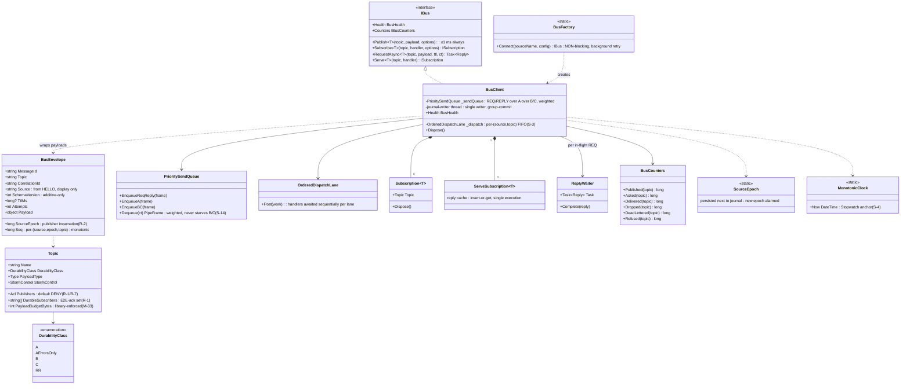
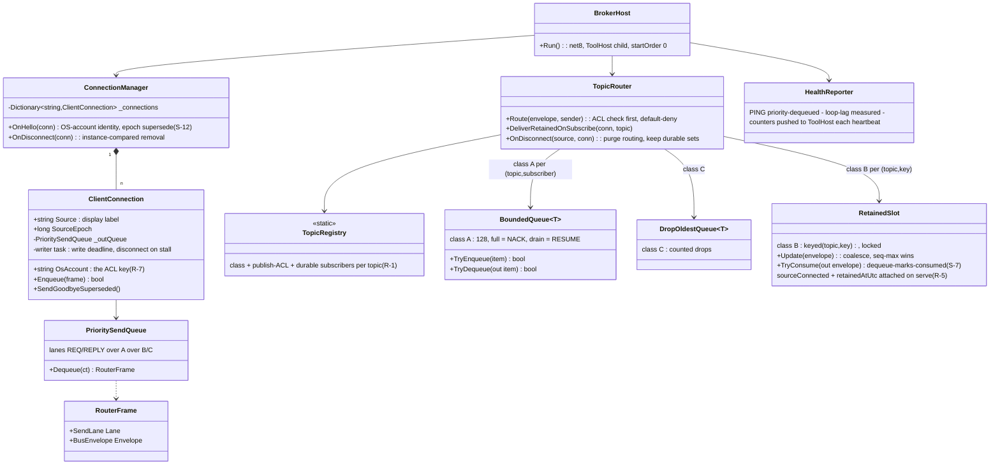
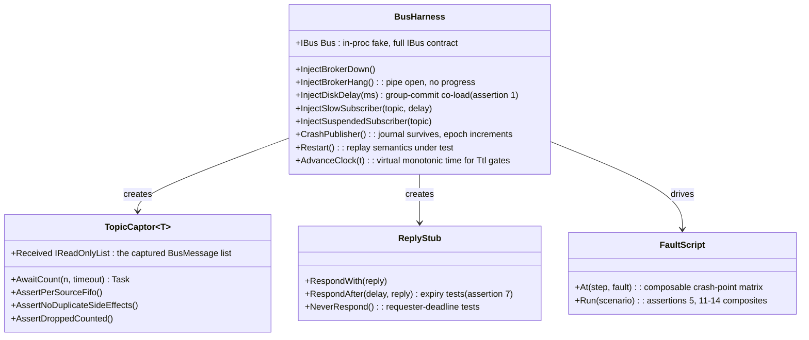

# 6 — Bus Implementation Specification (`Camtek.Messaging`)

> Level: **implementation**. The complete build spec for the fabric: projects, API, envelope, wire protocol, journal mechanics, broker algorithms, request/reply, security, load model, and the test kit. This is the deepest document of the set — everything an implementer needs.
> Up-links: where the bus sits → [01-system-architecture.md](01-system-architecture.md); AOI usage → [02-aoi-architecture.md](02-aoi-architecture.md); adoption method → [03-appendix-four-lanes.md](03-appendix-four-lanes.md).
> Incorporates all resolutions of the concurrency/connectivity/load review (Revision 3).

> **Diagram legend — new vs existing:** this document specifies the **`Camtek.Messaging`
> library, broker, and TestKit — all three are 🟩 NEW projects** ([04-impact-analysis.md §4.1](04-impact-analysis.md)).
> Consequently **every class in all three class diagrams below is 🟩 NEW**; a caption states
> this above each. No pre-existing types are shown, so per-class colour tags are omitted as
> redundant. (The WAL contract this doc references belongs to the evolved gateway — new-vs-existing
> for that is tagged in [07-toolconnect-design.md](07-toolconnect-design.md).)

---

## 6.1 Projects & packaging

```
Sources\Messaging\
  Camtek.Messaging\           net48;net8.0  — client: API, send queue, journal-writer thread,
                                              pump (split I/O), dedup, request/reply, storm control
  Camtek.Messaging.Contracts\ net48;net8.0  — envelope, topic registry, payload DTOs (no logic)
  Camtek.Messaging.Broker\    net8.0        — broker host (console; ToolHost child, startOrder 0)
  Camtek.Messaging.TestKit\   net48;net8.0  — contract-test base + fault-injection harness
  Camtek.Messaging.Tap\       net8.0        — bus-tap recorder CLI (diagnostics)
  Camtek.Messaging.Tests\     net8.0        — unit + protocol tests (xUnit + FakeItEasy)
```

Delivery: binary drops to `c:\bis\bin` **and** `c:\bis\bin\x64` (AOI builds both bitnesses); broker + net8 pieces deploy with ToolHost. Dependencies: `Newtonsoft.Json` (repo-standard) + `System.Threading.Channels` (netstandard2.0 — approval item). Native client `camtek_bus.dll` (flat C over the same protocol) is a later deliverable for machine-layer/DDS adoption — the protocol below is deliberately implementable in ~100 lines of C.

## 6.2 Public API

```csharp
public interface IBus : IDisposable
{
    // ≤1 ms ALWAYS: lock-free enqueue; class-A journaling happens on the
    // library's journal-writer thread BEFORE the pump sends (never on the caller).
    void Publish<T>(Topic topic, T payload, PublishOptions options = null);

    // Handlers run on pool threads; STA/UI marshaling is the HOST's job.
    ISubscription Subscribe<T>(Topic topic, Func<BusMessage<T>, Task> handler,
                               SubscribeOptions options = null);

    // Commands. Ttl mandatory; requester-side deadline mandatory (never wait bare).
    Task<Reply> RequestAsync<T>(Topic topic, T payload, TimeSpan ttl,
                                CancellationToken ct = default);
    ISubscription Serve<T>(Topic topic, Func<BusMessage<T>, Task<Reply>> handler);

    BusHealth Health { get; }        // connected, heartbeat age, queue depths, journal backlog
    IBusCounters Counters { get; }   // per-topic published/acked/delivered/dropped/dead-lettered
}
public static class BusFactory
{
    // NON-blocking: returns immediately, background jittered-backoff retry (infinite,
    // alarm after T). Subscriptions registered locally, replayed on (re)connect.
    public static IBus Connect(string sourceName, BusConfig config = null);
}
```

Topics are **declared, not stringly-typed** — durability class, payload type, publish ACL, **declared durable subscribers** (R-1 — the set whose DELIVER_ACKs complete the E2E-ack; without this property on the topic the R-1 rule is unimplementable, CON7-8/M-29), and storm control are compile-time properties of the topic (registry example: [03-appendix-four-lanes.md](03-appendix-four-lanes.md) lane A). The publish-ACL default is **deny** (never `Acl.Any`, the SEC-1 fail-open default).

## 6.3 Envelope (JSON v1 — field-readable at 3 am; protobuf later per-topic opt-in)

```json
{
  "messageId":   "0193f2a1-...",                 // GUID — R-R dedup key
  "topic":       "scan.committed",
  "correlationId": "wafer-BH01-20260718-0042",   // UnifiedLogger-aligned tracing
  "moduleId":    "frmScanTab",
  "source":      "AOI_Main",                     // identity from HELLO
  "sourceEpoch": 42,                             // publisher incarnation (R-2) — see below
  "seq":         18734,                          // per-(source,epoch,TOPIC) monotonic — ordering/loss/dedup (X7-2)
  "timestampUtc":"2026-07-18T11:02:03.412Z",
  "schemaVersion": 2,                            // additive-only; ignore-unknown (mixed versions
  "ttlMs":       null,                           //   are the DESIGNED steady state under ToolHost)
  "attempts":    0,                              // poison detection
  "payloadType": "ScanCommittedPayload",
  "payload":     { "...": "..." }
}
```

Frame cap **1 MB** — the bus carries *pointers* (paths / ids), never bulk data.

**`sourceEpoch` — publisher incarnation (resolves R-2).** A publisher's `seq` restarts at 0 every process start, so without an incarnation marker a restart (AOI restarts daily) or a journal re-creation makes the next message's low `seq` look like a *duplicate* to a subscriber whose high-water is already high — silently dropping a fresh wafer. `sourceEpoch` is a monotonic counter persisted in a one-line file beside the journal, **incremented on every journal (re)creation** and read at startup. The dedup identity is **`(source, sourceEpoch, topic, seq)`** and `seq` is **per-`(source, epoch, topic)`** — a per-source seq (or a per-source dedup key) mis-orders across topics on the gateway's per-`(source,topic)` lanes and reopens R-2 (X7-2). Rules:
- A **higher** epoch **starts a new baseline** for that `(source, topic)` and is **logged + alarmed** ("publisher re-incarnated" — never confused with a gap); the subscriber/gateway **retains the current + previous epoch** high-waters so a straggler replay of the prior epoch is still deduped (M-6).
- An **epoch regression** (lower epoch — a rolled-back AOI, or a cleared epoch file) is **alarmed and accepted with a baseline reset — never silently discarded** (a silent drop would make the rollback path itself lose fresh wafers).
- **Missing epoch on the wire ≡ epoch 0.** `schemaVersion` bumps to 2 (additive); old subscribers ignore the field.
- **Compaction must not regress the publisher seq below a delivered high-water (X7-9).** Class-A `seq` is restored on start as **`max(seq-sidecar, journal high-water)`**, where the sidecar is a monotonic per-`(source,topic)` record next to the epoch file (survives a directory clear via a boot seed) — because compaction removes acked+tombstoned top entries, so `max(journal seq)` alone can regress below seqs the gateway has already recorded, silently dropping the next fresh wafers as duplicates on the routine daily restart.

**Version-skew matrix (the fleet runs all four during a wave — M-6/OPS7-4):**

| Publisher | Gateway | Behavior |
|---|---|---|
| old AOI (no epoch) | new gateway | missing epoch ≡ epoch 0; dedup on `(source, 0, topic, seq)` |
| new AOI (epoch) | old gateway | old gateway ignores epoch, falls back to `(source, topic)` — safe only because the gateway is upgraded **before** AOI in the same wave |
| new AOI (epoch) | new gateway, then AOI **rolled back** (epoch present→absent) | epoch regression → alarm + accept-with-baseline-reset (never discard) |
| new AOI (epoch) | **gateway rolled back** | pre-epoch `(source,topic)` dedup with a stale high-water — an **unsupported combination**, enforced by the fleet-profile dashboard |

**Per-topic payload budget (M-33).** Beyond the 1 MB frame cap, each topic declares a payload budget the library enforces (truncate + `truncated:true`); `tool.telemetry` ≤ 2 KB. This makes the A-ErrorsOnly "never-lose-up-to-cap" horizon honest: it is `min(entries/rate, bytes/(rate × avgSize))` — ~2.8 h holds only because the ≤ 2 KB budget keeps the 100k count-cap (not the 256 MB byte-cap) the binding one.

## 6.4 Wire protocol

Transport: one duplex Windows named pipe per process (`\\.\pipe\camtek.bus`), localhost only, **pipe-ACL authenticated** (identity per connection → per-topic publish ACLs for free). Framing: 4-byte length prefix + UTF-8 JSON.

| Frame | Purpose |
|---|---|
| `HELLO` | identity (`source` + `sourceEpoch`, R-2), subscriptions, per-class-A-topic publisher replay start (`resumeFromSeq` — publisher-declared; broker is stateless and never serves history) |
| `PUB` / `PUB_ACK` | publish / broker enqueued to all matched subscriber queues (sufficient for B/C) |
| `DELIVER` / `DELIVER_ACK` | delivery / subscriber processed (class A — sent only after durable ownership, e.g. the gateway's WAL append) |
| `E2E_ACK` | class-A end-to-end confirmation **per (message, declared durable-subscriber set)** → journal appends the ack-tombstone. The set is the topic's registry-declared durable subscribers (R-1), **not** the connections live at PUB — see §6.6. |
| `NACK` / `RESUME` | class-A queue full → stays in publisher journal; redelivered on exponential backoff+jitter, seq order, bounded in-flight window; `RESUME` (queue below low-watermark) short-circuits |
| `REQ` / `REPLY` | commands (`requestId`, `ttlMs`); broker R-R queue-full → immediate `REPLY(rejected-busy)` |
| `PING` / `PONG` | heartbeat, **priority-dequeued**; self-check reports **measured loop lag** (degraded vs hung distinction) |

**I/O model:** reader and writer **split** (overlapped I/O) on both ends — a peer must always drain reads regardless of write progress (kills the duplex write-write deadlock). **Priority lanes** on every send queue and per-connection broker writer: `REQ/REPLY` > A > B > C (weighted — no total starvation). Per-frame write deadlines: client reconnects, broker disconnects the subscriber.

## 6.5 Client internals

### The publish path (the ≤1 ms bound + class-A durability)

```
caller thread:        enqueue(envelope)  ──►  returns ≤1 ms. No disk. No socket. No lock across I/O.
journal-writer thread: append batch ──► ONE group-commit flush per batch / per X ms
                       ──► release seq to pump (class A sends only after durable)
pump writer:           PUB ──► broker
pump reader:           E2E_ACK ──► enqueue Acked(seq) to journal thread ──► append {"ack":seq}
```

- **Single-*toucher* journal (M-5)**: only the journal thread touches journal files — for **reads as well as writes**. Replay-on-reconnect and high-water queries are posted to the journal thread as jobs, never opened on the pump-reader/connect thread; otherwise a replay handle held during compaction's `ReplaceFile` fails (the default handle lacks `FILE_SHARE_DELETE`) and, under a reconnect storm, repeatedly fails compaction → `scan.committed` refuse-new from a benign reconnect. "Delete" = an appended **ack-tombstone** (append-only, crash-safe; replay = entries minus tombstones in seq order). Compaction: survivors → tmp → flush → atomic `ReplaceFile`; no racing appender **or reader** exists by construction.
- **Durability contract (honest):** durable against **process crash immediately** (page cache survives process death); durable against **power loss within the group-commit interval ≤ X ms** (P0-measured under co-load) — acceptable because scan results also exist at their stable path.
- **Journal caps per topic** (default 100k entries / 256 MB, alarm at 50%): `scan.committed` = refuse-new + loud alarm at cap; error telemetry = drop+count beyond cap. **A journal failure never throws to the caller** (counted error + alarm). Journals/spool live on the system volume, **separate from tile/zip data**.
- **Reconnect algorithm:** the high-water **H = the max seq released to the pump**, recovered on restart as **`max(seq-sidecar, journal seq)`** for the current epoch — the monotonic sidecar (§6.3) is required because compaction removes acked top entries, so `max(journal seq)` alone can regress H below seqs already delivered downstream, silently dropping the next fresh wafers as duplicates (X7-9). Replay journal strictly in seq order to H → then drain the live queue discarding class-A ≤ H → per-`(source,topic)` FIFO holds; the caller never pauses. Reconnect backoff is jittered; replay paced by broker credit.
- **Dispatcher duties:** seq-contiguity dedup per **(source, sourceEpoch, topic)** (R-2) — O(1), immune to replay-burst size (`messageId` LRU only as the R-R secondary net); a higher epoch resets the baseline (alarmed); two-stage Ttl gates on a **monotonic clock**; catch boundary (a handler exception never kills the process); poison → dead-letter file after N attempts + alarm; reply cache = atomic insert-or-get of an in-progress placeholder (concurrent redelivery awaits the same completion — no double execution); late REPLYs counted, never a fault.
- **Storm control** (topic-contract, in the library): error-class telemetry coalesced by `(source, errorCode)` window (first immediate, summaries every 10 s) + token bucket (10/s sustained, 100 burst).

### Class design — public API + client internals

(Realized in [codeSnippets/](codeSnippets/) 01–03; contracts §6.2, internals as above.) — **every class below is 🟩 NEW** (the `Camtek.Messaging` client library).



### Gateway WAL lifecycle (resolves R-3, R-4)

> The gateway's complete component design — internal architecture, class design, WAL state machine, CommandPublisher/CMM proxy, threading, failure matrix — is **[07-toolconnect-design.md](07-toolconnect-design.md)**. This subsection keeps only the *bus-side contract* the gateway must honor; WAL mechanics (state transitions, completion reporting, drain arbitration, quota sizing) are doc 7's alone (§7.4–7.5).

The gateway's `BusSource` is the class-A subscriber; its WAL is the message's durable owner between the bus and the external sinks.

- **DELIVER_ACK is a function of the WAL append ONLY (R-4).** The gateway appends the message to the WAL (atomic: write tmp + `fsync` + rename) and *then* sends DELIVER_ACK — it does **not** wait for routing / sink delivery. Sink routing consumes from the WAL **asynchronously**. This severs the path by which a Fleet/TSMC outage back-propagated onto the bus (channel fills → routing blocks → ACKs stop → broker NACKs → AOI journal grows). An external cloud outage now lives entirely in the gateway spool, exactly as the design intends.
- **WAL entry lifecycle (R-3):** each entry is `received → routed{ per sink: pending|done|poison } → (poisoned →) deleted` — the entry is deleted only when **every** sink leg is `done` (or, for a poisoned leg, dead-lettered per sink). The normative state machine, including the poison-vs-outage split, is [07 §7.4](07-toolconnect-design.md). This fixes the two duplication paths: a delivered message is never re-sent by the drain, and one entry with two sinks where only one succeeded is retried **only to the pending sink** (today's per-sink spool keying is preserved, not regressed).
- **Gateway-side idempotency (R-3) — dedup key `(source, sourceEpoch, topic, seq)`, high-water durable (X7-2/X7-3).** The WAL is the durable dedup store: on every route the gateway checks `(source, sourceEpoch, topic, seq)` against a **durable per-`(source,epoch,topic)` high-water control record** (its own store, in the `append → persist → ack` order — *not* re-derived by scanning surviving WAL entries, which regresses once §7.4 deletion runs). A redelivery after a crash is recognized and dropped *at the gateway*, before either sink. **Residual + the ambiguous-outcome correction (M-3/M-37):** a crash between a sink acking the send and the WAL marking that leg done — **and, more commonly, a deadline that fires *after* the send left** — re-sends that one leg on recovery. Because the ambiguous case is routine timeout behavior (not just a crash window), **downstream idempotency is *required*, not optional**: the Fleet leg gets a dedup key added to `ToolEventMessage` ingestion (a P1a cross-team dependency — the shipped `PushEventAsync` carries none, so a re-send is a genuine duplicate yield record), and the TSMC leg reuses the stable `UniqueId` with same-`UniqueId`-overwrite asserted as the cloud contract. (Updates §5.6.1 A-6 from "optional hardening" to "required for the §7.1 no-unrecorded-duplication contract.")
- **Spool-at-quota is *withhold*, never *block* or drop (R-4/M-2):** at WAL quota the gateway **returns without acking** (deferred-ack list) — never parks the pump reader on a lane — so a full `scan.committed` lane cannot stall `tool.state`/`PING` in the same pipe; a below-low-watermark event redelivers the deferred set; NACK flows back to the publisher journal (the alarmed, sized store). `scan.committed` has a **per-topic quota floor** so a telemetry backlog cannot accelerate its backpressure (DI7-2). Loss is never taken at the last hop. Quota sizing + the withhold/resume mechanism are doc 7's ([§7.5](07-toolconnect-design.md)). Tested as assertion **5b**.
- **Test (assertion 5 as extended by R-3):** per-sink `count == published AND distinct-count == published` across {gateway-down-at-PUB, gateway-crash-with-128-queued, gateway-crash-between-sink-push-and-DELIVER_ACK, publisher-restart} — a plain count is blind to a loss cancelled by a duplicate.

## 6.6 Broker internals

- **Connection manager:** pipe server; identity = **OS-authenticated pipe account** (the `HELLO.sourceName` is a *label*, never the ACL key — R-7); publish-ACL enforcement keys on the account; **per-connection outbound writer task** with write deadline (a suspended subscriber is disconnected, never allowed to stall siblings). Duplicate-identity HELLO (crashed-but-not-dead client, or a second session) is resolved by `sourceEpoch`+PID: the higher epoch supersedes, the older connection is dropped with `GOODBYE(superseded)` and audited (never a silent `TryAdd` that leaves the new connection unrouted).
- **Durable subscribers are a static topic property, not a runtime connection fact (resolves R-1).** The topic registry declares each class-A topic's *durable subscribers* by identity — e.g. `scan.committed → { ToolGateway }`. E2E-ack completes only when **every declared durable subscriber has DELIVER_ACK'd**. A declared subscriber that is merely **disconnected** (gateway restart) does **not** shrink the set: its slot behaves like a persistent `NACK` — the message stays in the *publisher's* journal and redelivers on reconnect. Only an explicit **deregistration** (a config-profile change removing the subscriber) drops it from the set. This closes the gateway-restart silent-loss channel: "no live subscriber" (all declared subscribers down) keeps the message durable; **"no *declared* durable subscriber"** — a genuinely gateway-disabled tool via signed profile (§5.1 rule 2) — is the only case that acks immediately (no journal leak). Disabled-vs-down is now a config fact, not a timing accident.
- **Class-A queues** (bounded, default 128 = 2× worst burst): full → `NACK`; drained → `RESUME`. E2E-ack tracking bounded by Σ queue capacities; publisher disconnect purges its routing entries.
- **Class-B**: locked keyed-slot coalesce **per (topic, key)** with atomic dequeue-marks-consumed (a naive replace-in-channel loses updates, and a per-topic-only slot collapses multi-key state like `production.carrier`); **retained** — last value per (topic, key) delivered to every new subscriber on subscribe. **After a broker restart the in-memory retained slots are empty; every class-B publisher re-publishes its current value on (re)connect** (resolves R-5) — the broker stays persistence-free, and the publisher (which owns the state) restores it with the same `stateSeq`, which dedup absorbs. When serving a retained value the broker attaches `sourceConnected` + `retainedAtUtc`. **Mid-session owner death (M-7/CN7-3):** because `sourceConnected` was only ever attached *at serve time*, a subscriber that connected while the owner was alive would never learn the owner later died (no new serve occurs). So the broker, on detecting a retained-topic owner's disconnect, delivers a **synthetic retained update** (same envelope, `sourceConnected=false`, `disconnectedAtUtc`) to the *current* subscribers of that (topic, key) — still stateless, it already owns the connection fact. A subscriber treats `sourceConnected == false` beyond T as degraded input; the gateway derives `stale-since` from it ([07 §7.5](07-toolconnect-design.md)).
- **`stateSeq` needs an incarnation (M-9/GS7-4).** The class-B ordering key `stateSeq` is an in-memory counter that restarts at 0 on a ToolManager holder-process restart. At ~10 transitions/day the fresh stream stays below the old high-water for days, so a consumer's `ApplyIfNewer` silently freezes GUI reactions and E30 CEID reporting. Consumers therefore order by **`(SourceEpoch, StateSeq)`** ("a higher epoch is always newer"), or `stateSeq` is persisted next to ToolManager state — this covers the *publisher* restart R-5's same-`stateSeq` republish (broker restart) does not.
- **`tool.state.replay` — the GEM transition ring, a registered R-R topic (X7-7/GS7-1).** The R-6 "no missed E30 transition" guarantee needs the last-N transitions recoverable after a reconnect blip; class-B retains only the *last* value, so the ring is **its own R-R topic served by the ToolManager shim from a bounded last-N buffer the R-8 fan-out worker appends to** (§2.4 produces exactly the `(prev, new, seq)` records the ring needs). Payload `ToolStatePayload[]` (each with `PrevState` + `stateSeq`); ACL: served by `svc-ToolManager`, requested by `svc-GemShim`. It is a **first-class registered topic** (counted in [01](01-system-architecture.md) View 3), not prose — the earlier "republished by ToolManager" had no topic, no server, and no storage. The same REQ is the GEM shim's "completed handshake" carrier (§1.3.4).
- **Class-C**: drop-oldest + counted; drop counters alarmed.
- **Heartbeat/health:** PING priority-dequeued; loop-lag self-check via a pipe-frame probe (a new ToolHost probe type); counters **pushed** to ToolHost each heartbeat (survive broker death).
- **Supervision:** ToolHost child, `startOrder: 0`, `quarantine: never`, `priorityClass: AboveNormal`; broker updates are maintenance-window-only.

### Class design — broker internals

(Realized in [codeSnippets/04-broker.cs](codeSnippets/04-broker.cs) — the prose above is normative where the sketch diverges, per S-6/S-7/S-12.) — **every class below is 🟩 NEW** (the broker).



## 6.7 Request/reply protocol (commands)

Reply = **ACCEPTED on successful post to the executing dispatcher** — never completion, never gated on execution. The **final Ttl gate runs as the first statement of the marshaled delegate on the executing thread**; expired-at-dequeue → command-expired event + the consumer's per-command compensation. Requester-side deadline mandatory. Residual window (host-told-accepted / command-expired) is compensated and documented — it cannot be zero. Ttl derives from per-site E30 timeout config minus a measured margin (GEM pre-/post-hops measured at P0).

## 6.8 Security (resolves R-7 — the work-stream the earlier four review cycles never covered)

> **Owner: Security (Ofek Harel) — a named work-stream, a P1a entry criterion, not a footnote.** Grounded baseline today: no pipe ACLs and no TLS anywhere in `BIS\Sources`; every gRPC endpoint `Insecure`; `:5005` binds `0.0.0.0`; Fleet `:5050` is cleartext with no credentials. As originally drafted the fabric would have *increased* the command attack surface at P1a.
>
> **This section is a specified security skeleton, not a finished implementation.** Every design fork below is *decided* (so it no longer blocks the architecture), but standing up the work-stream will surface its own implementation detail — certificate/key management and rotation, a written threat-model sign-off, penetration testing — that a design document does not close. Read this as "the security design is settled and buildable," **not** "security is as done as R-1's durable-subscriber rule." Naming the owner rolls into the existing **pre-P0 "named owner" entry criterion** (§5.1 rule 4), extended to cover this work-stream.

**6.8.1 Identity is the OS-authenticated pipe account, never a self-asserted string (the linchpin — closes SEC-1/7/9).**
Today AOI_Main, the GEM shim, and ToolManager all run as one "AOI user," so a `HELLO.sourceName` string cannot separate them and any process as that user could publish `*.commands`. Resolution: **run the privileged publishers under distinct service accounts** — `svc-GemShim`, `svc-ToolManager`, `svc-Gateway`, plus the AOI-user for AOI_Main — and bind every per-topic publish ACL to the **impersonated pipe account** (`NamedPipeServerStream.GetImpersonationUserName` / SID), mapped account→ACL in the broker. `HELLO.sourceName` is a display label only. The ACL default is **deny** (the old `SenderToAcl => Acl.Any` was fail-open). The gateway also derives a message's `source` from the authenticated account, not the envelope field, so a spoofed `source` cannot inject `scan.committed`.

**6.8.2 Topic ACLs.** `gui.commands` / `tool.commands` publishable only by `svc-GemShim` and `svc-Gateway`; `tool.state` / `production.carrier` only by `svc-ToolManager`; `scan.*` only by the AOI user. The gateway's REST **diagnostic** surface runs on a *separate* bus connection under a non-command ACL, so the "diagnostic publishes non-command topics only" rule is enforced by the broker (by account), not by in-process convention (closes SEC-6).

**6.8.3 `:5007` external command door — default-deny, authenticated, *authorized*, cert-scoped (SEC-3 + X7-6).** MES/CMM command intake does **not** bind or accept until authz is implemented. **Mechanism (decided): mTLS** — fab tools are not uniformly domain-joined and MES is off-box, so certificate-based mutual auth is the portable choice; Windows-auth is the documented fallback only for sites that are fully domain-joined and require it. This closes §5.6 item 7. Bound to the minimum interface (a dedicated MES VLAN, not `0.0.0.0`), with per-caller rate-limit + lockout. **Authorization is separate from authentication and applies to *both* :5007 paths:** the CommandPublisher (§7.6) *and* the CMM proxy (§7.7) sit behind a default-deny per-identity operation allowlist, and **certificates are scoped to an operation class** — an MES command cert cannot invoke CMM operations, and vice-versa (X7-6/SEC7-1: without cert scoping + per-op authz on the proxy, any accepted cert reaches the full loopback `:50055` surface, incl. SECS-II wafer-map writes). "`:5007` refuses unauthenticated callers" is a **P1a exit criterion**; "the CMM proxy refuses un-allowlisted operations" is a **Wave-2 exit criterion** — both with tests. **Certificate lifecycle on air-gapped fabs is a named work-stream constraint (OPS7-5)** — like runtime servicing (R-OPS-6), issuance/rotation must be offline (via the Camtek installer), with staggered expiry across the fleet and a pre-expiry alarm (T-90/30/7) surfaced in the fleet fingerprint; on expiry, `:5007` fails closed with a **local alarm distinct from "fabric unavailable"** (a lapsed cert is a PKI housekeeping event, not a tool-down event) and production is unaffected.

**6.8.4 Child manifest is signed and verified (SEC-2 — SYSTEM code-exec otherwise).** ToolHost runs as LocalSystem and launches children by path from `toolbus.json`; today `ComputeHash()="TODO"` and there is no verification. Resolution: the manifest is **signed** (and the referenced exes Authenticode-signed); ToolHost **verifies the signature before launch and fails closed** on mismatch; the config directory ACL grants write only to the ToolHost service account (an explicit WiX `ServiceInstall` ACL). Signing authority + key location are recorded in the security work-stream doc.

**6.8.5 Data at rest (SEC-5) + integrity-critical control files (SEC7-6).** Journals, WAL spool, and dead-letter files contain `scan.committed` envelopes (WaferId/LotId/ResultsPath — customer IP) as plaintext JSON. Their directory ACL is restricted to the ToolHost + gateway service accounts (explicit, not inherited); dead-letters have a retention + scrub policy with an alarm. Encryption-at-rest is optional and secondary to the ACL. **The `sourceEpoch` file and the seq-sidecar (§6.3) are integrity-critical, not merely confidential:** they are written by the publisher (the broad AOI-user account, SEC-1's spoof vector), so **write access is restricted to the owning service account** — a lowered epoch or a regressed sidecar would poison the dedup identity and cause silent loss (M-6). **The one-time spool migrator securely deletes/scrubs the *old* `FailedMessages` location after drain (SEC7-5/M-13)** — those files hold plaintext customer IP under the pre-hardening ACL, so the migrator re-ACLs or scrubs and a test asserts the old location is empty + inaccessible post-migration; the hardening must not be forward-only.

**6.8.6 Audit (SEC-8) — fail-closed on sink loss (SEC7-2).** Command publishes and ACL rejections are written to an **append-only, service-account-owned sink OFF the bus** (not a coalesced `tool.telemetry` topic the AOI user can publish or storm away), **before** the command is published, with the authenticated account + `correlationId`. The audit stream is excluded from storm control. **If the audit sink is unavailable** (disk full, ACL broken, sink down) the command is **refused** (`audit-unavailable`) — never published unaudited: fail-open would blind the forensic control exactly during an attack. The audit-sink health is its own alarm/liveness token; a bounded local queued-audit fallback absorbs a transient blip so a momentary sink hiccup degrades to queued-audit rather than a hard command-door DoS.

**Net-surface honesty (corrected — SEC7-3/SEC7-7):** with §6.8.1–6.8.6 the tool ends with **fewer *inbound* authenticated surfaces** than today (`0.0.0.0:5005` gone; `:50055` already loopback and contained behind the authorized :5007 proxy; one audited external command door at `:5007`). Two honest caveats the earlier "one door" phrasing omitted: (a) **ToolHost `:5100` and ToolServices `:5060` are loopback-bound (or a defined mgmt interface) + authenticated** — they must be, or an unauthenticated `:5100` leaks the manifest hash / endpoint fingerprints as LAN recon; the gateway diagnostic REST surface (§6.8.2) likewise binds loopback with its own authn and appears in the [§1.4](01-system-architecture.md) ports table. (b) The **gateway→Fleet `:5050` *egress* stays cleartext/uncredentialed in the funded scope** — it carries `scan.committed` customer IP, so this is a **residual accepted risk with a named owner** (on-LAN customer-IP exposure / Fleet spoofing), not something the "one door" count covers; bringing `:5050` under TLS+credentials is a recommended follow-on. Without §6.8, P1a would have *more* command surface — hence they gate P1a.

**Standing:** name the security owner (folds into the §5.1 rule-4 pre-P0 "named owner" criterion) and let the work-stream execute its implementation detail — certificate/key management + rotation, threat-model sign-off, pen-test. No design fork remains open; `:5007` authn is decided (mTLS).

## 6.9 Load model & sizing (normative)

| Traffic | Nominal | Burst | Storm (post-coalescing) |
|---|---|---|---|
| Per-wafer events (~25–40 msgs/wafer @ 60 wph) | ~0.5–1 msg/s | ~50 msgs / 2 s | — |
| `tool.state` / carrier | ~10/day | — | — |
| Error telemetry (class A) | ~0 | — | capped 10/s per source |
| Future `dds.frame.*` tier | — | — | class C only, own ring |

Derived: broker class-A queue 128 (≥ 2× the 50-msg worst burst, rounded to a power of two); journal 100k/256 MB (alarm 50%; the count-cap binds only under the per-topic payload budget of §6.3 — telemetry ≤ 2 KB); **gateway WAL quota 4 GB ≈ 1.6 M entries (alarm 50/80 %), with a per-topic floor reserving `scan.committed`'s share** ([07 §7.5](07-toolconnect-design.md)); gateway channel 1000 (~17–33 min of **nominal** traffic — outage absorption is the WAL's job, drained at the rate cap T-L4 asserts: a 1-h outage backlog clears < 10 min); dedup OOO window 64; replay in-flight window 32 (**invariant: in-flight window ≤ OOO window, asserted at config load**). **Storm fan-in: 10/s × N sources (N ≈ 6) = 60 msg/s aggregate per tool** — FleetSink's P0 ceiling must be ≥ 60 msg/s (or gateway egress coalesces). P0 publishes measured **single-instance ceilings** (broker msg/s + MB/s at p99, batch-fsync/s under co-load, **FleetSink msg/s — acceptance ≥ max(60 storm, 7 T-L4-drain)**, **TsmcSink service time — acceptance ≤ 8.5 s/wafer (≥ 420/h) or T-L4 is re-scoped per sink**, **`scan.dds-node-status` emit rate — must be measured before it is sized/registered**) — scale-out is a documented non-requirement with an expiry condition. The future `dds.frame.*` tier carries **no normative number here** — sizing is deferred to the DDS census. Fleet-side herd control: jittered registration + drain start (0–120 s) + per-tool drain caps.

## 6.10 Test kit (no edge migrates without it)

| # | Assertion |
|---|---|
| 1 | Publish ≤1 ms p99.9 under broker-down / slow / hung **and disk co-load** (200 ms flush-delay injection) |
| 2 | Per-source FIFO per topic — including across reconnect replay; seq gaps counted |
| 3 | Duplicates absorbed (seq-contiguity) — side-effects once, including replay bursts larger than any cache |
| 4 | Slow / hung / **suspended** subscriber never delays publishers or siblings; a publisher's own bulk never delays its own `REQ/REPLY` (priority lanes) |
| 5 | Class A: zero loss across broker kill/restart, publisher crash+restart, subscriber outage, **and gateway crash between DELIVER_ACK and sink persistence** (WAL ordering) — verified **per sink** by `count == published AND distinct-count == published` across {gateway-down-at-PUB, gateway-crash-with-128-queued, gateway-crash-between-sink-push-and-DELIVER_ACK, publisher-restart} (R-3 — a plain count is blind to a loss cancelled by a duplicate) |
| 5b | **WAL at quota = backpressure, zero drop (R-4):** gateway at WAL quota withholds DELIVER_ACK (never parks the reader) → NACK back to the publisher journal → journal 50 % alarm fires; no message dropped at the sink hop; a below-low-watermark event redelivers the deferred set (drain resumes cleanly) |
| 5c | **WAL append I/O failure ≠ crash (M-17):** disk error / disk-full below quota → same withhold-ACK behavior + `wal-io-failure` health bit + local alarm; orphan `.tmp` swept at startup; no redeliver-forever, no crash-loop |
| 6 | Class B coalesces (concurrent-publish: delivered = seq-max) + retained delivery on subscribe; class C drops counted |
| 6b | **Retained republish after broker restart (R-5):** kill + restart broker → every class-B publisher re-publishes current value on reconnect → a *new* subscriber receives the current retained value within T (= P0-measured) without requiring a fresh transition |
| 7 | Expired command never dispatched **and never executed late** (queued-behind-a-5 s-stall test); in-flight redelivery executes once |
| 8 | Poison dead-letters after N attempts; process survives handler exceptions |
| 9 | Unknown envelope/payload fields ignored (mixed-version tolerance) |
| 10 | Unauthorized publish rejected + audited |
| 11 | NACK-with-healthy-pipe: delivery within T (= P0-measured) of `RESUME` (redelivery schedule) |
| 12 | Broker restart under load, **all declared publishers of the topic (≥6)** with journals → convergence, no NACK oscillation (3 publishers × 32 in-flight = 96 < 128 can never NACK, so the test must use the real publisher count; nightly-sized journal fill) |
| 13 | R-R round-trip p99 < X ms (= P0-measured) while the same pipe carries saturated bulk (replay + class-C burst) |
| 14 | Load: **T-L1** soak 100 msg/s × 8 h (flat memory/journal) · **T-L2** burst 1000/1 s drained < 30 s · **T-L3** storm 1 kHz × 60 s (synthetic margin — no modeled 1 kHz source; validates the token-bucket bound) → downstream ≤ 10/s · **T-L4** 1-h outage backlog drains < 10 min **with concurrent live traffic** (gated by the FleetSink ≥ 7 msg/s + TsmcSink ≤ 8.5 s/wafer P0 floors — re-scoped per sink if a floor is missed) · **T-L5** disk co-load · **T-L6** herd: 100 gateways register+drain with jitter, Fleet responsive |

The composite scenarios (5, 5b, 6b, 11–14) exist because every reviewed failure lived in **hand-offs under concurrency** while component-isolated tests passed.

### TestKit component design (`Camtek.Messaging.TestKit`)

**Responsibility:** the shipped instruments that make the 14 assertion groups (incl. 5b/5c/6b) *writable by every migrating team* — a consumer test needs a fake bus, fault injection, and capture/assertion helpers, not a live broker. Targets `net48;net8.0`, both bitnesses (R-TS-1) — the net48 build is the one AOI actually loads.

> **Every class below is 🟩 NEW** — the `Camtek.Messaging.TestKit`.



**Usage flow (a consumer contract test):** `BusHarness` up → subscribe the component under test → publish via the harness → inject the scripted fault at the scripted step → `TopicCaptor` asserts delivery/order/dedup/drop counters → harness restart → captor asserts replay semantics. The harness is also the fixture the assertion table runs against in CI. **CI tiers are the [04 §4.4](04-impact-analysis.md) R-TS-3 table (normative):** PR = fast assertions 1–4, 6–11 in-proc, both TFMs (<10 min); nightly = 5, 5b, 6b, 12, 13 + T-L2/3/5 with a real broker process; release/P0 = T-L1/4/6 + FlaUI + record-replay.
