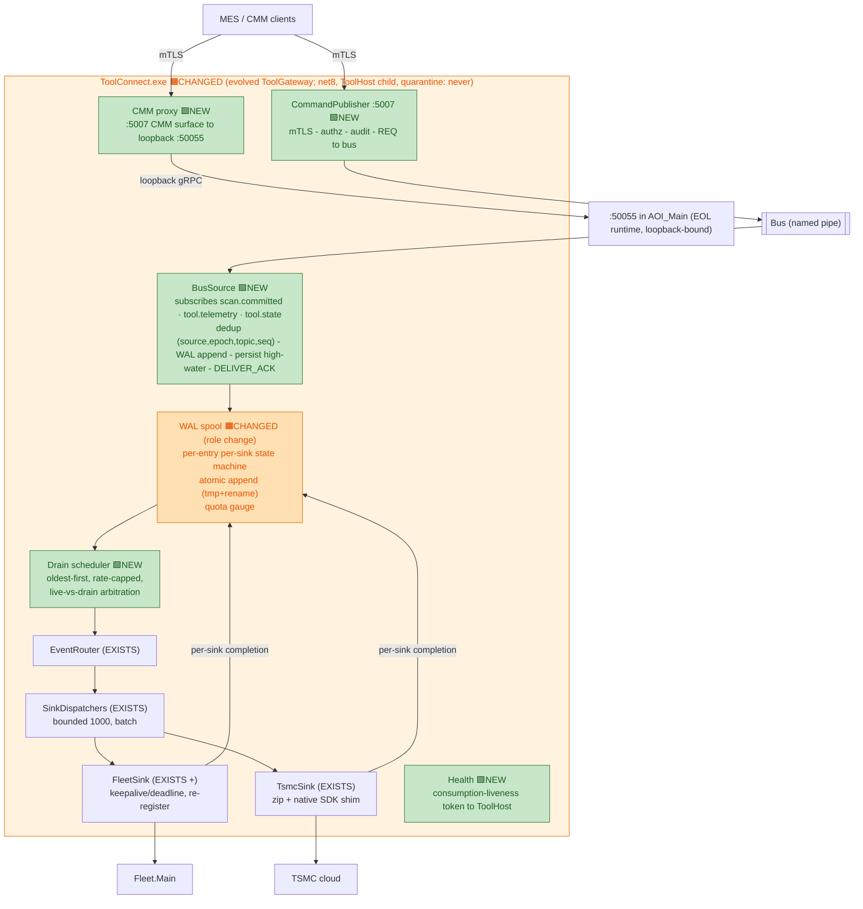
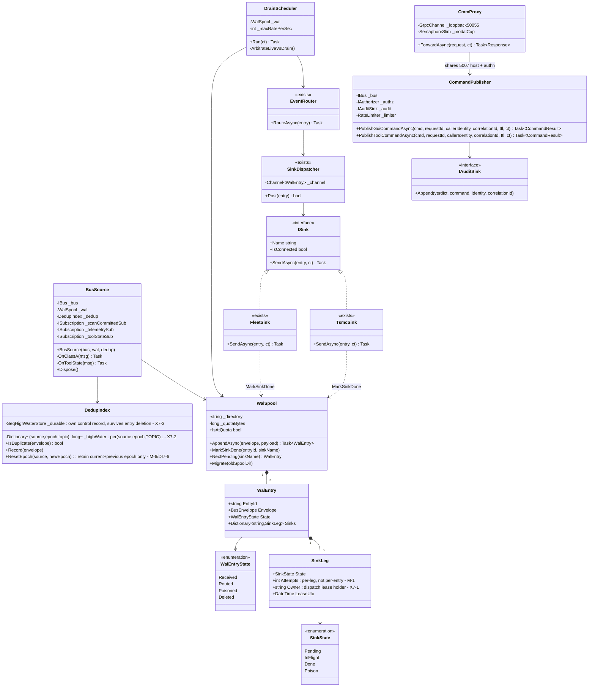
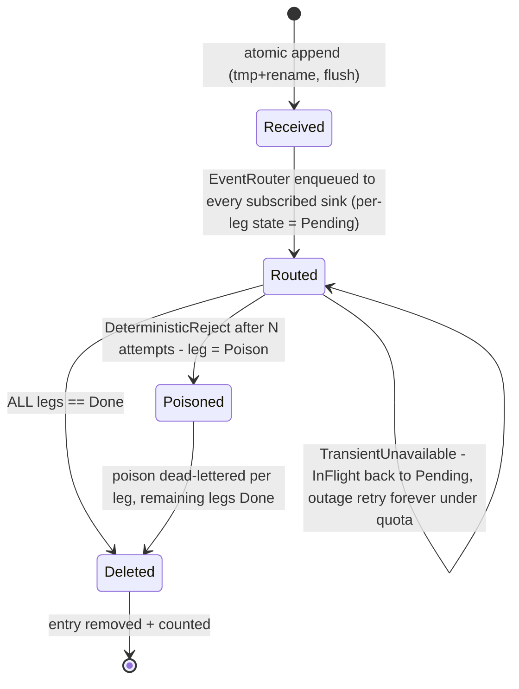

# 7 — ToolConnect Gateway Implementation Design

> Level: **implementation** — the complete build spec for the ToolConnect gateway internals, the same relationship to [01-system-architecture.md §1.3.2](01-system-architecture.md) that [06-bus-implementation.md](06-bus-implementation.md) has to §1.3.1. §1.3.2 remains the system-altitude view; **this document owns the gateway's internal contracts**.
> Up-links: system placement → [01-system-architecture.md §1.3.2](01-system-architecture.md) · bus contracts this component consumes → [06-bus-implementation.md](06-bus-implementation.md) (envelope §6.3, WAL-lifecycle prose §6.5, security §6.8).
> Incorporates the 5th-cycle resolutions **R-3** (WAL state machine + gateway-side idempotency), **R-4** (ack-on-WAL-only), and the LB1/LB5 spool lessons ([05-roadmap-and-risks.md §5.5](05-roadmap-and-risks.md)).
> Code sketch: [codeSnippets/12-gateway-additions.cs](codeSnippets/12-gateway-additions.cs) — **note** the sketch predates R-3/R-4 (its `OnScanCommitted` still couples ack to routing — the exact coupling **R-4** rejects; see the review record, not the S-list); *this document is normative where they diverge*.

---

> **Diagram legend — new vs existing** (applies to the §7.2 architecture flowchart): 🟩 **NEW**
> = new build · 🟧 **CHANGED** = existing component reworked (e.g. the WAL spool's role change)
> · plain / untagged = existing (reused) or external. Per §7.1 the reused sink mechanics
> (EventRouter, SinkDispatchers, FleetSink, TsmcSink) keep their "EXISTS" labels even though
> their contracts are reworked. The §7.3 class diagram **is** now tagged — reused classes carry
> the `<<exists>>` stereotype (🟧) already present, and the new classes are coloured 🟩 NEW
> (where the renderer supports classDiagram `classDef`). The §7.4 WAL state-machine stays
> untagged (states, not components). Authoritative accounting: [04-impact-analysis.md](04-impact-analysis.md).

## 7.1 Responsibility and altitude

ToolConnect is the tool's **only door besides GEM**: events out (Fleet/TSMC), authorized commands in (MES/CMM). It evolves today's ToolGateway: the **sink-side mechanics exist with tests** (EventRouter, SinkDispatchers, FleetSink, TsmcSink — bounded-1000/batch-10/Wait channels, ~90 xUnit tests). **The reuse is of mechanics, not signatures** — the class design below changes every "exists" component's contract (`RouteAsync(WalEntry)` replaces `Publish(EventMessage)`; `MarkSinkDone` replaces the `FailedMessages` path), so the existing test suite is reworked, not inherited (FEA7-2). New builds: a **BusSource** (replacing the :5005 gRPC intake), a **WAL spool with a per-entry/per-sink state machine** (replacing the failed-messages spool), a **CommandPublisher** on :5007, a **CMM proxy** that contains the :50055 surface, and **Fleet registration wiring** (`RegisterToolAsync` exists but is never invoked today — registration must be built, not merely re-registered).

Process: `ToolConnect.exe`, net8-era — **ships on .NET 10 LTS** per [04 §4.4](04-impact-analysis.md) (R-OPS-6) — ToolHost child, `quarantine: never`. It holds **durable ownership** of every class-A message it acks: after DELIVER_ACK, loss or unrecorded duplication anywhere downstream is ToolConnect's defect by contract.

## 7.2 Internal architecture

The decisive structural change from the sketch: **routing consumes from the WAL, never from the bus handler**. The bus handler's only jobs are dedup, WAL append, high-water persist, and returning (which releases DELIVER_ACK). Everything downstream — routing, sink dispatch, retries, drains — reads WAL entries and reports per-sink completion back to the WAL-state actor. A Fleet or TSMC outage therefore piles up in the **gateway's WAL**, never back onto the bus or into AOI's publisher journal (R-4).

**Topic → sink routing (normative — M-35).** The EventRouter routes by topic; the mapping is fixed, not discovered:

| Topic | Class | FleetSink | TsmcSink | WAL |
|---|---|---|---|---|
| `scan.committed` | A | ✔ | ✔ | full per-leg lifecycle |
| `tool.telemetry` | A | ✔ | ✗ (**never** — a 10/s storm × ~10 s/zip would diverge instantly) | full per-leg lifecycle |
| `tool.state` | B | ✔ (current-state) | ✗ | audit copy only (§7.4 rule 7) |

The per-tool storm aggregate is **10/s × N sources (N ≈ 6: AOI_Main, ToolManager, GEM shim, ToolConnect, ToolServices, broker) = 60 msg/s** — a FleetSink P0 ceiling of ≥ 60 msg/s (or gateway-egress aggregate coalescing) is the acceptance rule (§6.9).

## 7.3 Class design

> **New vs existing:** classes marked `<<exists>>` (EventRouter, SinkDispatcher, FleetSink,
> TsmcSink) are 🟧 reused today's ToolGateway sink mechanics (contracts reworked per §7.1);
> **every other class is 🟩 NEW**.

## 7.4 The WAL entry state machine (normative — resolves R-3)

Rules the state machine enforces (each was a review finding):

1. **Single mutation owner (X7-1/CC7-2).** Every entry mutation — `Pending→InFlight` dispatch lease, `MarkSinkDone`, per-leg attempt increment, poison, delete, quota-gauge update — is **posted to one WAL-state actor** (a single channel-consuming thread that owns the entry files and the in-memory index). Sink completion callbacks and the DrainScheduler **never touch entry files**; they post messages. Delete-vs-mark and poison-vs-done therefore serialize by construction, and a `MarkSinkDone` for an already-deleted entry is a counted no-op. This replaces the earlier bare "thread-safe, keyed by entryId+sink" assertion, which had no mechanism and admitted lost-update and drain/live double-send races.
2. **Exactly one dispatch authority per (entry, sink) (X7-1/CC7-1 / C8-MAJ-1).** **`InFlight` is entered at send-start via the actor, not at channel-post.** Channel items are dispatch hints only; the sink's first action is an actor round-trip `TryAcquireLease(entry, sink)` that fails for anything not `Pending`. `NextPending` therefore never returns an `InFlight` leg, and a drain tick cannot re-send a leg a live send is currently transmitting. Completion is `InFlight → Done`; failure is `InFlight → Pending|Poison`; **a periodic actor-owned lease sweep** (running mode, not just restart) reclaims legs orphaned mid-send: lease duration = sink deadline + sweep interval (both stated values in the manifest). This closes both the steady-state duplicate and the flaky-Fleet-mid-drain double-dispatch scenario.
3. **Poison ≠ outage — by a typed failure taxonomy, never a connectivity flag (X7-4/CN7-1).** A sink returns/throws a **typed result**, not a bool: `TransientUnavailable` (gRPC UNAVAILABLE / DEADLINE-before-send / socket / init failure) → `InFlight→Pending`, **not an attempt**, retries forever under quota; `DeterministicReject` (INVALID_ARGUMENT / serialization / 4xx-equivalent) → an attempt; after N → per-leg dead-letter + counter + alarm (fixes LB1's infinite cycle); `AmbiguousOutcome` (deadline *after* the send left) → leg stays `Pending` and the resend carries the sink's idempotency key (rule 6). The earlier `ISink.IsConnected` discriminator is abolished: the shipped `FleetMainServerClientImpl.IsConnected` is a trailing bool (true after the last success) that misclassifies a poison message as an outage (LB1 resurrected) *and* a slow-but-up Fleet as poison (fresh customer data dead-lettered) — both verified in code.
4. **Per-leg attempts.** `Attempts` lives on the `SinkLeg`, not the entry — one sink's failures never poison another sink's first attempt (M-1); "an attempt" is a completed send classified `DeterministicReject`.
5. **Atomic append.** `tmp` + `rename` + flush — a crash mid-append leaves no half-entry; "durable ownership FIRST" means on-platter, not page-cache (R-3d). Orphan `.tmp` files are swept by the actor at startup.
6. **Sink idempotency keys are contractual, not optional (M-3/M-37).** The `AmbiguousOutcome` leg re-sends on recovery, so per-sink idempotency is **required**, not defense-in-depth: **Fleet** — a dedup key is added to `ToolEventMessage` ingestion (the shipped `PushEventAsync` carries none — a cross-team requirement, tracked as [05 §5.6.1 A-6](05-roadmap-and-risks.md), now a P1a dependency for the "no unrecorded duplication" contract of §7.1); **TSMC** — retries reuse the stable `UniqueId` and the cloud contract is asserted to overwrite same-`UniqueId` uploads (verified in the mock; the real cloud semantics are a stated assertion).
7. **Deletion only from the actor.** An entry is deleted only when **every** leg is `Done` (or a poisoned leg is dead-lettered) — the drain never re-sends a `Done` leg and the WAL cannot grow unbounded (R-3b; the sketch's orphaned `MarkDeliveredAsync` becomes this contract). `tool.state` audit copies (§7.5) have no class-A sink leg, so they carry an **independent `AuditExpired → Deleted` path**: a TTL-based actor-owned job removes them after the audit window, independently of any sink completion. **ShadowDone entries** (from the dual-run comparator, §7.11) follow the same `AuditExpired → Deleted` path: comparator consumption marks the entry `ShadowDone`; only a compact verdict log is retained (not the full envelope); a dedicated disk gauge + alarm at 50/80% of a stated shadow budget (e.g. 2 GB) prevents unbounded accumulation — DI7-5/C8-MAJ-24.
8. **Startup migration (M-13/M-18/SEC7-5 / C8-MAJ-15).** First boot after upgrade runs a one-time migrator from the old `FailedMessages-*.txt` spool + `.overflow.txt` into the WAL (R-OPS-3, closing LB5). The migrator is **crash-idempotent**: a durable per-file completion record (`migrated.manifest` of content hashes) is fsynced **before archive** and checked **before migration begins** — a crash-after-drain-before-scrub restart does not re-migrate already-drained files (which would manufacture duplicates for entries the WAL already processed). An explicit **exclusive-access precondition**: fail loudly if any old gateway process or open file handles are detected — a concurrent old gateway re-spooling files voids the per-file completion record. A deterministic messageId derived from old-entry content hash so a retry-after-completion is a counted no-op, not a new WAL entry. **Rate-capped** subordinate to live traffic, counts as "processed-or-idle" for the health token during a long backlog, **archives + then securely scrubs** the old spool location (it holds plaintext customer IP under the pre-hardening ACL — the scrub is verified by a test asserting the old location is empty and inaccessible post-migration).

## 7.5 BusSource — intake contract (resolves R-4)

- **DELIVER_ACK is a function of the WAL append only** — never of routing, sink, dispatcher, or channel state. The handler: dedup-check → WAL append → persist high-water → return. Routing is asynchronous, downstream of the WAL.
- **Gateway-side idempotency — the dedup identity is `(source, sourceEpoch, topic, seq)` (X7-2).** `DedupIndex` is keyed `(source, sourceEpoch, topic)` and `seq` is per-`(source, epoch, topic)` (§6.3). A per-source-only key is wrong: the gateway's dispatch lanes are per-`(source, topic)` and unordered across topics, so a per-source high-water lets `tool.telemetry seq=105` arriving before `scan.committed seq=100` classify a fresh wafer as a duplicate — the R-2 loss reborn. A redelivered message (publisher crash between our ack and its tombstone) is acked again but **not** appended twice.
- **The high-water is a durable control record, not derived from live entries (X7-3/X7-9).** It is persisted per-`(source, epoch, topic)` in its own control store beside the WAL, with the ordering contract **`append entry (fsync) → persist high-water → return (=ACK)`**; recovery = `max(control record, max surviving-entry seq)`, and **entry deletion never lowers it**. Deriving the high-water by scanning surviving entries is unsound once §7.4 deletion runs: a delivered-and-deleted top-of-sequence entry would let the recovered high-water regress below a redelivered seq → second submission. The publisher side carries the mirror rule: the client's `_nextSeq` is restored as `max(seq-sidecar, journal-max)` so journal **compaction** (which removes acked+tombstoned top entries) can never regress the publisher below the gateway's surviving high-water — the DI7-1 daily-restart silent-loss path.
- **Epoch rules (M-6).** A *higher* epoch starts a new baseline for that `(source, topic)` and is alarmed ("publisher re-incarnated"). An *epoch regression* (lower epoch — a rolled-back AOI, or a cleared epoch file) is **alarmed and accepted with a baseline reset — never silently discarded** (a silent drop would make the rollback path itself lose fresh wafers). `DedupIndex` retains the **current + previous** epoch high-waters (so a straggler replay of the prior epoch after a bump is still deduped, not re-admitted) and prunes older ones. Missing epoch on the wire ≡ epoch 0 (mixed-version window, §6.3).
- **Per-class handling.** `scan.committed` and `tool.telemetry` (class A) take the full WAL path. `tool.state` (class B, retained) is routed without class-A E2E semantics — current-state-wins; the WAL keeps an audit copy under an independent TTL/ring (§7.4 rule 7).
- **Backpressure at quota is *withhold*, not *block* (M-2/CC7-5).** At WAL quota the handler **returns without acking** (a deferred-ack list keyed by deliveryId) or sends an explicit subscriber-NACK — it **never parks the pump reader on a lane** (parking would stall `tool.state`/`PING` behind a full `scan.committed` lane in the same pipe → broker write-deadline → gateway disconnect at quota). The broker bounds unacked in-flight per (topic, subscriber); a **below-low-watermark event** acks/redelivers the deferred set. The NACK/journal machinery then takes over, alarmed at the publisher — loss is never taken at the sink hop. **No deadlock cycle exists** (drainage depends only on Fleet/TSMC availability + the internal drain, never on any bus frame).
- **Per-topic quota floor (M-36/DI7-2).** The WAL quota is **partitioned**: `scan.committed` (money data) has a reserved guaranteed share, so a lower-value `tool.telemetry`/Fleet backlog cannot accelerate `scan.committed` backpressure into an AOI production pause. Under quota pressure telemetry is deprioritized/evicted before scan.committed.
- **Quota sizing (M-34 / C8-MAJ-20).** Quota = **4 GB ≈ 1.6 M entries at ~2.5 KB avg** (avg-entry-size is a **P0-measured quantity** — the 2.5 KB figure is a planning estimate; the alarm thresholds 50%/80% are re-derived from the measured avg at P0) **→ ≈18 h of sustained burst (25/s) or ≈18–37 days of nominal (0.5–1/s); alarm at 50 % and 80 %.** **WAL physical layout**: append-only segment files + a compact entry index (not one-file-per-entry — a 1.6 M file directory has measured enumeration latency; the index caps startup sweep time to a stated bound). Quota counts **serialized bytes** (not allocated), consistent with the avg-entry-size figure. **`scan.committed` payload budget** is declared in the topic registry (≤4 KB, per the M-33 mechanism) — this makes the 2.5 KB average figure auditable and keeps the WAL entry count model honest. **Fleet dedup P1a gate (C8-MAJ-22):** a P1a flip entry criterion is `Fleet ToolEventMessage ingestion dedup key deployed + verified against the real Fleet build`. Registration-time capability check: gateway refuses to leave shadow mode (emits a distinct alarm) if Fleet lacks the dedup key capability. No-key fallback: hold the Fleet leg `Pending` + alarm, never resend without the key (a re-send without a key manufactures a duplicate yield record in the Fleet DB).
- **WAL append failure is not a crash (M-17/OPS7-2).** A disk I/O error or disk-full *below* quota ⇒ the same externally visible behavior as quota (withhold DELIVER_ACK, backpressure to the publisher journal) + a distinct `wal-io-failure` health bit + a local alarm (routed per §7.11) — never a swallowed exception that redelivers forever, never a crash-loop against a full disk. Quota (sized, expected, self-drains) and I/O failure (needs an FSE) are distinct conditions.
- **Pointer-vs-data retention invariant (M-38/DI7-4 / C8-MAJ-23).** The WAL durably owns the *envelope* (a `ResultsPath` pointer), not the scan data, which `TsmcSink` reads at send time. A hard invariant therefore binds tile/zip retention: **results-directory retention ≥ (max WAL drain window + dead-letter recovery window)**, a Wave-0 §4 deliverable with a test — otherwise a long outage lets housekeeping age out the data under a still-`Pending` WAL leg, and the drain false-poisons an entry whose data is already gone. **Runtime enforcement:** housekeeping (and the `frmJobTab.DeleteAllJobsExcept` job-delete flow) must query the gateway's diagnostic REST surface for the oldest `ResultsPath` referenced by any non-Done non-dead-lettered WAL leg and **refuse or warn** if the proposed deletion would undercut it. A typed `SourceDataMissing` sink outcome immediately dead-letters the affected leg (alarm class distinct from network failures) with no re-inject affordance — the data is gone and cannot be recovered by re-inject.
- **`stale-since` is produced here (M-7).** The value the gateway reports to Fleet = `max(last tool.state receipt, own bus-connect time)`, emitted on the Fleet telemetry path; a subscriber that learns (via the broker's synthetic retained update, §6.6) that a `tool.state` owner died mid-session treats `sourceConnected==false` beyond T as degraded input.
- **Health = consumption-liveness token** pushed to ToolHost: "connected AND processed-or-idle within T" — a hung pipeline is distinguishable from an idle one; the token also carries the `wal-io-failure`/`wal-quota` bits so gateway health reaches Fleet **off the sink path** (§7.13 alarm table).

## 7.6 CommandPublisher :5007 — the audited external command door

Flow SYS-3 in [doc 01](01-system-architecture.md) shows the system view; the internal order is contractual:

1. **Authenticate** — mTLS client certificate ([06 §6.8.3](06-bus-implementation.md), decided; Windows-auth fallback for fully domain-joined sites). Unauthenticated callers are refused at the TLS layer; the endpoint binds to the MES VLAN interface, not `0.0.0.0`.
2. **Rate-limit / lockout** per caller identity — before any work.
3. **Authorize** — per-identity command allowlist, **default-deny** (the sketch's `IsAuthorized => true` is the SEC-3 finding, resolved by R-7 — not the design).
4. **Audit-before-publish, fail-closed** — verdict (accepted/rejected), command, authenticated identity, `correlationId` to the append-only off-bus audit sink ([06 §6.8.6](06-bus-implementation.md)). No publish precedes its audit record. **If the audit sink is unavailable** (disk full, ACL broken, sink down) the command is **refused** with a typed `audit-unavailable` response — never published unaudited (fail-open would defeat the forensic control exactly during an attack); the audit-sink health is its own alarm/liveness token, and a bounded local queued-audit fallback absorbs a transient blip so a momentary sink hiccup degrades to queued-audit rather than a hard command-door DoS (M-12/SEC7-2).
5. **Fast-fail on dark fabric** — bus not connected → immediate `fabric unavailable` response; never a hang, never a queue.
6. **REQ with mandatory Ttl + requester deadline** — reply semantics are ACCEPTED-on-post per [06 §6.7](06-bus-implementation.md); a dead command target returns `REPLY(rejected:no-server)`, distinct from a timeout.

`:5007 refuses unauthenticated callers` is a **P1a exit criterion** with a test.

## 7.7 CMM proxy — containing :50055 (Wave 2)

**Problem:** AOI_Main hosts a gRPC server on `:50055` (EOL Grpc.Core) for CMM. It is `Insecure` but loopback-bound; the *external* CMM caller is what needs a real door.

**Design — a strangler proxy, not a port:** the CMM surface is exposed on **:5007** (same host, same mTLS/authz/audit pipeline as §7.6) and forwarded over loopback to `:50055` inside AOI_Main. The proxy owns:

- **Per-operation authorization — default-deny, cert-scoped (X7-6/SEC7-1).** The proxy is **not** authn-only. It applies the same default-deny per-identity operation allowlist as §7.6, and **CMM-caller certs are a distinct operation class from MES command certs** — an MES cert cannot invoke CMM operations and vice-versa. Because bytes are forwarded, an **operation-id allowlist at the proxy** is the gate: high-impact ops — `UploadBinCodesToSecsIIWaferMap` (writes the SECS-II wafer map the host reads), `ExportMap`, setup-path loads — are individually authorized **and** audited. Without this, any accepted :5007 cert reaches the full loopback `:50055` (`Insecure`) surface — yield/bin falsification and operator-modal injection over a boundary that is loopback-only today. **"The CMM proxy refuses un-allowlisted operations" is a Wave-2 exit criterion with a test.**
- **Per-method concurrency (M-32/FEA7-3), not a global cap.** The real `:50055` surface mixes operator-blocking modal ops (`ExportMapConfirmation`, `DoPostScanMapMatch`) with fire-and-forget notifications (`Alert`, `NotifyAlarm`, `ExportMapStart`). A global cap-of-1 would refuse a legitimate notification arriving while a modal is open — a regression the external CMM never expected. The cap applies **per modal/blocking method** (long site-configured deadline + `SemaphoreSlim`); notifications pass uncapped. So "no CMM client change required" holds only under the per-method cap.
- **Modal lifecycle (CN7-6).** Cancellation is **not propagated** into a modal already open on the operator console — operator flows complete deterministically; if the external caller has gone, the loopback completion is discarded and audited `orphaned-completion`, and the modal cap releases only on loopback completion. A **proxy restart during a modal op** is a §7.9 row: the AOI-side modal completes, its result is discarded, and the next CMM call returns `busy-pending-operator` until completion.
- **Liveness mapping:** AOI closed / :50055 unreachable → immediate, typed `tool-gui-unavailable` response — the external caller never discovers AOI's absence via a TCP timeout.

This **contains the EOL Grpc.Core runtime and gives the external CMM caller an authenticated, authorized :5007 door** in Wave 2 with **no P4 dependency** ([05 §5.2](05-roadmap-and-risks.md)) — `:50055` was already loopback-bound (C-1), so this is runtime-containment + a real external door, not "closing an external surface." The deferred "CMM per-op split" later replaces the loopback hop with real ToolServices modules behind the same :5007 surface — callers don't move twice.

## 7.8 Threading model

| Stage | Discipline |
|---|---|
| Bus handlers (BusSource) | The client library's ordered dispatch lane per `(source, topic)` — handlers awaited sequentially; per-`(source,topic)` FIFO is load-bearing for dedup and WAL order. The handler **never blocks on a lane** (M-2) — at quota it returns without acking |
| WAL state | **A single WAL-state actor** owns all entry-file mutations and the in-memory index (§7.4 rule 1). `MarkSinkDone`, dispatch-lease, attempt-increment, poison, delete and the quota gauge are messages to this actor, serialized by construction — this replaces the earlier "thread-safe, keyed by entryId+sink" assertion that had no mechanism. **Actor inbox is bounded at N = 4 096** (C8-MAJ-2); all producers are flow-controlled (no fire-and-forget enqueue). The actor **group-commits** appends and high-water persists in batches (drain all pending before fsync) to amortize fsync cost at high ingest |
| WAL append | Atomic file I/O on the actor's thread (tmp + rename + flush); the high-water control record is persisted in the `append → persist → ack` order (§7.5) |
| Routing + sink dispatch | `SinkDispatcher` bounded channels — the **existing mechanics** (capacity 1000, batch 10, `FullMode.Wait`) carry over; the item type (`WalEntry`) and the completion/failure path (`MarkSinkDone` replacing `AddToFailedMessagesAsync`) change (M-31) |
| Sink I/O | One writer per sink; completion posts a typed result (§7.4 rule 3) to the WAL-state actor, never a direct file write |
| Drain scheduler | **Per-topic priority lanes (C8-MAJ-19):** `scan.committed` is in a high-priority lane; `tool.telemetry` is in a normal-priority lane. Within each lane: **oldest-first, rate-capped**. Across lanes: **weighted live:drain quantum** (e.g. 4:1, work-conserving — mirrors the S-14 send-queue fix); the high-priority lane is also weighted ahead of normal-priority within the same drain quantum. This prevents sustained telemetry backlog from delaying scan.committed drain. **Not** "live wins ties" (which gives drain no guaranteed share and lets sustained live traffic starve the drain → a past outage becomes future refuse-new). T-L4 (1-h outage drains < 10 min) is asserted **with concurrent live traffic** and is gated by the P0 sink-throughput floors (§6.10: FleetSink ≥ 7 msg/s; TsmcSink ≤ 8.5 s/wafer) — if a P0 measurement misses its floor, T-L4 is re-scoped per sink at Wave 0, not discovered impossible later. G-9 (§7.12) validates priority ordering: a mixed backlog of scan.committed + tool.telemetry entries must drain scan.committed legs first |
| :5007 host | Kestrel thread pool; `CommandPublisher`/`CmmProxy` are stateless per-request apart from the rate limiter and per-method modal cap |

## 7.9 Failure matrix

| Condition | Behavior | Where it's tested |
|---|---|---|
| Broker down/restart | BusSource reconnects (library backoff); missed class-A redelivers from publisher journals; dedup absorbs overlaps | TestKit 3/5 |
| Fleet down 1 h | Entries accumulate `Sinks[Fleet]=Pending`; TSMC copies unaffected; drain clears <10 min after recovery | TestKit 5, T-L4 |
| TSMC down + Fleet up | Per-sink: Fleet marked Done, entry survives for TSMC only | TestKit 5 (per-sink `count==published AND distinct==published`) |
| Gateway crash after WAL append, before sink send | Restart: WAL replays Pending legs (InFlight leases expire and reclaim); no loss (entry durable), no duplicate to Done legs | gateway suite crash-point matrix (G-8) |
| Gateway crash after ack, before publisher tombstone | Publisher redelivers; DedupIndex drops the duplicate on `(source,epoch,topic,seq)`; acked again; durable high-water never regressed | gateway suite G-8 + TestKit 5 (R-3/X7-3) |
| Sink deterministic reject while reachable | `DeterministicReject` counted; N attempts → per-leg dead-letter + alarm; other legs unaffected | gateway suite G-1/G-3 |
| Sink transient/deadline-before-send | `TransientUnavailable` → not an attempt; leg stays Pending; retries forever under quota | gateway suite G-2 |
| Sink deadline *after* send (ambiguous) | Leg stays Pending; resend carries the sink idempotency key (Fleet dedup key / TSMC UniqueId) | gateway suite G-2 + downstream dedup contract |
| WAL at quota / WAL append I/O error | Withhold DELIVER_ACK (never park the reader) → bus backpressure → publisher journal alarms; `scan.committed` protected by its per-topic quota floor; `wal-io-failure` bit distinguishes disk error from quota; zero drop | TestKit 5b + gateway suite 5c |
| Bus dark, MES calls :5007 | Immediate `fabric unavailable` | gateway suite G-5 (:5007 fast-fail — P1a exit criterion test, §7.6) |
| Audit sink unavailable | Command refused `audit-unavailable`; never published unaudited | gateway suite G-4 |
| CMM caller sends un-allowlisted op | Refused (default-deny per-op authz); audited | gateway suite G-6 (Wave-2 exit criterion) |
| AOI closed, CMM calls proxy | Immediate `tool-gui-unavailable` | gateway suite G-6 |
| Proxy restart during a modal op | AOI-side modal completes; result discarded; next CMM call `busy-pending-operator` until completion | gateway suite G-6 |

## 7.10 What exists vs what is built (per project impact, [04 §4.1–4.2](04-impact-analysis.md))

| Piece | Status | Note |
|---|---|---|
| EventRouter, SinkDispatchers, FleetSink, TsmcSink, zip/native shim | **EXISTS** (with xUnit suite) | Keepalive/deadline + re-register added to FleetSink |
| Spool | **REPLACED** — WAL state machine (§7.4) + one-time migrator | Fixes LB1 (poison loop) + LB5 (no drain, overflow) structurally |
| :5005 gRPC intake | **RETIRED** (P1b, after retention) | BusSource replaces it; :5005 kept one release past the last AOI publisher (R-OPS-1) |
| BusSource, DedupIndex, DrainScheduler, WAL-state actor | **NEW** | §7.4–7.5 |
| Fleet **registration** wiring (`RegisterToolAsync` never invoked today) | **NEW** | §7.10 — build, not a re-register tweak |
| CommandPublisher :5007, CMM proxy | **NEW** | §7.6–7.7; gated on §6.8 security work-stream (P1a criterion) |
| Fleet ToolId fix (LB3) | **Wave 0** | Independent of this design; filed regardless |
| **Process name: `ToolConnect.Service.exe`** | **NEW (normative — OPS8-3/C8-CRIT-4/D17)** | Old name `ToolGateway.Endpoint` is killed by `clsInitAOI.cs:406,458,478-484` at every AOI startup/exit. New process name breaks the kill path. See D17 (OPEN-DECISIONS.md) |
| **Dead-letter CLI (C8-MAJ-12)** | **NEW (Wave-0 deliverable)** | `toolconnect-admin dead-letter list` — lists all Poisoned entries with: entryId, sink, topic, first-seen, attempts, last-error, `ResultsPath`. `toolconnect-admin dead-letter re-inject <entryId>` — transitions leg from Poisoned back to Pending after operator confirmation (requires root cause fix first; re-inject is audited to the same audit sink as :5007 commands). `toolconnect-admin dead-letter delete <entryId>` — marks leg as Deleted (data-loss path; audited + banner alarm). No bulk re-inject (blast-radius guard). CLI contacts the WAL-state actor via a local Unix socket; no network exposure |

## 7.11 Dual-run mode (P1a — resolves X7-5)

At P1a the gateway ingests the same event through **two doors**: the new BusSource (bus) and the legacy `:5005` gRPC intake, run in parallel for a shadowed comparison before `:5005` retires at P1b ([03 lane A](03-appendix-four-lanes.md), [05 §5.2](05-roadmap-and-risks.md)). Without an explicit mode this double-submits every wafer to Fleet/TSMC for a full release cycle (the `:5005` `EventMessage` cannot match the bus dedup key), or — if BusSource silently doesn't route — the WAL fills and backpressures AOI in normal production. The mode is therefore contractual:

- **Exactly one door routes to sinks at a time**, selected by the signed fleet profile flag (default: bus is shadow until the edge is flipped, matching 03's per-subscriber flip).
- **The shadow door terminates at a gateway-side comparator tap** (pair key `correlationId`/`UniqueId`), **never at EventRouter** — a shadow event is compared, not sent.
- **Shadow-door WAL entries are marked `ShadowDone`** on comparator consumption — a quota-exempt audit class, so shadow traffic never counts toward the quota that gates live backpressure. `ShadowDone` entries have their own disk gauge + alarm. **`ShadowDone` has an `AuditExpired → Deleted` path** (TTL-gated, same compaction actor) so shadow entries do not accumulate unboundedly after the mode is retired.
- **The P1b flip procedure** names the old-`FailedMessages`-spool vs WAL overlap: at flip, a message present in both stores is **suppressed at the sink boundary by `UniqueId`** — the overlap key is `UniqueId` at sink boundary, checked independently for Fleet and TSMC. There is **no wall-clock dedup window** (a time window misses entries that enter the drain after the window closes and causes double-submit for slow-draining sinks). The dedup is active until both WAL legs for that `UniqueId` reach Done or Deleted state. (C8-MAJ-13)

## 7.12 Gateway suite (normative test contract — resolves M-20/M-21)

The bus TestKit ([06 §6.10](06-bus-implementation.md)) asserts the *bus* contract; its fault points are all bus-side. The gateway's WAL state machine, :5007 door, and CMM proxy need their own assertions and their own fault harness — cited by the §7.9 failure matrix and by the P1a exit criteria, so it is a named deliverable, not an implied one ([04 §4.1/§4.2](04-impact-analysis.md): `ToolGateway.Tests` extended).

**`GatewayHarness`** (in `ToolGateway.Tests`, consuming the TestKit `BusHarness` as its bus): hosts `BusSource + WalSpool + DrainScheduler + WAL-state actor` in-proc; a `FakeSink : ISink` with **settable reachability** and **scripted per-entry typed results** (TransientUnavailable / DeterministicReject / AmbiguousOutcome / success); a `CrashAt(GatewayStep)` covering {after-WAL-append/before-ACK, after-ACK/before-tombstone, after-sink-send/before-MarkSinkDone, mid-append (torn file)}; a restart-and-replay helper asserting per-sink `count == published AND distinct-count == published`.

| # | Assertion | Tier |
|---|---|---|
| G-1 | `DeterministicReject` × N while reachable → per-leg dead-letter + alarm; other legs unaffected | PR |
| G-2 | `TransientUnavailable`/deadline-before-send is **not** an attempt — a 24 h outage produces **zero** dead-letters; ambiguous (deadline-after-send) leg re-sends with the idempotency key | PR |
| G-3 | `Poisoned → Deleted` with remaining legs `Done`; no re-send to a `Done` leg; drain never returns an `InFlight` leg (steady-state no-duplicate) | PR |
| G-4 | :5007 refuses unauthenticated callers; audit-sink-down → command refused `audit-unavailable`, never published (**P1a exit criterion**) | PR |
| G-5 | :5007 dark-bus fast-fail < stated bound, never a queue | PR |
| G-6 | CMM proxy: `tool-gui-unavailable`; un-allowlisted op refused (**Wave-2 exit criterion**); per-method modal cap `busy`; proxy-restart-mid-modal → `busy-pending-operator` | PR |
| G-7 | Spool migrator: old `FailedMessages-*.txt` + `.overflow.txt` fixtures → WAL, crash-idempotent on retry (no duplicate), old location scrubbed | nightly |
| G-8 | Crash-point matrix — five `CrashAt` points: {after-WAL-append/before-ACK, after-ACK/before-tombstone, after-sink-send/before-MarkSinkDone, mid-append (torn file), **after-ACK/before-routing (`Received` state — entry durable, zero legs)**} + compact-to-empty → restart → **fresh wafer accepted, not deduped** (X7-3/X7-9). `Received`-state recovery oracle: startup routing pass **creates all legs from scratch**; per-sink `count==published AND distinct==published` — if publisher redelivers, dedup absorbs the duplicate on the *second* entry (not the first, which must be accepted). Pairs with TestKit 5/5b (C8-MAJ-26/C9-2) | nightly |
| G-9 | Scaled drain (~5 k mixed-state entries, mixed `scan.committed`+`tool.telemetry`): **scan.committed legs drain before tool.telemetry legs within the same drain quantum** (per-topic priority, C8-MAJ-19); oldest-first within lane; rate cap honored; no re-send to `Done` legs; live-traffic latency bound during drain (cheap proxy for T-L4) | nightly |
| G-10 | **Dual-run / shadow mode** (**P1a exit criterion** — C8-CRIT-5): shadow door events never reach EventRouter or sinks (comparator tap only); `ShadowDone` entries counted as quota-exempt; P1b flip: `UniqueId`-keyed dedup at each sink (Fleet + TSMC) prevents double-submit for any entry that was draining at flip time; flip passes G-1/G-3/G-8 clean with no extra deduplication failures | nightly |

## 7.13 Alarm routing (normative — resolves M-16/OPS7-1)

Every gateway/WAL/journal alarm has a stated surface and operator action; critically, **gateway/WAL/journal alarms reach Fleet via the Fleet-polled `:5100` health surface** (counters are pushed from broker/gateway to ToolHost each heartbeat and survive broker death per [06 §6.6](06-bus-implementation.md); Fleet polls `:5100` off-box on the management LAN — C8-CRIT-1/D16) — **never solely via `tool.telemetry`**, which is class-A through the same WAL the alarm is about and would be backpressured by the very condition it reports.

| Alarm | Local surface | Fleet surface | Operator action |
|---|---|---|---|
| WAL 50 % / 80 % quota | operator banner + light tower | Fleet polls :5100 | check Fleet/TSMC connectivity; drain is automatic on recovery |
| WAL quota reached (withhold-ACK) | banner + light tower | Fleet polls :5100 | Fleet/TSMC outage — data is durable, not lost; escalate if prolonged |
| `wal-io-failure` (disk error/full) | banner + light tower | Fleet polls :5100 | **FSE**: free disk / check the WAL volume |
| Poison dead-letter | banner | Fleet polls :5100 + count | inspect/re-inject via the dead-letter CLI (§7.10 deliverable) once the poison cause is fixed |
| Epoch new / **regression** | log + banner (regression) | Fleet polls :5100 | regression on a rollback is expected; otherwise investigate a journal clone/tamper |
| Journal 50 % / refuse-new (publisher side) | AOI banner | via AOI `tool.telemetry` **and** :5100 | the WAL is full upstream — same action as WAL-quota |
| :5007 TLS refusal (cert expired) | banner "certificate expired ≠ fabric down" | :5100 + fleet fingerprint `notAfter` pre-expiry alarm | offline cert rotation (security work-stream, air-gap constraint) |
