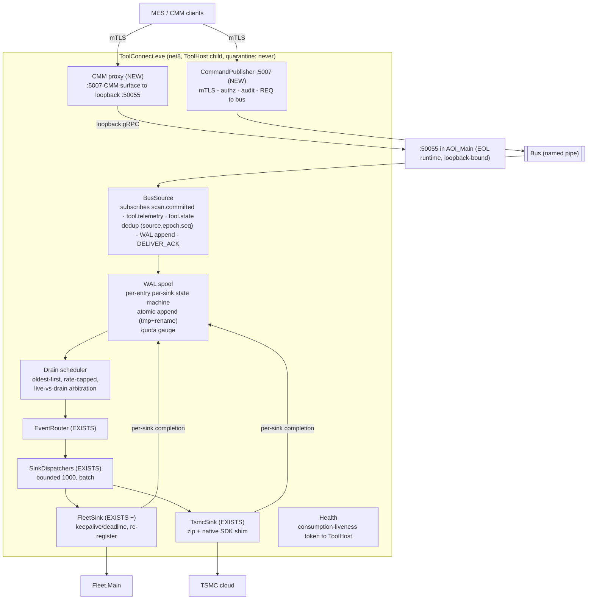
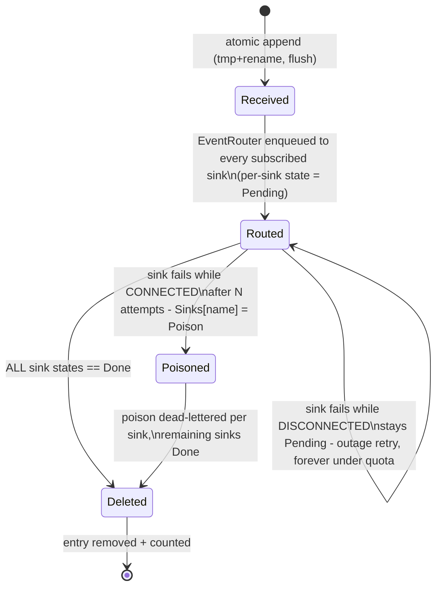

# 7 — ToolConnect Gateway Implementation Design

> Level: **implementation** — the complete build spec for the ToolConnect gateway internals, the same relationship to [01-system-architecture.md §1.3.2](01-system-architecture.md) that [06-bus-implementation.md](06-bus-implementation.md) has to §1.3.1. §1.3.2 remains the system-altitude view; **this document owns the gateway's internal contracts**.
> Up-links: system placement → [01-system-architecture.md §1.3.2](01-system-architecture.md) · bus contracts this component consumes → [06-bus-implementation.md](06-bus-implementation.md) (envelope §6.3, WAL-lifecycle prose §6.5, security §6.8).
> Incorporates the 5th-cycle resolutions **R-3** (WAL state machine + gateway-side idempotency), **R-4** (ack-on-WAL-only), and the LB1/LB5 spool lessons ([05-roadmap-and-risks.md §5.5](05-roadmap-and-risks.md)).
> Code sketch: [codeSnippets/12-gateway-additions.cs](codeSnippets/12-gateway-additions.cs) — **note** the sketch predates R-3/R-4 (its `OnScanCommitted` still couples ack to routing, flagged in the sketch-bug list); *this document is normative where they diverge*.

---

## 7.1 Responsibility and altitude

ToolConnect is the tool's **only door besides GEM**: events out (Fleet/TSMC), authorized commands in (MES/CMM). It evolves today's ToolGateway — **~70% of the pipeline exists with tests** (EventRouter, SinkDispatchers, FleetSink, TsmcSink). The additions are: a **BusSource** (replacing the :5005 gRPC intake), a **WAL spool with a per-entry/per-sink state machine** (replacing the failed-messages spool), a **CommandPublisher** on :5007, and a **CMM proxy** that contains the :50055 surface.

Process: `ToolConnect.exe`, net8, ToolHost child, `quarantine: never`. It holds **durable ownership** of every class-A message it acks: after DELIVER_ACK, loss or unrecorded duplication anywhere downstream is ToolConnect's defect by contract.

## 7.2 Internal architecture



The decisive structural change from the sketch: **routing consumes from the WAL, never from the bus handler**. The bus handler's only jobs are dedup, WAL append, and returning (which releases DELIVER_ACK). Everything downstream — routing, sink dispatch, retries, drains — reads WAL entries and reports per-sink completion back to the WAL. A Fleet or TSMC outage therefore piles up in the **gateway's WAL**, never back onto the bus or into AOI's publisher journal (R-4).

## 7.3 Class design

```mermaid
classDiagram
    class BusSource {
        -IBus _bus
        -WalSpool _wal
        -DedupIndex _dedup
        -ISubscription _scanCommittedSub
        -ISubscription _telemetrySub
        -ISubscription _toolStateSub
        +BusSource(bus, wal, dedup)
        -OnClassA(msg) Task
        -OnToolState(msg) Task
        +Dispose()
    }
    class DedupIndex {
        -Dictionary~(source,epoch), long~ _highWater
        +IsDuplicate(envelope) bool
        +Record(envelope)
        +ResetEpoch(source, newEpoch)
    }
    class WalSpool {
        -string _directory
        -long _quotaBytes
        +AppendAsync(envelope, payload) Task~WalEntry~
        +MarkSinkDone(entryId, sinkName)
        +NextPending(sinkName) WalEntry
        +IsAtQuota bool
        +Migrate(oldSpoolDir)
    }
    class WalEntry {
        +string EntryId
        +BusEnvelope Envelope
        +WalEntryState State
        +Dictionary~string,SinkState~ Sinks
        +int Attempts
    }
    class WalEntryState {
        <<enumeration>>
        Received
        Routed
        Deleted
    }
    class SinkState {
        <<enumeration>>
        Pending
        Done
        Poison
    }
    class DrainScheduler {
        -WalSpool _wal
        -int _maxRatePerSec
        +Run(ct) Task
        -ArbitrateLiveVsDrain()
    }
    class EventRouter {
        <<exists>>
        +RouteAsync(entry) Task
    }
    class SinkDispatcher {
        <<exists>>
        -Channel~WalEntry~ _channel
        +Post(entry) bool
    }
    class ISink {
        <<interface>>
        +Name string
        +SendAsync(entry, ct) Task
        +IsConnected bool
    }
    class FleetSink {
        <<exists>>
        +SendAsync(entry, ct) Task
    }
    class TsmcSink {
        <<exists>>
        +SendAsync(entry, ct) Task
    }
    class CommandPublisher {
        -IBus _bus
        -IAuthorizer _authz
        -IAuditSink _audit
        -RateLimiter _limiter
        +PublishGuiCommandAsync(cmd, requestId, callerIdentity, correlationId, ttl, ct) Task~CommandResult~
    }
    class CmmProxy {
        -GrpcChannel _loopback50055
        -SemaphoreSlim _modalCap
        +ForwardAsync(request, ct) Task~Response~
    }
    class IAuditSink {
        <<interface>>
        +Append(verdict, command, identity, correlationId)
    }

    BusSource --> DedupIndex
    BusSource --> WalSpool
    WalSpool "1" *-- "n" WalEntry
    WalEntry --> WalEntryState
    WalEntry --> SinkState
    DrainScheduler --> WalSpool
    DrainScheduler --> EventRouter
    EventRouter --> SinkDispatcher
    SinkDispatcher --> ISink
    ISink <|.. FleetSink
    ISink <|.. TsmcSink
    FleetSink ..> WalSpool : MarkSinkDone
    TsmcSink ..> WalSpool : MarkSinkDone
    CommandPublisher --> IAuditSink
    CmmProxy --> CommandPublisher : shares :5007 host + authn
```

## 7.4 The WAL entry state machine (normative — resolves R-3)



Rules the state machine enforces (each was a review finding):

1. **Per-sink completion, one entry.** A message delivered to Fleet but pending for TSMC is retried **only to TSMC** — never re-sent to Fleet (R-3c; today's per-sink spool keying is preserved, not regressed).
2. **Poison ≠ outage.** Deterministic failure *while the sink is connected* → per-sink dead-letter after N attempts, with a counter and alarm (fixes LB1's infinite poison cycle). Failure *while disconnected* → not an attempt; retries forever under quota.
3. **Atomic append.** `tmp` + `rename` + flush — a crash mid-append leaves no half-entry; "durable ownership FIRST" means on-platter, not page-cache (R-3d).
4. **Deletion only from the state machine.** `MarkSinkDone` is called by the sink completion path — the drain never re-sends a `Done` sink's copy and the WAL cannot grow unbounded (R-3b — the sketch's orphaned `MarkDeliveredAsync` becomes this contract).
5. **Startup migration.** First boot after upgrade runs a one-time migrator from the old `FailedMessages` spool into the WAL (R-OPS-3); the old overflow file is drained too, closing LB5's never-read overflow.

## 7.5 BusSource — intake contract (resolves R-4)

- **DELIVER_ACK is a function of the WAL append only** — never of routing, sink, dispatcher, or channel state. The handler: dedup-check → WAL append → return. Routing is asynchronous, downstream of the WAL.
- **Gateway-side idempotency (R-3/R-2):** before appending, `DedupIndex` checks `(source, sourceEpoch, seq)` against the per-source high-water mark (persisted with the WAL). A redelivered message (publisher crash between our ack and its tombstone) is acked again but **not** appended twice — duplicates never leave the gateway. Downstream `messageId` dedup at Fleet/TSMC remains defense-in-depth for the residual crash-between-ack-and-mark window, an *optional* cross-team hardening, not a correctness dependency.
- **A new epoch resets the seq baseline and is alarmed** (an AOI restart is normal; an epoch regression is not).
- **Per-class handling:** `scan.committed` and `tool.telemetry` (class A) take the full WAL path. `tool.state` (class B, retained) is routed without class-A E2E semantics — current-state-wins; the WAL keeps an audit copy only.
- **Backpressure at quota:** at WAL quota the gateway **withholds DELIVER_ACK** (the bus NACK/journal machinery takes over, alarmed at the publisher) rather than dropping — loss is never taken at the sink hop. Quota is sized from §6.9: a full hour of burst traffic is < 1% of quota.
- **Health = consumption-liveness token** pushed to ToolHost: "connected AND processed-or-idle within T" — a hung pipeline is distinguishable from an idle one.

## 7.6 CommandPublisher :5007 — the audited external command door

Flow SYS-3 in [doc 01](01-system-architecture.md) shows the system view; the internal order is contractual:

1. **Authenticate** — mTLS client certificate ([06 §6.8.3](06-bus-implementation.md), decided; Windows-auth fallback for fully domain-joined sites). Unauthenticated callers are refused at the TLS layer; the endpoint binds to the MES VLAN interface, not `0.0.0.0`.
2. **Rate-limit / lockout** per caller identity — before any work.
3. **Authorize** — per-identity command allowlist, **default-deny** (the sketch's `IsAuthorized => true` is the S-bug, not the design).
4. **Audit-before-publish** — verdict (accepted/rejected), command, authenticated identity, `correlationId` to the append-only off-bus audit sink ([06 §6.8.6](06-bus-implementation.md)). No publish precedes its audit record.
5. **Fast-fail on dark fabric** — bus not connected → immediate `fabric unavailable` response; never a hang, never a queue.
6. **REQ with mandatory Ttl + requester deadline** — reply semantics are ACCEPTED-on-post per [06 §6.7](06-bus-implementation.md); a dead command target returns `REPLY(rejected:no-server)`, distinct from a timeout.

`:5007 refuses unauthenticated callers` is a **P1a exit criterion** with a test.

## 7.7 CMM proxy — containing :50055 (Wave 2)

**Problem:** AOI_Main hosts a gRPC server on `:50055` (EOL Grpc.Core) for CMM. It is `Insecure` but loopback-bound; the *external* CMM caller is what needs a real door.

**Design — a strangler proxy, not a port:** the CMM surface is exposed on **:5007** (same host, same mTLS/authz/audit pipeline as §7.6) and forwarded **unchanged over loopback** to `:50055` inside AOI_Main. The proxy owns:

- **Modal-operation semantics:** CMM operations can block on operator-visible modal flows — the proxy applies a **long deadline** (site-configured) and a **concurrency cap of 1** (`SemaphoreSlim`); a second concurrent CMM request is refused with `busy`, never queued behind a modal.
- **Liveness mapping:** AOI closed / :50055 unreachable → immediate, typed `tool-gui-unavailable` response — the external caller never discovers AOI's absence via a TCP timeout.
- **No translation:** request/response bytes pass through — the proxy adds authentication, audit, and failure mapping only, so no CMM client change is required beyond the endpoint + certificate.

This closes the `:50055` *external* exposure in Wave 2 with **no P4 dependency** ([05 §5.2](05-roadmap-and-risks.md)). The deferred "CMM per-op split" later replaces the loopback hop with real ToolServices modules behind the same :5007 surface — callers don't move twice.

## 7.8 Threading model

| Stage | Discipline |
|---|---|
| Bus handlers (BusSource) | The client library's ordered dispatch lane per `(source, topic)` — handlers awaited sequentially; per-source FIFO is load-bearing for dedup and WAL order |
| WAL append | Serialized per topic-source lane by the handler discipline above; append itself is atomic file I/O |
| Routing + sink dispatch | `SinkDispatcher` bounded channels (1000, batch) — existing code, unchanged |
| Sink I/O | One writer per sink; completion callbacks post `MarkSinkDone` (thread-safe, keyed by `entryId`+sink) |
| Drain scheduler | Single background loop; **oldest-first, rate-capped, interleaved** — live traffic and drain share sink writers by arbitration (live wins ties), so a 1-hour outage drains in <10 min without starving fresh events (T-L4, measured against the WAL — the correct store) |
| :5007 host | Kestrel thread pool; `CommandPublisher`/`CmmProxy` are stateless per-request apart from the rate limiter and modal cap |

## 7.9 Failure matrix

| Condition | Behavior | Where it's tested |
|---|---|---|
| Broker down/restart | BusSource reconnects (library backoff); missed class-A redelivers from publisher journals; dedup absorbs overlaps | TestKit 5/6 |
| Fleet down 1 h | Entries accumulate `Sinks[Fleet]=Pending`; TSMC copies unaffected; drain clears <10 min after recovery | TestKit 5, T-L4 |
| TSMC down + Fleet up | Per-sink: Fleet marked Done, entry survives for TSMC only | TestKit 5 (per-sink `count==published AND distinct==published`) |
| Gateway crash after WAL append, before sink send | Restart: WAL replays Pending sinks; no loss (entry durable), no duplicate to Done sinks | TestKit 5 crash-point matrix |
| Gateway crash after ack, before publisher tombstone | Publisher redelivers; DedupIndex drops the duplicate; acked again | TestKit 5 (R-3) |
| Poison message (fails while sink connected) | N attempts → per-sink dead-letter + alarm; other sinks unaffected | TestKit 8 |
| WAL at quota | Withhold DELIVER_ACK → bus backpressure → publisher journal alarms; zero drop | TestKit 5b |
| Bus dark, MES calls :5007 | Immediate `fabric unavailable` | TestKit 12 |
| AOI closed, CMM calls proxy | Immediate `tool-gui-unavailable` | gateway suite |

## 7.10 What exists vs what is built (per project impact, [04 §4.1–4.2](04-impact-analysis.md))

| Piece | Status | Note |
|---|---|---|
| EventRouter, SinkDispatchers, FleetSink, TsmcSink, zip/native shim | **EXISTS** (with xUnit suite) | Keepalive/deadline + re-register added to FleetSink |
| Spool | **REPLACED** — WAL state machine (§7.4) + one-time migrator | Fixes LB1 (poison loop) + LB5 (no drain, overflow) structurally |
| :5005 gRPC intake | **RETIRED** (P1b, after retention) | BusSource replaces it; :5005 kept one release past the last AOI publisher (R-OPS-1) |
| BusSource, DedupIndex, DrainScheduler | **NEW** | §7.4–7.5 |
| CommandPublisher :5007, CMM proxy | **NEW** | §7.6–7.7; gated on §6.8 security work-stream (P1a criterion) |
| Fleet ToolId fix (LB3) | **Wave 0** | Independent of this design; filed regardless |
