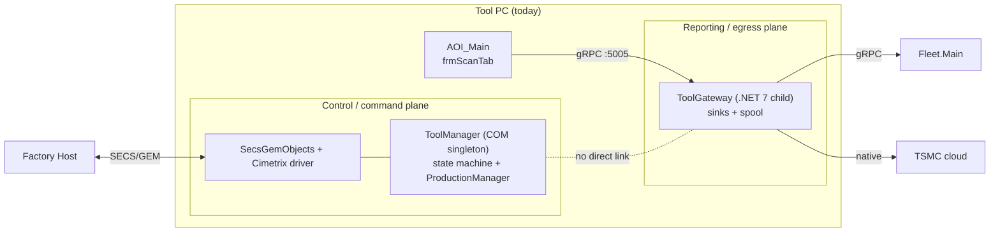

# 0 — Problem & Current State

## 0.1 What "unify to one tool gateway" means here

The request: in the current architecture, fix the split between **ToolManagement** and **ToolGateway** so the tool has **one tool gateway** rather than two disconnected external-facing components.

**Interpretation (stated explicitly, since "unify" is ambiguous):** the goal is to make **a single component own the tool's interface to the outside world** — both the *inbound* control/command direction (today ToolManagement's job) and the *outbound* reporting/telemetry direction (today ToolGateway's job) — so that external systems (factory host, Fleet, TSMC, future MES/analytics) connect to **one place**, and adding an integration is a change in **one** component, not two worlds.

It does **not** mean absorbing the whole ToolManagement subsystem (ProductionManager, EFEM/motion, the fab-qualified GEM engine, the tool clients) into a gateway — that is the control core and is out of scope for a "gateway" unification. Which parts move vs. stay is exactly what the three alternatives differ on.

## 0.2 Today's two components (verified this session)

### ToolManagement / ToolManager — the control & command plane

- **What:** a COM **out-of-process singleton** (`ComSingletonHolder.exe` cloned to `ToolManager.exe`, registered in the ROT), **.NET Framework 4.8**. Root: `BIS\Sources\ToolManagement\ToolManager`.
- **Owns:** the tool **state machine** (`NotInitialized → Engineering ↔ EngineeringToProduction → Production`), the **ProductionManager** (per-carrier `ICarrierExecuter`, docking/mapping/batch/execute), the fan-out event bus to the GUI (`CallbackHandler`/`I*CB`), and launches/monitors the one configured **tool client**.
- **External interface:** the factory host reaches it through the GEM stack — **C# `SecsGemObjects`** (E30/E87/E116 logic) over the native **Cimetrix `SECSGemDriver`**, mapped via `RemoteControl.cs` onto `ICarrierExecuter` operations. (`SecsGemClient\E30RemoteControl.cpp` is legacy — not in `Falcon_2022.sln`.)
- **Lifecycle:** starts when the tool starts; lives as long as the tool runs. This is the **safety-relevant control core**.

### ToolGateway — the reporting & egress plane

- **What:** an **ASP.NET Core / Kestrel** app, **.NET 7-windows**. Calls `UseWindowsService()` but in production is launched as a **child process of AOI_Main** (`clsInitAOI.EnsureToolGatewayRunning`, opt-in via `system.ini` `general/ToolGatewayEnabled=1`, job-object bound). Root: `BIS\Sources\Utilities\ToolGateway`.
- **Owns:** inbound gRPC on **:5005** (`ToolAPIGrpcServiceImpl`); an `EventProcessor → EventRouter → SinkDispatcher(s)` pipeline (bounded channels, batch, spool-on-full); **FleetSink** → Fleet.Main (remote gRPC, `10.5.1.106:5050`); **TsmcSink** → `TsmcZipBuilder` → native **`TsmcClientShim.dll`** (P/Invoke) → TSMC cloud; a JSON-lines **spool** (`C:\Fleet\ToolGateway\FailedMessages`). Has a real xUnit test suite.
- **Fed by:** `frmScanTab` → `ToolApiPublisher.PushEvent` (gRPC :5005) — **not** by ToolManager.
- **Lifecycle:** dies when AOI_Main closes (job object).

## 0.3 Why they're separate today — and why that's the problem

The two planes are **disconnected**: ToolManager handles host commands and control; ToolGateway handles reporting; the only thing joining them is that both live on the same tool and both talk to the outside. Consequences:

- **Two external surfaces, two mental models.** "How does the tool talk to the world?" has two unrelated answers (COM/GEM for control, gRPC for reporting).
- **Integrations touch two worlds.** A new external consumer (MES, analytics) or a new host capability lands in a different place depending on direction — there is no single "tool gateway" to extend.
- **Inconsistent lifecycle & supervision.** ToolManager is a long-lived COM singleton; ToolGateway is an opt-in AOI child that dies with the GUI — so reporting stops exactly when the operator closes the app (the moment the fleet most wants tool status).
- **Divergent tech & ops.** net48/COM vs net7/Kestrel; ROT registration vs child-process launch; different logging, different failure behavior.

## 0.4 Success criteria for "one tool gateway"

A design succeeds if, in the current architecture (no bus):

1. **Single *non-host* external surface** — non-host external systems (Fleet/TSMC/MES reporting + read-only status) connect to, or are owned by, **one** component. *(The factory host is a deliberate exception: it keeps the fab-qualified GEM wire — see criterion 3. No GEM-respecting design can route the host through the gateway, so the honest goal is "two doors": GEM for the host, the gateway for everything else. A design that claims to unify the host door too would violate criterion 3.)*
2. **Single lifecycle & supervision** — one place that starts, stops, restarts, and is health-checked for the tool's external I/O; independent of whether the operator GUI is open.
3. **Control core protected** — the tool state machine, ProductionManager, EFEM/motion, and the **fab-qualified GEM wire** are not destabilized; **no fab re-qualification** in the core change.
4. **Native-DLL blast radius contained** — a `TsmcClientShim.dll` crash must not take down tool control.
5. **Reversible** — deliverable behind a flag / opt-in, rollback without a fleet reinstall.
6. **Forward-compatible** — does not paint us into a corner versus the later bus architecture.

These six criteria are how the three alternatives are scored in [02-recommendation.md](02-recommendation.md).
