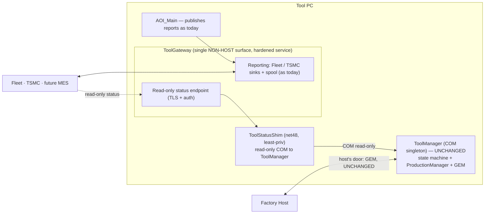
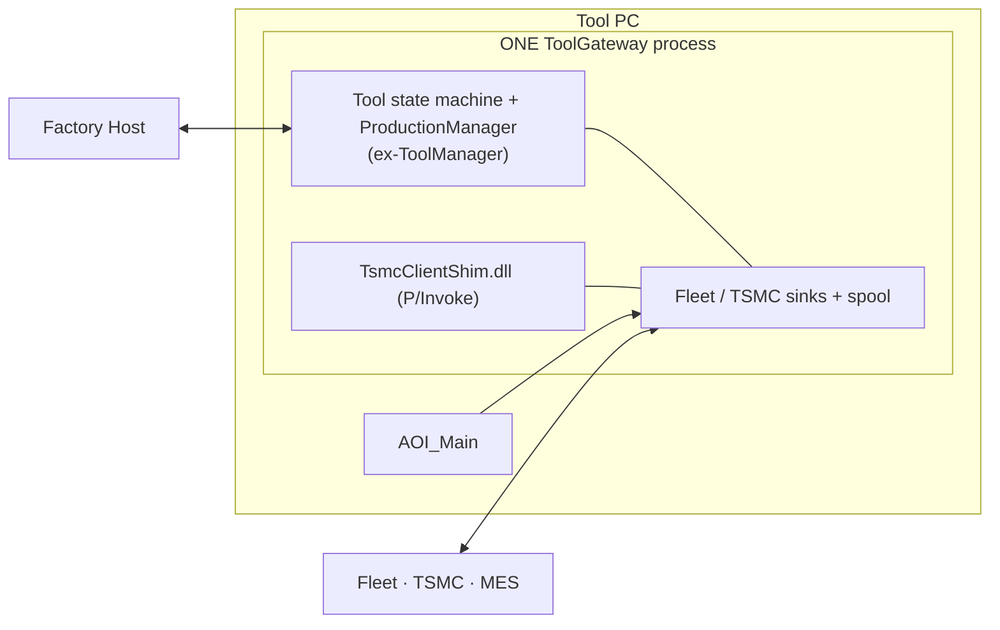
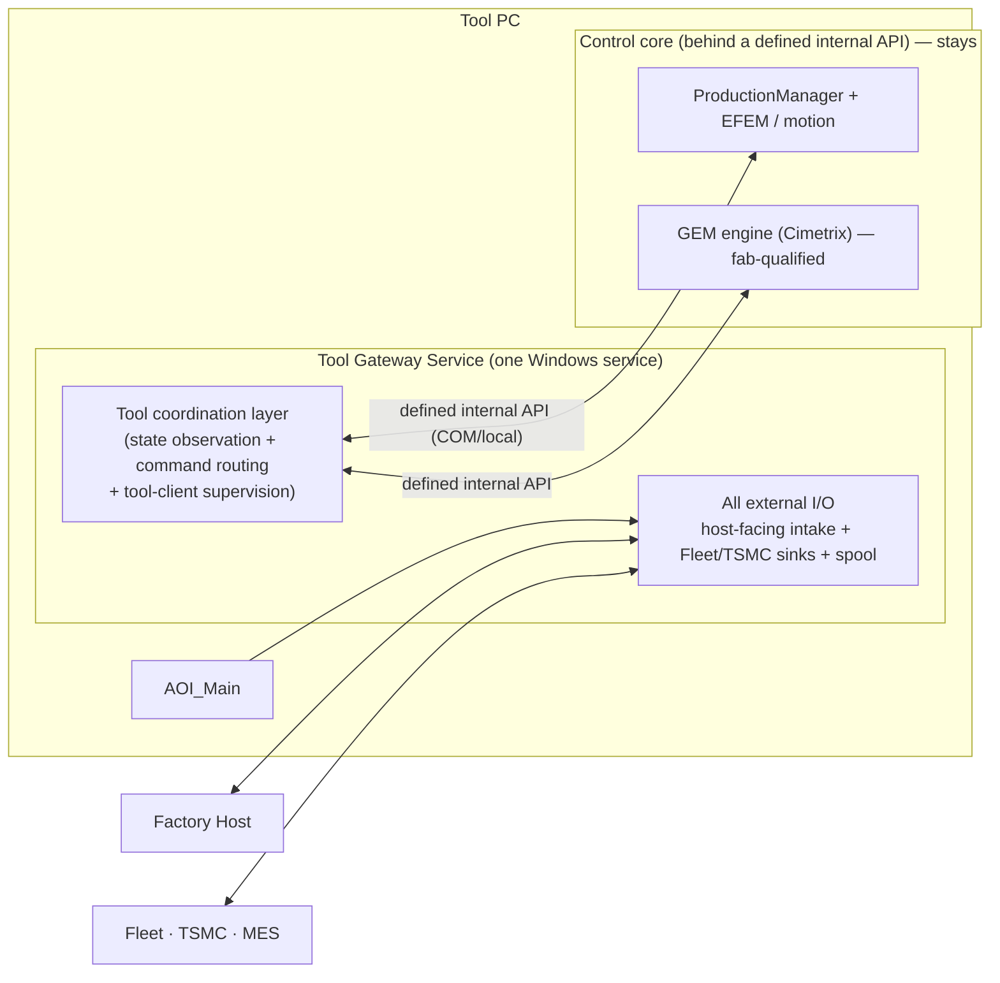

# 1 — Three Alternative Designs

> Level: **alternatives**. Three designs — how much moves: Alt 1 unifies the *surface*, Alt 2 unifies the *process*, Alt 3 unifies into a *service*. Scored against the six success criteria in [00-problem-and-current-state.md §0.4](00-problem-and-current-state.md).
> Up-link: problem definition → [00-problem-and-current-state.md](00-problem-and-current-state.md).
> Down-links: comparison & recommendation → [02-recommendation.md](02-recommendation.md) · Alt 1 complete design → [03-alt1-complete-design.md](03-alt1-complete-design.md) · Alt 3 complete design → [05-alt3-complete-design.md](05-alt3-complete-design.md).

---

## Alternative 1 — Unified Gateway Facade (surface unification)

**Idea:** make **ToolGateway the single *non-host* external-facing surface of the tool**, without moving the control logic. It already owns outbound (Fleet/TSMC); make it the one place non-host external systems attach for reporting and **read-only tool status**, observing ToolManager through a **separate read-only shim**. ToolManager stays exactly where it is as the internal control engine. The **factory host keeps its own door** (the GEM wire) — the honest framing is **two doors: GEM for the host, the gateway for everything else.** (Complete design: [03-alt1-complete-design.md](03-alt1-complete-design.md), post-review Rev 2.)

**What moves / what stays** (no external command relay — removed after review)

| Stays put | Moves / is added |
|---|---|
| ToolManager COM singleton, state machine, ProductionManager, EFEM, tool clients; the fab-qualified GEM wire (the host's door, untouched) | ToolGateway becomes the **declared single non-host surface**; a **separate read-only `ToolStatusShim`** observes ToolManager (no in-process COM handle in the network-facing gateway) |
| AOI_Main's reporting publish path (frmScanTab → gateway) | ToolGateway is **promoted to a hardened supervised service** independent of the AOI GUI (spool draining + status survive GUI close — conditional on the U0 spool-drain fix) |
| — | One place to add MES/analytics: a new sink in the gateway |

**Pros**
- Lowest risk — the control plane and GEM wire are **not modified**; no fab re-qualification.
- Reversible — it's an interface/deployment change; roll back to the child-process gateway with a flag.
- Delivers the two headline wins immediately: **one external surface** and **one lifecycle** (fixes the "reporting dies with the GUI" problem).
- Reuses ~all of today's tested gateway pipeline.

**Cons / limits**
- It's *surface* unification, not deep — ToolManager and the gateway are still two processes internally; the adapter is a new (thin) coupling to maintain.
- Doesn't reduce the tech-stack split (COM + net7 still coexist as separate processes).
- "One gateway" is true for the outside world, but an insider still sees two engines.

**Effort:** S–M. **Reversibility:** high. **Fab re-qual:** none.

---

## Alternative 2 — Co-Hosted Merge (process unification)

**Idea:** physically merge them — **one process that is both the tool state machine and the reporting engine.** Host ToolManager's logic and the gateway sinks together (either by hosting COM/net48 inside the gateway host, or porting ToolManager forward). This is the literal reading of "one tool gateway."

**What moves / what stays**

| Stays put | Moves |
|---|---|
| EFEM/motion drivers (called into) | **ToolManager's logic moves into the gateway process** — the state machine, ProductionManager, tool-client supervision, and the reporting sinks all share one host |
| The Cimetrix native driver (still the wire engine) | The GEM logic layer must be re-hosted alongside — or bridged into — the merged process |

**Pros**
- Maximum unification — genuinely one process, one thing to deploy and supervise.
- Fewest processes on the tool.

**Cons / risks (severe)**
- **Crash-domain coupling.** The native `TsmcClientShim.dll` (a known native-crash risk) now runs in the **same process as the tool state machine** — a TSMC upload fault can take down tool control. This violates success criterion #4 outright.
- **Framework collision.** ToolManager is COM/net48; the gateway is net7/Kestrel. Co-hosting means either hosting COM+net48 inside a net7 host (awkward, fragile) or **porting the tool state machine to net7** — a large, safety-relevant rewrite.
- **Threading/lifecycle mismatch.** A long-lived control singleton and a request/upload-driven web host have opposite lifecycle and threading models; merging them mixes a real-time-ish control loop with I/O-bound upload work in one scheduler.
- **Re-qualification risk.** Touching the control/GEM path this deeply almost certainly triggers per-customer fab re-qualification.
- **Poor reversibility.** A merged process is hard to un-merge; rollback is a full redeploy.

This is the same consolidation the earlier ToolGateway investigation rejected (its "merge into ToolManager" option) — presented here for completeness, with its costs stated honestly.

**Effort:** L. **Reversibility:** low. **Fab re-qual:** likely.

---

## Alternative 3 — Unified Tool Gateway Service (structured consolidation)

> **Note (post-review):** two claims in this sketch are **corrected against the entangled code** in [05 §5.2](05-alt3-complete-design.md) — (a) there is no "clean internal API in front of PM+GEM" to extract coordination above (coordination is written against Cimetrix wire types; outbound reporting is inlined across `E30Client`), and (b) the state machine and ProductionManager are one COM-coupled unit, not separable. The buildable design carries the control unit **in-process, unchanged**, and the "one Windows service" becomes **split hosting** (GUI-independent egress service + supervised interactive-session control process). This sketch is retained as the pre-correction framing that [05](05-alt3-complete-design.md) refines.

**Idea:** create **one proper Windows service — the "Tool Gateway"** — that owns *all of the tool's external I/O plus a thin tool-coordination layer*, while the **heavy control internals stay behind a clean internal boundary** the service calls into. This extracts and unites the *coordination + external-facing* parts of both ToolManagement and ToolGateway into one owned, independently-deployable service, and leaves motion / ProductionManager / the fab-qualified GEM engine where they are.

**What moves / what stays**

| Stays put (behind the internal API) | Moves into the service |
|---|---|
| ProductionManager, `ICarrierExecuter`, EFEM/motion | The **tool state machine + tool-client supervision** (coordination), unified with… |
| The Cimetrix GEM engine — fab-qualified, untouched at the wire | …**all external I/O** — host-facing coordination *and* the Fleet/TSMC sinks + spool, in one service |
| AOI_Main's reporting publish path | One supervised lifecycle (a real Windows service, running independent of the GUI) |

**Pros**
- Genuinely unified — one service is the whole external-facing "tool gateway," independently deployable and supervised, alive regardless of the GUI.
- **Control core protected** — motion and the qualified GEM wire stay behind a boundary; the native TSMC DLL can be kept in a child/sandbox so its crash doesn't reach coordination (criterion #4 satisfiable).
- Clean internal API replaces today's ad-hoc COM coupling — testable, and the strongest maintainability outcome of the three.
- **Forward-compatible with the bus:** this service is exactly the shape the future fabric's "gateway citizen" needs — Alt 3 is a stepping-stone, not a detour.

**Cons / risks**
- Most work of the three — it's a real extraction of coordination logic from ToolManager into a new service host, plus defining the internal API.
- Moving the state machine (even as coordination) is safety-relevant — needs the same care and record-replay validation as any control-path change; some re-qualification exposure if any host-visible timing shifts (mitigable by keeping the GEM wire and its timing untouched).
- Longer to deliver than Alt 1; needs a named owner.

**Effort:** M–L. **Reversibility:** medium (service boundary + flags). **Fab re-qual:** low if the GEM wire/timing is untouched; validate with record-replay.
