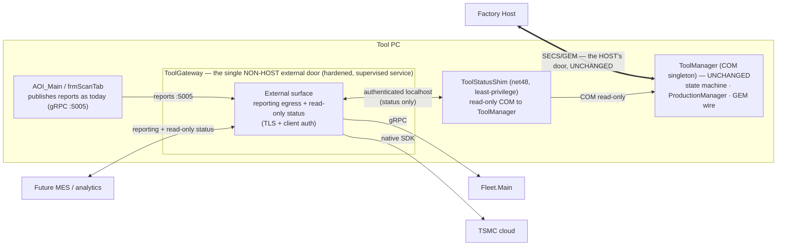
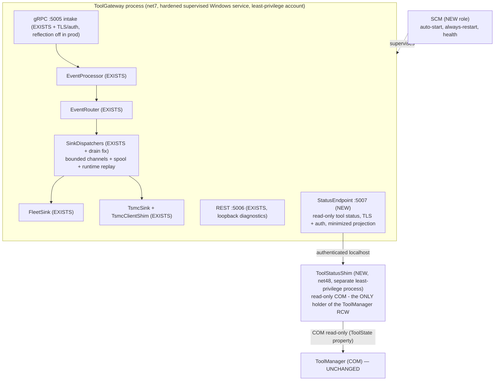
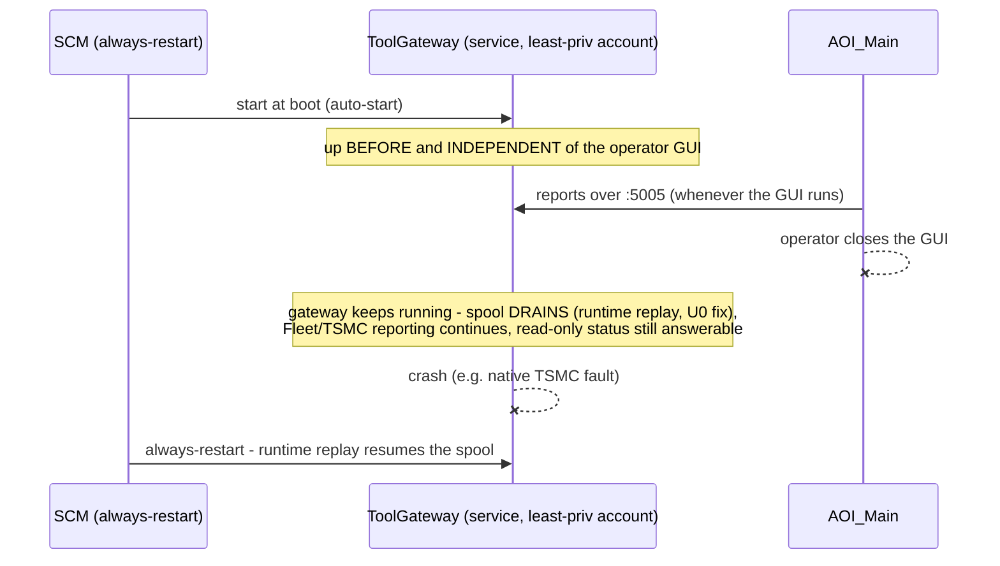
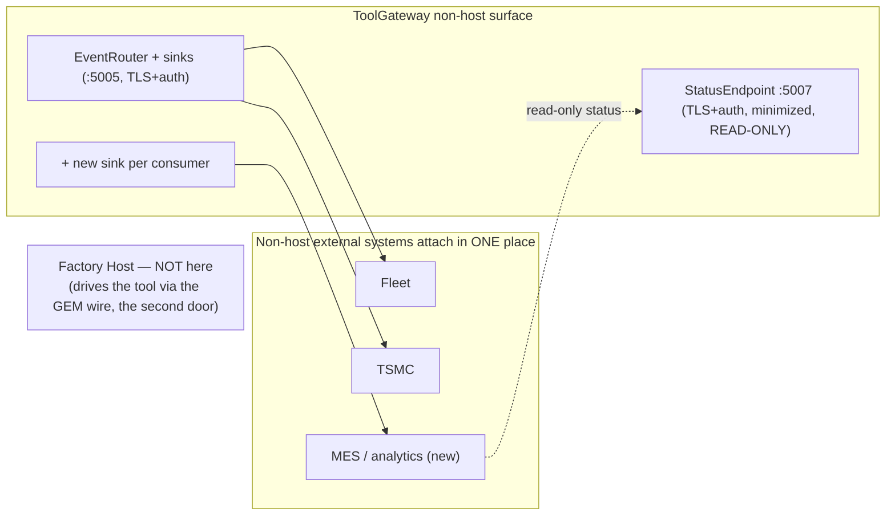
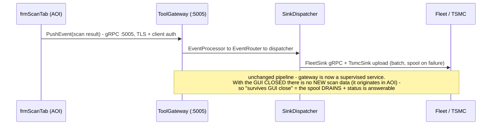
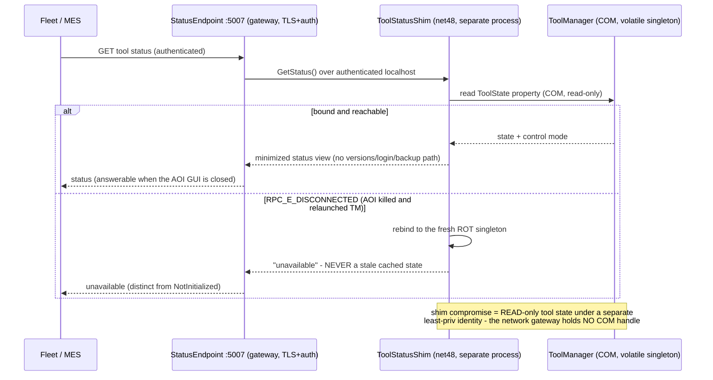
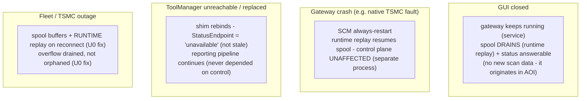

# 3 — Alternative 1: Unified Gateway Facade — Complete Design

> The detailed design for [Alternative 1](01-alternatives.md). Current architecture, **no bus**. Makes ToolGateway the tool's **single non-host external surface** (reporting + read-only status) with a **single, supervised, hardened lifecycle**, while the control plane (ToolManager/ProductionManager/GEM) stays exactly where it is.
> **Revision 2 (2026-07-18):** rewritten after the four-reviewer adversarial review ([04-alt1-review.md](04-alt1-review.md)). Changes: the **"two doors" framing** replaces the "single surface" overclaim (the host keeps the GEM wire); **external command relay ("CommandIntake") is removed** — a control entry point cannot be safely authorized inside a network-facing facade; the COM adapter becomes a **separate least-privilege net48 shim** (security boundary + the pragmatic answer to the net7↔net48 cross-process marshaling risk), **read-only**; and the spool drain/overflow fixes plus the AOI process-sweep collision are now hard **U0 prerequisites**.
> Grounding: verified component facts in [00-problem-and-current-state.md](00-problem-and-current-state.md); reviewer findings cite `file:line`. Mermaid: sequence notes use `<br/>` for line breaks; no bare `<`, `;`, or literal newlines in messages/notes (verified).

---

## 3.1 Purpose, goals, non-goals

**Purpose:** make **ToolGateway** the tool's single, always-on surface **for everything except the factory host** — the one place Fleet, TSMC, and future MES/analytics attach for reporting and read-only tool status — without moving any control logic. The honest framing (from the fabric design) is **two doors: GEM for the host, the gateway for everything else.** The host keeps its own door and is not touched.

**Goals (map to the success criteria):**
- **G1 — single *non-host* external surface:** all non-host tool↔external I/O (reporting egress + read-only status) is owned by the gateway; new consumers attach as new sinks. The factory host is the explicit exception (it keeps the GEM wire).
- **G2 — single, supervised lifecycle:** the gateway runs as a **hardened, supervised service independent of the operator GUI** — spool draining and status queries survive AOI_Main closing.
- **G3 — protected control core:** ToolManager, ProductionManager, EFEM, and the fab-qualified GEM wire are **unchanged**; the gateway's only coupling to control is **read-only, through a separate least-privilege shim**.
- **G4 — contained native risk:** the `TsmcClientShim.dll` crash domain stays inside the gateway, away from control.

**Non-goals (explicitly out of scope for Alt 1):**
- Moving the tool state machine or ProductionManager (that is Alternative 3).
- Changing the factory-host control path — the host drives the tool through the GEM wire, untouched.
- **Relaying external commands into the control plane.** External write-relay is **removed from Alt 1** — it cannot be safely authorized inside a network-facing facade (review A1-C2). If ever needed it belongs in a later, threat-modeled phase (or Alternative 3 / the bus).
- Introducing a message bus.

---

## 3.2 Design principles

1. **The facade owns the *non-host surface*, not the *engines*.** Two engines remain (ToolManager COM, gateway sinks); the gateway is the single non-host external door in front of them. The host keeps the GEM door.
2. **Reporting needs no ToolManager coupling.** The existing report path (AOI → gateway → Fleet/TSMC) already works end-to-end; the lifecycle + single-surface wins require **zero** ToolManager changes.
3. **The control coupling is read-only and behind a separate least-privilege shim — not a facade convenience.** The adapter exists only to *observe tool status*; it performs **no writes** to control. It runs as a separate net48 process (§3.6) so a compromise of the network-facing gateway has no in-process COM handle to the control singleton. "Read-only" is enforced by the interface, not by intent.
4. **The always-on service must not degrade durability.** Promoting to a service removes the accidental frequent-restart that hid the spool-drain bug today — so the spool drain + overflow fixes are **prerequisites**, not follow-ups (§3.9 U0).
5. **Everything is flag-reversible during the overlap window** — and rollback is honestly a redeploy once the AOI child-launch is retired (§3.8).

---

## 3.3 Target architecture

### High-level



Two doors, deliberately: the **host** drives the tool over the **GEM wire** (unchanged); the **gateway** is the single door for **everything else** (Fleet/TSMC/MES reporting + read-only status). Control is reached only through a **separate least-privilege shim**, read-only — the network-facing gateway never holds a COM handle to the control singleton.

### Component view — new / modified / unchanged



| Status | Elements |
|---|---|
| **Unchanged** | ToolManager + all control (state machine, ProductionManager, EFEM, GEM wire); AOI_Main's report-publish path; the gateway's `EventProcessor → EventRouter → SinkDispatcher → FleetSink/TsmcSink → spool` pipeline |
| **Modified** | Gateway **lifecycle**: AOI child → hardened supervised Windows service under a **least-privilege account**; **:5005 gains TLS + client auth**, gRPC reflection + Swagger disabled in production; the AOI child-launch becomes a strictly-mutually-exclusive fallback then is removed; **spool gains a runtime/on-reconnect replay + overflow drain** (U0 prerequisite) |
| **New (small)** | `ToolStatusShim` — a **separate net48 least-privilege process** that is the sole holder of the read-only COM reference to ToolManager; `StatusEndpoint` (:5007, TLS+auth, minimized status projection); a new sink per new external consumer (e.g. MES) |
| **Removed vs Rev 1** | `CommandIntake` / external write-relay (control entry point — cannot be safely authorized in a facade); the in-process COM adapter (replaced by the out-of-process shim) |

---

## 3.4 Sub-design A — Gateway lifecycle promotion (delivers G2)

**Today:** `clsInitAOI.EnsureToolGatewayRunning` launches the gateway as an AOI_Main child bound to a job object — it dies when the GUI closes; it is opt-in per `system.ini` `general/ToolGatewayEnabled=1`.

**Change:** run the gateway as a **hardened, supervised Windows Service** (it already calls `UseWindowsService()`, `Program.cs:19`; no installer exists today — it runs only as an AOI child via `clsInitAOI.EnsureToolGatewayRunning`). Auto-start; **SCM recovery set to "always restart"** (the default stops after 2–3 failures). Run under a **dedicated least-privilege service account** (virtual account / gMSA) — *not* the default LocalSystem (review A1-M3). (If a ToolHost-style supervisor is later introduced, the gateway becomes its child instead — same outcome.)



**Two coexistence hazards that MUST be fixed before any overlap release (review A1-C6, A1-M5):**

1. **AOI's process-sweep kills the service.** `clsInitAOI.KillStaleToolGatewayProcesses` (`:406,478`) kills *every* `ToolGateway.Endpoint` by name — including the SCM-managed service — and the child-launch double-binds `0.0.0.0:5005`. Fix: service-vs-child must be **strictly mutually exclusive**; in service mode AOI must not sweep by name (skip, or exclude the service PID). During the one-release fallback overlap this exclusivity is enforced in code, not just by a flag.
2. **Service-account ACL transition.** `FailedMessagesHandler..ctor` calls `EnsureSpoolDirectory` (`:53`) which re-applies a *protected* ACL and `SetAccessControl` with no try/catch (`:197-224`); on an upgraded tool the dir is operator-owned, so a service account may lack WRITE_DAC → throws → the DI singleton fails → **the service won't start**. Fix: the installer resets ownership/ACL of pre-existing `C:\Fleet\ToolGateway\{FailedMessages,Logs}` to the service account; wrap `EnsureSpoolDirectory` to log-and-continue on ACL failure.

Migration safety: the child-launch stays as a **strictly-exclusive** fallback for one release; **rollback is a flag only during that overlap** — once the child-launch is retired, rollback is a service-uninstall + redeploy (stated honestly, review m6).

---

## 3.5 Sub-design B — Single non-host external surface (delivers G1)

The gateway is the one place **non-host** external systems attach. The factory host is **not** here — it keeps the GEM wire (the second door). Concretely:

- **Reporting egress (exists):** AOI publishes to :5005; the gateway routes to Fleet/TSMC. Unchanged — **but :5005 is hardened** (TLS + client auth; gRPC reflection + Swagger disabled in production — review A1-C3, LB-C).
- **New external consumers = new sinks:** an MES or analytics integration is added as a **new `ISink` in the router**, not as new code in AOI or ToolManager. This is the core "add an integration in one place" win.
- **Read-only tool status out (new):** `StatusEndpoint` (:5007, **TLS + authenticated**) exposes a **minimized** status projection — enough for fleet/MES coordination, **not** the full `ToolStatusData` (which leaks FalconVersion/CMMVersion/LoginName/BackupSystemLocation/SN — review A1-C3 info-disclosure). Served via the read-only shim (§3.6), so status is answerable when the AOI GUI is closed.
- **External commands: removed.** Alt 1 has **no** external-command intake — see §3.1 non-goals and review A1-C2. This surface is reporting + read-only status only.



---

## 3.6 Sub-design C — Read-only ToolStatusShim (a separate least-privilege process)

The gateway's only coupling to the control plane is a **read-only status observation**, and it is deliberately **not in the gateway process**. It lives in a **separate net48 least-privilege process — the `ToolStatusShim`** — which is the *sole* holder of the COM reference to ToolManager. The network-facing gateway talks to the shim over an authenticated localhost channel and can only *read status*. This is a **security boundary** (review A1-M4: a compromised network gateway must not hold an in-process COM handle to control) *and* the pragmatic answer to the net7↔net48 marshaling risk below (review A1-C1).

**Why a separate net48 shim, not in-process net7 COM interop (the corrected feasibility picture — review A1-C1):**

- ToolGateway is `net7.0-windows` (`ToolGateway.Endpoint.csproj:4`); ToolManager is net48/COM, running **out-of-process** as `ToolManager.exe`.
- The design's Rev-1 fear (net7 dropped `Marshal.GetActiveObject`) was a **red herring** — the existing code never used it; it does manual `GetRunningObjectTable`/`CreateItemMoniker` P/Invoke (`MSDev.cs:16-20`), which *is* net7-portable, and `IToolManager`/`IToolManagerCB` are real GUID'd COM interfaces (`IToolManager.cs:19-22`).
- The **real, harder** risk: the ROT item-moniker binds a **`SingletonHolder`, not `IToolManager`** (`SingletonUtils.cs:52-76`, `SingletonHolder.cs:24,57-71`) — reaching `IToolManager` is a **two-step** (bind holder → `holder.GetSingleton(factoryAssembly, factoryType)` → cast), and it is **cross-process managed-COM marshaling with no generated proxy/stub/typelib**. Whether a **net7/CoreCLR** client can bind and invoke a **net48-CLR-hosted** managed object across that boundary is the genuine unknown.
- **A net48 shim sidesteps the unknown entirely** (it uses the exact same net48 connector path the GUI uses today) *and* gives the security boundary for free. So **the shim is the default, not a fallback.**

**Interaction: read-only, poll/query, ToolManager treated as volatile (review A1-M2).** The shim reads `IToolManager.ToolState` (a real property — `IToolManager.cs:31`; note: `GetToolState()` does **not** exist, Rev-1 sketch corrected) and `ToolControlMode`. It does **not** implement a COM callback sink. Critically, ToolManager is an unsupervised weak-ROT singleton that AOI *force-kills on its own startup* (`clsInitAOI.cs:665`) and re-spawns as a fresh `NotInitialized` instance — so the shim must **rebind on `RPC_E_DISCONNECTED`** and `StatusEndpoint` must distinguish **"unavailable" from "NotInitialized"** and never emit a stale cached state to Fleet.

```csharp
// ToolStatusShim (net48, separate least-privilege process) — the ONLY COM holder.
// READ-ONLY. No control writes exist in Alt 1 (external command relay was removed).
public interface IToolStatusShim
{
    ToolStatusView GetStatus();   // minimized projection; NOT the full ToolStatusData
}

internal sealed class ToolStatusShim : IToolStatusShim
{
    private IToolManager _tm;      // obtained via the SAME net48 connector path the GUI uses:
                                   // holder = SingletonUtils.GetSingleton("ToolManager", ...)
                                   // -> holder.GetSingleton(factoryAssembly, factoryType) -> IToolManager
    public ToolStatusView GetStatus()
    {
        try
        {
            var tm = EnsureBound();                 // rebind on RPC_E_DISCONNECTED (volatile singleton)
            return new ToolStatusView(
                state: tm.ToolState,                // real property (not GetToolState())
                controlMode: tm.ToolControlMode);   // "health" is synthesized (reachability), not a TM member
        }
        catch (COMException)
        {
            _tm = null;                             // force rebind next call
            return ToolStatusView.Unavailable;      // NEVER a stale cached state
        }
    }
    // gateway reaches this over an authenticated localhost channel; the gateway holds NO COM reference.
}
```

Failure isolation: if the shim can't reach ToolManager, `StatusEndpoint` returns "status unavailable" — the **reporting pipeline is unaffected** (it never depended on control). A shim compromise yields only *read* access to tool state, under a *separate least-privilege identity* from the network-facing gateway.

**Residual P0 spike (re-scoped):** confirm the net48 shim binds and reads `IToolManager.ToolState` cross-process against a live `ToolManager.exe`, and rebinds cleanly after an AOI-driven kill/relaunch. (This is a net48↔net48 path — low risk — but the rebind-on-replacement behavior must be proven.)

---

## 3.7 Flows

### F1 — Startup & supervision (GUI-independent)

Covered by §3.4's diagram: SCM/supervisor starts the gateway at boot; it runs and reports regardless of the GUI; crash → restart-on-failure → spool replays.

### F2 — Reporting egress (scan result → Fleet/TSMC), now gateway-owned



### F3 — Read-only tool-status exposure (via the shim, ToolManager treated as volatile)



### F4 — Degraded modes



---

## 3.8 Configuration & deployment

| Item | Change |
|---|---|
| Supervision | Install ToolGateway as a Windows Service, **least-privilege account**, auto-start, **SCM recovery = always-restart**. The `EnsureToolGatewayRunning` child launch stays a **strictly-mutually-exclusive** fallback for one release (AOI's process-sweep must exclude the service — review A1-C6) |
| Service-account ACLs | Installer resets ownership/ACL of pre-existing `C:\Fleet\ToolGateway\{FailedMessages,Logs}` to the service account; `EnsureSpoolDirectory` wrapped to log-and-continue on ACL failure (review A1-M5). Verify the native TSMC upload end-to-end under the account in Session 0 |
| `system.ini` `ToolGatewayEnabled` | The gateway becomes standard (always-on) rather than opt-in — confirm per-customer profiles before flipping the default |
| Ports & hardening | :5005 report intake — **now TLS + client auth**, gRPC reflection + Swagger **disabled in production**, bound deliberately (not the current `0.0.0.0` + `AllowedHosts:*`). :5006 diagnostics → **loopback only**. New :5007 read-only status — **TLS + authenticated**, minimized projection. A firewall rule must be deployed per tool (no interactive prompt for a Session-0 service) |
| Config source of truth | `appsettings.json` currently hardcodes one tool's `MainServerAddress`/`ToolId`/`Site` — a fleet must use templated/per-tool config, not one baked file (review m4) |
| New sink config | Per new external consumer (MES/analytics): endpoint + credentials, added to the router config |
| Shim | `ToolStatusShim` = a separate net48 least-privilege process, read-only; enabled by flag |
| Prereq fixes (U0, before U1) | **(1) Spool: add runtime/on-reconnect replay** (today it drains only at process start — the service model removes the accidental restart that hid this); **(2) overflow: drain it, don't overwrite-and-orphan** (`FailedMessagesHandler.cs:142-143`) + per-message attempt counter (poison); **(3) Fleet `ToolId=0`** (`FleetMainServerClientImpl.cs:117`) — verify Fleet's tool key, fix if numeric; **(4) :5005 hardening** above |

---

## 3.9 Migration phases (maps to [02-recommendation.md](02-recommendation.md) U0–U2)

| Phase | Delivers | Reversible by |
|---|---|---|
| **U0 — Prep (prerequisites, before U1)** | Re-verify §0 wiring; **fix the spool drain (runtime replay) + overflow drain + poison counter** — these gate G2; verify + fix **Fleet `ToolId=0`**; **harden :5005** (TLS/auth, reflection off); make AOI's process-sweep service-exclusive; installer ACL/ownership transition; **spike the net48 shim** (bind + read `ToolState` cross-process, rebind-on-relaunch) | n/a |
| **U1 — Promote lifecycle** | Gateway as a hardened least-privilege service, GUI-independent (delivers G2). Child-launch kept as a **strictly-exclusive** fallback | flag → back to AOI child (overlap window only) |
| **U2 — Single non-host surface** | Declare the gateway the one non-host door; add `StatusEndpoint` (:5007, TLS+auth, minimized) + the read-only `ToolStatusShim`; route any new consumer as a sink. **No CommandIntake** | flag / remove the shim + status endpoint |

U0 is not optional prep — the spool-drain and overflow fixes are **load-bearing for G2** (an always-on service that can't drain its spool defeats "reporting survives GUI close"). U1 fixes the lifecycle; U2 completes the non-host single-surface unification.

---

## 3.10 Risks & mitigations

| Risk | Severity | Mitigation |
|---|---|---|
| **Spool doesn't drain as a service** (G2-defeating) | **CRITICAL→resolved in U0** | Runtime/on-reconnect replay + overflow drain + poison counter, before U1 (review A1-C4/A1-C5) |
| **AOI process-sweep kills the service** + :5005 double-bind | **CRITICAL→resolved in U1** | Service-vs-child strictly exclusive; AOI sweep excludes the service PID (review A1-C6) |
| **net48 shim ↔ ToolManager cross-process bind** | Med | Re-scoped U0 spike (net48↔net48, low risk); shim rebinds on `RPC_E_DISCONNECTED`; the earlier net7-interop fear was a red herring (review A1-C1) |
| **ToolManager is volatile / can be stale** | Med | Shim rebinds on replacement; StatusEndpoint distinguishes "unavailable" vs "NotInitialized"; never emits stale state (review A1-M2) |
| **Service runs as LocalSystem (max blast radius)** | Med | Dedicated least-privilege account required, not "consider" (review A1-M3); ACL/ownership transition in the installer (A1-M5) |
| **Network→control escalation via an in-process COM handle** | Med→resolved | The read-only shim is a *separate least-privilege process* — the network gateway holds no COM reference (review A1-M4) |
| **Unauthenticated :5005 / info-disclosure on status** | **CRITICAL→resolved** | TLS+auth on :5005/:5007, reflection+Swagger off in prod, minimized status projection (review A1-C3, LB-C) |
| Native TSMC DLL crash | Low | Isolated in the gateway process (away from control); always-restart + runtime spool replay; verify the native path under the service account in Session 0 |
| Per-customer `ToolGatewayEnabled` profiles differ; one baked appsettings | Low-Med | Confirm profiles; use templated/per-tool config (review m4) |
| No tamper-evident audit | Med | Status-query events to an append-only off-host sink under a distinct identity (review A1-M6) |

---

## 3.11 Success-criteria check

| Criterion (§0.4) | Alt 1 result |
|---|---|
| 1. Single non-host external surface | ⚠️ **partial — the honest "two doors" result**: single surface for *non-host* I/O (reporting + read-only status); the factory host keeps the GEM door by design |
| 2. Single lifecycle & supervision | ✅ hardened supervised service, GUI-independent — **conditional on the U0 spool-drain fix** (else G2 is notional) |
| 3. Control core protected | ✅ ToolManager/GEM unchanged; the only coupling is read-only, in a separate least-privilege shim off the critical path |
| 4. Native-DLL blast radius contained | ✅ stays in the gateway process, away from control |
| 5. Reversible | ⚠️ flag-reversible during the one-release overlap; a redeploy once the child-launch is retired (stated honestly) |
| 6. Forward-compatible with the bus | ⚠️ **neutral** — U1/U2 are *groundwork toward*, not delivery of, the bus's "ToolConnect gateway" citizen (that is Alternative 3) |

**Honest caveats:** (1) Alt 1 unifies the *non-host surface*, not the internals — two engines remain, and the host keeps its own door; that is the deliberate trade for low risk and no re-qualification. (2) The headline "reporting survives GUI close" reduces to *drain the spool + answer status* (no new scan data originates with the GUI closed) — so it is only real once the U0 spool fixes land. (3) The deeper consolidation is [Alternative 3](01-alternatives.md), to which U0–U2 are groundwork.
