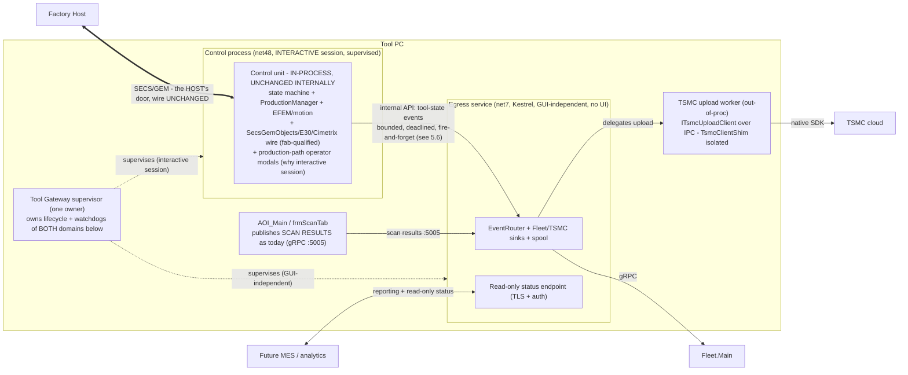
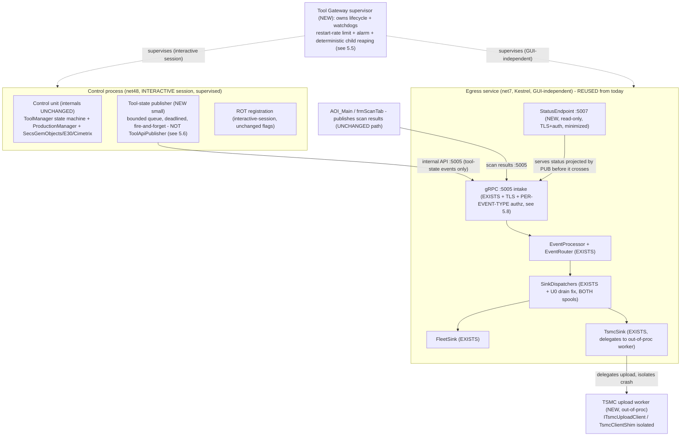
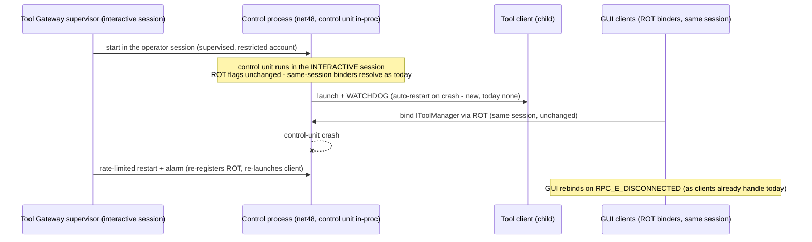
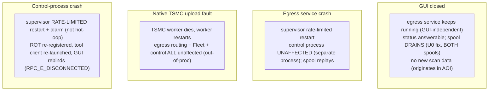
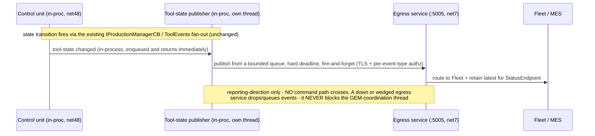
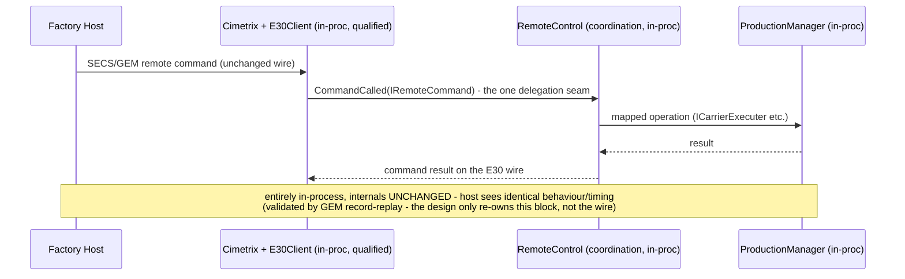
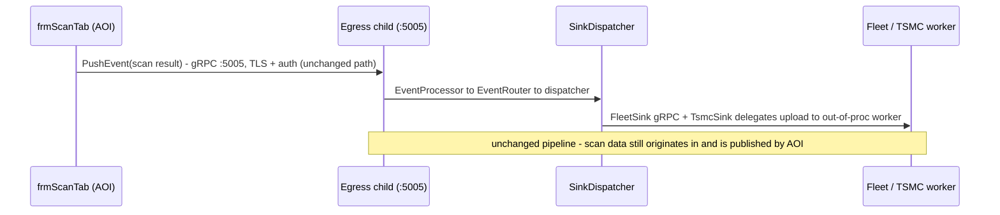

# 5 — Alternative 3: Unified Tool Gateway Service — Complete Design

> The detailed design for [Alternative 3](01-alternatives.md), taken **as the selected target design** (going straight to Alt 3, per [02-recommendation.md §2.2](02-recommendation.md)'s "if Alt 3 is committed, go straight to it" branch). Current architecture, **no bus**. Creates **one supervisor owning the tool's whole non-host external surface + tool coordination**, with the fab-qualified GEM/motion internals kept intact in-process. (Frameworks: the control unit is **.NET Framework 4.x** — `v4.8` via the shared `Camtek.CSharp.Common.Properties.props`; the egress gateway is `net7.0-windows` — the cross-CLR boundary the design keeps out of the control path.)
> **This design assumes Alt 3 is committed** — funded, with a named owner and an accepted appetite for a *control-path* change. In exchange for that appetite it forgoes Alt 1's cheap interim value and does **not** build Alt 1's read-only `ToolStatusShim` (that shim is **superseded** here — see §5.3/§5.6). If that appetite does not exist, [Alternative 1](03-alt1-complete-design.md) remains the safe first step and this document is the target it grows into.
> **Revision 2 (2026-07-18):** rewritten after the four-reviewer adversarial review ([06-alt3-review.md](06-alt3-review.md)). The load-bearing change: the **control unit cannot be a Session-0 boot service** — its ROT registration is provably per-session (`SingletonHolder.cs:24`), and the "unchanged" control internals pop operator modals on production paths (`RemoteControl.cs:717-749`, `ProductionManager.cs:986`). So Rev 2 **splits the hosting honestly** — egress is the GUI-independent service; **control is a supervised *interactive-session* process** (no longer AOI-killed), not a Session-0 promotion. The internal API's publish contract is now an **enforced** non-blocking/deadlined/fire-and-forget boundary (not an assertion), and per-event-type :5005 authz + a PKI + off-host audit are added.
> Grounding: this design is written against verified code facts from `C:\CamtekGit\BIS\Sources` (cited `file:line` inline). **It deliberately corrects two overclaims in the [01-alternatives.md](01-alternatives.md) Alt-3 sketch** — see §5.2. Mermaid: sequence notes use ` ` for line breaks; no bare `<`, `;`, or literal newlines in messages/notes (verified in Round 2).

---

## 5.1 Purpose, goals, non-goals

**Purpose:** replace today's split — a **volatile weak-ROT control singleton** (`ToolManager.exe`, which AOI *force-kills and respawns* on its own startup, `clsInitAOI.cs:665`) plus a **GUI-child reporting gateway** (dies when the operator closes AOI) — with **one properly-supervised owner** (a supervisor over split hosting — §5.3) for the tool's coordination and its whole non-host external surface. One brain, one supervision tree, one owner.

Where Alt 1 leaves the control singleton exactly as-is and only hardens the *gateway*, Alt 3 brings **both** the control unit and the egress pipeline under **one supervisor/owner** through a **defined internal coordination↔egress API** — control is *supervised and no longer AOI-killed*, egress is *GUI-independent*. That is the genuine difference: Alt 1 gives you *one hardened non-host door*; Alt 3 gives you *one supervised brain behind the doors*. The hosting is **deliberately split** (review A3-C1): egress can run GUI-independent (no UI); control must run in the operator's **interactive session** (it is UI-bearing and binds per-session ROT — §5.4).

**Goals (map to the success criteria in [00 §0.4](00-problem-and-current-state.md)):**
- **G1 — single non-host surface, "closer":** all non-host external I/O (Fleet/TSMC/MES reporting + read-only status) is owned by one supervised owner, *and* the host's GEM coordination is unified with it behind a single supervisor (not a separate weak-ROT singleton). The host still speaks GEM to the qualified wire — so this is **"closer, not complete"** (see §5.2, criterion 1).
- **G2 — single supervised lifecycle (split hosting):** one owner supervises both. **Egress** is a boot-start, always-restart, GUI-independent service. **Control** is a supervised, crash-restarted, single-owner **interactive-session** process (no more AOI-kills-and-respawns volatility) — but **not** Session-0 and **not** boot-independent (it is UI-bearing and per-session-ROT-bound, so it needs the operator session, which is the tool's normal running state). This is an honest downgrade from the Rev-1 "one Session-0 service for everything" claim (review A3-C1).
- **G3 — control core protected:** the state machine, ProductionManager, EFEM/motion, and the fab-qualified GEM/Cimetrix wire are **carried in-process, unchanged internally** — *not re-sliced*. No new cross-CLR control boundary is introduced (§5.2, §5.6). (Keeping control in the interactive session is precisely what lets "unchanged internally" hold — the production-path modals still render to the operator; §5.4.)
- **G4 — contained native risk:** the native `TsmcClientShim.dll` upload runs **out-of-process** (behind `ITsmcUploadClient`, in a separate worker), so a TSMC upload fault cannot reach the coordination brain. This is a **first-class MUST**, not "satisfiable" (§5.5).

**Non-goals (explicitly out of scope):**
- **Re-slicing the qualified wire.** We do **not** extract a "clean coordination layer above the GEM engine" — the code shows coordination is entangled with Cimetrix wire types and outbound reporting is inlined across `E30Client` (§5.2). Alt 3 *wraps and supervises* the qualified unit; it does not re-cut it.
- **Porting the control unit to net7.** The control process stays **.NET Framework 4.x** (the control unit is net48 and entangled — §5.2); porting it is a safety-relevant rewrite (that was Alt 2's trap). The egress service remains net7.
- **Routing host commands through a new service endpoint.** The host keeps the GEM wire; that wire is now *hosted by* the service process, but the host does not talk a new protocol to the service.
- **A message bus** (that is [../stage/](../stage/)); though this service is deliberately the shape the bus's "ToolConnect citizen" needs (§5.11, criterion 6).

---

## 5.2 Two corrections to the alternatives sketch (grounded in code)

The [01-alternatives.md](01-alternatives.md) Alt-3 sketch made two claims the code does not support. Both are corrected here; **neither kills Alt 3 — they narrow it to its defensible form.**

**Correction 1 — there is no clean internal API "in front of ProductionManager + GEM" to extract coordination above.** The seam between coordination and the qualified wire is **entangled**, not clean:
- Coordination is written **directly against Cimetrix wire types.** `RemoteControl.CommandCalled` (`RemoteControl.cs:45`) switches on the Cimetrix `IRemoteCommand`; every handler parses raw `ICxValueDisp`/`VALUELib` COM value objects (`RemoteControl.cs:173-182, 248-291`; `RemoteControlBase.cs:519-625`). You cannot lift it "above the wire" without dragging `IRemoteCommand`/`VALUELib` with it.
- The **only** clean cut is a single delegation point — `E30Client.CommandCalled → IRemoteControl.CommandCalled` (`E30Client.cs:591`) — and even there the payload is the Cimetrix `IRemoteCommand`.
- **Outbound** (equipment→host) has *no* seam at all: `TriggerEvent`/`TriggerEventEx`/`SetVariableValue` are inlined dozens of times across the ~6,937-line `E30Client` god object, mixed with coordination logic.
- **Consequence:** the state machine + ProductionManager are also one unit — `ToolManager` *is* the state machine and *implements* `IProductionManagerCB`; PM's callbacks are the primary transition triggers (`ToolManager.cs:21,170,239-247,472`). You cannot "move the state machine, leave PM behind an API" cleanly.
- **So the defensible boundary is not inside the control unit.** The qualified control unit (state machine + PM + SecsGemObjects/E30/Cimetrix wire) moves **as one intact in-process block**. The "internal API" Alt 3 introduces is the **coordination↔egress** boundary (§5.6) — the *reporting* direction, which already crosses a process boundary today (`frmScanTab → gateway` gRPC :5005). No new cross-CLR *control* boundary is created.

**Correction 2 — criterion 1 is "closer," not "complete."** The host does **not** connect to the service; it speaks SECS/GEM to the Cimetrix driver + E30/E87/E116 handling, which *is* the qualified endpoint and stays put — now *hosted inside* the service process. So Alt 3 is still **"two doors at the wire" (GEM for the host, the gateway for everyone else), but one brain behind them.** That "one brain behind them" is the real win over Alt 1 (where control is a separate, volatile singleton). Scored "closer, not complete" in §5.11.

---

## 5.3 Target architecture

### High-level

Two doors at the wire (GEM for the host, the gateway for everyone else) — but **one supervisor owns both domains**: a GUI-independent egress service and a supervised control process. The hosting is **split by necessity** (review A3-C1): egress has no UI so it runs GUI-independent; the control unit is UI-bearing on production paths and binds per-session ROT, so it runs in the **interactive session** — supervised and no longer AOI-killed, but not a Session-0 boot service. The native TSMC upload is pushed to its own worker so its crash domain never touches coordination.

### Component view — new / modified / unchanged

| Status | Elements |
|---|---|
| **Unchanged (internally)** | The control unit's *internals*: state machine, ProductionManager, EFEM/motion, and the SecsGemObjects/E30/Cimetrix qualified wire (`ToolManager.cs`, `RemoteControl.cs`, `E30Client.cs`) — including its **production-path operator modals** (`RemoteControl.cs:717-749`, `ProductionManager.cs:986`), which is *why* control stays in the interactive session — **carried in-process as one intact block, not re-cut**; AOI_Main's scan-result publish path (`frmScanTab → :5005`); the egress pipeline `EventProcessor → EventRouter → SinkDispatcher → FleetSink/TsmcSink → spool` |
| **Modified** | Control-unit **lifecycle/ownership**: from a weak-ROT singleton that AOI force-kills (`clsInitAOI.cs:665`, and the sibling wire processes at `:653-668`) → a **supervised interactive-session process** owned by the Tool Gateway supervisor, no longer AOI-killed (ROT flags **unchanged** — it stays in the operator session); **tool-client supervision** gains a real watchdog/auto-restart (today none — `ToolManager.cs:290-351`); the egress gateway becomes a **GUI-independent service** owned by the supervisor (was an AOI child); **:5005 gains TLS + per-event-type authz**; **both spools gain runtime/on-reconnect replay + overflow drain** (U0) |
| **New (small)** | The **Tool Gateway supervisor** (owns both domains' lifecycle + watchdogs, restart-rate limit + alarm + child reaping); a **bounded, deadlined, fire-and-forget tool-state publisher** in the control process (§5.6); the **out-of-proc TSMC upload worker** (§5.5); `StatusEndpoint` (:5007, in the egress service, TLS+auth, minimized projection projected in the control process) |
| **Superseded vs Alt 1** | Alt 1's read-only `ToolStatusShim` — **not built here**: the control process itself *pushes* a projected status to egress, so there is no separate net48 observer process to maintain |
| **Stretch (not required)** | Promoting the **control** process to a Session-0 SCM service — blocked on *both* an `ALLOWANYCLIENT`+AppID ROT rewrite **and** headless-ifying ~20 production-path modals; Alt 3 does **not** need it to deliver its value (review A3-C1) |

---

## 5.4 Sub-design A — Supervise the control unit in the interactive session (delivers G2/G3 for the control side; the hard part)

**Today:** `ToolManager.exe` is a COM out-of-process **weak-ROT singleton** (`ComSingletonHolder.exe` cloned, ROT-registered), net48. It is **not supervised**: AOI *force-kills* it on its own startup (`clsInitAOI.cs:665`) and it respawns as a fresh `NotInitialized` instance. ~5 GUI client processes bind it through the ROT (`SingletonUtils` `GetRunningObjectTable`/`CreateItemMoniker`).

**Change:** keep the **same net48 control unit** (unchanged internals) in the **operator's interactive session**, but put its lifecycle under the **Tool Gateway supervisor** — a watchdog that starts it, restarts it on crash (rate-limited, §5.5), and is its single owner. AOI's force-kill-and-respawn of ToolManager is **removed**. Dedicated **restricted account** (§5.8) — not the operator's ambient rights where avoidable, not LocalSystem.

**Why interactive-session, not a Session-0 SCM service (the load-bearing correction — review A3-C1):** Rev 1 proposed a Session-0 boot service; the code shows that is **not viable without changing the "unchanged" internals**, on three independent counts:

1. **The ROT registration is per-session, not "an unknown."** The singleton registers `_rot.Register(ACTIVEOBJECT_WEAK, …)` (`SingletonHolder.cs:24`; only `STRONG=0`/`WEAK=1` are defined — `MSDev.cs:10-11`), never `ROTFLAGS_ALLOWANYCLIENT`. A Session-0 instance is **invisible** to the user-session GUI binders, which then each spawn their **own** clone (`SingletonUtils.cs:59-63`) → split-brain, two control units on one qualified wire. Making it cross-session is a **registration rewrite** (`ALLOWANYCLIENT`+AppID/RunAs), not a config flag.
2. **The dependency is bidirectional.** The control unit itself binds *other* per-session singletons (CamtekUtils) the same way — `ToolManager.cs:23-25` → `CamtekUtilsConnector.cs:46` `SingletonUtils.GetSingleton(...)`. A Session-0 host also fails **outbound**, not just inbound (review A3-M1).
3. **The "unchanged" internals pop operator modals on production paths.** `RemoteControl.cs:717-749` shows a host-pause command popping a `CustomMessageBoxResumeStop`/WinForms dialog whose **Resume/Stop** answer drives `AbortProduction()` vs `Resume`; `ProductionManager.cs:986` is an OK/Cancel "entering production" dialog (Cancel aborts); `ToolManager.cs:43,340,492,638-640` and `CimetrixLicenseManager.cs:167-176` add more. In Session 0 these render on an invisible desktop and the calling thread blocks on a `DialogResult` **no operator can supply** — a stuck tool. **GEM record-replay cannot catch this** (it checks wire timing, not whether a modal rendered). Headless-ifying ~20 call sites would contradict "internals unchanged" (G3).

Keeping control in the **interactive session** makes all three moot: ROT flags stay unchanged, the modals still render to the operator, and the qualified wire's session is unchanged. The Session-0 SCM control-service is retained only as a **stretch goal** (§5.3 table), blocked on the ROT rewrite **and** modal headless-ification — neither of which Alt 3 needs.

**Cimetrix under a restricted account.** Even in the interactive session, moving the control unit off the operator's ambient rights onto a restricted account means the fab-qualified Cimetrix `SECSGemDriver` + native motion drivers run under a new identity. This is re-qualification-adjacent and validated on real hardware in **U0** (§5.9); the privilege floor for both hosting branches is defined there (review A3-M6).

**Validation:** because this changes *who owns the control lifecycle* (supervisor, not AOI) it is gated on **GEM record-replay** (host-visible behaviour/timing identical before/after) plus the **ROT-binding + Cimetrix-under-restricted-account spike** in U0. The GEM *wire and its timing* are not modified — only the owner of the process and its account.

---

## 5.5 Sub-design B — Unified supervision + out-of-process native TSMC (delivers G2 egress + G4)

The **Tool Gateway supervisor** is the **one owner** for the tool's external I/O tree (both hosting domains):
- **Egress service (net7):** today's ToolGateway, **reused largely unchanged**, launched and health-monitored by the supervisor as a **GUI-independent** service (was an AOI child bound to a job object). The existing `EventProcessor → EventRouter → sinks → spool` pipeline is kept — porting it to net48 would discard a tested pipeline for no gain.
- **Tool client:** launched with a **real watchdog + auto-restart** — today there is none (bare `Process.Start`, block-and-poll, kill-by-name; `ToolManager.cs:290-351`), which is a robustness gap Alt 3 closes.
- **Native TSMC upload — out-of-process (MUST, G4).** The native crash risk is genuine and the seam is clean: the P/Invoke is isolated in `TsmcSdkClient.cs:135-163` (`[DllImport("TsmcClientShim")]`) behind `ITsmcUploadClient`, DI-injected into `TsmcSink.cs:33-40`. So out-of-proc = supply an **IPC-backed `ITsmcUploadClient`** — `TsmcSink` is unchanged. A TSMC fault then takes down neither egress routing nor control. **This is the explicit fix for Alt 2's crash-domain trap.**

**Supervision realism (review A3-M2/M11) — "always-restart" is a contract, not a checkbox:**
- **Restart semantics must be explicit.** SCM's default recovery *stops* after 2–3 failures, and recovery fires only on *ungraceful* exit — a .NET process that clean-exits (`Environment.Exit`/return from `Main`) on a fatal config/driver error is **never** restarted. The supervisor must treat any exit as restart-eligible and set subsequent-failure = restart with reset-count = 0.
- **Crash-loops are rate-limited + alarmed.** An unbounded restart loop of the *control* process flaps the ROT and storms every GUI client with `RPC_E_DISCONNECTED` — **worse** than today's cleanly-dead singleton (which stays down, visibly, until an operator acts). The supervisor applies exponential backoff, a max-restart-rate, and raises an alarm/quarantine on breach instead of hot-looping.
- **Child reaping is deterministic across supervisor restarts.** Today AOI binds the gateway to a `ChildProcessJobObject` (`clsInitAOI.cs:386,410-411`). The supervisor must neither kill-on-close (that would drop egress/TSMC/tool-client on every control restart) nor orphan (a restarted instance double-binds :5005 + re-registers ROT — self-inflicted A3-C2). It **adopts** existing healthy children on restart and only replaces the failed one.
- **Unified process-health surface.** With four+ processes (supervisor, control, egress service, TSMC worker, tool client), the supervisor exposes one liveness/health view — *which* child, last exit code, restart count — **distinct** from tool *state* on :5007. Otherwise a field engineer cannot tell which process died from one place.

---

## 5.6 Sub-design C — The internal coordination↔egress API (what it is, and what it is NOT)

The "internal API" Alt 3 introduces is the **reporting-direction** boundary between the in-process coordination brain and the egress child. It is deliberately the *safe* boundary:

**What it IS:** the control process **publishes tool-state and coordination events** (state transitions, control-mode, tool-info, errors/warnings) to the egress service over the **existing gRPC :5005 intake** — the control process becomes a second client of that intake alongside AOI. This replaces Alt 1's read-only *pull* shim with a first-class *push* of coordination events, so Fleet/MES get live tool-state, and `StatusEndpoint` (:5007) serves the last-projected state (no COM round-trip on the read path).

**What it is NOT:** it is **not** a new cross-CLR *control* boundary. Commands do **not** flow from egress/network into control across it. Host commands still enter only through the qualified GEM wire (in-process, unchanged). Scan results still originate in AOI and are published by AOI. So the only data crossing the new boundary is **coordination telemetry, outbound**.

**The publish contract is ENFORCED, not asserted (review A3-C3).** Making the control process a publisher creates a **circular dependency** — control publishes into the very egress service the supervisor is responsible for restarting. The shipped publisher, `ToolApiPublisher`, is the wrong pattern to reuse: it blocks with **no gRPC deadline** (`ToolApiPublisher.cs:88`) and, when the egress endpoint is down, does `Process.Start` + `Thread.Sleep(1000)` **under `_lockObj`** on the calling thread (`:124-137,:204-211`). Reused on a control thread, a wedged or compromised egress service would **stall the GEM-coordination thread** — a safety-relevant control stall. So the tool-state publisher **MUST**:
- run on a **dedicated bounded queue + its own thread**, never on the GEM / `IProductionManagerCB` / `ToolEvents` fan-out thread;
- use a **hard per-call gRPC deadline** and be **fire-and-forget** — a down egress service drops/queues events, it never blocks coordination;
- **not** open a `Process.Start`/sleep loop from the control thread (the supervisor, not the publisher, owns egress lifecycle);
- **validate/ignore** the egress service's responses; the egress service **cannot initiate a call back into** the control process (it is a gRPC *server*, structurally one-directional — `EventProcessor.ProcessMessage` routes only to sinks, `EventProcessor.cs:44`).

**Why this is safe where the alternatives sketch's "COM/local API in front of PM+GEM" was not:** that sketch put a *control* API across a process/CLR boundary (net7 service ↔ net48 PM/GEM) — the exact net7↔net48 cross-process managed-COM risk Alt 1's review flagged (`04-alt1-review.md` A1-C1), made worse by being *bidirectional control*. By keeping the control unit **in-process net48** and crossing only the **reporting** boundary (outbound, fire-and-forget), Alt 3 avoids inventing a new control IPC path entirely.

---

## 5.7 Flows

### F1 — Startup & supervision (split hosting)

Covered by §5.4 and §5.5: the supervisor brings up the egress service **GUI-independent** and the control process **in the operator session** (ROT flags unchanged), each with a rate-limited watchdog; egress reports regardless of the GUI; crashes restart with spool replay and, for control, an alarm on crash-loop.

### F2 — Host command (in-process GEM wire, unchanged)

### F3 — Tool-state event → egress → Fleet / status (the new internal API)

Covered by §5.6's diagram: a state transition fires on the existing in-process fan-out; the control-process publisher enqueues it and returns immediately, then publishes to the egress service over :5005 fire-and-forget; egress routes to Fleet and retains it for the read-only StatusEndpoint. Reporting direction only.

### F4 — Scan result egress (unchanged from today)

---

## 5.8 Configuration & deployment

| Item | Change |
|---|---|
| Supervision | Install the **Tool Gateway supervisor** owning both domains: the **egress service** (net7) GUI-independent, and the **control process** (net48) in the operator's interactive session. Rate-limited restart + alarm + deterministic child reaping (§5.5). AOI no longer launches or kills either |
| **AOI startup kill-block (A3-C2)** | AOI's whole `clsInitAOI.cs:653-668` sweep (`SecsGemGUI.Net`:655, `SECSGemDriver`:658, `CMM.Net.Main`:666, `Connector`:667, `InspectionMngService`:668, `ToolManager`:665) **and** the `:478` name-sweep must become **flag-conditional with PID-exclusion** for **every** process the supervisor now owns — not just `:665`. Otherwise AOI's name-based, cross-session `KillProcessByName` tears the **qualified wire** (`SECSGemDriver`) out from under the supervised control process |
| ROT registration | **Unchanged flags** — the control unit stays in the interactive session, so same-session binders resolve exactly as today. (A cross-session `ALLOWANYCLIENT`+AppID rewrite is needed **only** for the Session-0 stretch, not for this design) |
| Egress service | Today's ToolGateway relaunched as a **GUI-independent service** owned by the supervisor (was an AOI child). Native TSMC delegated to an **out-of-proc upload worker** via `ITsmcUploadClient` (`TsmcSink` unchanged — §5.5) |
| **:5005 authorization (A3-C4)** | The intake is **identity-blind** today — `PushEvent` (`ToolAPIGrpcServiceImpl.cs:41-53`) accepts arbitrary `Source/Action/Payload` and stamps the **server-side** `_toolIdentity` (`App.cs:33-42`) onto every event. mTLS authenticates the channel, not provenance. Add **per-publisher cert identity + per-event-type authorization at the intake**: only the control process's cert may publish ToolState/ControlMode; AOI's cert only Scan; the **egress service holds no publish cert** — or put tool-state on a distinct authenticated endpoint. Also confirm `EventsController` REST `POST /api/events/push` (`EventsController.cs:40`) is unreachable off loopback |
| **:5007 status projection (A3-M4)** | Positive **allow-list** of exposed fields (state, control-mode, reachability) — **not** the full `ToolStatusData` (`ToolStatusData.cs:7-19`: FalconVersion/CMMVersion/LoginName/BackupSystemLocation/SN/SE). Projection happens **in the control process before the data crosses to egress**, so LoginName/SN never enter the network-facing process |
| **Credential / cert PKI (A3-M5)** | TLS+client-auth is **net-new** (today: Fleet plaintext `http://`, :5005 h2c, publisher `Insecure`). Name the PKI: **per-tool, per-publisher-role** client certs from a fab CA, in the **OS cert store** (not `appsettings.json`), with rotation + revocation. **Human fab-cybersecurity sign-off required** |
| **Privilege floor + child spawn (A3-M6)** | Enumerate the account rights for **both** branches — a dedicated gMSA/virtual account for egress; a dedicated **restricted** account for the interactive control process (not the operator's ambient rights). If the Cimetrix spike (U0) forces elevation, the supervisor **must lower the token when spawning the network-facing egress service** so it does not inherit an elevated token |
| **Audit (A3-M7)** | Append-only **off-host** sink (syslog/SIEM) under a **distinct identity** for state transitions, control-mode changes, and :5007 status queries — scope is larger than Alt 1 because control is now co-owned. Today audit is a local Serilog file the service's own identity can edit (`Program.cs:12-16`) |
| Service-account ACLs | Installer resets ownership/ACL of pre-existing `C:\Fleet\ToolGateway\{FailedMessages,Logs}` to the egress-service account; `EnsureSpoolDirectory` wrapped to log-and-continue on ACL failure (carried from `04-alt1-review.md` A1-M5) |
| Config source of truth | `appsettings.json` hardcodes one tool's `MainServerAddress`/`ToolId`/`Site` — a fleet needs templated/per-tool config; **secrets never in `appsettings`** (see PKI row) |
| Prereq fixes (U0) | Carried from Alt 1: **BOTH spools** runtime replay + overflow drain + poison counter (§5.9); Fleet `ToolId=0`; :5005 TLS + reflection/Swagger off — **plus** the Alt-3 spikes (interactive-session ROT bind incl. outbound; Cimetrix under a restricted account) |

---

## 5.9 Migration phases (internal phasing; straight to Alt 3)

Taken straight (no Alt 1 shim). Maps to [02-recommendation.md](02-recommendation.md) U0 + U3–U4, resequenced for a direct Alt-3 delivery. **Note:** `05`'s U0–U3 are this design's own resequenced numbering, distinct from `02`'s U-labels (where U2 = "declare non-host surface (Alt 1)").

| Phase | Delivers | Reversible by |
|---|---|---|
| **U0 — Prep (hard prerequisites)** | Re-verify §0 wiring; **fix BOTH spools' runtime replay + overflow drain + poison counter**; verify/fix **Fleet `ToolId=0`**; **harden :5005** (TLS + per-event-type authz, reflection/Swagger off); ACL/ownership transition; **PKI provisioning** (§5.8). **Alt-3 spikes: (a) interactive-session ROT bind** — prove GUI clients + the control unit's own outbound binds (CamtekUtils) resolve under the supervised control process, **(b) Cimetrix + native motion under a restricted account** on real hardware; name an owner | n/a |
| **U1 — Egress service under the supervisor + native TSMC out-of-proc** | Stand up the supervisor + the egress service (reusing today's gateway, GUI-independent) and the isolated TSMC upload worker (delivers G4 + egress G2). Control unit still the legacy AOI-owned singleton at this point. **Low-risk, security-neutral — can proceed ahead of U2/U3** | flag → egress back to AOI child (overlap only) |
| **U2 — Move control ownership to the supervisor (interactive session)** | Supervisor owns the control process in the operator session; **make AOI's whole `:653-668` kill-block + `:478` sweep flag-conditional with PID-exclusion** (A3-C2); add the tool-client watchdog + rate-limited restart. **Validated by GEM record-replay**. **Rollback is an atomic coordinated reconfiguration** (disable the supervisor's control ownership **and** re-enable AOI's kills together) — **not** a runtime flag; a half-applied toggle yields two coordinators on the qualified wire | atomic reconfiguration; keep the legacy AOI-owned launch one release |
| **U3 — Internal coordination↔egress API** | The control process publishes tool-state events to egress over :5005 (bounded, deadlined, fire-and-forget — §5.6); per-event-type authz enforced; `StatusEndpoint` serves the projected state. Reporting direction only | flag; disable the publisher, fall back to AOI-only publishing |

U1 delivers the crash-domain + egress-supervision wins immediately and is low-risk. U2 is the safety-relevant control-ownership change and is the gate the whole design turns on (§5.10). U3 completes the "one brain" unification.

---

## 5.10 Risks & mitigations

| Risk | Severity | Mitigation |
|---|---|---|
| **Control cannot be a Session-0 boot service** (per-session ROT + production-path modals) | **CRITICAL → resolved by reframe** | Control runs **supervised in the interactive session** (§5.4): ROT flags unchanged, modals still render to the operator. Session-0 SCM control-service demoted to a stretch (needs `ALLOWANYCLIENT`+AppID **and** modal headless-ification) — review A3-C1 |
| **AOI startup mass-kills the control fleet by name** (`SECSGemDriver`:658 etc., not just ToolManager:665) | **CRITICAL — gates U2** | Make the whole `clsInitAOI.cs:653-668` block + `:478` sweep flag-conditional with PID-exclusion for every supervisor-owned process (§5.8); atomic-reconfiguration rollback (§5.9 U2) — review A3-C2 |
| **Publisher stalls the control thread** (circular dep into the supervised child; `ToolApiPublisher.cs:88` blocks, no deadline) | **CRITICAL — gates U3** | Enforced bounded-queue, deadlined, fire-and-forget publisher off the GEM thread; **not** `ToolApiPublisher`'s pattern (§5.6) — review A3-C3 |
| **:5005 identity-blind — any cert-holder spoofs the tool to Fleet** | **CRITICAL — gates U3** | Per-publisher cert + per-event-type authz at the intake; egress holds no publish cert (§5.8) — review A3-C4 |
| **Interactive-session ROT bind (incl. control's own outbound binds, CamtekUtils)** | High — gates U2 | U0 spike proves inbound GUI binds **and** outbound singleton binds resolve under the supervised control process (§5.4) — review A3-M1 |
| **Cimetrix/native motion under a restricted account** | High — gates U2 | U0 spike on real hardware; defines the privilege floor for both branches; token lowered on egress spawn (§5.8) — review A3-M6 |
| **Supervision naïvety** (SCM stops-after-N, clean-exit-not-restarted, crash-loop flap, child reaping) | High | Explicit restart contract + backoff + rate alarm + deterministic child adoption (§5.5) — review A3-M2 |
| **Two write-only spools; U0 fix covers only one** | Med | U0 drains **both** the `ToolGateway.BL` spool **and** `ToolApiPublisher`'s own `c:\Fleet\ToolAPI\FailedMessages` (§5.8) — review A3-M3, **LB-D** |
| **Control-lifecycle change is safety-relevant** | High | GEM record-replay before/after (cannot catch the modal fault — the reframe removes it instead); atomic-reconfiguration rollback; GEM wire/timing untouched; per-customer fab sign-off |
| **Native TSMC crash reaching coordination (Alt 2 regression)** | High→resolved | Out-of-proc `ITsmcUploadClient` worker (§5.5) — MUST, not optional |
| **net7↔net48 control IPC** (the sketch's trap) | Avoided by design | Control stays **in-process net48**; only the outbound reporting boundary crosses (§5.6 / `04-alt1-review.md` A1-C1) |
| **No PKI for the net-new fleet-wide mTLS** | High | Per-tool/per-role certs from a fab CA in the OS cert store, rotation + revocation; **human sign-off** (§5.8) — review A3-M5 |
| **No tamper-evident audit; scope larger than Alt 1** | Med | Append-only off-host sink under a distinct identity for control events + status queries (§5.8) — review A3-M7 |
| **No unified process-health surface for the enlarged tree** | Med | Supervisor exposes liveness/last-exit/restart-count, distinct from tool state (§5.5) — review A3-M11 |
| **:5005 h2c / info-disclosure on status** | **CRITICAL→resolved in U0** | TLS+authz on :5005/:5007, reflection+Swagger off, minimized projection projected in the control process (§5.8) — A1-C3, LB-C |
| **Both spools don't drain** (G2-defeating) | **CRITICAL→resolved in U0** | Runtime/on-reconnect replay + overflow drain + poison counter, both stores (A1-C4/C5, A3-M3) |
| **Most work of the three; needs a named owner and control-path appetite** | Med | Explicitly conditional on Alt 3 being committed (§5.1); otherwise use Alt 1 first |

**Carried-forward shipped-code bugs (same code as Alt 1 — referenced already-known, not re-filed):** LB-A spool overflow overwrite → unbounded silent loss (**CRITICAL**), LB-B Fleet `ToolId=0`, LB-C `0.0.0.0:5005` h2c + reflection + the deadline-less blocking publisher — see [04-alt1-review.md §"Live bugs"](04-alt1-review.md). Also A1-C4 (missing runtime spool drain). **New this review — LB-D (MAJOR):** `ToolApiPublisher` writes its own failed-message spool (`ToolApiPublisher.cs:159`) that nothing reads → silent loss on the AOI scan path; see [06-alt3-review.md §"Live bugs"](06-alt3-review.md).

---

## 5.11 Success-criteria check

| Criterion (§0.4) | Alt 3 result |
|---|---|
| 1. Single non-host external surface | ⚠️ **"closer, not complete"**: one supervisor owns all non-host I/O *and* the host's GEM coordination — but the host still speaks GEM to the qualified wire ("two doors at the wire, one brain behind them"). Stronger than Alt 1's separate control singleton |
| 2. Single lifecycle & supervision | ✅ **one supervisor owns both domains** — egress GUI-independent, control supervised in the interactive session (no more AOI-kills-and-respawns volatility). Honest limit: control is **not** boot-independent (it needs the operator session, as today); conditional on the U0 both-spools drain fix and the U0 ROT-bind spike |
| 3. Control core protected | ✅ state machine + PM + EFEM + GEM wire carried **in-process, unchanged internally, not re-sliced**; no new cross-CLR control boundary; keeping control in the interactive session is what lets "unchanged" hold (modals still render); validated by record-replay |
| 4. Native-DLL blast radius contained | ✅ **out-of-proc `ITsmcUploadClient` worker** — a fault reaches neither egress nor control (the explicit fix for Alt 2's trap) |
| 5. Reversible | ⚠️ medium — U1/U3 flag-reversible; **U2 (control-ownership) rollback is an atomic reconfiguration**, not a runtime flag (§5.9) |
| 6. Forward-compatible with the bus | ✅ this supervised, single-owner tool-gateway **is** the shape the bus's "ToolConnect citizen" needs — Alt 3 *is* the stepping-stone, not groundwork toward it |

**Honest caveats:** (1) Alt 3 is the **most work and the most risk** of the three. Its Rev-1 "one Session-0 service for everything" claim did **not** survive review — the control unit is UI-bearing on production paths and binds per-session ROT (review A3-C1), so control runs **supervised in the interactive session**, not as a boot service. The unification (one owner, one brain, out-of-proc TSMC) holds; the G2 boot-independence claim is narrowed to egress. (2) It does **not** re-slice the qualified wire — the "clean internal API in front of PM+GEM" from the alternatives sketch is not buildable against today's entangled code (§5.2); the buildable internal API is the outbound reporting boundary (§5.6). (3) It assumes Alt 3 is committed; absent that appetite, [Alternative 1](03-alt1-complete-design.md) is the safe first step and this is its target.
