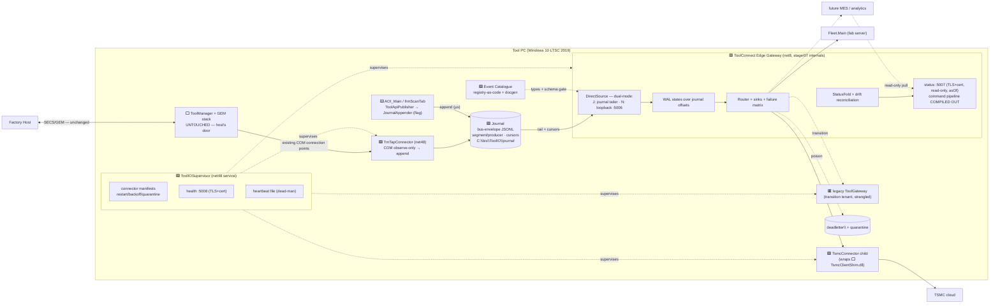
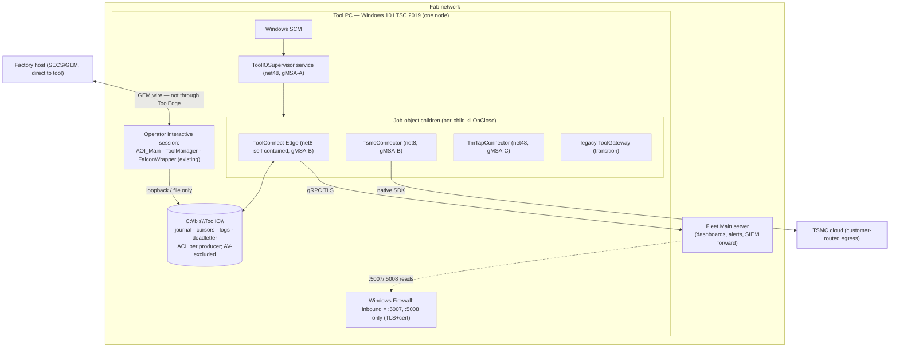

# ToolEdge — Supervised Connector-Journal Edge Gateway — Complete Design

> **Level: complete design (build spec).** Step-8 synthesis produced by the eleven-proposal
> architectural evaluation (2026-07-19). Not a copy of any single proposal: it composes the
> supervisor (Design C), the durability-first journal (Design A / SJFS), the strangler path to
> the stage/07 ToolConnect component (unitedDesign D), the connector isolation model (D3), the
> COM tap (D4), the CQRS status fold with drift reconciliation (D2), and the catalogue-as-code
> (Design B, S0 scope) — while removing the weaknesses each carried alone.
> **Status: DRAFT — pending adversarial review** (folder rule: nothing ships from an
> unreviewed design). The journal file plane and the dual-mode intake are the two elements
> that need their own review cycle before phase E2 ships enabled.
> **Problem & criteria:** [tool-gateway-unification/00-problem-and-current-state.md §0.4](tool-gateway-unification/00-problem-and-current-state.md).
> **Inherited component design:** ToolConnect internals per [stage/07-toolconnect-design.md](stage/07-toolconnect-design.md).
> Where they disagree, stage/07 governs ToolConnect internals; this document governs the
> integration and everything else.

---

## 1. High-Level Overview

### 1.1 Architecture style

**Supervised connector-journal edge gateway** — a single-node, on-premises architecture for a
Windows tool PC, composed of:

- one **process supervisor** (systemd-style, connector-manifest driven),
- one **durability-first event journal** (the data plane; producers append, never connect),
- one **edge gateway** (the bus program's ToolConnect component, fed directly today, by the
  bus tomorrow),
- **crash-isolated connectors** for anything carrying native or third-party risk,
- one **event catalogue** (registry-as-code — the tool's single public vocabulary).

It is deliberately *not* microservices, *not* cloud-hosted, and *not* container-orchestrated:
the deployment target is one Windows 10 LTSC 2019 PC bolted to a semiconductor inspection
tool, where the control core is a fab-qualified net48/COM system that must not be touched.

### 1.2 Design principles

1. **Two doors, forever (until the bus).** The factory host keeps the fab-qualified SECS/GEM
   wire. ToolEdge owns everything else. No design element routes, wraps, or times the GEM path.
2. **The disk is the interface.** Producers append to a local journal and return in
   microseconds. No producer ever opens a connection, retries, blocks, or knows a consumer
   exists. Durability is the primary path, the network is the drain. (From Design A — this
   structurally retires live bugs LB-A, LB-C-blocking, LB-D.)
3. **Control core untouched at every phase.** Zero code changes in ToolManager, the state
   machine, ProductionManager, EFEM/motion, or the GEM stack. The only artifact near control
   is a disposable, observe-only COM subscriber. Alt 3's control-supervision ambitions are
   explicitly deferred to the bus era.
4. **Isolation by risk class, not by dogma.** A new integration lands as an **in-process sink**
   inside the edge gateway by default (cheap). It is promoted to an **out-of-process
   connector** if and only if it loads native code, third-party SDKs, or code with an
   independent release cadence. (Resolves D3's "kernel without tenants" overkill and D4/Alt 1's
   under-isolation with one rule.)
5. **One vocabulary.** Every event type that may appear in the journal is declared once in the
   catalogue, with schema version and payload schema. Unregistered types are quarantined, not
   dropped. (Design B at S0 scope only — **no GEM emitter, no qualified call-site wrapping,
   permanently**; recorded as a rejected alternative so scope pressure cannot resurrect it.)
6. **Build the funded target, not another interim.** The edge gateway *is* stage/07's
   ToolConnect behind its BusSource intake contract. The bus migration is one class swap.
7. **Reversible and rehearsed.** Every phase has a flag/config rollback; every rollback cell
   has a scripted drill (test group T8). A rollback never rehearsed is not a rollback.
8. **Honest degradation.** Every loss is bounded, counted, and journaled as an event
   (`journal.overflow`, `journal.appender.degraded`, `tool.state.corrected`). Silent loss is
   a design defect, not an operational surprise.

### 1.3 Rationale — what was taken, what was fixed

| Source | Taken | Weakness eliminated in ToolEdge |
|---|---|---|
| Design C (supervisor) | ToolIOSupervisor, quarantine, health :5008 | SPOF under-specification → self-watchdog (SCM recovery + dead-man heartbeat file + hung-detection) |
| Design A / SJFS (journal) | Segment-per-producer journal, appender, cursors | Unreviewed file-plane risk → **dual-mode intake** (§5.2): loopback-gRPC fallback per customer; disk-health circuit breaker; segment headers with catalogue hash |
| unitedDesign D (strangler) | ToolConnect per stage/07, lane-by-lane strangling, compare-mode gates | Longest time-to-first-value → supervisor (E1) and journal (E2) deliver standing value before ToolConnect lands; producer-side hazard fixed at E2, not at end state |
| D3 (microkernel) | Connector manifest + isolation contract | Overkill at 2 integrations → connectors are the *supervision config schema*, not a separate kernel; promotion rule (§1.2-4) gates when isolation is paid for |
| D4 (COM tap) | GatewayBridge: observe-only connection-point subscriber | No durability, schema debt → tap appends catalogue-typed events to the journal instead of forwarding ad-hoc gRPC |
| D2 (CQRS) | StatusFold + snapshot drift reconciliation + `asOf` honesty | Over-investment → projections limited to `ToolStatus`; further folds only when a consumer exists |
| Design B (semantic) | Catalogue-as-code, generated event dictionary | Qualified-path wrapping → S1+ **permanently rejected**; GEM-mapping column is documentation only |
| Alt 1 (facade, Rev 2) | All U0 prerequisite fixes; TLS/auth posture; minimized status projection; least-privilege accounts | Interim throwaway (shim) → no shim exists; status comes from the fold |
| Alt 3 (unified service, Rev 2) | Out-of-proc native isolation; supervision realism (restart contract, reaping, rate limits) | Control-path risk → control ownership NOT moved; Alt 3 re-opened only at bus era |
| SJFS | Overall phase discipline, failure matrix, test kit, WAL-over-offsets | Component sprawl → command door compile-time absent; snapshot retention budgeted; rollback claims stated precisely; divergence-classifier ownership named at phase entry |

---

## 2. System Components

Legend: 🟩 NEW · 🟨 MODIFIED · 🟥 RETIRED at end state · ⬜ EXISTING untouched.

### 2.1 🟩 ToolIOSupervisor
- **Purpose:** the single owner of the tool's external-I/O process tree.
- **Responsibilities:** read connector manifests; launch/watch/restart children with backoff
  and quarantine; aggregate health; enforce strictly-exclusive launch vs legacy AOI
  child-launch; never parse tool data (hard rule, from Design C).
- **Public interfaces:** `:5008` aggregated health (HTTPS, client-cert): one JSON document —
  per-child `{state, pid, restarts, lastExit, probeResult}` + roll-up `GREEN/AMBER/RED`.
- **Dependencies:** Windows SCM, job objects, connector manifests. Nothing else.
- **Technology:** net48 Windows service, ~1 kLOC ceiling (enforced in review).
- **Scaling:** N/A single node. Fleet-scale = one supervisor per tool, health aggregated by Fleet.
- **Self-watchdog (new vs all predecessors):** SCM recovery = always-restart with reset;
  a dead-man heartbeat file (`C:\bis\ToolIO\supervisor.heartbeat`, touched every 5 s) that the
  edge gateway's health check reads — a *hung* (not dead) supervisor turns the tool's health
  AMBER within 15 s; children configured per-child `killOnClose` so a supervisor death never
  cascades (re-attach by named mutex on restart).

### 2.2 🟩 Tool Event Journal (+ 🟩 JournalAppender library)
- **Purpose:** the tool's durable event log — the data plane every producer writes and the
  edge gateway drains. System of record for "what did this tool say."
- **Responsibilities:** line-atomic append; segment rotation/retention; per-sink cursors;
  bounded, counted overflow.
- **Public interfaces:** `JournalAppender.Append(type, schemaVer, payloadJson, attrs)` —
  never throws, never blocks beyond a bounded in-memory enqueue (µs); `Stats` counters.
  File layout is a contract (§4.1), readable only by the edge gateway.
- **Dependencies:** NTFS, catalogue (type validation at read side, not append side — the
  appender must stay non-blocking).
- **Technology:** net48 library, C# 7.3 (lives in AOI/COM-land producers); JSONL segments.
- **Scaling:** per-producer disk budget (default 2 GB); rates are tens/sec — one order of
  magnitude of headroom measured at E2 gate.
- **Improvements over SJFS §4:** (a) **segment header line** carrying
  `{formatVer, catalogueHash, producer, createdUtc}` so replay detects schema drift
  mid-history; (b) **disk-health circuit breaker** — appender tracks p99 append latency; breach
  journals `journal.appender.degraded{reason:disk}` *before* the ring overflows; (c) snapshot
  events (§2.5) counted against their own retention sub-budget so a chatty snapshot cadence
  cannot evict production events.

### 2.3 🟩 ToolConnect Edge Gateway (internals inherited from stage/07)
- **Purpose:** the single non-host external surface — routes journal events to Fleet/TSMC/MES,
  answers read-only status. The bus program's tool citizen, delivered early.
- **Responsibilities:** intake (dual-mode, §5.2); WAL entry states over journal offsets;
  sink pipeline + failure matrix (stage/07 §7.9); StatusFold + drift reconciliation; lane
  flags for the strangler migration.
- **Public interfaces:** `:5007` read-only status (HTTPS, client-cert, minimized projection,
  `asOfTsUtc` per field group); `:5006` legacy intake (loopback gRPC, coexistence +
  fallback mode); `:5005` inherited at legacy retirement. **No command door exists in the
  binary** — the stage/07 command pipeline is excluded at compile time behind a build symbol
  (`BUS_ERA_COMMANDS`), not a config flag. Reinstating it requires a code change + review, by
  design.
- **Dependencies:** journal (read), cursors (write), catalogue (type gate), sinks' remote
  endpoints, TSMC isolate pipe.
- **Technology:** net8 Windows service (Kestrel for :5006/:5007 only).
- **Scaling:** single node; per-sink cursors mean a slow sink never backpressures another.

### 2.4 Sinks and connectors (inside / beside the edge gateway)
- 🟨 **FleetSink** (in-proc): existing tested sink logic re-fed from the journal; managed
  gRPC to Fleet.Main — in-proc per the promotion rule (no native code).
- 🟩 **TsmcConnector** (out-of-proc — promotion rule: native `TsmcClientShim.dll`): thin net8
  child; named-pipe work items `(zipPath, metadata)` → P/Invoke → ack/nack. Crash kills one
  upload attempt, nothing else.
- 🟩 **LegacyForwardSink** (in-proc, transition only): feeds today's ToolGateway from the
  journal during coexistence; removed with it.
- Future **MES sink**: in-proc `ISink` unless it violates the promotion rule.

### 2.5 🟩 TmTapConnector (GatewayBridge)
- **Purpose:** make ToolManager's lifecycle visible on the journal with zero control-core changes.
- **Responsibilities:** subscribe as a peer of `ToolManagerUiWrapper` to `OnToolStateChanged`
  + the reporting-relevant `Fire*` subset; enqueue-and-return in the COM callback (bounded
  ring 1024); map to catalogue types on its own thread; append; coalesce `tool.state`
  latest-wins under storm; heartbeat ROT re-resolve (5 s); on reconnect append a synthetic
  `tool.state.snapshot`; periodic snapshot every 30 s (read-only COM getters) for drift
  reconciliation.
- **Public interfaces:** none inbound. Health = process liveness + `Stats` via its log.
- **Dependencies:** FalconWrapper connection points (existing, exercised rails), JournalAppender.
- **Technology:** net48 exe, C# 7.3, ~500 LOC. **Disposability is the safety argument** —
  kill it any time; TM drops a dead subscriber harmlessly.
- **Scaling:** N/A; event rates are human-scale (state changes, production lifecycle).

### 2.6 🟩 Event Catalogue
- **Purpose:** the one place "what can this tool say" is written down.
- **Responsibilities:** declare every journal event type (`type`, `schemaVer`, payload schema
  ref, emit targets, GEM-mapping column **as documentation only**); generate the dictionary
  page shipped to Fleet and fab teams; provide the catalogue hash stamped into segment headers.
- **Public interfaces:** net48 static registry (C# 7.3) + generated markdown/HTML page.
- **Dependencies:** none at runtime (compiled in).
- **Governance:** `schemaVer` bumps require a review touch on this one file; the edge gateway
  quarantines unregistered types to a quarantine file + counter.

### 2.7 🟨 AOI_Main / ToolApiPublisher
- **Change:** `PushEvent` gains a flag branch (`general/JournalFirst=1`): serialize today's
  proto payload into the envelope, append via JournalAppender. Flag off ⇒ byte-identical
  current gRPC path. This is the E2 rollback. No other AOI change.

### 2.8 🟥 Today's ToolGateway
- Supervised child during transition (manifest `transitionOnly: true`), fed by
  LegacyForwardSink from E2, strangled lane-by-lane at E4, retired one release after it
  serves nothing. Its `:5005` binding is handed to the edge gateway's legacy listener at
  retirement so unknown stragglers keep working.

### 2.9 ⬜ Untouched
ToolManager, state machine, ProductionManager, EFEM/motion, SecsGemObjects/E30/Cimetrix,
FalconWrapper, the GEM wire, and the factory-host relationship. Zero code changes, all phases.

---

## 3. Services

| Service | Responsibilities | APIs | Events produced | Events consumed | Storage | Failure handling |
|---|---|---|---|---|---|---|
| ToolIOSupervisor | launch/watch/restart/quarantine children; health roll-up | :5008 health (HTTPS+cert) | Windows Event Log entries; health doc | child exit codes, probes | connector manifests, heartbeat file | SCM always-restart; per-child killOnClose; re-attach by mutex; quarantine after N-in-window |
| ToolConnect Edge | intake→WAL→sinks; StatusFold; lane flags | :5007 status; :5006 legacy/fallback intake | `journal.quarantine`, cursor-lag metrics, `tool.state.corrected` (via fold) | all catalogue types (journal tail) | WAL-over-offsets + per-sink cursor files | per-sink retry w/ backoff; poison counter → dead-letter (§10); crash = restart, resume from cursors |
| TsmcConnector | native TSMC upload | named pipe (work items) | ack/nack per item | upload work items | none (journal+cursor is the queue) | crash dies alone; supervisor backoff; sink nacks → retry |
| TmTapConnector | COM observe → journal | none | `tool.state.*`, `production.*` | COM connection-point callbacks | JournalAppender ring | disposable; ring drop-oldest + counter; ROT re-resolve |
| LegacyForwardSink (transition) | feed old TG from journal | old TG :5005 client | — | Fleet/TSMC-routed types | cursor file | nack → cursor waits; old TG restarted by supervisor |
| Legacy ToolGateway (transition) | today's egress until strangled | :5005 | — | forwarded events | its spool (U0-fixed) | supervised; lanes disabled by strictly-exclusive flags |

---

## 4. Data Layer

This is a single-node, file-plane architecture. There is deliberately **no database server, no
cache tier, no search engine, no object store** on the tool — each would be a new failure
domain on a fab-qualified PC for no requirement in the spec.

- **System of record:** the journal (`C:\bis\ToolIO\journal\`).
  - **Layout (§ from SJFS, kept):** `producers\<name>\<yyyyMMdd>-<seq>.jsonl` — segment per
    producer, **single writer per segment**, no shared handles, no cross-process locking.
    `cursors\<sink>.json` (temp-then-rename atomic). `overflow.log` append-only drop record.
  - **Segment header (new):** first line of every segment:
    `{"hdr":1,"formatVer":1,"catalogueHash":"…","producer":"aoi_main","createdUtc":…}`.
  - **Envelope = the bus envelope verbatim** (field set of
    [stage/06-bus-implementation.md](stage/06-bus-implementation.md)): `msgId` (ULID,
    idempotency key end-to-end), `source`, `type`, `tsUtc`, `seq`, `schemaVer`, `attrs`,
    `payload`.
  - **Durability:** whole-line appends, `FileOptions.WriteThrough`; torn tail discarded and
    counted on recovery. Flush per append at measured rates; config fallback `group25ms`.
  - **Rotation/retention:** 64 MB or UTC midnight; per-producer budget (2 GB default) with
    a snapshot sub-budget; breach drops the oldest whole segment + journals `journal.overflow`.
- **Derived state (rebuildable, never authoritative):** WAL entry states / per-sink cursors;
  the StatusFold in-memory document (rebuilt by re-folding from the last daily segment).
- **Data ownership:** producers own their segment subtree (ACL-enforced write); the edge
  gateway owns cursors and is the **only reader** of `producers\*` (resist "let me tail it").
- **Backup:** the journal is **excluded** from file-locking backup agents and on-access AV
  (installer requests the exclusion; E2 gate verifies per customer; refusal ⇒ documented
  fallback: retry-on-share-violation + drop counters, or the network-intake mode §5.2).
  Off-tool durability is Fleet/TSMC themselves — the journal is a buffer + flight recorder,
  retention-bounded, not an archive.
- **Replication/partitioning:** N/A single node. Partitioning *is* segment-per-producer.
- **Consistency model:** at-least-once delivery, per-producer FIFO (`seq` monotonic,
  persisted), cross-producer best-effort by `tsUtc` (same stance as the bus, stated);
  consumers dedupe on `msgId`. Cursors advance only after remote ack (ack-after-durable).

---

## 5. Integration Layer

- **API gateway / load balancer:** N/A — single node, two inbound endpoints (:5007 status,
  :5008 health), both read-only, both TLS+client-cert. Windows Firewall rules deployed by the
  installer are the perimeter.
- **Message broker / event bus:** none today — **by design**. The journal + cursors are the
  single-node precursor of the stage bus: at bus era, `DirectSource` is swapped for
  `BusSource` (stage/07 §7.5) and nothing above the interface changes. The journal envelope
  is already the bus envelope, so history is publishable as-is.
- **Queues:** the journal (producer→gateway) and per-sink cursors (gateway→sinks); the TSMC
  named pipe carries work items only (no queue of its own — one durability contract).
- **External systems:** Factory host — SECS/GEM direct to the qualified stack (**not through
  ToolEdge, ever**); Fleet.Main — FleetSink gRPC (TLS at E4 cutover); TSMC cloud — native shim
  inside TsmcConnector; future MES — new sink + catalogue entry + read access to :5007.
- **Webhooks:** none. External pull = :5007; external push = sinks. A future "watch" need is a
  gRPC server-stream on :5007, added as a sink-shaped subscriber of the fold — not a webhook
  fan-out from a fab tool.

### 5.2 Dual-mode intake (the key de-risking decision vs SJFS)

`DirectSource` implements stage/07's `IBusSource` with **two interchangeable feeds behind one
envelope**:

- **Mode J (default): journal tailer** — merge `producers\*` by `(tsUtc, seq)`;
  FileSystemWatcher hint + 100 ms poll fallback; torn-tail rule per §4.
- **Mode N (fallback): loopback network intake** — the :5006 listener accepts the same
  envelope over loopback gRPC and **appends it to `producers\net_intake\` before serving it**
  (one durability path, no bypass), or — in the *degraded* variant for customers who refuse
  AV exclusions on producer-writable directories — serves it directly with the gateway's own
  single-writer journal as the buffer.

Consequences: (a) if the journal adversarial review finds a structural flaw in multi-producer
file semantics, Mode N ships without losing the architecture; (b) a customer profile that
cannot grant AV exclusions runs Mode N; (c) the producer contract (`JournalAppender` vs
`PushEvent`-to-loopback) is a per-tool config, not a fork. Both modes carry identical
envelopes and identical catalogue governance.

---

## 6. Security

- **Authentication:** :5007 and :5008 require TLS + client certificates. :5006 binds loopback
  only (never `0.0.0.0` — the shipped LB-C defect class is retired). Journal write access is
  OS authentication: per-producer directory ACLs (each producer account writes only its own
  subtree; the gateway account reads `producers\*`, writes `cursors\`).
- **Authorization:** provenance = directory ACLs in Mode J (the OS enforces who can claim to
  be `aoi_main`); in Mode N, per-producer client certs on the loopback listener. Status/health
  endpoints are read-only by construction — **there is no write surface to authorize**; the
  command pipeline does not exist in the binary (compile-time exclusion, §2.3).
- **Secret management:** client certs in the OS certificate store (never `appsettings.json`);
  per-tool, per-role certs from the fab CA with rotation + revocation; fab-cybersecurity
  sign-off required (inherited from Alt 3 review A3-M5, scoped down — no per-event-type PKI
  needed because intake provenance is ACL-based).
- **Encryption:** TLS 1.2+ on all inbound endpoints and on FleetSink at cutover (today's
  plaintext `http://` to Fleet is fixed at E4); journal at rest relies on disk ACLs + BitLocker
  where the customer profile mandates it (the data is the same telemetry already sent off-tool).
- **Audit logging:** the journal *is* the append-only audit of everything the tool told the
  world; status/health queries are logged with client-cert identity; both forwarded off-host
  to Fleet/SIEM under a distinct identity (a local file the service can edit is not audit).
- **Rate limiting:** :5007/:5008 get a trivial per-client token bucket (they are O(1) reads;
  the limiter is DoS hygiene, not capacity management).
- **Network isolation:** inbound surface = exactly two authenticated read-only ports;
  producers→gateway crosses no network in Mode J (a file replaces the old `0.0.0.0:5005`
  hop — strict attack-surface reduction vs today and vs D1's hub).
- **Least privilege:** supervisor + gateway + connectors each under dedicated
  virtual/gMSA accounts; installer performs the ownership/ACL transition of pre-existing
  spool/log directories (Alt 1 review A1-M5, inherited).

---

## 7. Infrastructure

Honest mapping — this is an on-prem fab tool, not a cloud system:

- **Containers / Kubernetes / serverless / CDN / DNS / auto-scaling:** **not applicable.**
  The unit of deployment is a Windows service + child processes under job objects on one
  LTSC 2019 PC. Introducing container runtimes on fab-qualified tools would add an
  unqualified dependency for zero requirement. (Sonar for the future: the *fab-side* Fleet
  server may be containerized — out of this design's scope.)
- **Process model:** SCM hosts ToolIOSupervisor; the supervisor owns everything else via
  manifests + job objects (per-child `killOnClose`).
- **Networking:** loopback for all intra-tool traffic; fab LAN for Fleet; customer-routed
  egress for TSMC. Firewall rules shipped by the installer (no interactive prompts — Session 0).
- **Infrastructure as code:** the connector manifests + `toolio.json` + templated per-tool
  config (tool identity, endpoints, flags) generated at install from a fleet template —
  fixing the "one baked appsettings for the whole fleet" defect (Alt 1 review m4). Installer
  is a single MSI; per-customer profiles (AV exclusions, cert enrollment, intake mode) are
  declarative install parameters.
- **net8 on LTSC 2019:** self-contained deployment (no machine-wide runtime dependency);
  servicing policy per top customer profiles is a **gate for E3** (carried from SJFS open
  item 1; fallback = hold at E2, which is a complete outcome).

---

## 8. Observability

- **Logging:** Serilog structured logs, one root (`C:\bis\ToolIO\logs\<child>\`), one format,
  rolling files; correlation key = `msgId` end-to-end (producer append → WAL → sink ack).
- **Metrics:** counters journaled as first-class events (`journal.overflow`,
  `journal.appender.degraded`, `tool.state.corrected`, quarantine counts) — so the fleet
  sees them through the same pipe as everything else; plus :5008 health doc (per-child
  restarts, last exit, probe latency, cursor lag per sink, journal disk usage).
- **Tracing:** no distributed-tracing stack on a single node — `msgId` + structured logs give
  the same reconstruction; the journal itself is a flight recorder (Design A's "audit for
  free": "what did we tell Fleet at 03:12" is answerable from disk).
- **Dashboards:** Fleet-side, fed by the health doc + journaled counters; the tool ships data,
  not dashboards.
- **Alerts:** RED health roll-up, quarantine events, `journal.overflow`, corrected-event rate
  above ~0, cursor lag beyond threshold — all fleet-visible.
- **Health checks:** :5008 aggregate (supervisor); :5007 `/healthz` (gateway, probed by the
  supervisor); pipe ping (TSMC connector); process liveness + heartbeat file (supervisor
  itself, read by the gateway's health page — the watchdog-of-the-watchdog).

---

## 9. CI/CD

- **Build:** Azure DevOps pipeline in the `C:\CamtekGit` monorepo; net48 artifacts C# 7.3-clean
  (analyzer-enforced), net8 self-contained publish; one MSI per release; catalogue docgen runs
  in the build and the generated dictionary page is a build artifact.
- **Testing (test kit, inherited from SJFS §11 and extended):**
  - T1 appender property tests (never-throws, never-blocks >1 ms, overflow honesty, seq
    monotonicity, **disk-latency breaker triggers**);
  - T2 crash/power-cut harness (torn tail, cursor rename atomicity);
  - T3 multi-producer merge under clock step/DST; replay dedupe;
  - T4 dual-run compare harness + divergence classifier (**owner named at E3 entry — a gate
    condition, not an afterthought**);
  - T5 lifecycle soak (GUI open/close ×100, kill drills, quarantine, supervisor-crash
    re-attach, **hung-supervisor detection**);
  - T6 tap: COM storm/coalescing, zombie subscription, ROT re-resolve, kill-during-callback;
  - T7 security: port scan (only :5007/:5008 answer off-loopback, TLS+cert enforced), journal
    ACL matrix, reflection/Swagger absent;
  - T8 rollback drills — scripted, one per rollback cell in §10 of the phase plan;
  - T9 (new) **intake-mode equivalence**: Mode J and Mode N produce identical sink output for
    the same event set.
- **Deployment strategy:** ring-based — bench tool → 1 pilot production tool per customer
  profile → fleet; each phase gate (§14 of the phase table) must pass on the pilot before the
  ring widens.
- **Rollback:** per-phase flags/config (rehearsed via T8); after legacy retirement, redeploy
  of the previous MSI (stated honestly, as Alt 1 Rev 2 taught).
- **Feature flags:** `general/ToolIOSupervised`, `general/JournalFirst`, per-lane
  `lane.fleet|tsmc|status = legacy|shadow|live` (strictly exclusive, mutex-enforced),
  `intakeMode = journal|network`, `journal/flushMode`. No command-door flag exists (§2.3).

---

## 10. Reliability

- **Retry policies:** per-sink exponential backoff with jitter; cursor holds position until
  remote ack; `msgId` dedupe makes retries and mid-stream rollbacks safe.
- **Circuit breakers:** per-sink breaker (open on consecutive-failure threshold → cursor
  waits, half-open probes); appender disk-health breaker (§2.2); supervisor quarantine is the
  process-level breaker.
- **Timeouts:** every remote call has a hard deadline (Fleet gRPC, TSMC pipe ops, status
  probe); the appender path has no remote calls by construction.
- **Dead letter:** a per-sink **poison policy** — an event nacked N times with a
  non-transient classification moves to `deadletter\<sink>\` with a journaled
  `sink.poisoned` event (bounded, visible, fleet-alertable); the cursor advances past it.
  (Fixes the class of "one bad message wedges the lane forever.")
- **Disaster recovery:** tool PC reimage = reinstall MSI + certs; journal loss loses only the
  un-drained buffer window (bounded by cursor lag alerts); Fleet/TSMC hold everything acked.
  Recovery time objective: one install; recovery point: last acked cursor per sink.
- **High availability:** N/A in cluster terms (one PC per tool). Availability = supervision
  (auto-restart, quarantine, re-attach), durability-first intake (producers never blocked by
  egress), and GUI-independence (criterion 2). The failure matrix (SJFS §9) carries over
  verbatim, plus rows for Mode N intake and the poison path.

---

## 11. Performance

- **Producer path:** `Append` = bounded in-memory enqueue (µs) + background single-writer
  flush; the scan thread can never be touched by egress again (the structural fix for
  `ToolApiPublisher`'s `Thread.Sleep(1000)` hazard).
- **Freshness:** tail poll 100 ms typical (FileSystemWatcher hint faster); end-to-end
  event→Fleet in low seconds — inside the reporting-class envelope; stated on :5007 via
  `asOfTsUtc` so consumers can't mistake freshness.
- **Async processing:** everything downstream of the appender is asynchronous by
  construction; sinks batch per stage/07's pipeline.
- **Caching:** the StatusFold *is* the cache (in-memory projection, rebuilt from the last
  daily segment on restart — bounded work); no other cache tier needed at these rates.
- **Connection pooling:** one persistent channel per sink (Fleet gRPC keep-alive), one named
  pipe to the TSMC connector.
- **Capacity check (E2 gate):** measured producer rates + journal I/O vs scan-result disk
  copies on a bench tool decide flush mode; 64 MB segments at tens of events/sec ≈ days per
  segment — comfortable.

---

## 12. Sequence of Requests

**Flow 1 — scan result → Fleet + TSMC (the primary data path):**
1. `frmScanTab` finishes copying results to the stable path (existing, unchanged timing).
2. `ToolApiPublisher` (flag branch) calls `JournalAppender.Append("scan.results.ready", …)` —
   returns in µs; the event is on disk (WriteThrough) within the flush policy.
3. The edge gateway's tailer picks it up (≤100 ms), creates a WAL entry over the journal
   offset, and the router fans it to FleetSink and the TSMC lane.
4. FleetSink batches → gRPC to Fleet.Main → on ack, `cursors\fleet.json` advances.
5. TSMC lane hands `(zipPath, metadata)` to TsmcConnector over the pipe → shim uploads →
   ack → `cursors\tsmc.json` advances. A native crash kills the connector alone; the
   supervisor restarts it; the nacked item retries.
6. Fleet down for the weekend ⇒ the fleet cursor lags (alert at threshold), drains Monday;
   the producer never noticed anything.

**Flow 2 — external status query (read-only door):**
1. Fleet/MES calls `GET https://tool:5007/status` with its client cert.
2. The gateway serves the StatusFold document from memory — **no call touches ToolManager on
   the request path** (D2's guarantee): state, control mode, production progress, health
   summary, each with `asOfTsUtc`.
3. Freshness is maintained by the tap: `OnToolStateChanged` → ring → journal → fold (sub-second),
   plus the 30 s snapshot; a snapshot/fold mismatch adopts the snapshot and journals
   `tool.state.corrected` (counted, alertable — drift is visible, never silent).

**Flow 3 — factory host command (unchanged, shown for the boundary):**
Host → SECS/GEM → Cimetrix/E30 → RemoteControl → ProductionManager — entirely inside the
qualified stack. ToolEdge appears nowhere in this flow; it only *observes* the resulting
state change via the tap.

---

## 13. Architecture Diagram

## 14. Deployment Diagram

(No Kubernetes — the deployment fabric is Windows SCM + job objects on one node, the fab LAN,
and two remote systems.)

---

## 15. Future Growth

- **New features / integrations:** declare the event in the catalogue → add an in-proc sink
  (or an out-of-proc connector if the promotion rule triggers) → per-lane flag. One component,
  one review touch — criterion F2 stays true as the integration count grows; D3's flat-cost
  curve without D3's up-front kernel.
- **Higher traffic:** the journal has ~an order of magnitude of headroom at reporting rates;
  beyond that, per-producer segments shard naturally and flush policy amortizes; the sinks
  batch. If a future feature is genuinely high-rate (e.g., per-defect streaming), that is
  bus-era traffic and lands on the broker, not this buffer.
- **Additional teams:** the catalogue is the coordination point (schema review on one file);
  connectors are independently ownable/updatable units with manifests — "ship a new TSMC shim
  without touching anything the fab qualified."
- **Multi-region / multi-fab:** everything per-tool is templated config (identity, endpoints,
  certs, intake mode, AV posture) — a customer profile, not a fork. Fleet aggregates per fab.
- **Multi-tenant:** N/A on a tool PC; the analogue is **per-customer profiles**, handled by
  declarative install parameters (§7).
- **The bus era (the designed-for growth):** swap `DirectSource` → `BusSource`; the journal
  becomes the bus's local durability (its envelope already is the bus envelope); the
  supervisor is superseded by ToolHost if that program lands (same pattern — its manifests
  carry over); the catalogue becomes the bus schema registry's seed; only then is the command
  door built — behind the bus's authenticated, audited command transport, with the compile
  symbol flipped in a reviewed change.

---

## 16. Phased delivery, gates, rollback

| Phase | Delivers | Gate | Rollback |
|---|---|---|---|
| **E0** | Live-bug prerequisites in shipped code: spool runtime drain + overflow drain + poison counter (old TG), Fleet `ToolId=0` verified/fixed, :5005 loopback-bind + reflection off, exclusive-launch mutex | LB test set green | n/a — pure fixes |
| **E1** | Supervisor live (empty → TsmcConnector for old TG's lane → old-TG launch moves AOI→supervisor); heartbeat + hung-detection | 72 h soak: GUI cycles ×100, kill/quarantine/re-attach drills (T5) | `ToolIOSupervised=0` per step |
| **E2** | Catalogue S0 + appender + journal + `JournalFirst=1` + LegacyForwardSink; **journal + dual-mode-intake adversarial review passed**; AV exclusion verified or Mode N selected per profile | T1–T3 + T9 green; N-day divergence: journal-fed old-TG output ≡ direct-fed; I/O contention measured → flush mode fixed | `JournalFirst=0` → byte-identical **data path** (launch ownership stays E1) |
| **E3** | ToolConnect Edge in shadow: Fleet/TSMC sinks compare-mode; **divergence-classifier owner named at phase entry**; net8/LTSC servicing confirmed; stage/07 owner co-owns | ≥14 days clean divergence; stage/07 §7.12 suite green | stop the service |
| **E4** | Lane cutovers Fleet → TSMC → status :5007 (TLS to Fleet lands here); legacy TG retired +1 release; :5005 handed to legacy listener | per-lane divergence evidence; strictly-exclusive lane flags; T7 security pass | lane flag back |
| **E5** | Tap live: `tool.state`/production events + snapshots + reconciliation; catalogue page published to Fleet/fab | bench soak vs FalconWrapper (T6); corrected-event rate ≈ 0 | stop one exe |
| **E6** | Bus era: `DirectSource`→`BusSource`; command door built behind bus auth (reviewed change) | stage program gates | n/a — destination |

**Hold-points are first-class outcomes:** holding at E2 (supervised + durable + live bugs
dead) or E4-Fleet-only are complete, valuable states — not stranded investments.

**Effort:** E0–E2 ≈ S–M · E3–E4 ≈ M · E5 ≈ S. Total ≈ M–L. **Fab re-qualification: none at
any phase** (no qualified path touched; the GEM wire never crosses ToolEdge).

## 17. Open items (gating)

1. net8 servicing policy on LTSC 2019 per top customer profiles (**gates E3**; fallback: hold at E2).
2. Fleet.Main tool key (ToolId vs machineName) — decides `ToolId=0` severity (**gates E0 scope**).
3. stage/07 owner named as co-owner of the edge-gateway build (**gates E3**).
4. Measured producer rates + journal I/O vs scan-copy contention on a bench tool (**gates E2 flush policy**).
5. AV/backup exclusion attainability per customer → intake-mode choice J vs N (**gates E2 per profile**).
6. Journal + dual-mode-intake adversarial review scheduled (**gates E2 enable**).
7. Fab-cybersecurity sign-off on the cert scheme (:5007/:5008 + Fleet TLS) (**gates E4**).
