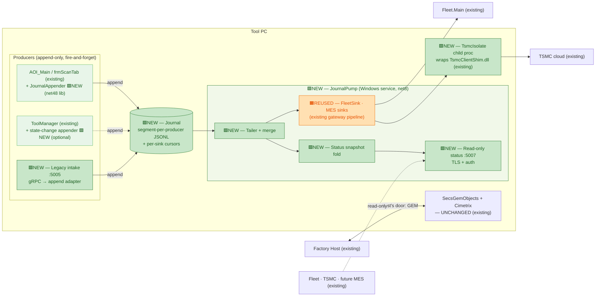

# Design A — Journal-First Gateway ("the gateway is a log")

> Level: **exploratory design study** — see folder banner in [README.md](README.md).
> Axis: **data plane**. The unifying element is not a process but a durable, append-only,
> local **journal**. Producers append; one pump service drains to the world.
> Problem definition: [../tool-gateway-unification/00-problem-and-current-state.md](../tool-gateway-unification/00-problem-and-current-state.md).

---

## A.1 The inversion

Every reviewed alternative asks: *which process should own the external surface?* This design
asks a different question: *why does any producer need to know a process exists at all?*

Today's reporting chain is **connection-first**: `frmScanTab → ToolApiPublisher (gRPC :5005)
→ ToolGateway pipeline → sinks`, with a JSON-lines spool (`C:\Fleet\ToolGateway\FailedMessages`)
as the *fallback* when the connection fails. That ordering is exactly backwards for a tool:
the local disk is the only thing that is always available, and the two worst live bugs in the
gateway (spool never drained at runtime; spool overflow silently overwrites) exist precisely
because the durable path is the *exception* path — rarely exercised, never trusted.

**Journal-first inverts it: durability is the primary path, the network is the drain.**

1. Producers **append one line to a local journal segment and return**. No connection, no
   retry, no spawn, no sleep. (This kills the known `ToolApiPublisher` defect — the
   `Thread.Sleep(1000)` + process-spawn that can block the scan thread when the gateway is
   down — *by construction*, not by tuning.)
2. One **JournalPump** Windows service tails the journal and dispatches to sinks
   (Fleet gRPC, TSMC via an isolated native child, future MES) with per-sink persisted
   cursors. A sink being down moves a cursor lag, never a producer stall and never data loss.
3. Read-only tool status is served by the pump from a **snapshot fold** of the journal
   (last state-change event wins), on a TLS+auth endpoint — the same "two doors" posture as
   Alt 1: GEM for the host, this for everything else.

## A.2 Architecture

> **Legend:** 🟩 **NEW** = new component built by this design · 🟧 **REUSED** = existing code
> re-hosted unchanged · ⬜ unchanged / external. Node text also carries `NEW` / `REUSED` /
> `existing` inline for terminals that don't render color.

*(In the diagram, `AOI` and `TM` are existing components tinted light-green because they gain
a NEW appender; the appender itself is the only new code added to them.)*

## A.3 What moves / what stays

| Stays put | Moves / is added |
|---|---|
| ToolManager COM singleton, state machine, ProductionManager, EFEM, tool clients — **unchanged** (an *optional* appender is additive) | **JournalAppender** — a tiny net48 library (single-writer append, rotate, fsync policy); referenced by AOI_Main in place of the direct gRPC push |
| The fab-qualified GEM wire — untouched, host's door | **JournalPump** — a net8 Windows service hosting the *existing, tested* `EventProcessor → EventRouter → SinkDispatcher` pipeline, re-fed from the journal tail instead of the gRPC intake |
| The gateway's sink code (FleetSink, TsmcSink, batching) — **reused**, not rewritten | **TsmcIsolate** — the native shim moved to a supervised child of the pump (named-pipe handoff), so a native crash costs one upload, not the tool |
| The `:5005` gRPC contract — kept as a **legacy intake adapter** that just appends (zero-change compatibility for any caller during transition) | **Status snapshot + :5007 endpoint** — read-only, TLS+auth, minimized (same scope Alt 1's review allowed) |

## A.4 The journal (design rules that make a file a bus-grade primitive)

Multi-writer files are where this idea usually dies, so the rules are strict:

- **Segment per producer, single writer per segment.** `journal\<producer>\<yyyyMMdd>-<seq>.jsonl`.
  No shared file handles, no cross-process locking. The pump is the only multi-segment reader
  and merges by `(ts, producerSeq)`.
- **Envelope = the bus envelope.** Each line carries `msgId, source, type, ts, schemaVer,
  payload` — the field set of the stage bus design ([../stage/06-bus-implementation.md](../stage/06-bus-implementation.md)).
  When the bus arrives, journal entries *are* publishable messages; nothing is re-modeled.
- **Bounded with honest overflow.** Fixed size budget per producer; on breach, drop-oldest
  **with a monotonic dropped-count in the journal itself** — the exact opposite of the shipped
  spool's silent-overwrite defect, which this design retires along with the spool.
- **Cursor-per-sink, ack-after-durable.** A sink's cursor advances only after the remote
  accepts the batch. Fleet down for a weekend = a cursor 2 days behind, drained on Monday.
- **Crash recovery is trivial** — re-tail from cursors; appends are line-atomic (write-through,
  torn-tail line discarded on recovery).

## A.5 Flows

**Scan result** (today's `frmScanTab` ~:1888–1902 path): results copied to stable path →
`JournalAppender.Append(WaferScanResultsReady, payload)` → return (µs, no network on the scan
thread — ever) → pump tails within its poll interval (default 100 ms) → FleetSink batch →
Fleet.Main; TSMC lane via the isolate.

**Tool state change** (optional, additive): `OnToolStateChanged` callback in a wrapper appends
`ToolStateChanged` — a try/catch-swallowed file append, nothing on the control path can block
or fault on it. The snapshot fold makes this the source of the :5007 status answer.

**Operator closes the GUI:** producers stop producing; the pump — a Windows service — keeps
draining everything already journaled and keeps answering status. The "reporting dies with
the GUI" pain is gone, and unlike the promoted-service variant it is gone *even for messages
produced seconds before the close*, because they are already on disk.

## A.6 Pros

- **Producers can never be hurt by egress again** — no blocking, no backpressure into the scan
  thread, no coupling of AOI timing to Fleet availability. Strongest possible form of
  criterion 3 for the reporting direction.
- **Durability by construction** — the two CRITICAL spool bugs are not "fixed" but made
  structurally impossible (there is no fallback path; the durable path is the only path).
- **Replay and audit for free** — a journaled tool can re-send any window, and support gets a
  local flight recorder of every externally-visible event.
- **The strongest bus on-ramp of the reviewed and unreviewed field except Design D** — the
  journal is the durability layer the stage bus design already specifies; migration is
  "point the pump at the broker."
- Reuses the tested gateway pipeline and its xUnit suite for the sink half.

## A.7 Cons / risks

- **Latency floor** — tail-poll adds ~100 ms typical. Fine for reporting/telemetry (the only
  traffic in scope); wrong for anything request/response — which is why status is a snapshot
  endpoint, not a journal read.
- **File-plane engineering is real** — rotation, retention, disk-budget, torn-line recovery,
  AV-scanner exclusions on the journal directory. Small pieces, but they must all be right;
  needs its own test kit (property tests on the appender + crash-recovery harness).
- **New format to govern** — the envelope becomes a contract; schema versioning discipline
  starts now (mitigated by adopting the bus envelope verbatim rather than inventing one).
- Two processes still exist (pump + producers) — like Alt 1, an insider still sees two
  engines; unification is of the *data path*, not the org chart.

## A.8 Phasing & reversibility

| Phase | Change | Reversible by |
|---|---|---|
| J0 | Appender lib + journal format + pump service in shadow (pump reads, sinks in dry-run) | delete — nothing depends on it |
| J1 | AOI_Main flag: `JournalFirst=1` switches `ToolApiPublisher` to append (gRPC push kept as the flag-off path); :5005 adapter appends | flag off → today's path, byte-identical |
| J2 | Pump's sinks go live; old ToolGateway retired from the AOI child-launch; TSMC isolate | start old ToolGateway, flag off |
| J3 | Optional ToolManager state appender + :5007 snapshot status | remove appender (additive) |

**Effort:** M. **Reversibility:** high (flag until J2, service swap after). **Fab re-qual:** none — GEM path untouched.
