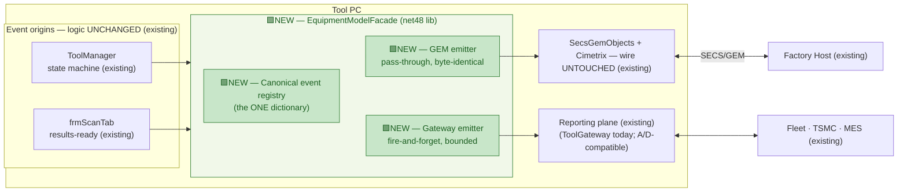

# Design B — Semantic Model Unification ("one equipment model, two wires")

> Level: **exploratory design study** — see folder banner in [README.md](README.md).
> Axis: **semantic plane**. Unify the *vocabulary*, not the processes: every externally-visible
> tool event is declared once, in one canonical equipment model, and emitted to both wires.
> Problem definition: [../tool-gateway-unification/00-problem-and-current-state.md](../tool-gateway-unification/00-problem-and-current-state.md).

---

## B.1 The inversion

All three reviewed alternatives — and Designs A, C, D in this folder — treat the split as a
*topology* problem: two processes, two lifecycles, two ports. This design claims the deeper
split is **semantic**: the tool has **two vocabularies** for describing itself to the world.

- To the **factory host**, the tool speaks the fab-qualified GEM equipment model — CEIDs, SVs,
  alarms (E30/E87/E116), mapped in `SecsGemObjects` (`RemoteControl.cs` → `ICarrierExecuter`).
- To **Fleet/TSMC**, the tool speaks an ad-hoc vocabulary invented in `frmScanTab` push calls
  and ToolGateway proto messages — defined nowhere but the code, overlapping the GEM model in
  meaning but sharing not one identifier with it.

That is *why* "integrations touch two worlds" (§0.3): not because there are two processes, but
because **there is no single place where "what can this tool say?" is written down.** A new
report today means inventing meaning twice, in two dialects, in two subsystems. Unify the
dictionary and the topology question becomes secondary — any egress engine (today's
ToolGateway, Design A's pump, Design D's ToolConnect) can carry a unified vocabulary.

## B.2 The design: one declarative model, two emitters

A single net48 library, **`EquipmentModelFacade`**, beside `SecsGemObjects`:

1. **Canonical event registry.** Every externally-visible event/state/alarm is declared once —
   `ToolEventDef { CanonicalId, PayloadSchema, GemMapping (CEID/SV/ALID), GatewayMapping
   (proto message) }`. C# 7.3 idiom (static registry table, no records). The registry file *is*
   the tool's public dictionary; a doc page is generated from it.
2. **One emission API.** `EquipmentModel.Emit(ToolEvent e)`:
   - **GEM emitter** — calls the *same* `SecsGemObjects` report APIs the call site called
     before, same arguments, same order, same thread. The facade is a pass-through wrapper at
     the qualified boundary: **the wire is byte-identical by construction.**
   - **Gateway emitter** — fire-and-forget, bounded, deadlined forward of the same event to
     the reporting plane (today: the :5005 push; under Design A: a journal append; under
     Design D: ToolConnect intake). Never blocks, never throws into the caller.
3. **Call-site migration, one event at a time.** Each site that today reports to GEM *or*
   pushes to the gateway is rewired to `Emit()` behind a per-event flag. Sites that today do
   **both** in two places (the scan-results pair: `frmProduction.FireWaferScanResultsAreReady`
   on the COM bus *and* the later `frmScanTab` gRPC push) collapse to one declaration.

> **Legend:** 🟩 **NEW** = new component built by this design · ⬜ unchanged / external.
> Node text also carries `NEW` / `existing` inline for terminals that don't render color.

## B.3 What moves / what stays

| Stays put | Moves / is added |
|---|---|
| Both transports — the GEM stack and the gateway pipeline — **completely unchanged** | `EquipmentModelFacade` net48 lib: registry + two emitters |
| ToolManager, ProductionManager, EFEM, tool clients | Call sites of externally-visible events rewired to `Emit()` — one event at a time, per-event flag |
| ToolGateway process, ports, sinks, spool, lifecycle (this design deliberately does **not** fix lifecycle — pair with U1 or [Design C](03-toolio-supervisor.md)) | A generated **event catalogue** document (the "what can this tool say" page fabs and Fleet have never had) |

## B.4 What this uniquely buys

- **A new integration is a registry entry, not an archaeology project.** MES wants a new
  report → declare the event once (payload + GEM mapping if host-visible + gateway mapping)
  → both worlds receive it. Today the same request lands as two tickets in two subsystems.
- **The host and the fleet finally agree on what happened.** Same CanonicalId, same payload,
  same timestamp source for both doors — ending the class of support case where the GEM log
  and the Fleet record describe the same wafer differently.
- **It composes with every topology.** Whichever of Alt 1/Alt 3/A/C/D wins the process
  argument, the dictionary carries over unchanged. It is the only design in either folder
  whose value survives *all* possible outcomes of the others.
- **It is the bus's schema registry, delivered early.** The stage bus design requires exactly
  this canonical, versioned event vocabulary; the registry is that artifact, in net48 form.

## B.5 Cons / risks — stated honestly

- **It wraps qualified call sites.** The GEM emitter is pass-through and the wire is designed
  byte-identical, but "designed" is not "proven": this touches the code path that fab
  qualification watched. **Gate: GEM record-replay equivalence** (same tooling the stage
  program specifies) on every migrated event before its flag ships enabled. Events migrate
  one at a time precisely so this gate stays small.
- **It does not unify surface, lifecycle, or supervision.** Criteria 1–2 of §0.4 are simply
  out of scope; scoring it alone against them is a fail. It must ride with a topology design.
- **Dictionary governance is a new ongoing duty.** Someone owns the registry, reviews schema
  changes, versions payloads. (This duty already exists implicitly today — it is just unowned
  and split across two codebases.)
- **Dual-emit divergence risk.** If the GEM emitter succeeds and the gateway emitter drops
  (bounded queue full), the two doors briefly disagree. Mitigation: the gateway emitter's
  drop counter is itself a registry event (`ReportingDegraded`), so the divergence is visible,
  not silent.

## B.6 Phasing & reversibility

| Phase | Change | Reversible by |
|---|---|---|
| S0 | Registry lib + catalogue generator; **zero call sites moved** — registry mirrors today's de-facto events | delete |
| S1 | Migrate the scan-results pair (the known duplicated event) behind flags; record-replay gate | per-event flag off |
| S2 | Migrate tool-state / alarm events; catalogue published to Fleet & fab teams | per-event flag off |
| S3 | New-integration rule takes effect: additions land in the registry only | policy, revocable |

**Effort:** S–M (a library and staged rewires, no new process). **Reversibility:** high
(per-event flags; wrapper removable). **Fab re-qual:** none *claimed* — but this is the one
design here whose claim must be **proven per event** via record-replay, because it wraps the
qualified path rather than avoiding it.
