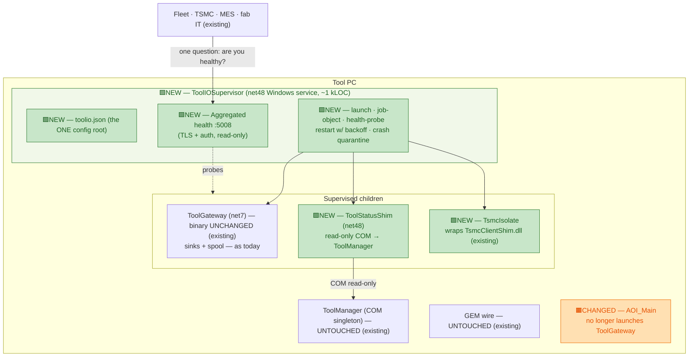

# Design C — ToolIO Supervisor ("unify operations, not code")

> Level: **exploratory design study** — see folder banner in [README.md](README.md).
> Axis: **ops plane**. Accept that two engines exist; unify everything the outside world
> *operates and observes*: one supervisor service, one installer, one config root, one log
> root, one health answer. Zero business logic moves.
> Problem definition: [../tool-gateway-unification/00-problem-and-current-state.md](../tool-gateway-unification/00-problem-and-current-state.md).

---

## C.1 The inversion

Ask who actually suffers from the split, and it is mostly **not the code** — it is operations:
the fab IT person who asks "what do I restart?", the Fleet operator who asks "is the tool's
reporting up?", the installer author shipping two lifecycles, the support engineer collecting
logs from two roots with two formats. The reviewed alternatives buy relief for these people by
moving code. This design buys the same relief by **moving none** — it unifies the tool's
external I/O at the level where the pain lives: **process supervision, deployment, and health.**

This is deliberately the smallest thing that makes the outside world see *one gateway-shaped
unit*. It is `systemd` thinking applied to the tool PC — and it is the **ToolHost pattern from
the stage design ([../stage/01-system-architecture.md](../stage/01-system-architecture.md)),
delivered early** with today's components as its first tenants.

## C.2 The design: one tiny service that owns the fleet of I/O processes

**`ToolIOSupervisor`** — a net48 Windows service, deliberately under ~1 kLOC, whose entire
job is: read one config file, launch children, watch them, restart them, aggregate their
health, and never, ever parse tool data.

> **Legend:** 🟩 **NEW** = new component built by this design · 🟧 **CHANGED** = existing
> component with a behavior change (no code rewrite) · ⬜ unchanged / external. Node text also
> carries the tag inline for terminals that don't render color.

**The hard rule that keeps this honest:** the supervisor never opens a tool-data connection,
never parses an event, never routes a message. The moment someone proposes "the supervisor
could also transform…", the answer is no — that is Alt 3's job, and scope creep here would
rebuild Alt 3 badly. Its inputs are exit codes, health probes, and `toolio.json`; its outputs
are process starts and one aggregated health document.

## C.3 What moves / what stays

| Stays put | Moves / is added |
|---|---|
| **Every line of business logic.** ToolManager, GEM wire, ToolGateway pipeline, sinks, spool — all binaries unchanged | `ToolIOSupervisor` service + `toolio.json` (children, restart policy, backoff, probe endpoint, log root per child) |
| The :5005 intake and AOI publish path | **Launch ownership**: ToolGateway moves from AOI's job object (`clsInitAOI.EnsureToolGatewayRunning`) to the supervisor's — fixing "reporting dies with the GUI" without promoting or modifying ToolGateway itself |
| | `TsmcIsolate` child — the native shim out of the gateway process (the one child that is *new* code: a thin named-pipe host, no logic) |
| | One MSI, one log root (`C:\bis\ToolIO\logs\<child>\`), one health endpoint :5008 |

## C.4 What this uniquely buys

- **Criterion 2 (single lifecycle & supervision) delivered whole, for effort S.** One service
  to install, start, health-check; children restart with backoff and quarantine-after-N; the
  GUI can open and close all day and egress never blinks.
- **Criterion 4 delivered as a side effect** — the TSMC native shim becomes a supervised
  child, so its crash is a restart event in a log, not a gateway outage.
- **The best possible risk profile:** since no business code moves, there is nothing to
  re-qualify, nothing to record-replay, and rollback is a config change (`AOI child-launch
  flag back on, supervisor service off`). It is the only design in either folder whose worst
  case is "we wasted ~1 kLOC."
- **It is scaffolding, not a detour.** Alt 1's hardened service, Design A's pump, Design D's
  ToolConnect — all of them need exactly this supervision to exist. Build it once, first, and
  every later winner is a new `toolio.json` entry instead of a new lifecycle design.

## C.5 Cons / limits — stated honestly

- **It does not unify the surface (criterion 1) or the mental model.** Two engines remain;
  MES integration still lands in ToolGateway code. This design *contains* the split; it does
  not heal it. Pair with [Design B](02-semantic-model-unification.md) for the semantic half.
- **Session/desktop constraints must be respected:** the supervisor runs children in the
  service session; anything needing the interactive session (none of today's three children
  do — verified: ToolGateway is headless Kestrel, the shim is headless COM client, the isolate
  is headless) would need the split-hosting treatment Alt 3's review defined. The boundary
  must be re-checked per new child.
- **AOI's process-sweep and the strictly-exclusive launch rule** (from the Alt 1 U-phases)
  apply here identically — two launchers racing for one ToolGateway is the failure mode to
  design out first.
- **One new single point of failure** — the supervisor itself. Mitigated by its size (~1 kLOC,
  no I/O but process API + one HTTP listener), service recovery settings, and the fact that
  children keep running if the supervisor dies (job objects configured kill-on-close *per
  child policy*, not blanket).

## C.6 Phasing & reversibility

| Phase | Change | Reversible by |
|---|---|---|
| V0 | Supervisor + `toolio.json` shipped; children list **empty**; :5008 health up | uninstall |
| V1 | TsmcIsolate under supervision; ToolGateway config points TSMC lane at the isolate | config: point lane back in-proc |
| V2 | ToolGateway launch moves AOI → supervisor (strictly-exclusive flag, as U1 defines) | flag: back to AOI child-launch |
| V3 | ToolStatusShim child + publish :5008/:status to Fleet as the tool's one health answer | remove child entry |

**Effort:** S. **Reversibility:** highest of all designs (config/flag at every phase).
**Fab re-qual:** none — no qualified path is even *near* this change.
