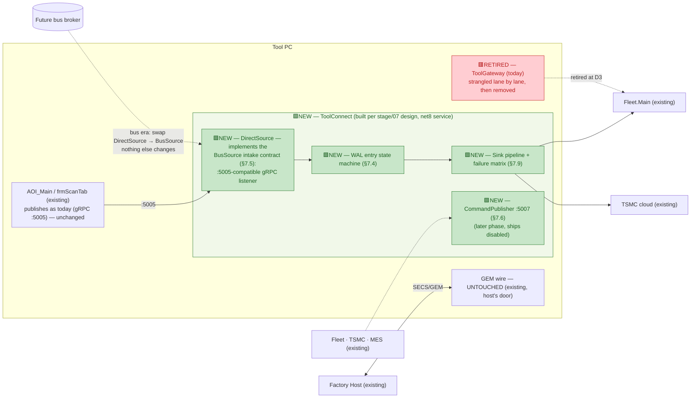

# Design D — Strangler ToolConnect ("build the target, feed it directly")

> Level: **exploratory design study** — see folder banner in [README.md](README.md).
> Axis: **target-first delivery**. Don't design another interim gateway — stand up the bus
> program's already-designed **ToolConnect gateway** now, fed directly instead of by the bus,
> and strangle today's ToolGateway lane by lane.
> Problem definition: [../tool-gateway-unification/00-problem-and-current-state.md](../tool-gateway-unification/00-problem-and-current-state.md).
> Target component design (normative for the end state): [../stage/07-toolconnect-design.md](../stage/07-toolconnect-design.md).

---

## D.1 The inversion

Every design so far — reviewed or in this folder — accepts the framing "we can't have the bus
yet, so design something for the current architecture." This design rejects the framing:
**the unified gateway the tool ultimately needs is already fully designed, adversarially
reviewed through multiple cycles, and sitting in [../stage/07-toolconnect-design.md](../stage/07-toolconnect-design.md)** —
WAL entry state machine, class design, :5007 audited command door, CMM proxy, threading model,
failure matrix, gateway test suite (§7.12), and — decisively — a **dual-run coexistence mode
(§7.11) designed for exactly the kind of side-by-side migration this requires.**

The only thing ToolConnect lacks today is its feed: it expects a bus. But its intake is
already an abstraction — the **BusSource intake contract (§7.5)**. Implement that contract
with a **DirectSource** and the target component runs *today*, no broker required. Then
migrate the way Martin Fowler's strangler fig does: shadow first, cut over one lane at a
time, retire the old component when it serves nothing.

Why this is better than writing another design: every interim gateway (Alt 1's hardened
service, even Design A's pump) is code with a planned funeral — absorbed or superseded when
the bus lands. ToolConnect-now is the only path where **100 % of the work is the end state.**

## D.2 Architecture

> **Legend:** 🟩 **NEW** = new component built by this design (WAL/pipeline/command-door are
> new code built to the *inherited* stage/07 design; DirectSource is the one from-scratch
> artifact) · 🟥 **RETIRED** = existing component removed at the end state · ⬜ unchanged /
> external / future. Node text also carries the tag inline for terminals that don't render color.

The deliberate trick: **DirectSource speaks today's :5005 contract**, so `frmScanTab` /
`ToolApiPublisher` need *zero changes* — at cutover, ToolConnect simply becomes the listener
on :5005 (or the publisher's target port flips by config). The producer side never knows the
strangling happened.

## D.3 What moves / what stays

| Stays put | Moves / is added |
|---|---|
| ToolManager, state machine, ProductionManager, EFEM, GEM wire — **untouched** (same posture as Alt 1: two doors, host keeps GEM) | **ToolConnect** built per stage/07 — the WAL, pipeline, failure matrix, and test suite are *inherited designs*, not new ones |
| AOI_Main publish path and the :5005 wire contract — byte-compatible | **DirectSource** — the one genuinely new artifact: a BusSource implementation wrapping a :5005-compatible listener (+ optionally a journal reader, if [Design A](01-journal-first-gateway.md)'s appender exists) |
| Fleet/TSMC endpoints and expectations | Old ToolGateway — **strangled**: lanes cut over one at a time, then the process is retired |

## D.4 The strangler phases

| Phase | Change | Guard | Reversible by |
|---|---|---|---|
| D0 — Shadow | ToolConnect runs beside ToolGateway; a tee (or dual-push) mirrors :5005 traffic into DirectSource; **all ToolConnect sinks in compare mode — they write divergence logs, never the wire** | the no-double-egress rule is absolute in D0: one wire writer only (old TG) | stop the service |
| D1 — Fleet lane | FleetSink cutover: ToolConnect writes Fleet; old TG's Fleet lane disabled (strictly-exclusive flag) | compare-mode evidence from D0 ≥ N days clean; Fleet `ToolId` fix verified first (don't inherit the identity-collision bug) | flag back |
| D2 — TSMC lane | TsmcSink cutover with the native shim isolated per stage/07's containment | same evidence gate | flag back |
| D3 — Status + retire | Read-only status on :5007 (per §7.6, command door **stays disabled** — matching the Alt 1 review's removal of external command relay until a real authorization design exists); old ToolGateway removed from launch | old TG uninstalled only after one clean release | redeploy old TG |
| D4 — Bus era | Broker arrives: `DirectSource` swapped for `BusSource`; **nothing else in the component changes** | stage program gates | n/a — this *is* the destination |

## D.5 Pros

- **Zero throwaway work** — the only interim artifact is DirectSource (small), and even it
  survives as a fallback intake. Criterion 6 is not "compatible with the bus"; it is the bus
  citizen, minus the broker.
- **Inherits a reviewed design, not a fresh one** — the WAL state machine, failure matrix,
  threading model, and test suite went through the stage program's adversarial cycles;
  every other design in this folder starts its review count at zero.
- **Dual-run was already designed** (§7.11) — coexistence, the hardest part of any strangler
  migration, is specified rather than improvised.
- **Producer-invisible** — the :5005 compatibility means no AOI_Main change at all in D0–D2.
- End state gives the full Alt-3-grade outcome (single non-host surface, single supervised
  lifecycle, contained native DLL) without designing a new component to get there.

## D.6 Cons / risks — stated honestly

- **Couples this effort to the stage design's maturity.** If implementation falsifies a
  stage/07 assumption, this program inherits the rework — and must feed corrections *back*
  into the normative stage set (consistency rule). Mitigation: D0 shadow mode is precisely
  the cheap falsification harness.
- **net8 service on tool PCs earlier than the bus program planned** — runtime rollout,
  patching, and IT acceptance arrive ahead of schedule. (Windows 10 LTSC 2019 fleet: confirm
  net8 servicing policy per customer.)
- **Needs the stage/07 owner engaged** — building someone else's reviewed design without them
  is how inherited designs get silently forked.
- **Heavier first step than A or C** — nothing ships until the WAL core and one sink pass the
  §7.12 suite in compare mode; expect the longest time-to-first-value in this folder.
- The :5007 **command door must ship disabled** — the stage design includes it because the bus
  provides authenticated, audited command transport; in a direct-fed world it would reopen
  exactly the command-relay hole the Alt 1 review closed. The guard is stated in D3 and must
  survive scope pressure.

## D.7 Verdict conditions

Choose this design when: the bus program is *probable but not imminent*, the stage/07 owner
can co-own this build, and there is appetite for one M–L effort instead of two S–M efforts
(interim + target). Choose A or C instead when funding uncertainty is high enough that
time-to-first-value dominates.

**Effort:** M–L. **Reversibility:** high through D2 (flags + shadow), redeploy after D3.
**Fab re-qual:** none — the GEM wire and control core are never touched.
